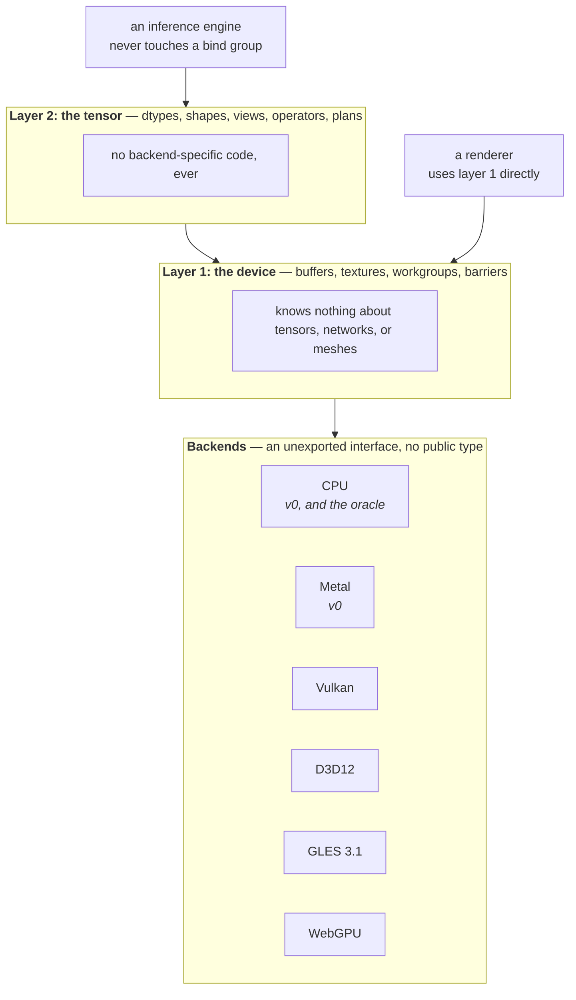

# accel: design

`accel` is a backend-selectable, cgo-free foundation for running compute and
graphics work on a GPU from Go.

This is an internal design record, not user documentation: it holds the decisions
everything else is built on, and it is normative. If another spec contradicts it,
that spec is wrong. Bounded designs live alongside it in `specs/`; empirical
backend behaviour lives in [`conventions.md`](../docs/conventions.md).

Readers looking for an explanation rather than a decision record want
[`docs/architecture.md`](../docs/architecture.md).

## The decisions at a glance

Blast radius is what reversing a decision would cost today. It is the number to
look at before arguing with one.

| # | Decision | Blast radius if reversed | Depended on by |
| --- | --- | --- | --- |
| 1 | Submission is a recordable, replayable graph | **Total.** Layer 1 and layer 2 are both shaped around it | [003](003-command-graph.md), [005](005-graphics.md), [006](006-backends.md), [007](007-tensor-layer.md) |
| 2 | cgo-free is a hard requirement | **Total.** Every backend, and the reason the project exists | [004](004-kernel-authoring.md), [006](006-backends.md) |
| 3 | A pure-Go CPU backend is first-class | **High.** Every test strategy and the whole verification story | [002](002-compute-model.md), [004](004-kernel-authoring.md), [005](005-graphics.md), [006](006-backends.md), [011](011-conformance-harness.md) |
| 4 | The compute model is designed in | **High.** Kernel signatures change, so every kernel is rewritten | [002](002-compute-model.md), [004](004-kernel-authoring.md), [007](007-tensor-layer.md) |
| 5 | Kernels are authored once in Go and lowered from one typed IR | **High.** Removes decision 3's exactness and the author-once property | [004](004-kernel-authoring.md), [006](006-backends.md), [010](010-kernel-corpus.md) |
| 6 | Capabilities are queryable, absence explicit | **Moderate.** Contained to error paths and the capability struct | [002](002-compute-model.md), [006](006-backends.md) |

Decisions 1 and 2 are the two that cannot be revisited without restarting. The
rest are expensive but survivable.

## Two layers, not one

The library is two layers with a hard boundary between them.

The arrows only point one way, which is the whole content of the layering rules
below: layer 2 imports layer 1 and never the reverse, and adding a backend is a
layer 1 concern only.

**Layer 1, the device.** Memory, kernels, pipelines, command recording,
submission, and presentation. It knows nothing about tensors, neural networks,
or meshes. Its vocabulary is buffers, textures, workgroups, and barriers.

**Layer 2, the tensor.** Dtypes, shapes, views, an operator set, a computation
graph, and memory planning. It is written entirely in terms of layer 1 and adds
no backend-specific code of its own.

The boundary matters because the two layers have genuinely different users. A
renderer wants layer 1 directly. An inference engine wants layer 2 and should
never touch a bind group. Keeping the tensor layer free of backend code is what
makes adding a backend a layer 1 concern only.

**Rejected: one layer.** A single API where tensors are the only vocabulary
would be smaller and easier to learn. It also makes the library useless for
graphics, and it forces every backend to know about tensors, which is the
coupling that makes adding a backend a project rather than a task. Ollama's `ml`
is a one-layer design and can afford to be, because its backend is GGML and GGML
is somebody else's problem. Here the backend is ours.

**Rejected: three layers**, with a portability shim between the device layer and
the backends. It is what you reach for when backends diverge badly, and
[`conventions.md`](../docs/conventions.md) shows they do. We rejected it because
the shim becomes the place where every divergence is half-hidden and half-leaked,
and because the device layer already *is* that shim: hiding backend divergence is
its job description. A separate layer for it would only mean two places to look.

## Locked decisions

### 1. The unit of submission is a recordable, replayable command graph

**This is the decision the rest of the design hangs on.**

The obvious model, and the one WebGPU uses, is a one-shot command encoder: begin
a pass, set a pipeline, dispatch, end, submit, discard. `accel` does not use that
as its primary model.

Instead, work is recorded into a **`Graph`**: a reusable object, immutable once
built, that can be submitted many times with its inputs rebound between
submissions. Single-shot submission still exists, as a convenience that records a
one-use graph and submits it.

Why, concretely. A transformer layer is on the order of a hundred operations, and
a model is dozens of layers. Under one-shot encoding, every token costs a full
re-encode of thousands of commands, every intermediate allocation is negotiated
per operation, and no operation can be fused with its neighbour because the API
has already forgotten what came before. Ollama's `ml.Context` has exactly this
shape for exactly this reason: `Forward` records, `Compute` executes, `Reserve`
pre-plans the allocation. A device API offering only immediate submission forces
its tensor layer to give all of that up.

Recording costs graphics nothing. A render pass is already recorded into a
command buffer under every backend, and a frame whose structure is stable across
frames benefits from replay as much as a model does. Every backend has a native
expression of this: Vulkan secondary command buffers, D3D12 bundles, Metal
indirect command buffers, and, where nothing native exists, a recorded list the
backend replays itself.

The cost is real and accepted: a recorded graph is harder to build and harder to
debug than a straight-line encoder, and validation moves from "when you call it"
to "when you build it". The alternative is a layer 1 that cannot carry layer 2,
discovered only after layer 1 has users.

**Alternatives rejected.**

| Alternative | Why not |
| --- | --- |
| One-shot encoder (WebGPU, wgpu) | Familiar, and every backend supports it directly. But it forecloses memory planning, barrier computation, and fusion, which is precisely what layer 2 needs. Rejecting it is the whole decision. |
| Encoder plus an optional "bundle" for hot paths | Two models to implement, document, and test, with the fast one always second-class. The predecessor's experience is that an optional fast path is the one that rots. |
| Immediate mode with a driver-side cache keyed on the command stream | Shifts the burden to detecting that this frame matches the last, which is fragile and invisible when it misses. A cache miss becomes a silent performance cliff. |
| A full tracing JIT over Go code | Most ergonomic of all, and by far the largest project. Requires either runtime code generation or a reliable escape analysis over user code. Out of proportion to the rest of the design. |

**What would change our mind.** If the worked example in
[003](003-command-graph.md) showed the build cost dominating for realistic graph
sizes, or if plan-once turned out to save little on the backends that matter
(measured, not assumed, see [006](006-backends.md)), the calculus changes.

### 2. cgo-free is a hard requirement

Every backend reaches its driver through `purego` or raw syscalls. No `import "C"`
anywhere in the module, ever, including in tests.

This is the project's central bet: cross-compilation, fast builds, no toolchain
dependency, and a `CGO_ENABLED=0` binary that still uses the GPU.

The cost, stated honestly: the ML ecosystem is C and CUDA all the way down, so
this rules out linking cuBLAS, cuDNN, or GGML. Everything layer 2 needs must be
written as kernels in this repo. That is a large amount of work, and it will not
beat vendor libraries on raw throughput for a long time, if ever.

**Alternatives rejected.**

| Alternative | Why not |
| --- | --- |
| cgo, like every other Go GPU binding | Gives the whole C ecosystem immediately, including cuBLAS and GGML, which is a genuinely strong argument. It also gives up cross-compilation, fast builds, and `CGO_ENABLED=0`, which is the only thing this project offers that existing bindings do not. Taking cgo makes the project redundant. |
| cgo-free by default, cgo behind a build tag for vendor libraries | Superficially the best of both. In practice it forks the test matrix, and the cgo path inevitably becomes the one that works and the pure path the one that lags. It also means the honest README says "cgo-free unless you want it to be fast". |
| Bind to a C library through a subprocess or IPC | Keeps the module cgo-free in the letter. Per-call latency makes it unusable for kernel dispatch, and shipping a helper binary is worse than shipping a cgo dependency. |

**What would change our mind.** Nothing short of the project's purpose changing.
This is the decision the library exists to embody; if it goes, use `wgpu` or
GGML bindings instead.

### 3. A pure-Go CPU backend is a first-class backend

Not a fallback, not a mock. It implements the same interface as every GPU backend
and produces the same results.

Without it every test needs a device, and that cost is not theoretical: the
predecessor project provisioned Mesa llvmpipe, lavapipe, WARP, and
ANGLE-scavenged-from-an-installed-browser across four CI jobs to get coverage,
and the ANGLE one broke when a runner image dropped the DLL. A CPU backend gives
a device-free reference oracle that runs under `go test ./...` on every platform
with no provisioning, and it is what makes the tensor layer testable before any
GPU backend is finished.

It is also the cross-backend oracle. Every GPU backend is verified against it.

**Be precise about what that proves.** Decision 5 has the CPU backend and every
GPU backend lower the same typed kernel IR, so agreement between them proves the
lowerings agree: the compiler, the bindings, the dispatch, and the backend's
conventions. It does not prove the kernel computes the right thing. A wrong
formula is wrong identically everywhere and every parity test passes.

Algorithm correctness therefore needs a second, independent implementation:
a naive reference written separately, in the test, not derived from the kernel
source. Both checks are required and they catch different failures. Treating
cross-backend agreement as sufficient is the trap this decision is most likely
to lead someone into.

**Alternatives rejected.**

| Alternative | Why not |
| --- | --- |
| A software GPU (Mesa llvmpipe, lavapipe, WARP) as the reference | Real drivers with real conventions, so parity means more. But they must be provisioned, they differ per platform, and the predecessor's ANGLE job broke when a runner image changed. They also cannot report a missing barrier as a Go race. Kept as CI backends, not as the reference. |
| A mock backend that records calls without computing | Cheap, and enough to test the graph builder. It cannot verify a single numeric result, so every kernel would need a device to test at all. |
| No CPU backend; require a GPU for all tests | Simplest to build, and honest about being a GPU library. It also blocks all of layer 2 until a GPU backend is finished, which is the wrong dependency order for a project whose hardest work is the tensor layer. |

**What would change our mind.** If the CPU backend's maintenance burden came to
exceed the GPU backends it verifies, the trade would be worth re-examining. Note
that [006](006-backends.md) has already increased its cost by deciding it also
rasterizes.

### 4. The compute model is designed in, not retrofitted

Workgroup size, shared-memory extent, binding layout, and access are generated
kernel metadata consumed by pipeline creation rather than handwritten a second
time. Shared memory, barriers, atomics, and subgroup operations are in the layer
1 API from the start. Dtypes include f16, bf16, and 8-bit integers alongside
f32.

This corrects a specific, known mistake. The predecessor emitted
`layout(local_size_x = 1) in;`, had no shared memory, no barriers, and no atomics,
and supported only `[]float32`. Each of those alone makes a tiled GEMM
impossible, and without a tiled GEMM there is no attention, no softmax, no
reduction, and so no transformer. Adding them afterwards is not an extension but
a rewrite, because they change what a kernel signature means.

**Alternatives rejected.**

| Alternative | Why not |
| --- | --- |
| Ship a simple model first, extend when needed | Exactly what the predecessor did, and the reason this decision exists. Shared memory changes a kernel's signature, so "extend later" means rewriting every kernel and every pipeline descriptor written in the meantime. |
| Expose the union of what all backends support | Larger surface, and each addition serves one backend. Callers then write per-backend code, which defeats the point of a portable layer. |
| Expose the intersection only | Portable by construction, and the most tempting. It also drops subgroups, f16 arithmetic, and atomic float add, which is most of the achievable throughput. Decision 6 exists precisely so the intersection does not have to be the ceiling. |

**What would change our mind.** If the worked GEMM in
[002](002-compute-model.md) turned out not to need one of these primitives, that
primitive could move to a capability. The GEMM is the arbiter.

### 5. Kernels are authored once in Go and lowered from one typed IR

**Revised 2026-08-21.** This decision previously read "Kernels are authored in
Go", and its mechanism was that the CPU backend *called the authored function*
through a generated adapter, with one goroutine per invocation and a barrier
implemented as a rendezvous between them. What changed is the mechanism, not the
principle: the authored function is still the single source of truth and there is
still one text rather than two. What it bought is a CPU lowering that can insert
explicit rounding points, track shared-memory definition per element, and report
non-uniform arrival and conflicting accesses deterministically, none of which a
call adapter around an ordinary Go function can supply. What it cost is that
agreement between the authored Go and the executed Go stopped being a tautology
and became a test ([004](004-kernel-authoring.md)'s fifth testing level). The
revision procedure at the end of this document requires the old text to survive
its replacement, and this paragraph is that record.

A restricted subset of Go is type-checked once and lowered into one typed IR.
That IR produces an instrumented Go runner for the CPU backend and native shader
code for each GPU backend. The authored function is the single source of truth;
the unmodified function is not called directly by the oracle.

The distinction is load-bearing. The CPU lowering inserts explicit f32 rounding
points, shared-memory initialization tracking, and barrier-generation checks.
Those behaviours cannot be supplied by a call adapter around an ordinary Go
function. They are instrumentation of the same program, not an independently
maintained CPU implementation, so decision 3 retains the author-once and
differential-lowering properties it needs.

The predecessor proved this works, including helper functions that compile
correctly on both Metal and GLSL and match a Go run bit for bit. It also showed
the compiler must be built on `go/types` rather than a bare AST walk; skipping
that is a debt that surfaces later as confusing failures.

Note the limit this places on decision 3: sharing the source and typed IR is what
makes the oracle a precise lowering oracle, and equally what stops it from being
an independent algorithm oracle. See decision 3.

**Alternatives rejected.**

| Alternative | Why not |
| --- | --- |
| Callers write native shader source per backend | No compiler to build, and full access to each language. It also means writing every kernel four times, and it makes decision 3's oracle impossible, since the CPU backend would have no common program to lower. |
| A new DSL, not Go | Free to design for GPUs, with no Go semantics to honour. It needs its own parser, type checker, and tooling, where Go gives us `go/types` for nothing, and the predecessor's DSL overloaded operators, which is exactly what made `go/types` unusable there. Note that one argument against a DSL weakened with this decision's revision: a DSL could also be lowered to a Go runner, so "it cannot run as Go on the CPU" is no longer the objection. What survives is the front end we do not have to write and the tooling authors already have. |
| Go, but transpiled from an AST walk rather than `go/types` | Simpler to start, which is why the predecessor did it. It resolves identifiers by name instead of by object identity, cannot disambiguate a conversion from a call, and cannot resolve untyped constants, each of which surfaces later as a confusing miscompile. |
| WGSL as the source language | Already portable, already specified, with tooling. It is not Go, so the oracle goes, and it drags in a WGSL front end for no gain over emitting to it. |

**What would change our mind.** If the Go subset turned out too small to express
a competitive kernel, the choice would be between growing the subset and admitting
inline native source for hot kernels. The second forfeits the oracle for those
kernels and should be a last resort.

### 6. Capabilities are queryable, and absence is explicit

Backends differ in what they support, and the API says so rather than failing at
dispatch time. A caller asks what a device can do and gets a typed answer. An
operation a backend cannot perform returns a clear error naming the missing
capability, never a silent wrong result.

The rule has a corollary that matters more than it sounds: a capability is either
present, or absent and reported. There is no third state where the library
quietly substitutes something slower or less precise. A caller who wanted the
fallback can write it; a caller who did not needs to know.

**Alternatives rejected.**

| Alternative | Why not |
| --- | --- |
| Silent emulation of missing capabilities | Everything runs everywhere, which reads as a feature. It also means a kernel can be fifty times slower on one backend with nothing in the API to say why, and numerics can differ with nothing to say that either. |
| Fail at dispatch, when the operation actually runs | No capability struct to maintain, and the error is precise. It arrives after the caller has built pipelines and graphs, and on a machine they may not own. |
| Version tiers, a feature level per backend | Familiar from D3D, and easy to reason about. Real backends do not fall into tiers: [006](006-backends.md)'s matrix has genuinely orthogonal rows, and a tier would either overclaim or exclude. |

**What would change our mind.** If the capability set grew past what a caller can
reasonably branch on, a curated set of named profiles over the top would be worth
adding. Note that this adds profiles, it does not remove capabilities.

## What this is not

Stated plainly so the scope is not read as a promise:

| Not | Why not, and what it would take |
| --- | --- |
| **A training framework** | There is no autodiff and none is designed. It would need a differentiable operator set (every op carrying its adjoint), gradient accumulation, an optimizer set, and a backward graph, which is roughly the size of the tensor layer again. It is also pointless before a competitive GEMM exists, since a slow forward pass makes a slow backward pass. |
| **A CUDA backend at v0** | CUDA's driver API is a C ABI reachable through `purego` in principle, so decision 2 does not forbid it. It is out of the first milestone on effort, not principle: PTX or cubin generation is a target [004](004-kernel-authoring.md) does not have. This is the largest single gap for anyone training on NVIDIA hardware, and it is the most likely v1 addition. |
| **A portable performance guarantee** | A cgo-free kernel will not match a vendor library at v0. Closing that needs cooperative matrix primitives (deferred in [002](002-compute-model.md)), per-backend kernel specialization, and an autotuner. Each is a project. |
| **A WebGPU implementation** | Decision 1 makes the submission model deliberately different, so matching `wgpu`'s API is not a goal and never becomes one without reversing decision 1. WebGPU as a *backend* is a separate question and is live; see [006](006-backends.md). |
| **A rendering engine** | No scene graph, no material system, no asset pipeline. Layer 1 is what an engine is built on. The predecessor is the engine. |

## The v0 milestone

The decisions above are permanent. This section is not: it is what v0 builds, and
it moves as milestones land. It is here rather than in a sibling spec because a
spec that contradicts it is wrong in the same way as one that contradicts a
decision, and because two of the specs disagreed about it before it was written.

**v0 is compute only.** [005](005-graphics.md) remains the normative parent
design. No graphics public API was promised until its stage ABI, render API,
surface/present contract, and CPU rasterizer had their own implementation-ready
child specs. Attachment formats, blend state, and stencil operations remained
design inputs so the device layer would not accidentally foreclose them.

**The gate is satisfied, 2026-08-23.** The four child specs are
[032](032-stage-abi.md), [033](033-render-api.md),
[034](034-surface-present.md), and [035](035-cpu-rasterizer.md). This is the gate
being *met* rather than revised: the condition it named is the condition that was
done, no decision above changed, and 005's own four open questions were closed in
the direction 005 argued rather than reopened. [004](004-kernel-authoring.md)
correspondingly un-defers `//accel:vertex` and `//accel:fragment` and points at
032.

Implementation follows 035's order, and until it lands the cost stands as it
always did: **the graphics half of
[`conventions.md`](../docs/conventions.md) is unverified.** Clip-space depth
range, face winding, and the readback origin are exactly the entries that cost
the predecessor hours. The predecessor's known gap, a Metal present path that was
never written, is now scheduled rather than open — 034 puts it before every other
on-screen backend, for the reason that it was the brick that project left for
last. This is a deferral with a bill attached, not a simplification, and the
bill now has a due date.

**v0 backends are the CPU backend and Metal.** Vulkan, D3D12, OpenGL ES, and
WebGPU stay specified in [006](006-backends.md) and unbuilt. Three consequences
follow and are load-bearing:

1. **SPIR-V emission is post-v0**, so [004](004-kernel-authoring.md)'s IR is not
   justified by SPIR-V at v0. It is justified by the analyses that sit on it, and
   004 says so where it makes the argument.
2. **006's open question 4, how D3D12 reaches shader model 6, is post-v0** and
   stays open. Nothing at v0 depends on the answer.
3. **CI is thinner than 006's tier table describes.** Tier 1 (the CPU backend on
   linux, macOS, and windows; a `CGO_ENABLED=0` build for every `GOOS`; the
   `import "C"` grep) is the whole blocking set, plus Metal on a macOS runner.
   The lavapipe, llvmpipe, and WARP jobs arrive with their backends.

**v0 inference is deliberately unquantized.** It proves one f16/f32 transformer
decode path and the minimum prefill path needed to compare incremental decode
against the same token sequence evaluated in one pass. Quantized weights, a
quantized KV cache, and the kernel variants they require are post-v0 work. This
keeps the first token a proof of the layering and execution model rather than a
claim of production throughput.

The cost of a two-backend set is that **the oracle has no second opinion.** 006's
rule is that the CPU backend enforces the intersection of what every backend
allows; at v0 it is enforcing an intersection nothing else in the room can
contradict, against one GPU backend whose shading language is the most permissive
of the six and whose hardware is one vendor's. Strict portable mode is therefore
doing *more* work at v0 than it will later, not less: it is the only thing
standing between a kernel and a portability bug that no v0 device can produce.

**What v0 must prove**, in the order the sequencing spec builds it: a buffer
round trip on both backends, [002](002-compute-model.md)'s tiled GEMM running
under the kernel compiler on both backends and agreeing with an independently
written reference, and [007](007-tensor-layer.md)'s unquantized decode step
reaching a token while matching its minimum prefill path. [010](010-kernel-corpus.md)
owns the kernels that make those demonstrations possible and
[011](011-conformance-harness.md) owns the evidence. The GEMM is the gate
[006](006-backends.md) §7 already names; the token is the one that proves the
layering.

## Layering rules

1. Layer 2 imports layer 1. Layer 1 never imports layer 2.
2. Backends implement an unexported interface. Adding one touches no public API.
3. No backend-specific type appears in a public signature.
4. The CPU backend is always buildable on every platform and is never build-tagged
   away.

*Rule 3, amended 2026-09-02.* The CPU backend is not "a backend" in rule 3's
sense: rule 4 makes it the one implementation every build carries, and
[006](006-backends.md) §5 makes it the oracle whose modes (Developer, Strict,
Mimic) are a public contract about *portability*, not about one device.
`OpenCPU`, `CPUOptions` and `CPUMode` are therefore the reference backend's
surface and stay public; [036](036-documentation.md) §5 froze them on
2026-08-24. What rule 3 continues to forbid is a type of a *device* backend --
Metal, Vulkan, and the rest -- in a public signature, and the two constants
that violated it (`mslabi.StageVertexBufferLimit`, `StageTextureLimit`) became
per-device `Limits` fields on 2026-08-30 and 2026-09-02. A test pins the rule:
no public declaration names a type from `internal/metal`, `internal/mtl` or
`internal/mslabi`.

## Revising a decision

These are locked, not permanent. Locked means the burden is on the change, and
that the cost in the blast radius table is paid deliberately rather than
discovered.

To revise one:

1. **State which decision, and which of its rejected alternatives you are
   promoting.** Each decision above lists what it beat and why. If your proposal
   is not on that list, say why it was not considered; if it is, say what was
   wrong with the reasoning that rejected it.
2. **Check the blast radius table**, and name every spec that has to change. A
   revision that does not enumerate its dependents is not yet a proposal.
3. **Bring evidence, not preference.** Every decision here cites something
   concrete: a predecessor failure, a measured cost, another project's design
   under the same pressure. Match that standard. "This would be cleaner" is not
   evidence; "here is the GEMM that cannot be written" is.
4. **Check the "what would change our mind" note.** Most decisions name the
   observation that would overturn them. If yours is that observation, the case
   is already half made.

When a decision is revised, it keeps its number, and the old text stays with a
note saying when and why it changed. A decision record that quietly rewrites
itself is worth nothing to whoever inherits it.
