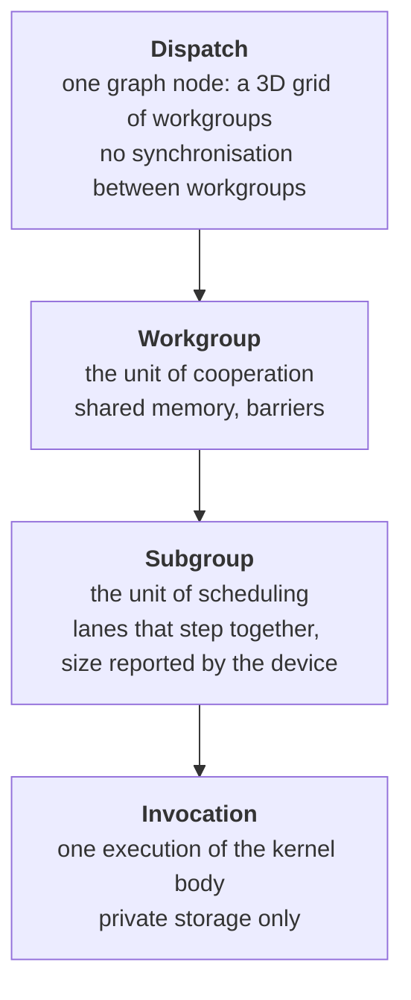

# Compute model

**What is built — 2026-08-24.** §§1–5 are implemented on the CPU backend: the
execution hierarchy and built-in ids, workgroup-shared memory, barriers with
§3.1's uniformity requirement enforced by the compiler and §3.4's non-uniform
arrival detected at run time, the atomic set of §4, and the subgroup operations
of §5 in uniform control flow — the reductions, the votes, `Elect`, `Ballot`,
both broadcasts and all four shuffles. The five inactive-lane rules of §5.2 are
implemented and tested one by one, including the read of an inactive lane that
is reported rather than answered.

**What is not.** §5's scans, and every operation in divergent control flow. A
subgroup operation in a conditional is refused by the cooperative lowering,
which has nowhere to resume inside a branch, and §5.1 says whether lanes
reconverge after divergence is implementation-defined — so what an emulation
would have to model is an active set no two backends agree on. The operations
built are the ones §5.1 says are portable.

This spec is therefore *in progress* rather than implemented, and §5's scan rows
are what remains.

Implements [`000-decisions.md`](000-decisions.md) decision 4. This spec exists because
its subject was the predecessor project's central mistake, and the mistake is
worth stating precisely so the design is judged against it.

It is the normative definition of what a kernel *means*.
[004](004-kernel-authoring.md) owns the language a kernel is written in and how
it lowers; [006](006-backends.md) owns which device can do what. This spec owns
the semantics both of them have to preserve.

## The mistake being corrected

The predecessor emitted `layout(local_size_x = 1) in;`. One invocation per
workgroup, no shared memory, no barriers, no atomics, and `[]float32` as the only
buffer element type.

Each of those alone is fatal for the workloads layer 2 targets:

- One invocation per workgroup leaves the hardware almost entirely idle, since
  the scheduler's unit is a subgroup of 32 or 64 lanes.
- Without shared memory a tiled GEMM cannot exist, because tiling *is* staging a
  block into fast memory shared by a workgroup.
- Without barriers a workgroup cannot cooperate at all, so no reduction, no
  softmax, no scan, no attention.
- With f32 only, inference runs at 2 to 4 times the memory traffic it should and
  cannot touch quantized weights.

None of these can be added later without changing what a kernel signature means,
which is why they are specified before anything is built.

---

## 1. The execution model

### 1.1 The hierarchy

Four levels, each with a different guarantee attached to it. Confusing two of
them is how most GPU bugs start.



| Level | Size fixed at | Can synchronise with peers | Shares memory with peers |
| --- | --- | --- | --- |
| Dispatch | graph record, or device if indirect | No. Ordering between dispatches is [003](003-command-graph.md)'s computed barriers. | Storage buffers only |
| Workgroup | pipeline creation | Yes, `t.Barrier()` | Shared memory and storage buffers |
| Subgroup | device (reported, not chosen) | Yes, `t.SubgroupBarrier()`, capability-gated | Lane values via subgroup ops |
| Invocation | n/a | n/a | Nothing. Private storage is per invocation. |

Two boundaries are load-bearing:

**The workgroup is the largest scope with a synchronisation primitive.** There is
no device barrier inside a kernel and none is planned. Cross-workgroup ordering
is a graph edge, not a kernel construct, because on real hardware a workgroup may
not begin until another has finished, so waiting on a peer workgroup can deadlock
outright. See 2.7.

**The subgroup is discovered, not chosen.** A kernel that assumes a subgroup size
is wrong on the next device. Workgroup size is the caller's, subgroup size is the
device's.

### 1.2 Workgroup size is generated metadata fixed at pipeline creation

Workgroup size is part of the generated `Kernel` metadata consumed at pipeline
creation, not a caller-written pipeline field and not a dispatch argument.
Backends need it at compile time: it appears in the GLSL layout qualifier, in
`[numthreads(...)]` in HLSL, and in Metal's threads-per-threadgroup. The author
writes it once in 004's kernel directive; the public pipeline descriptor carries
only the generated kernel and an optional label.

A dispatch specifies a count of **workgroups**, not a count of threads. This is
the opposite of the predecessor's `Dispatch(x, y, z)` thread count, and the
change is deliberate: a thread count makes the workgroup size invisible to the
caller, which is exactly how it ended up being 1.

The size is three-dimensional, spelled `//accel:kernel workgroup=16,8`, with
`workgroup=256` meaning `256,1,1`. A 2D group is not a convenience: a tiled
GEMM's tile is 2D, and a 1D group means recovering `x` and `y` by division in
every kernel with a 2D domain. The pipeline's declared size and the source's
directive must agree, and a disagreement is a build error naming both positions.

### 1.3 Built-in ids

Every id is `uint32`. That is the type that makes `l < s` and `tile[l+s]`
typecheck without a conversion, and it is where the GLSL integer-literal
divergence in [`conventions.md`](../docs/conventions.md) is settled at the root
rather than papered over by coercing ids to `int`.

Vector ids are `accel.ID3`, a plain Go struct of three `uint32` fields `X`, `Y`,
`Z`. It is a value type with no methods, so it has a trivial spelling in every
target (`uvec3`, `uint3`).

Write `S` for the workgroup size, `G` for the workgroup count, `g` for the
workgroup id, `l` for the local id.

| Accessor | Type | Derivation | Range | Uniform across |
| --- | --- | --- | --- | --- |
| `t.WorkgroupSize()` | `ID3` | generated kernel metadata | `S` | dispatch |
| `t.NumGroups()` | `ID3` | dispatch parameter | `G` | dispatch |
| `t.GlobalSize()` | `ID3` | `S.i * G.i` per axis | | dispatch |
| `t.GroupID()` | `ID3` | scheduler-assigned | `[0, G.i)` | workgroup |
| `t.LocalID()` | `ID3` | scheduler-assigned | `[0, S.i)` | invocation |
| `t.GlobalID()` | `ID3` | `g.i*S.i + l.i` per axis | `[0, S.i*G.i)` | invocation |
| `t.LocalIndex()` | `uint32` | `l.Z*S.Y*S.X + l.Y*S.X + l.X` | `[0, S.X*S.Y*S.Z)` | invocation |
| `t.GroupIndex()` | `uint32` | `g.Z*G.Y*G.X + g.Y*G.X + g.X` | `[0, G.X*G.Y*G.Z)` | workgroup |
| `t.GlobalIndex()` | `uint32` | `GroupIndex()*S.X*S.Y*S.Z + LocalIndex()` | `[0, total)` | invocation |
| `t.SubgroupSize()` | `uint32` | device-reported | `[1, 128]` | dispatch |
| `t.SubgroupID()` | `uint32` | implementation-defined, see 5.1 | `[0, ceil(inv/size))` | subgroup |
| `t.SubgroupInvocationID()` | `uint32` | implementation-defined, see 5.1 | `[0, SubgroupSize())` | invocation |

The rightmost column is not decoration. It is the seed set for the uniformity
analysis in 3.3: `GroupID` is uniform across a workgroup and `LocalID` is not,
and that single distinction decides whether a barrier is legal.

**`GlobalIndex` is workgroup-contiguous and is not the linearization of
`GlobalID` over the grid.** Those two are equal only when the grid and the
workgroup are both one-dimensional. For `S = (16,16,1)` and `G = (2,2,1)`, the
invocation at `g = (1,0,0)`, `l = (0,0,0)` has `GlobalIndex() == 256` and a
grid-linearized `GlobalID` of `16`. The workgroup-contiguous definition is
chosen because it is the one that makes consecutive lanes touch consecutive
addresses, which is the whole point of a linear index. This is exactly the class
of silently divergent convention that [`conventions.md`](../docs/conventions.md)
exists for, so it is stated rather than assumed.

### 1.4 Linearization is x-fastest, and it is guaranteed

**`X` varies fastest, then `Y`, then `Z`.** Not implementation-defined, not
advisory. With workgroup size $S$ and local id $l$:

$$
\mathrm{LocalIndex} = l_z S_y S_x + l_y S_x + l_x
$$

and with workgroup count $G$ and workgroup id $g$:

$$
\mathrm{GroupIndex} = g_z G_y G_x + g_y G_x + g_x,
\qquad
\mathrm{GlobalIndex} = \mathrm{GroupIndex} \cdot S_x S_y S_z + \mathrm{LocalIndex}
$$ Index arithmetic is not portable otherwise: a kernel flattening a 2D
tile index computes a different address on a device that disagrees, and the
result is a plausible wrong number rather than a crash.

The guarantee costs nothing, which is why it can be made. Every target already
agrees: GLSL's `gl_LocalInvocationIndex`, HLSL's `SV_GroupIndex`, WGSL's
`local_invocation_index`, and Metal's `thread_index_in_threadgroup` are all
defined as `z*sy*sx + y*sx + x`. The backend emits the built-in directly and
never computes it.

Row-major, x-fastest also matches [007](007-tensor-layer.md)'s "last dimension
varies fastest" rule, so a `[rows, cols]` tensor and an `(x=col, y=row)` workgroup
agree without a transpose in the reader's head.

### 1.5 Limits, and the portable floor

Every device reports a maximum workgroup size per axis, a maximum total
invocation count per workgroup, a maximum workgroup count per axis, and a shared
memory budget. Exceeding any of them is a **graph build error, not a dispatch
failure**.

All of these numbers live in `Device.Limits()` as
`MaxWorkgroupSize`, `MaxWorkgroupInvocations`, `MaxWorkgroupCount`, and
`MaxSharedMemoryBytes`. `Capabilities` contains only support flags and operation
sets. A number used in validation or arithmetic is a limit even when zero has a
special meaning on hardware.

The guaranteed minimums differ enough that portability is not obvious, so the
floor is written down rather than remembered:

| Limit | Portable floor | Where the floor comes from |
| --- | --- | --- |
| Max invocations per workgroup | 128 | Vulkan and GLES 3.1 guaranteed minimum |
| Max workgroup size, X and Y | 128 | same |
| Max workgroup size, Z | 64 | same |
| Max workgroup count per axis | 65535 | Vulkan, D3D12, GLES 3.1 |
| Shared memory per workgroup | 16384 bytes | Vulkan, GLES 3.1, WebGPU default |

Every number above is a floor **to be confirmed at first contact** with each
backend and recorded in [`conventions.md`](../docs/conventions.md), per
[006](006-backends.md)'s rule that a confidently wrong number in a normative spec
is worse than an unknown. The floors are what [006](006-backends.md)'s strict
portable mode enforces, and they are why section 7's GEMM uses a 128-invocation
workgroup rather than the 256 a 16x16 tile suggests: 256 does not fit the floor.

`WorkgroupCount` uses zero only to omit trailing axes on the **host-authored
direct** form: `X` must be positive, while `Y == 0` and `Z == 0` normalise to 1.
After normalisation every direct-dispatch axis is positive; callers omit a
direct node rather than recording a zero-sized one. An indirect count is three
device-written `u32` values and is not normalised: if any actual axis is zero,
the node performs no invocations. This is the bounded conditional-execution
form. The host-authored `maxCount` follows the direct normalization rule and is
positive after normalization.

---

## 2. The memory model

This is the part of the compute model that cannot be tested into existence. A
kernel with a missing barrier produces the right answer on a software rasterizer
and the wrong answer on a mobile GPU, so the rule has to be stated and checked,
not discovered.

### 2.1 Which model, and where accel simplifies it

**accel follows the Vulkan memory model, which is the SPIR-V memory model, and
simplifies it in six places.** Vulkan is the right ancestor because it is the
only one of the targets with a formally specified, machine-checked memory model,
and because a rule accel states is only real if some backend can enforce it.

The simplifications, each with what it costs:

| Vulkan has | accel has | Why | Cost |
| --- | --- | --- | --- |
| Scopes up to `Device` and `QueueFamily` | Scopes up to `Workgroup` | No target below Vulkan can express a device-scope kernel barrier, and none can guarantee the forward progress that would make one useful (2.7) | Cross-workgroup handoff inside a kernel is not expressible. It is a graph edge instead. |
| Per-instruction memory semantics on every atomic and barrier | One collective barrier primitive per storage-class mask; atomics are relaxed (4.2) | GLSL ES 3.1 and WGSL have no portable acquire/release atomic surface | Atomic flag handoff is not expressible in v0. Cooperation uses a collective barrier; cross-workgroup handoff uses a graph edge. |
| Availability and visibility as separate operations with memory domains | One operation: a memory barrier makes prior writes both available and visible to the whole workgroup | The split pays for itself only with non-coherent host mappings and device scope, neither of which is inside a kernel | Slightly stronger, therefore slower, than the minimum on some hardware. Accepted. |
| Non-privately-buffered versus privately-buffered variables | Every storage-class access is treated as non-privately-buffered | The distinction exists to permit aggressive caching of variables no other thread can see, which is exactly accel's `Private` class, and that class has no aliases | None material. |
| Pointer aliasing rules | No pointer casts exist in the subset | [004](004-kernel-authoring.md)'s subset admits exactly one pointer type, `*[N]T` as a parameter | None. |
| Semaphore and fence scoped operations | [003](003-command-graph.md)'s fences | Layering | None. |

One place accel is **stronger** than Vulkan, and it is worth stating because it
bounds how bad a bug can be: **a data race produces undefined values at the
racing locations and nowhere else.** It cannot corrupt an unrelated buffer, and
it cannot make the kernel do something the source does not say. This holds
because the CPU oracle is Go over bounds-checked slices, and because on every GPU
target the racing accesses are still ordinary loads and stores through a bound
descriptor. There is no undefined-behaviour-permits-anything clause here.

### 2.2 Storage classes

| Class | Go spelling | Lifetime | Visible to | Initial contents | Made visible by |
| --- | --- | --- | --- | --- | --- |
| Private | locals, `var x`, by-value params | one invocation | that invocation | zero | nothing needed |
| Workgroup (shared) | `*[N]T` parameter | one workgroup instance | every invocation of that workgroup | **undefined, and tracked** | `t.Barrier()` or `t.BarrierShared()` |
| Storage | `[]T` parameter | the buffer's | every invocation of every dispatch | whatever the buffer holds | `t.Barrier()` or `t.BarrierStorage()` within a workgroup; [003](003-command-graph.md)'s computed barriers between nodes |
| Uniform | struct-by-value parameter | one dispatch | every invocation, read-only | host-written before submission | n/a, immutable for the dispatch |

**Private is zero-initialised, and that is an obligation on the emitter, not a
property of the hardware.** Go zero-initialises `var acc float32`; GLSL, MSL, and
HLSL do not, and SPIR-V's `OpVariable` initialiser is optional. If the emitter
omits the store, the Go path reads 0, the GPU path reads whatever the register
held, and the oracle silently stops being an oracle.

**Shared memory is uninitialised at workgroup start**, and the CPU backend
proves it by **tracking definition rather than by writing a poison value**. Each
scalar element carries a shadow initialized bit; a store sets it, and a load or
atomic read-modify-write that finds it clear fails naming the kernel, source
position, workgroup, invocation, and element
([004](004-kernel-authoring.md)). A kernel accidentally relying on
zero-initialisation therefore fails on the oracle instead of silently working on
whichever backend happens to zero.

A poison byte pattern remains useful as a debugging aid and is not the
correctness mechanism, for a reason worth stating because the earlier design
turned on it: **every bit pattern is a valid integer.** `0xDEADBEEF` is a
perfectly ordinary `u32`, so an integer kernel reading undefined shared memory
could consume it without any test noticing, and a floating poison NaN can be
overwritten or propagated without proving which access came first. A shadow bit
answers the actual question, which is whether this element was written before it
was read.

**Uniform is immutable for the dispatch and read-only in the kernel**, which is
what makes its fields a seed for the uniformity analysis in 3.3. Assigning to a
by-value parameter is legal Go and would mutate a private copy, so the compiler
rejects it outright rather than letting the two paths mean different things.

Shared memory is a **parameter and not a local declaration** because a
`var tile [256]float32` is per-invocation under Go's semantics, and no Go local
can be shared by 128 goroutines. Devices report their shared-memory budget per
workgroup; requesting more is a build error.

### 2.3 Scopes

A scope is the set of invocations an ordering guarantee applies to.

| Scope | Members | Barrier available in a kernel | Ordering across it otherwise |
| --- | --- | --- | --- |
| `Invocation` | one invocation | implicit: program order | n/a |
| `Subgroup` | the lanes the device schedules together | `t.SubgroupBarrier()`, capability-gated | none |
| `Workgroup` | every invocation of one workgroup instance | `t.Barrier()` and its class-masked variants | none |
| `Dispatch` | every invocation of one dispatch | **none, by design** | [003](003-command-graph.md) inserts a barrier between graph nodes |
| `Queue` | everything submitted to one queue | **none** | [003](003-command-graph.md)'s node edges and fences |

`Subgroup` scope exists and is narrower than `Workgroup`, so a subgroup barrier
is cheaper. It is capability-gated for the same reason subgroup operations are:
GLES 3.1 has no subgroup concept at all. A kernel with no subgroup fallback path
is not portable, per 5.5.

### 2.4 Happens-before

Let a memory operation be a read or write of one location in one storage class.

- **Program order.** `a ->po b` when `a` and `b` are issued by the same
  invocation and `a` precedes `b` in the kernel's execution.
- **Synchronises-with.** `a ->sw b` when there is a dynamic barrier instance `B`
  whose storage-class mask covers the class of `a` and `b`, those are issued by
  invocations `i` and `j` in the same barrier scope, `a ->po (i's arrival at B)`, and
  `(j's departure from B) ->po b`. The barrier's execution component is what
  makes arrival and departure separable events, and its memory component is what
  makes the edge carry data.
- **Happens-before.** `->hb` is the transitive closure of `->po` union `->sw`.

Then, for a location `x`:

1. A read `R` of `x` observes the write `W` such that `W ->hb R` and there is no
   other write `W'` with `W ->hb W' ->hb R`. If several such `W` exist and are
   unordered with respect to each other, the value is undefined.
2. If a write `W` and any access `A` to `x` are unordered by `->hb` and at least
   one of them is a write, that is a **data race**, and the value read by `A` (or
   subsequently read from `x`) is undefined, bounded by 2.1's stronger clause.
3. Atomic operations on `x` are exempt from (2): they never race with each other.
   They form a total modification order per location, and nothing more (4.2).

Two consequences that people get wrong in exactly this order:

- **The barrier orders the class it names, not every class.** A barrier with a
  shared mask does not order storage-buffer accesses. `t.BarrierShared()` between
  a storage write and a peer's storage read is a race, and it is a race that
  works on every desktop GPU because their caches are coherent enough to hide it.
- **`->hb` is not created by a relaxed atomic flag.** A payload written by
  invocation 0, followed by a flag observed by invocation 1, does not order the
  payload. v0 deliberately has no acquire/release spelling for that handoff; use
  a collective workgroup barrier or a graph edge (4.2 and 2.7).

### 2.5 What a barrier orders, and what it makes visible

Two components, and conflating them is a common source of wrong results:

- **Execution barrier**: all invocations in the scope reach this point before any
  proceeds. It orders *control*. Alone, it makes no write visible.
- **Memory barrier**: writes to the named storage classes issued before this
  point are visible to reads issued after it, throughout the scope. It orders
  *data*. Alone, it does not stop an invocation from running ahead.

The common case is both together, and the API provides that as one call so the
easy path is the correct one:

| Call | Execution | Classes made visible | Scope |
| --- | --- | --- | --- |
| `t.Barrier()` | yes | shared and storage | workgroup |
| `t.BarrierShared()` | yes | shared | workgroup |
| `t.BarrierStorage()` | yes | storage | workgroup |
| `t.SubgroupBarrier()` | yes | shared and storage | subgroup, capability-gated |

`t.Barrier()` is the one to reach for. The masked variants exist because a
storage memory barrier is materially more expensive than a shared one on tiled
mobile hardware, and a tiled GEMM executes two barriers per k-tile in its
innermost structure, so the difference is not academic. v0 exposes no
memory-only fence: without acquire/release atomics it would invite a flag
handoff the portable model cannot make correct.

Lowering, so the claim is checkable rather than asserted:

| Call | GLSL ES 3.1 | MSL | SPIR-V | HLSL | WGSL |
| --- | --- | --- | --- | --- | --- |
| `Barrier` | `memoryBarrierShared(); memoryBarrierBuffer(); barrier()` | `threadgroup_barrier(mem_threadgroup\|mem_device)` | `OpControlBarrier Workgroup Workgroup (AcquireRelease\|WorkgroupMemory\|UniformMemory)` | `AllMemoryBarrierWithGroupSync()` | `workgroupBarrier(); storageBarrier()` |
| `BarrierShared` | `memoryBarrierShared(); barrier()` | `threadgroup_barrier(mem_threadgroup)` | same, `WorkgroupMemory` only | `GroupMemoryBarrierWithGroupSync()` | `workgroupBarrier()` |
| `BarrierStorage` | `memoryBarrierBuffer(); barrier()` | `threadgroup_barrier(mem_device)` | same, `UniformMemory` only | `DeviceMemoryBarrierWithGroupSync()` | `storageBarrier()` |
| `SubgroupBarrier` | not available | `simdgroup_barrier(...)` | `OpControlBarrier Subgroup Subgroup ...` | SM 6 wave intrinsics | `subgroupBarrier()` where present |

The GLSL memory barrier precedes `barrier()`: writes must be made available
before invocations are released from the rendezvous. Reversing those calls lets
a peer leave the execution barrier before the publishing invocation has issued
its memory barrier, which does not establish the edge this section promises.

### 2.6 Without a barrier, nothing is guaranteed

Stated as a rule so it can be quoted: **between two invocations, with no barrier
and no atomic, there is no ordering and no visibility guarantee whatsoever.**

Not "eventually visible". Not "visible within a subgroup". Not "visible because
the hardware is coherent". A write by one invocation and a read by another with
no `->hb` edge is a race, and the read's value is undefined even if the two
invocations are lanes of the same subgroup and the hardware executes them in
lockstep. Lockstep execution is a scheduling property that hardware has removed
before (independent thread scheduling on NVIDIA Volta and later) and it was never
a specified guarantee.

The one exception is within a single invocation: program order gives an
invocation a coherent view of its own writes in every storage class, with no
barrier. That is what makes an accumulator in a local variable work.

### 2.7 Forward progress is not guaranteed

**A kernel must not wait on another invocation except at a barrier.**

Between workgroups this is absolute: a workgroup may not be scheduled until
another has finished, so a spin loop waiting on a peer can deadlock the device
rather than merely run slowly. Every backend in [006](006-backends.md)'s matrix
permits that scheduling, and so does the CPU backend, whose workgroups run on a
worker pool sized from `GOMAXPROCS`. Within a workgroup it is nearly as bad: on
hardware without independent thread scheduling, a lane spinning on a flag
prevents the lane that would set it from running.

So there is no lock, no spin, and no producer-consumer flag inside a kernel: a
barrier for intra-workgroup cooperation, an atomic for contention-free
accumulation, and a graph edge for anything wider. This is the boundary that
divides this spec from [003](003-command-graph.md), and it is why 003's barriers
being *computed* is not a limitation: there is nothing legal a caller could write
here instead.

Barriers here are *intra*-kernel. Inter-node synchronisation is computed by the
graph builder and is not the caller's concern.

---

## 3. Barrier semantics, precisely

### 3.1 Uniform control flow is required at the barrier's scope

**Rule.** Every invocation in a barrier's scope must execute the same sequence of
barrier instances. The scope is the workgroup for `Barrier`, `BarrierShared`, and
`BarrierStorage`, and one subgroup for `SubgroupBarrier`. Formally, for a barrier
statement `B` and any two invocations `i` and `j` in the same dynamic scope, the
number of times `i` executes `B` equals the number of times `j` executes `B`, and
the interleaving of `B` with every other barrier at that scope is the same for
both. A subgroup barrier need not be reached by other subgroups in the
workgroup; a workgroup barrier must be reached by all of them.

A barrier reached by some invocations of a workgroup and not others is undefined
behaviour on real hardware, and **it will appear to work in testing.** On most
desktop and software implementations the barrier is effectively a no-op when the
missing lanes are masked off, so the kernel computes the expected answer on
lavapipe, on llvmpipe, on WARP, and on the developer's laptop, and hangs or
corrupts on a mobile GPU. [006](006-backends.md) makes the same point about tier
2 CI: green software-rasterizer runs do not prove the memory model.

This is a documented caller obligation, enforced two ways: statically by the
compiler where it can decide, and dynamically by the CPU backend always.

### 3.2 Legal and illegal, in Go

Illegal. The barrier is control-dependent on `l < s`, and `l` is `LocalIndex`,
which is not uniform:

```go
//accel:kernel workgroup=256
func BadReduce(t accel.Thread, in []float32, out []float32, tile *[256]float32) {
	l := t.LocalIndex()
	tile[l] = in[t.GlobalIndex()]
	for s := uint32(128); s > 0; s >>= 1 {
		if l < s {
			tile[l] += tile[l+s]
			t.Barrier() // REJECTED: control-dependent on a non-uniform predicate
		}
	}
	if l == 0 {
		out[t.GroupIndex()] = tile[0]
	}
}
```

Legal. Same computation, barrier hoisted out of the divergent region. The `if`
still diverges, and that is fine: divergence is not the problem, a barrier inside
divergence is:

```go
//accel:kernel workgroup=256
func GoodReduce(t accel.Thread, in []float32, out []float32, tile *[256]float32) {
	l := t.LocalIndex()
	tile[l] = in[t.GlobalIndex()]
	t.BarrierShared()
	for s := uint32(128); s > 0; s >>= 1 {
		if l < s {
			tile[l] += tile[l+s]
		}
		t.BarrierShared() // every invocation reaches this, every iteration
	}
	if l == 0 {
		out[t.GroupIndex()] = tile[0]
	}
}
```

Also illegal, and this is the one people forget: a barrier not inside any `if`,
in a loop whose trip count is non-uniform. The fix is to read the count from a
uniform parameter, which is what section 7's GEMM does with `d.K`:

```go
type Params struct{ N uint32 }

//accel:kernel workgroup=256
func Trip(t accel.Thread, p Params, counts []uint32, tile *[256]float32) {
	n := counts[t.LocalIndex()] // non-uniform: a storage load indexed by local id
	for i := uint32(0); i < n; i++ {
		t.Barrier() // REJECTED: enclosing loop has a non-uniform trip count
	}
	for i := uint32(0); i < p.N; i++ { // uniform: a uniform-buffer field
		t.Barrier() // accepted
	}
}
```

The same rule catches an early `return`, a `break`, and a `continue` under a
non-uniform predicate, because each makes the barrier control-dependent on that
predicate.

### 3.3 How the compiler decides

Uniformity is a forward dataflow analysis over [004](004-kernel-authoring.md)'s
typed IR. It computes a three-level lattice for every value:
`WorkgroupUniform` (equal across the whole workgroup), `SubgroupUniform` (equal
within each subgroup), or `NonUniform`. Workgroup-uniform values are also
subgroup-uniform. Workgroup barriers require `WorkgroupUniform` control;
subgroup barriers require `SubgroupUniform` control.

**Seeds.**

| Workgroup-uniform | Subgroup-uniform only | Non-uniform |
| --- | --- | --- |
| Literals and constants | `t.SubgroupID()` | `t.LocalID()`, `t.LocalIndex()` |
| Fields of the uniform-struct parameter | | `t.GlobalID()`, `t.GlobalIndex()` |
| `t.GroupID()`, `t.GroupIndex()` | | `t.SubgroupInvocationID()` |
| `t.WorkgroupSize()`, `t.NumGroups()`, `t.GlobalSize()` | | any load from a storage buffer |
| `t.SubgroupSize()` | | any load from shared memory |
| | | any atomic's return value |
| | | any subgroup operation's result (conservative even when one operation broadcasts) |

Loads are non-uniform even when the index is uniform, because another invocation
may have written the location. A uniform-indexed load *after* a barrier is still
non-uniform under this analysis, which is conservative and known to be so: see
below.

**Propagation.** A value's uniformity is the least-uniform operand. A variable's
value at a program point has a scope only if every reaching definition has at
least that scope and every definition is control-dependent only on predicates
uniform at that scope.
The second clause is what stops `if l < 4 { x = 1 } else { x = 2 }` from being
called uniform because both `1` and `2` are literals.

**The rule.** A barrier `B` is accepted iff every predicate in `B`'s control
dependence set is uniform at `B`'s scope, and every loop enclosing `B` has a trip
count uniform at that scope (and no `break` or `continue` controlled by a less
uniform predicate).

**When the analysis cannot decide, it rejects.** This is a choice, and the
alternative is worse. An admitted invalid barrier is undefined behaviour that
passes every test the project can run without buying hardware, then fails on a
user's phone with a hang. A rejected valid barrier is a compile error with a
`file:line:col`, and the caller's fix is to hoist the barrier out of the region
the compiler could not prove uniform, which is a transformation that is always
available and always correct. Cost of the choice, stated: some correct kernels
are rejected, and the two known families are a barrier whose predicate is
uniform by construction but flows through a shared-memory location, and a loop
whose trip count is computed from a storage buffer the caller knows holds the
same value everywhere. Both are real, and neither is common enough to trade for
the failure mode above.

**The escape hatch stays closed, and now for a reason rather than a deferral.**
The tempting fix is to make the second family disappear: a load from a binding
**no invocation writes** could be as uniform as its index, since the seed's own
justification — "another invocation may have written the location" — does not
apply to it. `Binding.Write` is already inferred from the body, counts an atomic
as a write, and propagates out of helpers, so the compiler has the fact.

It is unsound, and what makes it unsound is a deliberate capability. The
conclusion needs no *other* binding of the same node to write that memory, and
[003](003-command-graph.md) permits exactly that alias: one buffer bound to a
read binding and a write binding of one dispatch is how in-place elementwise
work is expressed, with a test defending it. 003's check V23 would forbid the
alias and is not implemented; implementing it as worded would delete the
feature. So the load's value can change under a workgroup mid-dispatch, and a
barrier admitted on the strength of it would hang on a device — the failure this
section chose conservatism to avoid.

What a kernel does instead is bound the loop by the binding's **extent** rather
than its **contents**. `len()` is seeded workgroup-uniform above and is fixed
when the node is recorded, so no aliased write can move it.
[044](044-unbounded-context.md) is the worked example: five attention kernels
walk a cache of any length under a barrier-bearing loop, each taking its bound
from the binding that describes its reach.

The analysis runs on the IR, once, and is therefore shared by every target, which
is [004](004-kernel-authoring.md)'s argument for having an IR at all.

### 3.4 The CPU backend catches what the compiler cannot

Static analysis is conservative in one direction; the runtime check is exact. The
CPU backend detects **non-uniform arrival** and fails deterministically rather
than hanging. The mechanism is [004](004-kernel-authoring.md)'s: every generated
suspension point carries a stable barrier ID and source position, and at each
rendezvous epoch every active invocation must suspend at the same ID. An
invocation that returns, reaches a different ID, or runs on into another epoch
while peers wait is reported with the expected and observed barrier positions and
the offending invocation ids. It is a detection, not a timeout, so it is not
flaky and it fires on the first offending run.

Note what this does *not* rely on: counting live invocations against the number
blocked at a barrier. That count falling short is one way an arrival becomes
impossible and not the only one, so inferring from it alone would miss the cases
where an invocation is still running but will never arrive at this barrier.

Reaching two *different* barrier statements is caught by the same rule rather
than by a separate one: the epoch is keyed by barrier identity, so arriving at A
while a peer waits at B is a reported mismatch, not a silent pairing. The CPU backend catching this is a
large part of why it is worth having.

---

## 4. Atomics

### 4.1 The operation set

Atomics are **free functions taking a buffer and an index**, never a pointer into
a buffer, because GLSL cannot form one:

| Signature | Result | Notes |
| --- | --- | --- |
| `accel.AddU32(b []uint32, i uint32, v uint32) uint32` | previous value | wraps modulo 2^32 |
| `accel.AddI32(b []int32, i uint32, v int32) int32` | previous value | wraps, two's complement |
| `accel.SubU32`, `accel.SubI32` | previous value | wraps |
| `accel.MinU32`, `accel.MinI32` | previous value | comparison by the named type |
| `accel.MaxU32`, `accel.MaxI32` | previous value | |
| `accel.AndU32`, `accel.OrU32`, `accel.XorU32` | previous value | |
| `accel.ExchangeU32`, `accel.ExchangeI32` | previous value | unconditional store |
| `accel.CompareExchangeU32(b []uint32, i, cmp, v uint32) uint32` | previous value | strong; success is `returned == cmp` |
| `accel.CompareExchangeI32` | previous value | strong |
| `accel.AddF32(b []float32, i uint32, v float32) float32` | previous value | **capability**, see 4.5 |

A shared array is passed as `tile[:]`. The subset admits a slice expression on a
`*[N]T` parameter **only** as a direct argument to an atomic intrinsic, which
keeps one name per operation instead of a parallel shared-memory family, and
lowers exactly: GLSL's `atomicAdd(tile[i], v)` and `atomicAdd(buf.data[i], v)`
are the same construct with a different base.

`CompareExchange` is **strong**: it fails only when the observed value differs
from `cmp`. There is no spurious failure to loop around. Every target's
compare-exchange is strong, so promising weak would be inventing a hazard.

### 4.2 Atomics are relaxed, and barriers are explicit

**Decision: every atomic has relaxed ordering.** An atomic operation is atomic
with respect to other atomics on the same location and orders nothing else.

Why. Vulkan and SPIR-V carry per-instruction memory semantics, so an
acquire-release atomic is one instruction there. GLSL ES 3.1's and WGSL's
`atomicAdd` have no semantics operand at all, so acquire-release would lower to a
full memory barrier before and after **every atomic** on those backends. A
histogram or a reduction executes millions of atomics and needs none of that
ordering, so the cost would be paid entirely by kernels that do not want it.
Rather than hide that cost, v0 leaves acquire/release atomics and flag handoff
out of the model.

What is still guaranteed, and is enough for the actual uses:

- All atomic operations on one location occur in a single total order, and each
  observes the immediately preceding one in that order. A counter incremented by
  a million invocations reaches exactly a million.
- An atomic never tears. A 32-bit atomic read never observes half of two writes.
- An atomic never races with another atomic on the same location.

What is not guaranteed, spelled out because it is the trap:

```go
// WRONG. Nothing orders the payload write against the flag.
payload[i] = v
accel.ExchangeU32(flag, 0, 1)                          // publish
// ... another invocation ...
if accel.AddU32(flag, 0, 0) == 1 { x := payload[i] }   // may read a stale payload
```

```go
// RIGHT: all invocations cooperate in phases.
payload[i] = v
t.BarrierStorage()
x := payload[peer]
```

There is **no v0 flag-handoff spelling**, even within one workgroup. Putting a
collective barrier before the flag does not order a later payload read after the
flag observation, while putting it after the observation can deadlock because
not every invocation necessarily takes that branch. Memory-only fences do not
supply acquire/release semantics for the relaxed atomic. Across workgroups there
is no right spelling either, per 2.7. Use unconditional collective phases within
a workgroup and a graph edge between dispatches. A future flag handoff requires
an explicit acquire/release atomic model and backend lowering before it may enter
the surface.

**Mixing an atomic and a non-atomic access to the same location without a barrier
between them is a data race**, with the ordinary consequence in 2.4. Atomics do
not make a location safe, they make atomic accesses to it safe.

### 4.3 Previous value, and overflow

Every atomic **returns the value the location held immediately before the
operation**, in the location's total modification order. That is the definition
that makes `AddU32(counter, 0, 1)` a ticket dispenser: every invocation gets a
distinct value, and the values are exactly `[0, n)` for `n` invocations.

For `CompareExchange` the returned value is the pre-operation value whether or
not the exchange happened, so `returned == cmp` is the success test and
`returned` is the observed value on failure. A `(value, bool)` pair was rejected:
[004](004-kernel-authoring.md) allows one result in v0, and one value is what
every target returns anyway.

Overflow:

| Operation | Behaviour |
| --- | --- |
| `AddU32`, `SubU32` | wraps modulo 2^32 |
| `AddI32`, `SubI32` | wraps, two's complement |
| `MinU32`, `MaxU32` | unsigned comparison |
| `MinI32`, `MaxI32` | signed comparison |
| `AddF32` | IEEE-754: overflows to an infinity, never wraps; NaN propagates |

Integer wrapping agrees with Go's defined signed-overflow behaviour and with
SPIR-V's `OpIAdd`, so the oracle and the hardware agree with no correction. This
is one of the few places where Go's semantics and the GPU's coincide exactly.

### 4.4 Shared and storage atomics have the same semantics

Atomic add, min, max, exchange, and compare-exchange on 32-bit integer and
unsigned types work in **both** storage and shared memory, with identical
semantics: same total order per location, same relaxed ordering, same return
value.

They differ in cost, not meaning. A shared-memory atomic is typically an order of
magnitude cheaper because it resolves in the workgroup's local memory, which is
why the standard histogram accumulates into a shared bin array and does one
storage atomic per bin at the end rather than one per sample.

They also differ in availability at the margin: [006](006-backends.md)'s matrix
gives atomic float add two separate rows, `cap` for storage and `?` for shared on
Metal. Integer atomics are `yes` in both rows on every backend.

### 4.5 Atomic float add is a capability

Atomic **float** add is a queryable capability, not a guarantee. Support is
genuinely uneven across backends (absent architecturally in WGSL, D3D12, and
GLES 3.1, per [006](006-backends.md)), and it is the one people reach for in
reductions, so its absence must be visible rather than discovered.

Two consequences a kernel author has to plan for:

- **A no-capability path is mandatory**, and the portable one is a shared-memory
  tree reduction followed by one atomic per workgroup, or a compare-exchange loop
  over `math.Float32bits`. The CPU backend implements `AddF32` as exactly the
  latter.
- **A float-atomic result is not reproducible** on any hardware, including
  between two runs on the same device. The hardware picks the accumulation order
  and floating-point addition is not associative.
  [004](004-kernel-authoring.md)'s class E is tolerance-only for this reason. An
  integer atomic contention test asserts an exact total; the f32 version of the
  same test cannot, and writing it as if it could is how a flaky test enters a
  suite.

---

## 5. Subgroups

Subgroup operations, a shuffle, a broadcast, a ballot, and a reduction across the
lanes the hardware schedules together, are the difference between a fast
reduction and a slow one. A 256-lane tree reduction through shared memory is
eight barriers; the subgroup version is five shuffles and one barrier.

They are a **queryable capability** with a device-reported subgroup size, not a
guarantee. Subgroup size varies across hardware, some backends do not expose
these at all, and a kernel that assumes a size is wrong on the next device.

### 5.1 Membership, activity, and what is not guaranteed

A workgroup's invocations are partitioned into subgroups of `t.SubgroupSize()`
lanes, with the last one partially filled when the invocation count is not a
multiple of the size.

**Which invocation lands in which subgroup, and at which lane, is
implementation-defined.** The obvious mapping (`SubgroupID = LocalIndex / size`,
`SubgroupInvocationID = LocalIndex % size`) is what the CPU oracle uses, and it is
what most hardware does, but it is not promised by every backend, and asserting it
here would be exactly the confidently-wrong-number failure
[006](006-backends.md) warns about. A kernel that needs a specific lane-to-data
mapping must build it from `LocalIndex` itself. This is an open question below.

An invocation is **active** at a program point if it is currently executing that
point. Every subgroup operation is defined in terms of the active set at the
point it executes.

**Whether lanes reconverge after a divergent region is implementation-defined.**
Two lanes that took different branches of an `if` may or may not be active
together at the statement after it. That is the deepest trap in this section, and
it means the portable subset is narrower than the operations suggest: a subgroup
operation's result is portable when it sits in **uniform control flow**, where
the active set is the full subgroup, or when the kernel's result does not depend
on which lanes were active. Everything else is a per-device answer.

### 5.2 The operations

`M` is `accel.KernelMask`, an opaque value type with methods rather than a `uint64`.
The dtype set has no 64-bit integer, and Vulkan's ballot is 128 bits wide, so a
`uint64` would foreclose a real device. Methods: `Count()`, `Bit(lane uint32)`,
`LowestSet()`, `CountLower(lane uint32)`, `Any()`.

| Operation | Signature | Semantics | Inactive lanes |
| --- | --- | --- | --- |
| Elect | `t.Elect() bool` | true for exactly one lane | true for the **lowest-numbered active lane**; pinned by accel, since hardware only guarantees "exactly one" |
| Broadcast | `t.BroadcastF32(v float32, lane uint32) float32` | every active lane receives lane `lane`'s `v` | `lane` must be **dynamically uniform**; reading an inactive lane is undefined |
| BroadcastFirst | `t.BroadcastFirstF32(v float32) float32` | every active lane receives the lowest-numbered active lane's `v` | always defined; the safe form |
| Shuffle | `t.ShuffleF32(v float32, lane uint32) float32` | lane `i` receives lane `lane[i]`'s `v` | `lane` need **not** be uniform; reading an inactive lane is undefined |
| ShuffleXor | `t.ShuffleXorF32(v float32, mask uint32) float32` | lane `i` receives lane `i ^ mask`'s `v` | undefined if the partner is inactive |
| ShuffleUp, ShuffleDown | `t.ShuffleUpF32(v float32, delta uint32) float32` | lane `i` receives lane `i-delta`, or `i+delta` | undefined if the partner is inactive **or out of range** |
| Ballot | `t.Ballot(pred bool) M` | bit `i` is lane `i`'s `pred` | bit is **0** for an inactive lane, so `Ballot(true)` is not all-ones |
| Any, All | `t.Any(pred bool) bool`, `t.All(pred bool) bool` | over the active set | inactive lanes contribute nothing; `All` over one active lane is that lane's predicate |
| Reduction | `t.SubgroupAddF32(v float32) float32`, plus `Mul`, `Min`, `Max` over f32/i32/u32 and `And`, `Or`, `Xor` over i32/u32 | the reduction of `v` over the active set, broadcast to all active lanes | inactive lanes contribute nothing, not an identity element |
| Inclusive scan | `t.SubgroupInclusiveAddF32(v float32) float32` | lane `i` receives the reduction over active lanes `j <= i` | inactive lanes are skipped, not treated as identity |
| Exclusive scan | `t.SubgroupExclusiveAddF32(v float32) float32` | lane `i` receives the reduction over active lanes `j < i` | the lowest active lane receives the **identity** |

**Spelling.** Every operation above is a `Subgroup`-prefixed method:
`t.SubgroupElect()`, `t.SubgroupBroadcastF32(v, lane)`,
`t.SubgroupShuffleXorF32(v, mask)`, and so on. The table keeps the short names
because they are what the operation is called; the prefix is what keeps
`accel.Thread` readable beside `t.GlobalID()` and `t.Barrier()`, and it is the
convention the reductions shipped with.

**Which capability each implies.** The lane-addressed reads — `Broadcast`,
`Shuffle`, `ShuffleXor`, `ShuffleUp` and `ShuffleDown` — all infer
`CapSubgroupShuffle`. Vulkan files `subgroupBroadcast` under its *ballot*
feature and the relative shuffles under a third; accel's capability names what
the operation does, which is read the value a lane an operand names holds. The
practical reason is Metal: it spells every one of these and cannot spell a
ballot, because `simd_ballot` returns a `simd_vote` rather than an integer
([022](022-msl-target.md) §5). Grouping them under ballot would refuse a device
that has all five. A backend whose own grouping is finer — SPIR-V's
`OpGroupNonUniformBroadcast` needs `GroupNonUniformBallot` — requests the
superset when it declares its features, which is a backend's business and not a
kernel's. `BroadcastFirst` keeps `CapSubgroupBallot`, which is the one place the
two groupings still disagree.

**Inactive lanes are the part everyone gets wrong**, so the rules are collected:

1. An inactive lane produces no value and consumes none. It is not zero, it is
   not the identity, it is not present.
2. `Ballot` reports 0 for it. Code computing `Ballot(true).Count()` to learn the
   subgroup size gets the *active* count, which is usually what was wanted and
   occasionally a bug.
3. Reading an inactive lane through `Broadcast`, `Shuffle`, `ShuffleXor`,
   `ShuffleUp`, or `ShuffleDown` yields an **undefined value**. It does not yield
   zero, and it does not fault. The CPU oracle reports it through the same
   developer-mode instrumentation that carries 2.2's definition bitmap
   ([006](006-backends.md) §5), naming the reading lane and the requested lane
   rather than letting a plausible number propagate. With the instrumentation
   off the read produces a quiet NaN: still not a number a kernel could have
   computed, and still not zero.
   **Out of range is not the same as inactive, and the oracle draws the line
   there.** A lane index outside the subgroup — past its width, or below zero
   after a shuffle up — is undefined and is *not* reported. The idiomatic
   shuffle-up has every lane at one end read out of range and discard the
   answer, and it cannot avoid the call, since a subgroup operation inside a
   conditional does not lower; reporting it would refuse the kernel the
   operation exists for. What is reported is a lane that is *there* — inside the
   width, in this subgroup — and is not taking part, which is the case this rule
   is written about. The partly filled last subgroup of §5.1 is the reachable
   witness.
4. Scans skip inactive lanes rather than treating them as identity elements.
   These differ: an exclusive add-scan over active lanes `{0, 2, 3}` gives lane 3
   the sum of lanes 0 and 2, not the sum of lanes 0, 1, and 2 with lane 1 reading
   zero.
5. A reduction over an active set of one returns that lane's value, not `v + 0`.
   For non-associative f32 arithmetic those differ in the last bit.

### 5.3 Subgroup operations do not require uniform control flow, barriers do

This contrast is stated explicitly because conflating the two is the standard
mistake. A barrier in divergent control flow is undefined behaviour and is
rejected by the compiler (3.3). A subgroup operation in divergent control flow is
**legal**, and its semantics are defined in terms of the active set at that
point. What is not portable is the active set itself, per 5.1.

`t.SubgroupBarrier()` is a barrier, so it obeys 3.1 at subgroup scope: every lane
of the subgroup must reach it.

### 5.4 The CPU backend's subgroup size

The CPU backend emulates subgroups at a **configurable size, defaulting to 4**,
per [006](006-backends.md) section 5.

Four, and not 32 or 64, because the emulated size is a test instrument rather
than a model of hardware. At 4, a 128-invocation workgroup spans 32 subgroups, so
cross-subgroup boundaries, tail handling, and the "the reduction is per-subgroup,
not per-workgroup" mistake are all exercised by an ordinary workgroup. At 32 or
64 a small test workgroup is one subgroup and none of that is reached.

One size is rejected as a *default*: **1**. There every cross-lane operation is
the identity, every ballot is one bit, and every shuffle returns the lane's own
value, so a kernel with a subgroup bug passes. It stays a *test case*, because a
kernel that breaks at size 1 is a kernel that assumes lanes cooperate. The size
is configurable so a kernel whose declared semantic result is subgroup-size
independent can be compared at 1, 4, 32, and 64. Individual subgroup intrinsic
results are not expected to match across sizes; the complete kernel and its
no-subgroup fallback are.

### 5.5 Every subgroup kernel needs a fallback

**Every kernel using subgroups must have a correct path that does not.** This is
not a style rule, it is what makes the capability queryable rather than fatal:
GLES 3.1 has no subgroups at all, and D3D12 is `gated` in
[006](006-backends.md)'s matrix through the shader compiler that ships with the
OS.

The two paths must agree within the numeric contract, and the conformance suite
runs both on every device. For an f32 reduction they will not agree bit for bit
unless both reduce in the same order, which is a real design constraint on how a
fallback is written and is the reason the tests state a tolerance for f32 and
demand exactness for integers.

---

## 6. Dtypes

Buffer elements are typed. The set is closed: no f64 (it exists for training
numerics and no inference kernel here wants it), no 64-bit integers, no packed
sub-byte types at layer 1 ([007](007-tensor-layer.md) builds those out of `u8`).

### 6.1 The set

| dtype | Bits | Layout | Finite range | Precision | Availability |
| --- | --- | --- | --- | --- | --- |
| `f32` | 32 | 1 sign, 8 exponent (bias 127), 23 mantissa | +/-3.4028235e38, smallest normal 1.1754944e-38 | 24-bit significand, eps 2^-23 = 1.19e-7, about 7.2 decimal digits | universal |
| `f16` | 16 | 1 sign, 5 exponent (bias 15), 10 mantissa | +/-65504, smallest normal 6.1035e-5, smallest subnormal 5.96e-8 | 11-bit significand, eps 2^-10 = 9.77e-4, about 3.3 digits | storage universal, **arithmetic is a capability** |
| `bf16` | 16 | 1 sign, 8 exponent (bias 127), 7 mantissa | +/-3.3895e38, smallest normal 1.1754944e-38 | 8-bit significand, eps 2^-7 = 7.8e-3, about 2.4 digits | storage universal, **arithmetic is a capability** |
| `i32` | 32 | two's complement | -2147483648 to 2147483647 | exact | universal, atomics |
| `u32` | 32 | unsigned binary | 0 to 4294967295 | exact | universal, atomics |
| `i8` | 8 | two's complement | -128 to 127 | exact | storage and conversion |
| `u8` | 8 | unsigned binary | 0 to 255 | exact | storage and conversion |

The f16 versus bf16 tradeoff in one line: **bf16 has f32's exponent range and
half of f16's precision.** That is why bf16 does not need loss scaling, and why
an f16 accumulator overflows at 65504 where a bf16 one does not. It is also why
bf16 is worse for values that are already well scaled.

`f16` is the inference workhorse. `bf16` has wider range at equal width and
thinner support.

### 6.2 Conversions and their rounding modes

Every conversion's rounding mode is pinned. An unpinned rounding mode makes the
CPU oracle disagree with hardware in the last bit, which surfaces as a tolerance
somebody widens until the test passes.

| From | To | Rounding | Overflow | NaN |
| --- | --- | --- | --- | --- |
| `f32` | `f16` | **round-to-nearest-even** | to +/-Inf, **not saturating** | quiet NaN out; payload not preserved |
| `f16` | `f32` | exact, no rounding possible | n/a | quiet NaN preserved |
| `f32` | `bf16` | **round-to-nearest-even**, not truncation | to +/-Inf | quiet NaN out |
| `bf16` | `f32` | exact, mantissa zero-extended | n/a | preserved exactly, payload included |
| `f16` | `bf16` and back | via `f32`, two roundings | see above | see above |
| `i32`, `u32` | `f32` | round-to-nearest-even | n/a | n/a |
| `f32` | `i32`, `u32` | toward zero, **saturating** | clamps to the type's range | NaN maps to 0 |
| `i32`, `u32` | `i8`, `u8` | n/a | **wraps**: the low 8 bits | n/a |
| `f32` | `i8`, `u8` | toward zero, then **saturating** to the 8-bit range | clamps | NaN maps to 0 |
| `i8`, `u8` | `i32`, `u32`, `f32` | exact, sign-extended for `i8` | n/a | n/a |

**bf16 rounds, it does not truncate, and the distinction matters.** A truncating
`uint16(bits >> 16)` is a bug that a great deal of shipped code contains: it
biases every conversion toward zero, so a long dot product accumulated through
truncated bf16 drifts systematically rather than randomly, and the drift grows
with the reduction length. The correct conversion is:

```go
// accel.ToBF16, round-to-nearest-even.
func ToBF16(x float32) BF16 {
	u := math.Float32bits(x)
	if u&0x7fffffff > 0x7f800000 { // NaN: rounding would not preserve NaN-ness
		return BF16(0x7fc0)
	}
	lsb := (u >> 16) & 1
	return BF16((u + 0x7fff + lsb) >> 16)
}
```

The NaN branch is not optional. Adding the rounding bias to a NaN pattern can
carry the mantissa to zero and turn the NaN into an infinity, which then
propagates as a finite-looking wrong answer instead of as a NaN.

**Integer narrowing wraps and float-to-integer narrowing saturates. They differ,
and that is the trap.** Integer narrowing wraps because that is what Go's
`int8(x)` does and what every shading language does, so making it saturate would
require the emitter to insert a clamp at every narrowing and would make the two
paths differ if it ever forgot. Float-to-integer saturates because the
alternative is worse than either: **Go specifies that an out-of-range
float-to-integer conversion is implementation-defined**, so `int32(f)` for
`f = 1e30` is a different value on arm64 and amd64. That directly threatens
[006](006-backends.md)'s requirement that the same f32 kernel be bit-identical on
arm64 and amd64.

The consequence is an API requirement this spec is adding: **the kernel subset
forbids a bare conversion from a float type to an integer type**, and provides
`accel.ToI32(x float32) int32`, `accel.ToU32`, `accel.ToI8`, and `accel.ToU8`
with the saturating, NaN-to-zero semantics in the table. The compiler rejects
`int32(f)` with a message naming the intrinsic to use. Integer-to-float and
integer-to-integer conversions stay as ordinary Go conversions, because those are
fully defined in Go and agree with every target.

### 6.3 Denormals, NaN, and infinity

This is where the honest answer is "capability", and pretending otherwise would
put a lie in the numeric contract.

| Behaviour | Guarantee |
| --- | --- |
| NaN propagates through `+`, `-`, `*`, `/` | **guaranteed** on every backend |
| NaN sign and payload | **not guaranteed**; a conversion may quiet a signalling NaN and may discard the payload |
| Comparison with NaN is false, except `!=` | **guaranteed**: Go, IEEE-754, and every target agree |
| `Min` and `Max` with a NaN operand | **implementation-defined.** GLSL leaves it undefined, MSL follows IEEE `minNum`, and SPIR-V's `FMin`/`FMax` are undefined for NaN unless the device declares NaN preservation. The portable pattern is an explicit `IsNaN` test. |
| Overflow produces an infinity | **capability-reported.** Required by accel, and GLSL ES 3.1 does not require an implementation to produce Inf, so this starts as an unmeasured row. On Metal it is also a property of how accel compiles rather than of the device: the default floating-point mode assumes no infinities and no NaNs, so the backend must compile in the safe mode ([008](008-numerics.md) §4.2). |
| f32 subnormals preserved | **capability-reported.** Many mobile GPUs flush to zero. |
| f16 subnormals preserved | **capability-reported**, and more often absent than the f32 case. |

The rule that follows: **a kernel whose correctness depends on subnormal values
is not portable, and accel does not make it so.** Flush-to-zero cannot be
emulated away on hardware that does it, and emulating it on hardware that does
not would cost an operation per arithmetic instruction.

The CPU backend's strict portable mode therefore **flushes subnormals to zero**,
matching [006](006-backends.md)'s oracle rule that the oracle is the strictest
device rather than the most permissive one. A kernel that quietly depends on
subnormals fails on a laptop rather than on a user's phone. Permissive mode
preserves them, so the difference is observable and attributable in one run.

Three new capability rows follow from this section and are proposed for
[006](006-backends.md)'s matrix: `DenormF32Preserved`, `DenormF16Preserved`, and
`InfNaNProduced`. All three start as `?` on every GPU column and are resolved by
measurement at first contact.

### 6.4 Arithmetic is f32 by default

Arithmetic in a kernel is f32 unless the kernel says otherwise. Narrow types are
storage formats that convert on load and store by default, which is what most
inference kernels want: read f16, accumulate f32, write f16. A kernel that wants
native narrow arithmetic asks for it and requires the corresponding capability.

That default is a correctness choice, not a convenience. Sequential summation of
$K$ terms carries a forward error bounded by $\gamma_K \sum_i |x_i|$ with
$\gamma_K = K u / (1 - K u)$ and $u$ the unit roundoff
([008](008-numerics.md) §3). For $K = 4096$:

$$
u_{f32} = 2^{-24} \Rightarrow \gamma_K \approx 2.4 \times 10^{-4},
\qquad
u_{f16} = 2^{-11} \Rightarrow K u > 1
$$

The f16 bound is not merely worse, it is **vacuous**: $Ku > 1$ makes the
denominator non-positive and the bound says nothing at all. The mechanism behind
that is concrete: once the running sum passes 2048 an addend of 1.0 rounds to the
nearest multiple of 2 and small terms vanish entirely. Making f32 accumulation the default means
the naive kernel is the numerically sound one.

It is enforced by the type system rather than by convention:
[004](004-kernel-authoring.md) gives `accel.F16` and `accel.BF16` no arithmetic
operators, so Go itself forces `h.F32()` in and `accel.ToF16(x)` out. There is no
way to spell an f16 accumulator until native narrow arithmetic ships as
capability-gated intrinsics.

---

## 7. A worked tiled GEMM

This is the motivating case and the proof the model is sufficient. If it cannot
be written against this API, this spec has failed.

### 7.1 Shape and budget

Compute `C = A * B` with `A` shaped `[M, K]`, `B` shaped `[K, N]`, `C` shaped
`[M, N]`, all row-major per [007](007-tensor-layer.md), all stored `f16`,
accumulated `f32`.

| Choice | Value | Why |
| --- | --- | --- |
| Tile | 16 x 16 output elements | 2 KiB of shared memory total, well under the 16 KiB floor |
| Workgroup | 16 x 8 = 128 invocations | 128 is the portable floor from 1.5. A 16x16 group is 256 and would not run under strict portable mode. |
| Per invocation | 2 output elements, 2 tile loads per k-tile | forced by a 128-invocation group over a 256-element tile, and realistic anyway |
| Shared | `tileA *[256]float32`, `tileB *[256]float32` | f32 in shared memory, converted once on load, so the inner loop never converts |
| Barriers | 2 per k-tile | one after the load, one after the compute. One is a bug; see 7.3. |

### 7.2 The kernel

```go
// Dims is a uniform: immutable for the dispatch, and its fields are uniform
// values, which is what makes the k-loop's trip count provably uniform (3.3).
type Dims struct{ M, N, K uint32 }

//accel:kernel workgroup=16,8
func GEMMf16(t accel.Thread, d Dims, a []accel.F16, b []accel.F16, c []accel.F16,
	tileA *[256]float32, tileB *[256]float32) {

	lx := t.LocalID().X // 0..15, indexes the tile's column
	ly := t.LocalID().Y // 0..7,  indexes half the tile's rows

	col := t.GroupID().X*16 + lx
	row0 := t.GroupID().Y*16 + ly
	row1 := row0 + 8

	var acc0 float32
	var acc1 float32

	kTiles := (d.K + 15) / 16

	for kt := uint32(0); kt < kTiles; kt++ {
		k0 := kt * 16

		// Stage A[row0..row0+15, k0..k0+15] into tileA and the matching block of
		// B into tileB. Every invocation writes two elements of each tile,
		// unconditionally: out of range loads a zero rather than skipping the
		// store, which is what keeps the barrier below in uniform control flow.
		ka := k0 + lx
		var a0, a1 float32
		if row0 < d.M && ka < d.K {
			a0 = a[row0*d.K+ka].F32()
		}
		if row1 < d.M && ka < d.K {
			a1 = a[row1*d.K+ka].F32()
		}
		tileA[ly*16+lx] = a0
		tileA[(ly+8)*16+lx] = a1

		kb0 := k0 + ly
		kb1 := kb0 + 8
		var b0, b1 float32
		if kb0 < d.K && col < d.N {
			b0 = b[kb0*d.N+col].F32()
		}
		if kb1 < d.K && col < d.N {
			b1 = b[kb1*d.N+col].F32()
		}
		tileB[ly*16+lx] = b0
		tileB[(ly+8)*16+lx] = b1

		t.BarrierShared() // the tiles are now written by everybody

		for kk := uint32(0); kk < 16; kk++ {
			bv := tileB[kk*16+lx]
			acc0 += tileA[ly*16+kk] * bv
			acc1 += tileA[(ly+8)*16+kk] * bv
		}

		t.BarrierShared() // nobody may overwrite a tile still being read
	}

	if col < d.N {
		if row0 < d.M {
			c[row0*d.N+col] = accel.ToF16(acc0)
		}
		if row1 < d.M {
			c[row1*d.N+col] = accel.ToF16(acc1)
		}
	}
}
```

Dispatch: `WorkgroupCount{X: (N + 15) / 16, Y: (M + 15) / 16, Z: 1}`.

### 7.3 Walkthrough

**What the kernel is doing, per k-tile.** One workgroup owns one 16x16 block of
`C` and walks `A` rightwards and `B` downwards, staging a 16x16 block of each into
shared memory before every pass of the inner loop:

```
                  B  [K, N]                    one k-tile of the loop:
                  rows are k, columns are n
                +---------------------+        1. every invocation loads 2
                |        |#####|      |           elements of A and 2 of B
   rows k0..k0+15 -----> |#####|      |           into shared memory
                |        |#####|      |        2. BarrierShared
                +---------------------+        3. 16 multiply-adds per
                          |                       accumulator, reading only
                          |  cols owned by         shared memory
                          v  this workgroup    4. BarrierShared, so nobody
   A  [M, K]                 C  [M, N]            overwrites a tile still
   rows are m, cols are k                         being read
 +--------------+          +---------------------+
 |      |#####| |          |        |16x16|      |   tileA, tileB: 256 f32
 |      |#####| |  ----->  |        |block|      |   each = 2 KiB, against a
 |      |#####| |          |        |     |      |   16 KiB portable floor
 +--------------+          +---------------------+
         ^ cols k0..k0+15,          ^ owned by this workgroup
           rows are this
           workgroup's 16
```

The two index expressions in the kernel read straight off that picture:
`ka := k0 + lx` walks A's **columns** within the tile, and `kb0 := k0 + ly` walks
B's **rows** within it. Both are the k axis; they differ because k is A's second
index and B's first.

**Why it is tiled at all**, as a ratio. Per k-tile a workgroup performs
$16 \cdot 16 \cdot 16 \cdot 2 = 8192$ flops. Tiled, it loads $256 + 256 = 512$
elements. Untiled, each of the 256 outputs loads two values for each of 16 k
steps, so $256 \cdot 16 \cdot 2 = 8192$ loads. The arithmetic intensity, in flops
per element loaded, is therefore

$$
I_{\text{tiled}} = \frac{8192}{512} = 16,
\qquad
I_{\text{untiled}} = \frac{8192}{8192} = 1
$$

and the ratio is exactly the tile width $T = 16$, because a $T \times T$ tile
reuses each loaded element $T$ times. That is the entire argument for shared
memory existing: without it the kernel is memory-bound by a factor of $T$ and no
amount of arithmetic throughput helps. This is what
[`000-decisions.md`](000-decisions.md) decision 4 means when it says the absence
of shared memory makes a tiled GEMM impossible.

**Why the group is 16x8 and not 16x16.** 256 invocations exceeds 1.5's
128-invocation portable floor, so a 16x16 group would fail the guaranteed minimum
of two backends and would not run under [006](006-backends.md)'s strict portable
mode. Halving the group and giving each invocation two outputs costs nothing and
gains something: two accumulators reuse each loaded `tileB` value twice, which is
the first step of register blocking.

**Why the loads are unconditional and the *values* are predicated.** The tail of
a matrix whose dimensions are not multiples of 16 is the classic place a barrier
goes wrong. The tempting shape is `if row0 < d.M { tileA[...] = ... }` around the
store; the barrier after it is then control-dependent on `row0 < d.M`, derived
from `LocalID`, not uniform, and the compiler rejects it (3.3). It is right to:
on hardware some lanes would arrive at the barrier and some would not. Predicate
the value, not the store, which is why the `var a0, a1 float32` declarations
exist. This kernel is therefore also section 3's worked example of the rule.

**Why `d.K` is a uniform field and not a storage element.** `kTiles` controls the
loop containing the barriers, so it must be uniform or the whole loop is rejected
by 3.3's trip-count clause. Reading `K` from a storage buffer makes it
non-uniform under the analysis (loads are non-uniform seeds) even though every
invocation would read the same value. That is why `BindingUniformBuffer` is
load-bearing rather than a convenience: without it a tiled GEMM over runtime
dimensions cannot be written and proven legal at the same time.

**Why two barriers per k-tile.** The first orders the tile writes against the
tile reads: without it an invocation may read `tileB[kk*16+lx]` before its owner
wrote it. The second orders this iteration's tile *reads* against the next
iteration's tile *writes*: without it a fast invocation entering `kt+1`
overwrites `tileA[ly*16+lx]` while a slow one is still summing `kt`. The second
is the one that gets left out, because removing it leaves the kernel correct on
any implementation that happens to run lanes in step, which is every
implementation the project can test without buying hardware. It is exactly what
[004](004-kernel-authoring.md)'s conflicting-access reporting on the CPU backend
catches deterministically, and that is the only mechanism here that catches it
reliably.

**Why f32 accumulators over f16 storage, and what the memory model says.** `acc0`
and `acc1` are `float32` and the loads spell `.F32()` because `accel.F16` has no
arithmetic operators (6.4); at `K = 4096` an f16 accumulator loses roughly a
decimal digit. Conversion happens once per element on the way into shared memory
and never in the inner loop, which is 32 f32 multiply-adds over shared memory
with no conversion at all. The tile stores and tile loads are in different
invocations, so 2.4 requires an `->hb` edge and `t.BarrierShared()` provides
exactly one, shared class at workgroup scope. The loads of `a` and `b` need no
barrier, being read-only for the dispatch; the stores to `c` need none, because
no invocation reads them and [003](003-command-graph.md)'s computed barrier
orders them against whatever node reads `c` next. `acc0` is private and needs
nothing.

### 7.4 What it proves, and what it is not

It proves the model is sufficient: workgroup size in the descriptor, 2D ids,
shared memory as a parameter, barriers in uniform control flow, f32 accumulation
over f16 storage, a uniform for the shapes, and a portable limit budget. Nothing
in the kernel reaches outside this spec.

It is **not** a fast GEMM, and claiming otherwise would be dishonest. A tuned
kernel adds register blocking (4x4 or 8x8 outputs per invocation, not 2),
double-buffered tiles so the next k-tile's loads overlap this one's arithmetic,
vectorized loads, a tail kernel so the main kernel drops its bounds tests, and,
where the hardware has it, cooperative matrix instructions that collapse the
inner loop to one instruction. That last is the open question below, and it is
where most of the achievable throughput lives.

### 7.5 The API gaps writing it exposed

Writing this kernel turned three things from opinions into requirements, and all
three change sibling specs:

1. **Ids must be 3D.** [004](004-kernel-authoring.md)'s table has `GlobalID`,
   `LocalID`, and `GroupID` returning `uint32`. A 2D tile cannot be addressed
   with a scalar id without recovering `x` and `y` by division. 1.3 defines the
   full set: `ID3` for the vector ids, and separate `LocalIndex`, `GroupIndex`,
   and `GlobalIndex` accessors for the linear ones. 004's table adopts this, and
   its reduction example becomes `i := t.GlobalIndex()`.
2. **The workgroup directive must take up to three extents.**
   `//accel:kernel workgroup=16,8`, with `workgroup=256` continuing to mean
   `256,1,1`.
3. **The device query needs facts it did not have**: numeric workgroup and
   subgroup constraints in `Limits`, plus separate feature flags for storage and
   shared float atomics, subgroup operation classes, and the denormal rows from
   6.3. See section 8.

---

## 8. Capabilities

### 8.1 What is queried

Queried before use, never discovered by failure. Numeric constraints are in
`Limits`; feature availability is in `Capabilities`:

- `Limits`: max workgroup size and count per dimension, max invocations per
  workgroup, shared-memory bytes, storage-binding bytes, bindings per kind, and
  minimum/maximum subgroup size
- `Capabilities`: subgroup support and the **set of subgroup operation classes**
- f16 and bf16 arithmetic support, separately from storage
- atomic float add support, **separately for storage and shared memory**
- denormal preservation for f32 and f16, and whether infinities and NaNs are
  produced (6.3)
- floating-point contraction control, whether the emitter can forbid an FMA

Three of those were refinements of what `compute.go` declared when this spec was
written. Each came from a disagreement this spec found, and all three are now on
the surface; they are kept here because the reasoning is what stops them being
collapsed back into something simpler:

| Was | Is | Why |
| --- | --- | --- |
| `AtomicFloatAdd bool` | `AtomicFloatAddStorage` and `AtomicFloatAddShared` | [006](006-backends.md)'s matrix has two rows, `cap` for storage and `?` for shared on Metal. One bool cannot express that. |
| `Subgroups bool` plus `SubgroupSize int` in capabilities | `Capabilities.SubgroupOps` plus `Limits.MinSubgroupSize` and `Limits.MaxSubgroupSize` | Vulkan reports subgroup features as a flag set and a device may have ballot without arithmetic. D3D12's numeric lane bounds are limits, not feature flags. |
| no workgroup count limit | `Limits.MaxWorkgroupCount [3]int` | 65535 per axis is a real floor and a real failure. |

### 8.2 How a kernel declares what it needs

**Requirements are inferred from the kernel body, not declared by the author.**
The generator walks [004](004-kernel-authoring.md)'s IR, which already knows
every intrinsic by object identity, and emits a requirement set into the
generated record:

```go
type Capability uint32

const (
	CapSubgroupBasic Capability = 1 << iota // plus Vote, Ballot, Shuffle, Arithmetic
	CapF16Arithmetic
	CapBF16Arithmetic
	CapAtomicFloatAddStorage
	CapAtomicFloatAddShared
	CapI8DotProduct
)

// Requirements is what a compiled kernel needs from a device. It is derived
// from the kernel body, never written by hand.
type Requirements struct {
	Caps                 Capability
	WorkgroupSize        [3]uint32
	WorkgroupInvocations uint32
	SharedBytes          uint32
}

// Missing reports every feature or numeric requirement this device does not
// meet, in a stable order. Empty means the kernel can run here.
func (d *Device) Missing(r Requirements) []Unmet
```

Inference rather than declaration, because a declaration can be forgotten and an
inference cannot. The author-facing directive `//accel:requires f16arith` still
exists and is an **assertion**, not a declaration: if the asserted set differs
from the inferred set in either direction, generation fails naming both. That
makes the directive useful for documenting intent and for catching a refactor
that silently added a capability requirement to a kernel meant to stay portable.

### 8.3 What is checked, when, and what the error says

Three checkpoints, none of them at dispatch:

| When | What is checked | Failure |
| --- | --- | --- |
| `go generate` | the asserted requirement set matches the inferred one; the source's workgroup directive is consistent with its shared array extents | generation error at the source position |
| `NewComputePipeline` | workgroup size and shared bytes fit the device's limits | pipeline creation error naming the limit, the requested value, and the device |
| `Graph.Build` | every requirement of every pipeline is met by the target device | build error naming the node, the capability, the device, and the source position that requires it |

A graph requiring an absent capability fails at build with an error naming the
capability and the device. Concretely, and this shape is normative because
[003](003-command-graph.md) says an error saying only "compile failed" is a
defect in the design:

```
accel: graph build failed
  node 3 "attn.qk" (recorded at model/attention.go:214)
  pipeline "GEMMf16" requires capability f16-arithmetic
  device "llvmpipe (LLVM 17, 256 bits)" [vulkan] does not report it
  required by kernels/gemm.go:41:12 (accel.MulF16)
  portable alternative: f16 storage with f32 arithmetic, which is the default
```

The last line is the part that is easy to leave out and is the part that makes
the error actionable. Where a portable alternative exists, the error names it.

### 8.4 The floor is testable on a laptop

[006](006-backends.md)'s strict portable mode sets the CPU backend's limits to
1.5's floors and turns off every `cap` capability. A kernel that builds and runs
under it runs on every backend in 006's matrix; a kernel that does not is naming
the capability it needs, at build time, on a machine with no GPU. That is the
point of queryable capabilities: the absent case is the one that regresses,
because it is the code nobody runs on their own machine.

---

## Open questions

- **Cooperative matrix and tensor core primitives** (Vulkan cooperative matrix,
  Metal simdgroup matrix, D3D wave matrix). This is where most of the achievable
  GEMM throughput lives on modern hardware, and exposing it portably is hard: the
  operand types are opaque, the fragment layout across lanes is deliberately
  unspecified, and supported shapes differ per device. Deferred, but the
  workgroup and subgroup design must not foreclose it, and section 7's
  shared-memory tile is the right staging point for one.
- **An escape hatch for the conservative uniformity analysis.** 3.3 rejects what
  it cannot prove, and two families of correct kernel are rejected with it. A
  `t.AssumeUniform(x)` intrinsic that the CPU backend *checks* at runtime (every
  invocation of the workgroup passed the same value, or the run fails naming the
  position) would fit the oracle rule exactly: an assertion unverifiable on
  hardware is verified on the device that runs everywhere. Leaning toward yes,
  deliberately not in v0, because an unchecked assumption intrinsic is worse than
  a rejection and the check must ship with it.
- **Is the lane mapping worth guaranteeing?** 5.1 leaves
  `SubgroupInvocationID = LocalIndex % SubgroupSize` implementation-defined. Most
  hardware does exactly this, and guaranteeing it would let a kernel build a
  lane-to-data mapping without going through `LocalIndex`. It cannot be
  guaranteed until it is measured on real hardware from more than one vendor, so
  it is a measurement, not a decision. Until then, kernels use `LocalIndex`.
- **Reconvergence.** 5.1 says whether lanes reconverge after a divergent region
  is implementation-defined, which makes the portable subgroup subset narrower
  than the operation list suggests. SPIR-V offers maximal reconvergence as an
  execution mode on newer implementations, and adopting it as a requirement would
  sharpen the guarantee at the cost of excluding devices. Not decided, and it
  should be decided before any kernel puts a subgroup operation inside an `if`.
- **Does the CPU oracle's strict mode flush f16 subnormals on conversion?** 6.3
  says strict portable mode flushes, which makes the oracle the strictest device.
  It also means a small f16 value round-trips to zero on the laptop and not on
  the phone, which is the opposite of the usual direction of surprise. The
  alternative (preserve, and let the tolerance absorb it) hides a real
  portability problem. Leaning toward flushing, and it needs one measurement of
  how many real inference values land in the f16 subnormal range, below 6.1e-5.
- **Is `accel.KernelMask` the right shape for a ballot?** 5.2 makes it opaque so a
  128-lane subgroup is expressible without a 64-bit dtype. The cost is that the
  common bit tricks become method calls, and the method set must be complete
  enough that nobody wants the raw bits. If it is incomplete the fix is more
  methods, not exposing the representation.

## Testing

### How a memory-model violation is detectable at all

This is the question the section exists to answer, because a race that produces
the right answer on every machine in CI is not detected by comparing outputs.
Four mechanisms, and they catch different things:

1. **Conflicting-access reporting in the generated CPU lowering.** Every shared
   and storage access carries its source position, and the lowering tracks
   overlapping unordered accesses within a rendezvous epoch, reporting the
   conflicting pair deterministically. This is the mechanism that finds a
   *missing* barrier directly, and it finds it on the first offending run rather
   than on an unlucky interleaving. It replaces an earlier design in which
   invocations were goroutines and `go test -race` was the detector: the race
   detector reports an interleaving that actually occurred, which makes it a
   strong probabilistic check and not a proof. `-race` still runs, over the CPU
   runtime itself rather than over kernels.
2. **Definition tracking.** A read of shared memory before any invocation wrote
   it fails against the element's shadow initialized bit, for every stored bit
   pattern, so the check cannot be defeated by an integer kernel whose undefined
   value happens to be a legal number (2.2).
3. **Non-uniform arrival detection.** Deterministic, not a timeout, naming the
   workgroup, the invocations, and the barrier position (3.4).
4. **An in-band sentinel stress kernel**, which turns a statistical failure into
   a guaranteed one. Each k-iteration writes a tile whose values encode the
   iteration number, so a read of a stale tile produces a value that is
   arithmetically impossible for the current iteration rather than merely a
   different number. The test asserts an exact expected result, and any staleness
   fails it on the first occurrence rather than one run in a thousand.

Mechanisms 1, 2, and 3 exist only on the CPU backend. That is the concrete payoff
of [`000-decisions.md`](000-decisions.md) decision 3, stated as something
measurable.

### The tests

**Execution model.** Every built-in id matches its derivation in 1.3, on every
backend, for a dispatch with all three axes greater than one: a kernel writes
each id to its own buffer and the host checks every formula. `LocalIndex` is
x-fastest, verified as an identity permutation over a 3D workgroup.
`GlobalIndex` is workgroup-contiguous, checked against 1.3's counterexample
explicitly so the definition cannot drift. A pipeline exceeding any limit in 1.5
fails at creation naming the limit, the requested value, and the device.
Direct counts `{X:n}` and `{X:n,Y:1,Z:1}` execute identically; direct `X == 0`
is rejected. An indirect count with any zero axis executes no invocations, while
its omitted host-authored maximum axes normalise to one.

**Memory model and barriers.**

- A shared-memory-and-barrier reduction matching the CPU oracle exactly for f32
  and within a stated tolerance for f16.
- A cross-invocation read-after-write chain whose result is wrong if the barrier
  is missing, on every backend, plus the sentinel variant above so the failure is
  deterministic rather than probabilistic.
- Class-masked barriers order what they claim and nothing more: `BarrierShared`
  around a *storage* read-after-write is a race, and conflicting-access reporting
  names both accesses. This is what stops the masked variants from being used as
  cheaper synonyms.
- Definition tracking fails a read-before-write on the CPU backend for a float
  and an integer dtype, and the integer case is the one that matters: it must
  fail for every stored bit pattern, not only for one chosen sentinel;
  private zero-initialisation reads 0 on every backend, which tests 2.2's
  emitter obligation rather than the hardware.
- Non-uniform arrival is reported with the workgroup, the invocations, and the
  position; two invocations reaching *different* barriers is a reported mismatch,
  not a silent pairing.
- Generated GLSL places `memoryBarrierShared` and `memoryBarrierBuffer` before
  `barrier`; a golden lowering test rejects the reversed sequence.
- A compile-time negative test rejects memory-only fence intrinsics: v0 has no
  API with which to spell a relaxed-atomic payload handoff.

**The uniformity analysis.** One negative test per illegal shape in 3.2 (barrier
under a non-uniform `if`, in a loop with a non-uniform trip count, after a
non-uniform early `return`, bypassed by a non-uniform `continue`), each asserting
message and position. One positive test per legal shape, so the analysis cannot
be made "correct" by rejecting everything. Every kernel rejected by the analysis
but hand-verified as correct is recorded as a known false positive with its
workaround, so 3.3's cost stays visible rather than becoming folklore.
A `SubgroupBarrier` controlled by `SubgroupID` is accepted while the same
control around a workgroup barrier is rejected. A predicate involving
`SubgroupInvocationID` rejects both. CPU execution sweeps subgroup sizes so the
accepted case proves only peers in each subgroup rendezvous.

**Atomics.** Contention produces the exact expected total for `u32` and `i32`, in
storage and in shared memory. `n` invocations each doing `AddU32(counter, 0, 1)`
collect exactly `[0, n)`. Under `CompareExchange` contention exactly one succeeds
and each loser's return is the actual value. `AddU32` past 2^32 wraps and
`AddI32` wraps two's complement, on every backend. Float atomic add asserts a
**tolerance**, never an exact total, with the reason in a comment so nobody
tightens it.

**Subgroups.** A subgroup kernel and its fallback agree exactly for integers and
within tolerance for f32, at emulated sizes 1, 4, 32, and 64. Inactive-lane
semantics get one test each: `Ballot` reports 0 for inactive lanes; a reduction
over a partial active set equals the reduction of exactly those lanes; an
exclusive scan skips inactive lanes rather than treating them as identity;
`Elect` picks the lowest-numbered active lane; `Shuffle` from an inactive lane
returns an undefined value and is reported in strict mode. A workgroup whose invocation count
is not a multiple of the subgroup size exercises the tail at every size.

**Dtypes.** Every dtype round-trips host to device to host unchanged. Conversion
rounding is asserted with **pinned bit patterns at the tie cases**, not
tolerances: `f32` to `f16` and `f32` to `bf16` each get a table of exactly-halfway
inputs with expected output bits written down, which is what turns 6.2's
round-to-nearest-even claim into something a test can fail, and the bf16 table
includes a case where truncation and round-to-nearest-even differ so a `>>16`
implementation fails immediately. NaN survives conversion in both directions, and
the bf16 NaN branch is tested with an input that would round to an infinity
without it. Integer narrowing wraps and float-to-integer narrowing saturates,
tested at every boundary including NaN to 0 and `1e30` to the i32 maximum. A bare
`int32(f)` is rejected with a message naming `accel.ToI32`. The same f32 kernel
is bit-identical on arm64 and amd64.

**The GEMM.** Section 7's kernel against a naive triple loop written
independently in the test, not derived from the kernel source, per
[`000-decisions.md`](000-decisions.md) decision 3: cross-backend agreement proves
the lowering, only the independent reference proves the mathematics.
Non-multiple-of-16 dimensions in all three of M, N, and K exercise 7.3's
predication. Removing either barrier must fail the suite, the first through
conflicting-access reporting, the second through definition tracking or the
sentinel test; this asserts that a test can fail,
which matters because a barrier test that passes without the barrier is the most
common way this area ends up with no coverage at all. It runs under strict
portable mode, which is the mechanical check on 1.5's floors and 7.1's budget.

**Capabilities.** Every gated path is exercised present and absent, with strict
portable mode making the absent case runnable anywhere. A graph needing an absent
capability fails at build with an error containing the node, the capability, the
device, and the source position, asserted on the message text so 8.3's shape
cannot rot. The `//accel:requires` assertion fails generation when it
under-declares and when it over-declares.
