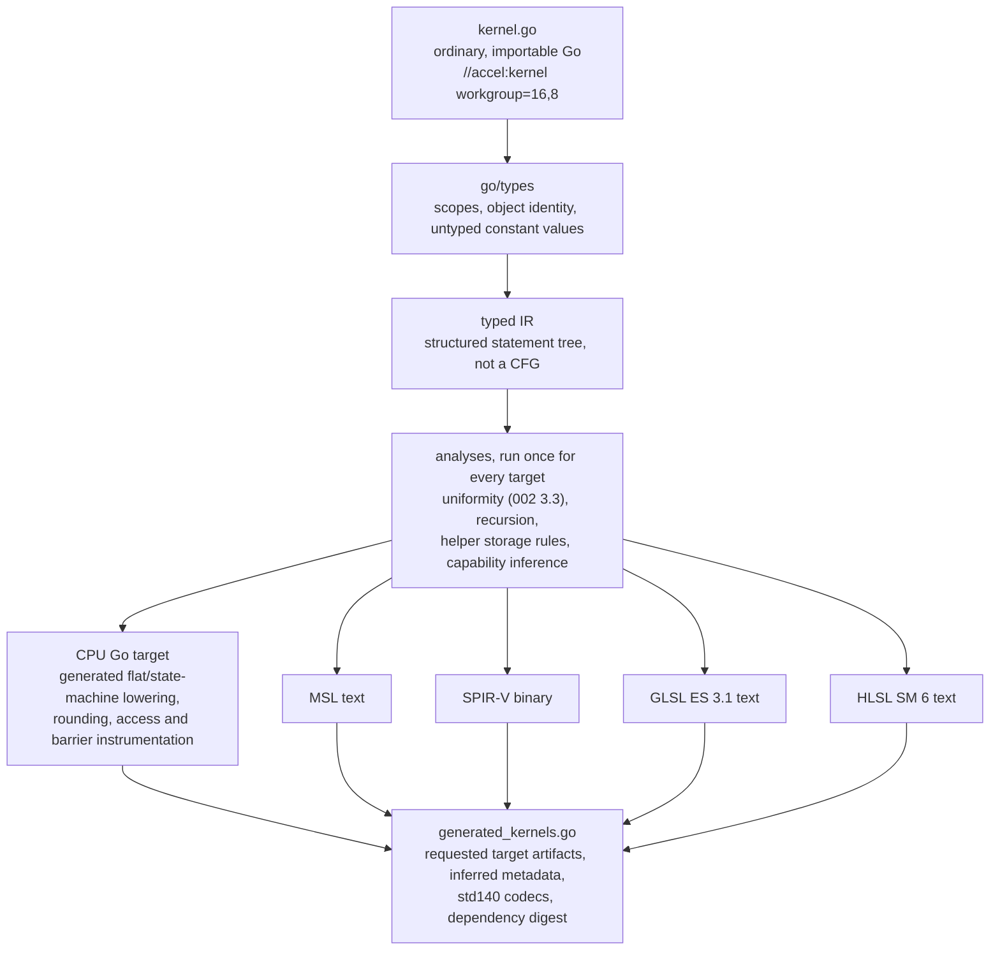

# Kernel authoring

Implements [`000-decisions.md`](000-decisions.md) decision 5. A kernel is written
once, in Go, type-checked once, and lowered from one typed IR to every backend.
The CPU backend consumes a generated, instrumented Go lowering from that IR; it
does **not** invoke the authored function directly. GPU backends consume shader
artifacts from the same IR. Nothing is hand-translated, so the oracle of decision
3 compares one program rather than two implementations that can drift.

## The mistake being corrected

The predecessor's kernel language was a Go-*shaped* DSL, not Go. It overloaded
operators on vector and matrix types, so `m * v` with `m` a `Mat4` was legal
kernel text and illegal Go. Two consequences followed, and they were the same
consequence:

1. The kernel could not be type-checked as ordinary Go, so every parity test
   compared the GPU against a **hand-written second implementation** of the same
   math. Two sources, drifting.
2. `go/types` rejects such a program, so the compiler was built on `go/parser`
   plus an ad-hoc string-keyed type environment. Its own package doc records
   this as deliberate and permanent: "full `go/types` checking was evaluated and
   is not viable".

A later spec (`author-once-kernels.md`) narrowed the gap by replacing operators
with methods (`a.Sub(b)`, `m.MulV(v)`), which made the source valid Go and
delivered exact CPU/GPU parity for its corpus, verified on real Metal hardware
at max diff 0.000000. It still ran a separately maintained CPU path and did not
go back and revisit (2). That is the debt this spec pays.

The visible symptom of the whole arrangement is
`gpu/shader/compile.go:652`, which emits `layout(local_size_x = 1) in;`
unconditionally. See [002](002-compute-model.md) for why that alone is fatal.

## The keystone

**The kernel language is exactly the set of Go programs that (a) type-check and
compile under `go build`, and (b) the accel compiler accepts.** Not a superset,
not a dialect. The authored function is the type-safe source form, not the CPU
runtime entry point.

This is not a stylistic preference. Requirement (a) is what makes `go/types`
usable and lets ordinary Go tooling check names, types, and signatures before
generation. Decision 3 additionally requires the CPU lowering to preserve the
same typed operations and control flow as every shader lowering. Generating it
from the common IR is what provides that guarantee; directly calling the source
would bypass the explicit rounding, access tracking, and barrier diagnostics the
oracle is required to provide.

Everything below is a consequence.

## How kernels are delimited

A kernel is a top-level function in an ordinary, importable Go package, carrying
a doc directive:

```go
//accel:kernel workgroup=256
func Sum(t accel.Thread, in []float32, out []float32, tile *[256]float32) {
	i := t.GlobalIndex()
	l := t.LocalIndex()
	tile[l] = in[i]
	t.Barrier()
	for s := uint32(128); s > 0; s >>= 1 {
		if l < s {
			tile[l] += tile[l+s]
		}
		t.Barrier()
	}
	if l == 0 {
		out[t.GroupIndex()] = tile[0]
	}
}
```

Three alternatives were rejected. **A build tag** makes the file invisible to
the ordinary build, which defeats ordinary Go type checking and package tooling.
**Every top-level func is a kernel**, the
predecessor's rule, makes adding a plain Go helper to the file a compile error
at a distance, and is why `//gpu:helper` had to be invented later.
**Signature-based detection** is implicit: a refactor that changes a parameter
silently stops producing a kernel.

The directive wins because it is explicit, greppable, carries attributes
(`workgroup=`), and marks the exact boundary where the restricted subset starts.
It matches Go's recognized directive shape, so `gofmt` leaves it alone
(verified on go1.27).
Undirected functions in the same package are ordinary Go and are never lowered.
`//accel:helper` marks a callee. The `//accel:` namespace is reserved; `vertex`
and `fragment` are held for the graphics stages this spec defers.

## The signature is the binding layout

Parameter types map one-to-one onto resource kinds from
[001](001-device-resources.md), and every one of them is a real Go type with a
real Go meaning:

| Go parameter | Resource | Why this spelling |
| --- | --- | --- |
| `t accel.Thread` (first) | ids and intrinsics | Carries the CPU backend's rendezvous state. `GlobalID`, `LocalID`, and `GroupID` return `accel.ID3`; `GlobalIndex`, `LocalIndex`, and `GroupIndex` return `uint32`. |
| `[]T` | storage buffer | A slice is the Go type that already means "sized region I index into". |
| `T` (struct, by value) | uniform | Immutable per dispatch, which is what by-value means in Go. |
| `*[N]T` | workgroup shared memory | Pointer to a **fixed-size array**: `go/types` reads `N` off the type, so the extent is static without inventing const generics. Pointer, so all invocations in the group share one. |

`T` ranges over `float32`, `int32`, `uint32`, `int8`, `uint8`,
`accel.Float16`, `accel.BFloat16`. Pointer-to-array is the only pointer the
subset admits, and only as a parameter.

**The narrow types are named `Float16` and `BFloat16`, not `F16` and `BF16`.**
An earlier draft of this spec used the short names, and they were already taken:
`accel.F16` is the [`001`](001-device-resources.md) `DType` constant for the
same format, and it appears at every allocation site. A dtype is metadata a
descriptor carries and a storage type is what a parameter is made of; both
wanted the short name and the constant shipped first. Found while implementing
[013](013-kernel-subset.md).

They are **structs, not defined integer types**, and that is what makes the
narrow-arithmetic exclusion below enforceable rather than advisory. A defined
type over `uint16` carries `uint16`'s operators, so `a + b` on two narrow values
would compile and add their *bit patterns*, with no diagnostic anywhere. A
struct has no operators at all.

The **ids are three-dimensional** (`accel.ID3`, with `.X`, `.Y`, `.Z` of type
`uint32`) with linear forms alongside. An earlier draft made them scalar
`uint32`, and writing the tiled GEMM in [002](002-compute-model.md) proved that
wrong: a 2D shared-memory tile cannot be addressed from a scalar id without index
math the compiler then cannot prove uniform. `workgroup=` correspondingly takes
up to three extents (`workgroup=16,8`), with `workgroup=256` still meaning
`256,1,1`.

The id components being `uint32` is load-bearing rather than incidental. It is what makes
`l < s` and `tile[l+s]` in the example above typecheck without a conversion, and
it is where the GLSL integer-literal divergence in
[`conventions.md`](../docs/conventions.md) is settled: `go/types` reports the
untyped `128` in `uint32(128)` and the untyped `1` in `s >>= 1` with their
resolved types, so the emitter spells each literal correctly instead of coercing
the id to `int` to keep GLSL happy. The predecessor did the coercion
(`int gid = int(gl_GlobalInvocationID.x)`) precisely because it had no type
information to do otherwise.

Shared memory is a **parameter and not a local declaration**. A
`var tile [256]float32` in the body is per-invocation under Go's semantics. The
parameter tells the IR that one allocation is shared by all invocations in a
workgroup. The generated CPU lowering indexes an instrumented allocation with
the same extent; it checks bounds and definition state before each load, so an
out-of-range or read-before-write access fails where a GPU could corrupt a
neighbouring tile or observe unspecified data.

`workgroup=` in the directive and the array extent both appear in the source, so
the compiler can check the relationship it can see (an extent that is not a
multiple of, or is smaller than, the declared group size is reported at both
positions). The generated `Kernel` owns the workgroup size. Callers do not repeat
it in a pipeline descriptor, so there is no second value to disagree with the
source.

### The subset itself

Inside a kernel or helper body: arithmetic and comparison on the scalar types
above, `var` and `:=`, assignment and compound assignment, indexing on slices
and shared arrays, struct field selection, explicit conversions, `if`, `for`
(all three forms), `break`, `continue`, `return`, and calls to helpers and
intrinsics.

Everything else is rejected with a position. The exclusions are not arbitrary
taste: each names a target that cannot express it. Recursion, closures, and
function values have no spelling in GLSL, MSL, or SPIR-V. Slices of slices,
interfaces, maps, channels, and strings have no memory model on a GPU. `defer`,
`panic`, and `goto` have no control-flow lowering that survives structured
control flow. Allocation has no allocator.

Two kinds of exclusion, kept distinct on purpose. The ones above are permanent:
a target cannot express the construct. The ones under *Out of scope for v0*
(generic kernels, multiple helper results) are sequencing, and the spec says
which is which so a future reader does not argue with a wall that was only ever
a schedule.

## The generated CPU lowering

This is the crux of decision 5, so it is spelled out mechanically. Generation
produces a Go implementation of the typed IR with explicit operations for every
load, store, arithmetic rounding point, atomic, subgroup operation, and barrier.
The authored function is never registered as an executable callback. Its only
runtime-independent roles are to be valid Go and to supply the typed source from
which the IR is built.

The CPU backend runs each workgroup as a unit and workgroups in parallel across
`GOMAXPROCS`. The CPU target emits two entry points when the analyses permit it:

- **Flat lowering.** When the IR has no shared memory, barrier, or subgroup
  operation, invocations execute as a plain generated loop. There are no
  goroutines or synchronization points.
- **Cooperative lowering.** The generator splits the structured IR at barriers
  and subgroup rendezvous into resumable states. Each invocation carries a
  program counter and locals; the workgroup scheduler advances every active
  invocation to its next suspension point. This is an instrumented lowering of
  the same IR, not an interpreter of source and not a direct function call.

The cooperative transform is more compiler work than one goroutine per
invocation, but it makes barrier failures deterministic, permits exact
read-before-write tracking, and avoids scheduler-dependent deadlocks. The flat
path remains the performance path for kernels that need none of those features.

**Shared memory uses definition tracking, not a sentinel value.** Each scalar
element has a shadow initialized bit. A store marks the element defined; a load
or atomic read-modify-write checks the bit first and reports the kernel, source
position, workgroup, invocation, and element when it is clear. Filling bytes
with a poison pattern may remain a debugging aid, but it is not the correctness
mechanism: every bit pattern is a valid integer and some poison NaNs can be
overwritten or propagated without proving which access was first.

**Atomics** are free functions taking a buffer and an index,
`accel.AddU32(buf, i, v) uint32`, never a pointer into a buffer, because GLSL
cannot form one. On the CPU they are
`sync/atomic` on the backing slice. Atomic float add has no `sync/atomic`
primitive and is compare-and-swap over `math.Float32bits`.

**Subgroups** are methods on `accel.Thread` over a contiguous lane range within
the workgroup, using the same rendezvous machinery as `Barrier`. The CPU
backend reports a **configurable** subgroup size, defaulting to 4, per
[006](006-backends.md), which owns the CPU backend. Size 1 was rejected: it makes
every cross-lane operation the identity and hides exactly the bugs subgroup tests
exist to find. The default is 4 rather than 32 because 4 is small enough that a
normal workgroup spans several subgroups, which exercises cross-subgroup errors
and tail handling that a size equal to the workgroup would hide. Configurable,
because a kernel that silently assumes a size must fail when the harness runs it
at 1, 4, 32, and 64.

**Non-uniform barrier arrival is detected, not timed out**, because a timeout is
flaky and this is an oracle. A generated suspension point has a stable barrier
ID and source position. At each dynamic rendezvous epoch, every active invocation
must suspend at the same ID. If one returns, reaches a different barrier ID, or
continues to another epoch while peers wait, the scheduler reports the expected
and observed barrier positions plus the offending invocation IDs. It therefore
does not rely on the invalid inference that a count of live invocations becoming
smaller than a blocked count is the only way an arrival can become impossible.

**Race diagnostics are explicit.** The generated lowering associates each
shared and storage access with its source position and tracks overlapping
unordered accesses during a workgroup epoch. It reports a conflicting pair
deterministically. `go test -race` remains an additional check for mistakes in
the CPU runtime itself, but it is not the kernel race detector: the resumable
lowering need not execute invocations as simultaneous goroutines.

## Type checking with go/types

The front end loads the kernel package and type-checks it. Concretely, over an
AST walk this buys:

- **Intrinsics keyed by object identity.** The intrinsic table maps
  (package path, object name) to a shader builtin, resolved through
  `go/types`. The predecessor's table was keyed by bare name, so any user
  function called `Dot` or `Mix` lowered to the GPU builtin. That is a silent
  wrong-answer bug, not a compile error.
- **Conversions are distinguishable from calls.** `float32(x)` and `Sqrt(x)`
  are the same AST shape. The predecessor resolved this by putting `float32`
  in the builtins map next to `sqrt`. `go/types` classifies it.
- **Untyped constants get their real type and value.** This dissolves the GLSL
  integer-literal divergence in [`conventions.md`](../docs/conventions.md) at
  the root: the emitter knows whether `2` in `gid*2` is `uint32` or `int32` or
  `float32` and spells it accordingly, instead of the id being coerced to `int`
  to keep literals legal.
- **Scopes, shadowing, and method sets** come for free. The predecessor
  reimplemented identifier resolution as a "bare identifiers in value position"
  check, which is scope resolution written badly.

What it does **not** buy: it will not tell you a program is a legal *GPU*
program. Recursion, divergent barriers, and the helper storage restrictions are
separate analyses over the IR.

### Every rejection is the checker's, never the parser's

A front end whose coverage depends on what an upstream tool happens to reject
has an unstated dependency on that tool's current release. Go 1.27 makes the
point concretely rather than hypothetically.

Through Go 1.26 the parser rejected a method carrying type parameters outright,
reporting `method must have no type parameters` and discarding them, so
`FuncDecl.Recv != nil` implied `FuncDecl.Type.TypeParams == nil`. Go 1.27 permits
generic methods: the parser keeps the type parameters, and `types.NewSignatureType`
no longer panics on a receiver plus type parameters.

**Nothing in the subset changes.** Generic kernels and helpers are out of scope
for v0 either way, and that was a sequencing decision before and remains one.
What changes is who enforces it. A walk that inherited the parser's rejection
now traverses a generic method silently and lowers its body as though the type
parameters were not there. That is a wrong-answer bug rather than a compile
error, and it is the same failure shape as the predecessor's bare-name intrinsic
table: the tool agrees with itself and disagrees with the source.

So the rule, which is worth more than the instance that prompted it:

> Every construct outside the closed node set is rejected by an explicit check
> carrying a source position. Never by relying on something upstream to have
> failed first.

The v0 checker therefore rejects a type parameter list on any kernel, helper, or
method reachable from a kernel, naming the position and saying generic kernels
are out of scope for v0 rather than unrepresentable, per the distinction the
subset section draws. It carries a negative test like every other rejected
construct.

The same reasoning applies to the two other Go 1.27 language changes, neither of
which the subset admits: a struct literal keyed by a promoted field is still a
bare `*ast.Ident` key, so a walk assuming a key names a field of the literal's
own type is now wrong, and generalized function type inference does not reach a
subset with no function values.

The cost is that type checking needs the package loaded, with its import graph
and the `go` tool present, which a deployed binary does not have. That decides
the next section.

### Compiler packaging and the exact v0 IR

The generator is `cmd/accel-kernel` in the main module, with reusable compiler
code in `internal/kernelc`. `golang.org/x/tools/go/packages` is therefore a
build-tool dependency in `go.mod`, but neither the root runtime package nor a
deployed binary imports it. A second module is rejected for v0: it would make the
tool unable to share internal compiler/runtime ABI definitions without exporting
them or duplicating them.

The structured IR has this closed v0 node set:

- types: bool, i32, u32, f32, i8, u8, the f16/bf16 storage wrappers, `ID3`,
  structs, fixed shared arrays, and typed resource slices;
- values: constants, parameters, locals, field selection, indexing, unary and
  binary operations, explicit conversion, helper call, and intrinsic call; and
- statements: block, local declaration, assignment, expression statement, `if`,
  three-clause/condition/infinite `for`, `break`, `continue`, and single-value or
  empty `return`.

`i8` and `u8` were missing from this list in the first draft while the binding
table above admitted `int8` and `uint8`, so the two halves of this spec
disagreed about whether a quantized plane had a type. Found while implementing
[012](012-kernel-pipeline.md) and resolved here rather than by adding a kind in
passing, which is the rule [013](013-kernel-subset.md) states.

There is deliberately no generic “AST escape” node. Encountering `range`,
`switch`, `select`, a labeled branch, or any construct outside the list is a
source-positioned subset error. Each value and statement carries its resolved Go
type, source position, and referenced `go/types.Object`; resource accesses also
carry binding identity and inferred access mode.

Intrinsic identity is likewise closed and versioned. Thread IDs, barriers,
atomics, conversions, and `FMA` are functions or methods a kernel author spells
on the root `accel` package. Some of those names are aliases of types declared
below it, because the CPU backend has to construct a `Thread` and cannot import
`accel`; [012](012-kernel-pipeline.md) §3 has the argument. The table therefore
resolves on the identity `go/types` reports, which for a method is **(package
path, receiver type name, method name)** and never (package path, method name),
while the digest records the authored spelling so that relocating a type does
not invalidate every committed digest. Bounded scalar math (`Sqrt`, `RSqrt`, `Exp`, `Log`, `Sin`, `Cos`,
`Tanh`) lives in `accel/kmath`. `internal/kernelc` builds a table from the exact
import-path/name objects and rejects a same-named function from any other
package. The table records IR opcode, uniformity effect, capability requirement,
numeric class, and target lowering; its ABI version participates in the kernel
digest. The ordinary Go bodies exist only so authored packages type-check and
are never the registered CPU implementation.

The v0 corpus lives at `tensor/internal/kernels/...`, imports only the root
device API and `accel/kmath`, and is registered into the tensor runtime from
inside `tensor`. The root package never imports the tensor or corpus packages.
Conformance cases that need both use external test packages, so there is no
device → tensor or compiler → corpus import cycle.

## Compilation is ahead of time

**Locked.** The compiler is a build-time generator run under `go generate`,
emitting one Go file per kernel package. For each kernel it emits the requested
shader artifacts, the flat or cooperative CPU lowering, and one immutable
`Kernel` record that owns all facts inferred from the source:

- workgroup size and workgroup-shared allocation layout;
- binding kinds, dtypes, uniform codecs, and inferred read/write/atomic access;
- capability and numeric-limit requirements;
- barrier/source-position tables used by CPU diagnostics;
- the transitive helper and intrinsic dependencies, generator/IR ABI version,
  target set, and a digest over all of those inputs.

Callers supply only the generated `Kernel` and a label when creating a compute
pipeline. They do not repeat workgroup, shared-memory, binding-layout, or access
metadata in `ComputePipelineDescriptor`; duplicating compiler-owned facts would
turn every generated change into a possible runtime mismatch.

Registration points at generated CPU code, not at the authored function:

```go
func init() {
	accel.Register(accel.KernelRec{
		Name: "Sum", Workgroup: [3]uint32{256, 1, 1}, Digest: "…",
		Bindings: sumBindingLayout, Access: sumAccess,
		Shared: sumSharedLayout, Requires: sumRequirements,
		Dependencies: sumDependencies,
		Targets: accel.TargetArtifacts{CPU: runSumCPU, MSL: mslSum},
	})
}
```

The internal CPU ABI may still use raw resource handles, but every typed detail
(which index, dtype, extent, access mode, and uniform codec) lives in generated
code and immutable kernel metadata. It is never reconstructed by reflection at
dispatch.

**Uniform structs are decoded, not cast.** A by-value struct parameter is
`constant T&` on the GPU under std140 (narrowed from 'std140 or std430' by [001](001-device-resources.md), because GLSL ES 3.1 permits std140 on uniform blocks and not std430) layout, and Go's struct layout is
not std140: std140 pads a three-float member to sixteen bytes and aligns a nested
struct to sixteen, and Go does neither. So the generator emits a per-kernel
decoder that reads the std-layout bytes into the Go struct field by field, and
the matching encoder on the host side. **The GPU layout owns the padding**, and
the Go side conforms to it, because the alternative (declaring padding fields in
the caller's Go struct) leaks a backend detail into a type users write by hand.
An unsafe cast is rejected outright: it would be silently correct for a struct of
four floats and silently wrong for the first one containing a three-float member.

### Typed uniform binding

A by-value uniform parameter also causes the generator to emit a typed codec and
a typed binding field. Callers never construct std140 bytes:

```go
params, err := accel.NewUniformBuffer(dev, SumParamsCodec)
if err != nil { /* ... */ }
if err := params.Write(queue, SumParams{K: k}); err != nil { /* ... */ }

bindings := SumBindings{
	In: in.View(), Out: out.View(), Params: params.View(),
}
rec.Dispatch(pipeline, bindings.Bind(), groups)
```

`SumParamsCodec` is generated for the exact Go struct type and knows its std140
size, alignment, field offsets, and encoder/decoder. `UniformBuffer[T]` owns an
ordinary uniform buffer; `Write` encodes `T` into it through the queue, so values
may change between graph submissions without changing graph structure. `Bind`
returns the ordinary resource bindings after checking all fields. The raw byte
codec is internal. A caller that already manages a uniform arena may request the
generated codec's encoded size and call its typed `Encode(dst, value)` method,
but still never spells padding offsets.

This path is required for v0 because a storage-buffer substitute would make a
uniform loop bound appear non-uniform to the barrier analysis. It also makes the
signature-to-binding promise executable rather than leaving a by-value parameter
with no public way to supply it.

### Target generation policy

The target set is explicit generator input and is never inferred from the host
running `go generate`:

```go
//go:generate go run ./cmd/accel-kernel -targets=cpu,metal .
```

`cpu` is mandatory. M2 permits `cpu`; M6 adds `metal`, and the v0 release corpus
is generated for exactly `cpu,metal`. Later milestones admit `vulkan`, `d3d12`,
`gles`, and `webgpu` only when their emitter and conformance gate exist.
Requesting an unknown or not-yet-admitted target fails generation instead of
leaving an empty artifact. Generated files record the ordered target set, so
generation on Linux and macOS produces identical bytes. Opening a pipeline on a
backend for which the kernel was not generated is a pipeline-creation error that
names the missing target and the generator command needed to add it.

CI runs `go generate ./...` then `git diff --exit-code`. A kernel edited without
regenerating fails the build, and the dependency digest makes the failure name
the kernel and changed input. The digest covers the kernel body, every reachable
`//accel:helper`, the referenced intrinsic identities and ABI versions, directive
attributes, compiler version, and target set. Editing a helper or changing a
codec therefore cannot leave a stale kernel looking fresh.

This is the direct fix for the predecessor's worst hazard: its kernel sources
lived as Go **string constants** (`shadingKernelSrc`, `helperSrc`) duplicating
real Go files, so the thing compiled to MSL and the thing run as Go were two
texts that merely looked alike.

In-process compilation from source in a deployed binary is out of scope for v0.

## Targets and the IR

The shape of the compiler, which is what the rest of this section argues about:



Two things the picture is making an argument about. The analyses sit on the IR
and are shared by every target, which is why an IR exists even when v0 has one
GPU text target ([`000-decisions.md`](000-decisions.md)'s v0 milestone). And the
CPU is an ordinary target of that lowering pipeline, which prevents it from
bypassing the semantics the GPU emitters implement.


| Target | Artifact | Source level |
| --- | --- | --- |
| Go (CPU backend) | generated instrumented Go lowering | yes |
| MSL | text | yes |
| GLSL ES 3.1 / GLSL 4.3 | text | yes |
| HLSL SM 6 | text | yes, but see below |
| SPIR-V | **binary** | no |

**There is an IR**, and at v0 it is not SPIR-V that pays for it.
[`000-decisions.md`](000-decisions.md)'s v0 milestone builds the CPU backend and
Metal only, so the emitter has exactly one text target and the "quadratic in
targets" argument below is a forecast rather than a present cost. What justifies
the IR at v0 is the set of analyses that have already been specified onto it and
have nowhere else to live: the uniformity analysis
([002](002-compute-model.md) §3.3), recursion detection, the helper storage
restrictions, and the capability requirement inference
([002](002-compute-model.md) §8.2). Every one of those is a whole-kernel dataflow
or call-graph question that an emitter cannot answer while printing.

Being honest about the risk in the other direction: an IR for one text target is
the shape most likely to be over-built. The guard is that the IR is a typed
statement tree, not a general CFG (below), so it is close to the AST the front
end already has, and the analyses are what give it its node set.

**SPIR-V is why it must stay a real IR**, and it arrives with Vulkan. SPIR-V is a binary SSA format with
explicit result ids, typed instructions, and structured control flow declared
through `OpSelectionMerge` and `OpLoopMerge`. You do not print that by walking
an AST. And there is no cgo-free path from GLSL text to SPIR-V, because glslang
and shaderc are C++, so decision 2 forbids the usual escape. Vulkan is a
headline backend and Vulkan consumes SPIR-V only. The IR is therefore not a
refinement, it is the price of the backend list.

The second argument is the one the predecessor demonstrated. Its emitter carried
a `glsl bool` threaded through every method, with `c.typ()`, `c.zero()`, and
`c.name()` each switching on it, and a separate `ast.Inspect` pass per target to
find written buffers. That is the two-target shape of a problem that is
quadratic in targets. Analyses (recursion, barrier divergence, buffer mutability,
capability requirements) belong on one IR and run once.

**The IR keeps structured control flow.** A tree of typed statements with `if`
and `for` as nodes, values in SSA form within a block and locals kept in memory,
not a general CFG. Three of the four GPU targets are structured source
languages, and SPIR-V demands structured control flow anyway. Because the Go
subset excludes `goto` and arbitrary labeled jumps, the structure is preserved
for free.

For the same reason `golang.org/x/tools/go/ssa` is **rejected** as the IR: it is
a general CFG with phi nodes, which discards exactly the structure every target
needs back. Recovering it means writing a relooper, a known-hard component, to
undo work we did not need done.

Locals in memory rather than SSA registers is a deliberate simplification:
SPIR-V accepts function-scope `OpVariable` with load and store, and drivers
promote it. Cost: the emitted SPIR-V leans on the driver optimizer.

HLSL carries an asterisk. D3D12 wants DXIL, and producing DXIL means loading
`dxcompiler.dll` through `purego`: cgo-free, but a runtime dependency on a
Microsoft binary. Whether HLSL text is a sufficient artifact is open below.

## Helper functions

Carried forward from the predecessor, which proved it: a `//accel:helper`
function is emitted ahead of its callers, `static` in MSL, plain in GLSL, and
inlined or emitted into the generated CPU lowering from the same helper IR.
Verified in the predecessor as byte-identical output for pre-existing kernels
and exact on Metal hardware; the new dependency digest additionally makes a
helper edit invalidate every caller.

One rule, from [`conventions.md`](../docs/conventions.md): **helpers take
values, never storage.** Not a storage buffer, because GLSL ES 3.1 cannot pass
an SSBO block to a function. Not a shared array either, because GLSL passes
array parameters **by value**: a helper taking a tile would silently copy 256
floats per call and discard every write to it. Buffer and shared indexing stays
in the entry point. Both cases produce one error naming the restriction.

Further restrictions, each with a target that forbids it:

- **No recursion, direct or mutual.** Forbidden in GLSL, MSL, and SPIR-V.
  Detected as a cycle in the IR call graph, reported with the cycle's members.
- **Exactly one result.** Multiple return values have no direct spelling in the
  targets. They lower to a generated struct eventually; not in v0.

`go/types` removes machinery here too. The predecessor needed a pre-pass
collecting helper result types into a `map[string]string` so a helper could call
one declared later in the file. Type checking has already done that.

## Diagnostics

Every rejection carries a `token.Pos` and is formatted as
`file:line:col: message`, which editors and CI already parse. Non-negotiable:

- **Errors are collected, not first-only.** A kernel with four unsupported
  constructs reports four.
- **A restriction names its cause.** Not "unsupported parameter" but
  "helper `bilerp`: parameter `tile` is workgroup memory; GLSL passes array
  parameters by value, so writes would be lost (docs/conventions.md)".
- **A target-specific rejection names the target.** A kernel legal on MSL and
  illegal on GLSL says which, and says what capability or limit is the cause.
- **Errors arrive at generation, not at pipeline creation.** This is the same
  obligation [003](003-command-graph.md) puts on graph build: an error that says
  only "compile failed" is a defect in this design.

## Out of scope for v0

- **Graphics stages.** Compute only. The predecessor shipped vertex and fragment
  kernels, so this is a sequencing decision, not a doubt. The directive
  namespace is reserved.
- **Sampled textures in kernels.** Deferred on evidence: the predecessor
  established that its CPU sampler and a hardware sampler cannot be reconciled
  bit-exactly (addressing at `u*(dx-1)` rather than the half-texel convention,
  an off-by-one in LOD selection, and uint8-truncating lerps at every tap), and
  had to transliterate the CPU sampler into a storage-buffer kernel to get
  parity at all. Admitting samplers admits a permanent tolerance into the oracle.
- **Native narrow arithmetic.** Narrow dtypes are storage that converts on load
  and store, per [002](002-compute-model.md). `accel.Float16` and
  `accel.BFloat16` carry no arithmetic operators at all, so Go itself forces
  `f.F32()` on the way in and `accel.ToFloat16(x)` on the way out, and f32
  accumulation is not a convention but the only thing that compiles. Native f16 arithmetic will be explicit
  capability-gated intrinsics, later.
- **Cooperative matrix intrinsics**, per [002](002-compute-model.md).
- Generic kernels, **generic methods**, closures, recursion, `goto`, `defer`,
  `panic`, slices of slices, interfaces, maps, channels, goroutines, string
  operations, allocation. Generic methods are called out separately because Go
  1.27 made them legal syntax that the parser accepts; see the rule above.
- Runtime compilation, multiple helper results, CUDA/PTX.

## Exactness: what parity actually promises

Parity is exact **not because floating point is associative** but because both
sides execute the same algorithm in the same order: a barrier-based tree
reduction reduces in the same tree in the generated CPU and GPU lowerings from
one typed IR. What survives that argument is hardware divergence, and it is
bounded:

These classes are normative in [008](008-numerics.md), which derives the bounds
the tolerance columns refer to. They are kept here because they are a property of
what the emitter produces, and 008 is where a test finds out what to assert.

| Class | Contents | Contract |
| --- | --- | --- |
| A | Integer ops; f32 add, sub, mul; loads, stores, indexing | Bit-exact only in 008 §3's proved domain/profile; otherwise Bounded or Special. |
| B | Implicitly contractible `a*b+c`; explicit `accel.FMA` | Implicit form uses 008's expression-DAG budget. Explicit FMA is correctly rounded in its finite domain or the target rejects it. |
| C | Division, `sqrt`, and admitted transcendentals | Normative per-operation domain and ceiling from 008 §6; an unbounded primitive is rejected. |
| D | f16 and bf16 conversion | Exact canonical bits under 008 §4, including rounding and NaN rules. |
| E | Atomic float add | Bounded, order-dependent, and excluded from same-backend determinism. |

Class E deserves the emphasis: an integer atomic contention test asserts an
exact total, and the same test written in f32 cannot, on any hardware. Writing
it as if it could is how a flaky test enters a suite.

## Post-v0 questions

v0 accepts exactly one literal workgroup size and shared-array extent per
authored entry function. A tuned second size is a distinct entry function and
stable 010 variant. Whether later versions generate several variants from one
directive or use target specialization constants remains open, but it cannot
change a v0 variant's identity.

Generic dtype-parameterized kernels are also post-v0. `go/types` exposes
instantiation, but the v0 IR is monomorphic after type checking. A later design
may instantiate `func Add[T Numeric]` into several ordinary stable variants; it
must not add runtime generic dispatch to the kernel ABI.

## Testing

Five levels, each catching what the one below cannot.

1. **Golden output.** Emitted text and SPIR-V are byte-stable for a fixed input.
   The predecessor's corpus assertion (existing kernels emit byte-identically
   after a compiler change) caught real regressions and is carried forward.
2. **The target's own compiler accepts it.** Golden text that no driver accepts
   is worthless. MSL through the Metal compiler, GLSL through the GL driver,
   SPIR-V structurally validated and accepted by the Vulkan driver.
3. **Differential execution, the core test.** For every kernel in the corpus:
   run its generated CPU lowering, run each generated GPU artifact on an
  available backend, and compare buffers under the class contract above. The
  harness reports max absolute difference; class-A cases inside a profile's
  proved exact domain compare bits. This is the only test that can exist because of decision 5, and it
   replaces the predecessor's hand-written second implementation.
4. **CPU instrumentation tests** for every barrier-using kernel, including
   deterministic non-uniform arrival, conflicting accesses, and definition
   tracking. `go test -race` separately checks the runtime implementation.
5. **The authored function against its generated flat lowering.** This level
   exists because of what changed above, and without it there is a hole where a
   tautology used to be.

   When the CPU backend called the authored function, "the executed Go and the
   authored Go agree" needed no test: they were one function. Now nothing
   executes the authored function, so a mistake in IR construction produces a CPU
   runner and a GPU artifact that agree with each other, both derived from the
   same wrong IR, and disagree with the Go program the author read and reasoned
   about. Differential execution at level 3 cannot see that, for the same reason
   [`000-decisions.md`](000-decisions.md) decision 3 gives for a wrong formula:
   it is wrong identically everywhere.

   So every **flat** kernel in the corpus is run twice, once by calling the
   authored function directly over the same buffers and once through the
   generated flat lowering, and the results are compared. Flat kernels are the
   ones eligible because they have no barrier, no shared memory, and no subgroup
   operation, so an ordinary Go call has the right semantics; cooperative kernels
   have no direct-call form by construction.

   The comparison follows [008](008-numerics.md) rather than asserting bits
   unconditionally, and the reason is itself the point of the exercise: the
   generated lowering emits an explicit `float32(...)` at every rounding point
   and the authored function does not, so on a host with FMA the two may
   legitimately differ where the Go compiler contracts. Integer and layout
   kernels therefore compare bits, and f32 kernels compare under class B's
   contraction bound. A difference outside that bound is a lowering bug.

   This does not cover every IR node, since cooperative constructs are excluded,
   but the cooperative lowering is built from the same node set and the same
   emitters, so it covers the arithmetic, indexing, conversion, and control-flow
   nodes where a silent mistranslation is most likely.

Plus:

- **Negative tests, one per rejected construct**, asserting both the message and
  the source position. A restriction with no test is a restriction that will be
  emitted as broken shader text instead.
- **Non-uniform barrier arrival** is detected by the CPU backend, deterministically,
  and names the barrier's position.
- **Shared-memory definition tracking**: a kernel reading before writing fails
  on the CPU backend for every possible stored bit pattern; the test cannot pass
  merely because a sentinel happened to compare unequal.
- **Subgroup size sweep**: every subgroup-independent semantic result runs on the
  CPU backend at sizes 1, 4, 32, and 64, and agrees with its no-subgroup fallback
  at each.
- **Dependency freshness**: editing the entry function, a reachable helper, an
  intrinsic ABI, a uniform codec input, or the target list changes the digest;
  `go generate ./...` and `git diff --exit-code` keep checked-in artifacts fresh.
- **The tiled GEMM from [002](002-compute-model.md)** is written in this
  language, or this spec has failed alongside that one.

## Amendments from writing the GEMM

[002](002-compute-model.md) wrote a tiled GEMM against this subset, which is the
only real test a kernel language gets before it has users. Four changes came out
of it, recorded here because each one narrows or widens the subset:

1. **Three-dimensional ids and multi-extent `workgroup=`.** Covered above. The
   scalar form could not address a 2D tile.

2. **Bare `int32(f)` and friends leave the subset.** Go's float to integer
   conversion is *implementation-defined* when the value is out of range, which
   collides directly with [006](006-backends.md)'s requirement that the CPU
   backend produce bit-identical results on arm64 and amd64. The subset provides
   saturating `accel.ToI32`, `ToU32`, `ToI8`, `ToU8` instead, and rejects the bare
   conversion with an error naming the reason. This is a case where valid Go is
   deliberately not valid kernel Go.

3. **A uniform buffer binding is load-bearing, not a convenience.** The GEMM's
   `K` has to come from a uniform, because if it comes from a storage buffer the
   k-loop's trip count is not provably uniform and this spec's own divergence rule
   rejects the loop that contains the barrier. Uniform bindings are therefore part
   of the minimum viable subset rather than an optimization.

4. **Shared-memory atomics need a slice expression.** `tile[:]` is admitted, but
   only as a direct argument to an atomic intrinsic, which keeps the general
   slicing rules out of the subset while allowing the one construct that needs it.

The "helpers take values, never storage" rule held under pressure: it forced the
GEMM's guarded tile loads to be written inline in the entry point. That is a
visible cost in the kernel and it is the right trade, but it is a cost, not a
free constraint.
