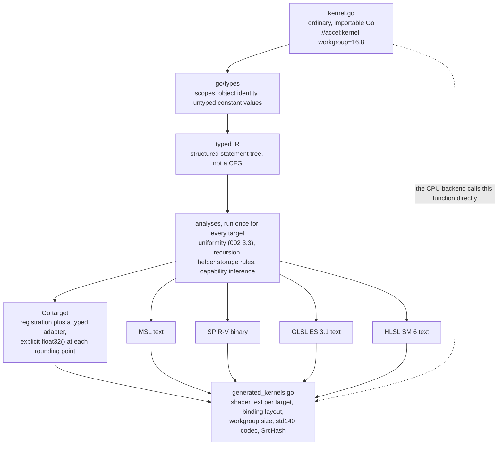

# Kernel authoring

Implements [`000-decisions.md`](000-decisions.md) decision 5. A kernel is written once,
in Go. On the CPU backend that Go function is called. On every GPU backend the
same source is compiled to the backend's shading language. Nothing is written
twice, so the oracle of decision 3 is exact rather than approximate.

## The mistake being corrected

The predecessor's kernel language was a Go-*shaped* DSL, not Go. It overloaded
operators on vector and matrix types, so `m * v` with `m` a `Mat4` was legal
kernel text and illegal Go. Two consequences followed, and they were the same
consequence:

1. The kernel could not run as ordinary Go, so every parity test compared the
   GPU against a **hand-written second implementation** of the same math. Two
   sources, drifting.
2. `go/types` rejects such a program, so the compiler was built on `go/parser`
   plus an ad-hoc string-keyed type environment. Its own package doc records
   this as deliberate and permanent: "full `go/types` checking was evaluated and
   is not viable".

A later spec (`author-once-kernels.md`) fixed (1) by replacing operators with
methods (`a.Sub(b)`, `m.MulV(v)`), which made the source valid Go and delivered
exact CPU/GPU parity, verified on real Metal hardware at max diff 0.000000. It
did not go back and revisit (2). That is the debt this spec pays.

The visible symptom of the whole arrangement is
`gpu/shader/compile.go:652`, which emits `layout(local_size_x = 1) in;`
unconditionally. See [002](002-compute-model.md) for why that alone is fatal.

## The keystone

**The kernel language is exactly the set of Go programs that (a) compile and run
correctly under `go build`, and (b) the accel compiler accepts.** Not a
superset, not a dialect.

This is not a stylistic preference. Requirement (a) is forced by decision 3: the
CPU backend runs the source, so the source must be Go. And requirement (a) is
what makes `go/types` usable, since `go/types` is by definition the checker for
valid Go. One constraint delivers both. The predecessor lost both at once by
relaxing it.

Everything below is a consequence.

## How kernels are delimited

A kernel is a top-level function in an ordinary, importable Go package, carrying
a doc directive:

```go
//accel:kernel workgroup=256
func Sum(t accel.Thread, in []float32, out []float32, tile *[256]float32) {
	i := t.GlobalID()
	l := t.LocalID()
	tile[l] = in[i]
	t.Barrier()
	for s := uint32(128); s > 0; s >>= 1 {
		if l < s {
			tile[l] += tile[l+s]
		}
		t.Barrier()
	}
	if l == 0 {
		out[t.GroupID()] = tile[0]
	}
}
```

Three alternatives were rejected. **A build tag** makes the file invisible to
the ordinary build, which is precisely what must not happen: the CPU backend
imports this package and calls `Sum`. **Every top-level func is a kernel**, the
predecessor's rule, makes adding a plain Go helper to the file a compile error
at a distance, and is why `//gpu:helper` had to be invented later.
**Signature-based detection** is implicit: a refactor that changes a parameter
silently stops producing a kernel.

The directive wins because it is explicit, greppable, carries attributes
(`workgroup=`), and marks the exact boundary where the restricted subset starts.
It matches Go's recognized directive shape, so `gofmt` leaves it alone
(verified on go1.27).
Undirected functions in the same package are ordinary Go and are never compiled.
`//accel:helper` marks a callee. The `//accel:` namespace is reserved; `vertex`
and `fragment` are held for the graphics stages this spec defers.

## The signature is the binding layout

Parameter types map one-to-one onto resource kinds from
[001](001-device-resources.md), and every one of them is a real Go type with a
real Go meaning:

| Go parameter | Resource | Why this spelling |
| --- | --- | --- |
| `t accel.Thread` (first) | ids and intrinsics | Carries the CPU backend's rendezvous state. `GlobalID`, `LocalID`, and `GroupID` return `accel.ID3`; `GlobalIndex`, `LocalIndex`, and `GroupIndex` return `uint32`. |
| `[]T` | storage buffer | A slice is the Go type that already means "sized region I index into". |
| `T` (struct, by value) | uniform | Immutable per dispatch, which is what by-value means in Go. |
| `*[N]T` | workgroup shared memory | Pointer to a **fixed-size array**: `go/types` reads `N` off the type, so the extent is static without inventing const generics. Pointer, so all invocations in the group share one. |

`T` ranges over `float32`, `int32`, `uint32`, `int8`, `uint8`, `accel.F16`,
`accel.BF16`. Pointer-to-array is the only pointer the subset admits, and only
as a parameter.

The **ids are three-dimensional** (`accel.ID3`, with `.X`, `.Y`, `.Z` of type
`uint32`) with linear forms alongside. An earlier draft made them scalar
`uint32`, and writing the tiled GEMM in [002](002-compute-model.md) proved that
wrong: a 2D shared-memory tile cannot be addressed from a scalar id without index
math the compiler then cannot prove uniform. `workgroup=` correspondingly takes
up to three extents (`workgroup=16,8`), with `workgroup=256` still meaning
`256,1,1`.

The id components being `uint32` is load-bearing rather than incidental. It is what makes
`l < s` and `tile[l+s]` in the example above typecheck without a conversion, and
it is where the GLSL integer-literal divergence in
[`conventions.md`](../docs/conventions.md) is settled: `go/types` reports the
untyped `128` in `uint32(128)` and the untyped `1` in `s >>= 1` with their
resolved types, so the emitter spells each literal correctly instead of coercing
the id to `int` to keep GLSL happy. The predecessor did the coercion
(`int gid = int(gl_GlobalInvocationID.x)`) precisely because it had no type
information to do otherwise.

Shared memory is a **parameter and not a local declaration**. A
`var tile [256]float32` in the body is per-invocation under Go's semantics, and
no Go local can be shared by 256 goroutines. As a parameter, the CPU driver
allocates one array per workgroup and hands the same pointer to every invocation
in it: the GPU semantics, in stock Go. It pays twice, because Go's bounds check
catches an out-of-range shared access where a GPU silently corrupts a
neighbour's tile.

`workgroup=` in the directive and the array extent both appear in the source, so
the compiler can check the relationship it can see (an extent that is not a
multiple of, or is smaller than, the declared group size is reported at both
positions). Per [002](002-compute-model.md) the pipeline descriptor still
carries the workgroup size; a descriptor disagreeing with the source is a graph
build error naming both.

### The subset itself

Inside a kernel or helper body: arithmetic and comparison on the scalar types
above, `var` and `:=`, assignment and compound assignment, indexing on slices
and shared arrays, struct field selection, explicit conversions, `if`, `for`
(all three forms), `break`, `continue`, `return`, and calls to helpers and
intrinsics.

Everything else is rejected with a position. The exclusions are not arbitrary
taste: each names a target that cannot express it. Recursion, closures, and
function values have no spelling in GLSL, MSL, or SPIR-V. Slices of slices,
interfaces, maps, channels, and strings have no memory model on a GPU. `defer`,
`panic`, and `goto` have no control-flow lowering that survives structured
control flow. Allocation has no allocator.

Two kinds of exclusion, kept distinct on purpose. The ones above are permanent:
a target cannot express the construct. The ones under *Out of scope for v0*
(generic kernels, multiple helper results) are sequencing, and the spec says
which is which so a future reader does not argue with a wall that was only ever
a schedule.

## Running as Go: what a barrier means

This is the crux of decision 5, so it is spelled out mechanically.

The CPU backend runs each workgroup as a unit and workgroups in parallel across
`GOMAXPROCS`. Within a workgroup:

- **No barrier, no subgroup op in the kernel** (a property the compiler already
  knows, since it has the typed IR): invocations run as a plain loop. No
  goroutines, no synchronisation, full speed.
- **Otherwise**: one goroutine per invocation, and `t.Barrier()` is a cyclic
  rendezvous over the group's invocation count.

The cost is real: 1024 goroutines per workgroup is not fast. Accepted, because
the alternative (transforming the kernel into a state machine split at barriers)
is a second compiler, and because the fast path covers the kernels that have no
barrier to begin with.

**Shared memory** is a Go array, poison-filled per [002](002-compute-model.md)
before each workgroup, so a kernel relying on zero-init fails on the oracle.

**Atomics** are free functions taking a buffer and an index,
`accel.AddU32(buf, i, v) uint32`, never a pointer into a buffer, because GLSL
cannot form one. On the CPU they are
`sync/atomic` on the backing slice. Atomic float add has no `sync/atomic`
primitive and is compare-and-swap over `math.Float32bits`.

**Subgroups** are methods on `accel.Thread` over a contiguous lane range within
the workgroup, using the same rendezvous machinery as `Barrier`. The CPU
backend reports a **configurable** subgroup size, defaulting to 4, per
[006](006-backends.md), which owns the CPU backend. Size 1 was rejected: it makes
every cross-lane operation the identity and hides exactly the bugs subgroup tests
exist to find. The default is 4 rather than 32 because 4 is small enough that a
normal workgroup spans several subgroups, which exercises cross-subgroup errors
and tail handling that a size equal to the workgroup would hide. Configurable,
because a kernel that silently assumes a size must fail when the harness runs it
at 1, 4, 32, and 64.

**Non-uniform barrier arrival is detected, not timed out**, because a timeout is
flaky and this is an oracle. The rendezvous holds the number of invocations
still inside the kernel; an invocation returning decrements it. If that count
falls below the number already blocked at a barrier, the missing arrival can
never come: report non-uniform arrival at the barrier's source position. It
fires on the first offending run.

**`-race` is the real prize.** A missing barrier is invisible on every GPU
backend (it produces a plausible wrong number) and is a textbook data race on
the Go path. `go test -race` over the CPU backend finds it. Honest caveat: the
race detector reports an interleaving that actually occurred, so it is a strong
probabilistic detector and not a proof.

## Type checking with go/types

The front end loads the kernel package and type-checks it. Concretely, over an
AST walk this buys:

- **Intrinsics keyed by object identity.** The intrinsic table maps
  (package path, object name) to a shader builtin, resolved through
  `go/types`. The predecessor's table was keyed by bare name, so any user
  function called `Dot` or `Mix` lowered to the GPU builtin. That is a silent
  wrong-answer bug, not a compile error.
- **Conversions are distinguishable from calls.** `float32(x)` and `Sqrt(x)`
  are the same AST shape. The predecessor resolved this by putting `float32`
  in the builtins map next to `sqrt`. `go/types` classifies it.
- **Untyped constants get their real type and value.** This dissolves the GLSL
  integer-literal divergence in [`conventions.md`](../docs/conventions.md) at
  the root: the emitter knows whether `2` in `gid*2` is `uint32` or `int32` or
  `float32` and spells it accordingly, instead of the id being coerced to `int`
  to keep literals legal.
- **Scopes, shadowing, and method sets** come for free. The predecessor
  reimplemented identifier resolution as a "bare identifiers in value position"
  check, which is scope resolution written badly.

What it does **not** buy: it will not tell you a program is a legal *GPU*
program. Recursion, divergent barriers, and the helper storage restrictions are
separate analyses over the IR.

The cost is that type checking needs the package loaded, with its import graph
and the `go` tool present, which a deployed binary does not have. That decides
the next section.

## Compilation is ahead of time

**Locked.** The compiler is a build-time generator run under `go generate`,
emitting one Go file per kernel package: for each kernel, the shader text for
every target, the binding layout, the workgroup size, and a **hash of the
kernel's source**. Registration includes a generated adapter closure, typed at
the call site, so the untyped dispatch path never reflects to call the Go
function:

```go
func init() {
	accel.Register(accel.KernelRec{
		Name: "Sum", Workgroup: [3]uint32{256, 1, 1}, SrcHash: "…",
		Bindings: […],
		MSL: mslSum, GLSL: glslSum, SPIRV: spirvSum,
		Run: func(t accel.Thread, a accel.RawArgs) {
			Sum(t,
				unsafe.Slice((*float32)(a.Buf[0]), a.Len[0]),
				unsafe.Slice((*float32)(a.Buf[1]), a.Len[1]),
				(*[256]float32)(a.Shared))
		},
	})
}
```

`accel.RawArgs` is a fixed, hand-written struct of untyped pointers and lengths.
Every typed detail (which index, which dtype, which extent) lives in the
**generated** unpacking expression, not in a method on the arg type. That
direction matters: a hand-written `Args` would need a method per
(kind, index, dtype, extent) combination, which is not a type anyone can write.
The generator knows the signature because `go/types` told it, so it writes the
unpacking once per kernel.

**Uniform structs are decoded, not cast.** A by-value struct parameter is
`constant T&` on the GPU under std140 (narrowed from 'std140 or std430' by [001](001-device-resources.md), because GLSL ES 3.1 permits std140 on uniform blocks and not std430) layout, and Go's struct layout is
not std140: std140 pads a three-float member to sixteen bytes and aligns a nested
struct to sixteen, and Go does neither. So the generator emits a per-kernel
decoder that reads the std-layout bytes into the Go struct field by field, and
the matching encoder on the host side. **The GPU layout owns the padding**, and
the Go side conforms to it, because the alternative (declaring padding fields in
the caller's Go struct) leaks a backend detail into a type users write by hand.
An unsafe cast is rejected outright: it would be silently correct for a struct of
four floats and silently wrong for the first one containing a three-float member.
The slice cast above is a different case and stays: a buffer's element layout is
one scalar, so there is no padding to disagree about.

CI runs `go generate ./...` then `git diff --exit-code`. A kernel edited without
regenerating fails the build, and the `SrcHash` makes the failure name the
kernel.

This is the direct fix for the predecessor's worst hazard: its kernel sources
lived as Go **string constants** (`shadingKernelSrc`, `helperSrc`) duplicating
real Go files, so the thing compiled to MSL and the thing run as Go were two
texts that merely looked alike.

In-process compilation from source in a deployed binary is out of scope for v0.

## Targets and the IR

The shape of the compiler, which is what the rest of this section argues about:



Two things the picture is making an argument about. The analyses sit on the IR
and are shared by every target, which is why an IR exists at all when v0 has one
text target ([`000-decisions.md`](000-decisions.md)'s v0 milestone). And the
kernel source appears twice, once as input to the compiler and once as the thing
the CPU backend calls, which is decision 5: one text, not two.


| Target | Artifact | Source level |
| --- | --- | --- |
| Go (CPU backend) | none, the source already is Go | n/a |
| MSL | text | yes |
| GLSL ES 3.1 / GLSL 4.3 | text | yes |
| HLSL SM 6 | text | yes, but see below |
| SPIR-V | **binary** | no |

**There is an IR**, and at v0 it is not SPIR-V that pays for it.
[`000-decisions.md`](000-decisions.md)'s v0 milestone builds the CPU backend and
Metal only, so the emitter has exactly one text target and the "quadratic in
targets" argument below is a forecast rather than a present cost. What justifies
the IR at v0 is the set of analyses that have already been specified onto it and
have nowhere else to live: the uniformity analysis
([002](002-compute-model.md) §3.3), recursion detection, the helper storage
restrictions, and the capability requirement inference
([002](002-compute-model.md) §8.2). Every one of those is a whole-kernel dataflow
or call-graph question that an emitter cannot answer while printing.

Being honest about the risk in the other direction: an IR for one text target is
the shape most likely to be over-built. The guard is that the IR is a typed
statement tree, not a general CFG (below), so it is close to the AST the front
end already has, and the analyses are what give it its node set.

**SPIR-V is why it must stay a real IR**, and it arrives with Vulkan. SPIR-V is a binary SSA format with
explicit result ids, typed instructions, and structured control flow declared
through `OpSelectionMerge` and `OpLoopMerge`. You do not print that by walking
an AST. And there is no cgo-free path from GLSL text to SPIR-V, because glslang
and shaderc are C++, so decision 2 forbids the usual escape. Vulkan is a
headline backend and Vulkan consumes SPIR-V only. The IR is therefore not a
refinement, it is the price of the backend list.

The second argument is the one the predecessor demonstrated. Its emitter carried
a `glsl bool` threaded through every method, with `c.typ()`, `c.zero()`, and
`c.name()` each switching on it, and a separate `ast.Inspect` pass per target to
find written buffers. That is the two-target shape of a problem that is
quadratic in targets. Analyses (recursion, barrier divergence, buffer mutability,
capability requirements) belong on one IR and run once.

**The IR keeps structured control flow.** A tree of typed statements with `if`
and `for` as nodes, values in SSA form within a block and locals kept in memory,
not a general CFG. Three of the four GPU targets are structured source
languages, and SPIR-V demands structured control flow anyway. Because the Go
subset excludes `goto` and arbitrary labeled jumps, the structure is preserved
for free.

For the same reason `golang.org/x/tools/go/ssa` is **rejected** as the IR: it is
a general CFG with phi nodes, which discards exactly the structure every target
needs back. Recovering it means writing a relooper, a known-hard component, to
undo work we did not need done.

Locals in memory rather than SSA registers is a deliberate simplification:
SPIR-V accepts function-scope `OpVariable` with load and store, and drivers
promote it. Cost: the emitted SPIR-V leans on the driver optimizer.

HLSL carries an asterisk. D3D12 wants DXIL, and producing DXIL means loading
`dxcompiler.dll` through `purego`: cgo-free, but a runtime dependency on a
Microsoft binary. Whether HLSL text is a sufficient artifact is open below.

## Helper functions

Carried forward from the predecessor, which proved it: a `//accel:helper`
function is emitted ahead of its callers, `static` in MSL, plain in GLSL, and
called as an ordinary Go function on the CPU. Verified there as byte-identical
output for pre-existing kernels and exact on Metal hardware.

One rule, from [`conventions.md`](../docs/conventions.md): **helpers take
values, never storage.** Not a storage buffer, because GLSL ES 3.1 cannot pass
an SSBO block to a function. Not a shared array either, because GLSL passes
array parameters **by value**: a helper taking a tile would silently copy 256
floats per call and discard every write to it. Buffer and shared indexing stays
in the entry point. Both cases produce one error naming the restriction.

Further restrictions, each with a target that forbids it:

- **No recursion, direct or mutual.** Forbidden in GLSL, MSL, and SPIR-V.
  Detected as a cycle in the IR call graph, reported with the cycle's members.
- **Exactly one result.** Multiple return values have no direct spelling in the
  targets. They lower to a generated struct eventually; not in v0.

`go/types` removes machinery here too. The predecessor needed a pre-pass
collecting helper result types into a `map[string]string` so a helper could call
one declared later in the file. Type checking has already done that.

## Diagnostics

Every rejection carries a `token.Pos` and is formatted as
`file:line:col: message`, which editors and CI already parse. Non-negotiable:

- **Errors are collected, not first-only.** A kernel with four unsupported
  constructs reports four.
- **A restriction names its cause.** Not "unsupported parameter" but
  "helper `bilerp`: parameter `tile` is workgroup memory; GLSL passes array
  parameters by value, so writes would be lost (docs/conventions.md)".
- **A target-specific rejection names the target.** A kernel legal on MSL and
  illegal on GLSL says which, and says what capability or limit is the cause.
- **Errors arrive at generation, not at pipeline creation.** This is the same
  obligation [003](003-command-graph.md) puts on graph build: an error that says
  only "compile failed" is a defect in this design.

## Out of scope for v0

- **Graphics stages.** Compute only. The predecessor shipped vertex and fragment
  kernels, so this is a sequencing decision, not a doubt. The directive
  namespace is reserved.
- **Sampled textures in kernels.** Deferred on evidence: the predecessor
  established that its CPU sampler and a hardware sampler cannot be reconciled
  bit-exactly (addressing at `u*(dx-1)` rather than the half-texel convention,
  an off-by-one in LOD selection, and uint8-truncating lerps at every tap), and
  had to transliterate the CPU sampler into a storage-buffer kernel to get
  parity at all. Admitting samplers admits a permanent tolerance into the oracle.
- **Native narrow arithmetic.** Narrow dtypes are storage that converts on load
  and store, per [002](002-compute-model.md). `accel.F16` and `accel.BF16` carry
  no arithmetic operators at all, so Go itself forces `f.F32()` on the way in and
  `accel.ToF16(x)` on the way out, and f32 accumulation is not a convention but
  the only thing that compiles. Native f16 arithmetic will be explicit
  capability-gated intrinsics, later.
- **Cooperative matrix intrinsics**, per [002](002-compute-model.md).
- Generic kernels, closures, recursion, `goto`, `defer`, `panic`, slices of
  slices, interfaces, maps, channels, goroutines, string operations, allocation.
- Runtime compilation, multiple helper results, CUDA/PTX.

## Exactness: what parity actually promises

Parity is exact **not because floating point is associative** but because both
sides execute the same algorithm in the same order: a barrier-based tree
reduction reduces in the same tree on the CPU, since the CPU is running that
kernel. What survives that argument is hardware divergence, and it is bounded:

These classes are normative in [008](008-numerics.md), which derives the bounds
the tolerance columns refer to. They are kept here because they are a property of
what the emitter produces, and 008 is where a test finds out what to assert.

| Class | Contents | Contract |
| --- | --- | --- |
| A | Integer ops; f32 add, sub, mul; loads, stores, indexing | Bit-exact |
| B | `a*b+c` where a target may contract to FMA | Bit-exact where contraction is controllable, tolerance otherwise. Explicit `accel.FMA` is always exact. |
| C | Division, `sqrt`, and transcendentals (`sin`, `exp`, `pow`, …) | Stated bound per operation. Implementation-defined on every backend: SPIR-V specifies `OpFDiv` at 2.5 ULP rather than correctly rounded, and Metal's default floating-point mode may compute a division as a multiplication by a reciprocal. See [008](008-numerics.md) §6. |
| D | f16 and bf16 conversion | Rounding mode must be pinned and stated; tolerance otherwise. |
| E | Atomic float add | **Tolerance only.** The hardware picks the accumulation order and it varies between runs, so no CPU implementation can reproduce it. |

Class E deserves the emphasis: an integer atomic contention test asserts an
exact total, and the same test written in f32 cannot, on any hardware. Writing
it as if it could is how a flaky test enters a suite.

## Open questions

- **Where the `golang.org/x/tools/go/packages` dependency lives.** Loading a
  package for `go/types` wants it, and the runtime library should not carry it.
  A tool-only submodule for `cmd/accel` keeps the library's import graph clean
  at the cost of a second `go.mod`. Leaning toward the submodule, unresolved.
- **Workgroup-size specialization.** Go has no const generics, so a kernel's
  shared array extent is a literal and one source cannot produce a 128-lane and
  a 256-lane variant. Options: generate variants from a directive
  (`workgroup=128,256`), use SPIR-V specialization constants where available and
  regenerate elsewhere, or accept one size per source. Undecided, and it is the
  question a tuned GEMM will ask first.
- ~~**f32 contraction control across targets.**~~ **Moved to
  [008](008-numerics.md)**, which owns the contract this question was really
  about and states the decision: contraction is forbidden in the exact tier and
  forbidding it is an obligation on the emitter, including on the Go target, which
  emits an explicit `float32(...)` at each rounding point rather than trusting how
  the source was written. Where a target cannot be controlled (GLSL ES 3.1 and
  WGSL have no equivalent of `precise`), that target's `a*b+c` drops to class C
  with the bound in 008 §4.3. What remains unmeasured, and is 008's own first
  open question, is whether MSL can be made to stop contracting: if it cannot, the
  largest exact class on the only v0 GPU backend collapses.
- **Whether the intrinsic set is a package or a table.** Intrinsics resolved by
  object identity must be *some* Go function with a real body for the CPU path.
  An `accel/kmath` package is the obvious home, but then the Go body and the
  GPU builtin are two implementations of `sin`, which is the divergence class
  this spec exists to eliminate. Bounded, not fatal: class C already concedes
  transcendentals are per-backend and tested to a stated ULP, so the question is
  whether that concession is the right size or whether the CPU path should carry
  a shared correctly-rounded implementation to shrink it.
- **Generic kernels for dtype parameterization.** `func Add[T Numeric](...)`
  would be the natural way to write one kernel per dtype, and `go/types` does
  expose instantiation. Out of scope for v0, but it is the obvious v1 request
  and the IR should not foreclose it.

## Testing

Four levels, each catching what the one below cannot.

1. **Golden output.** Emitted text and SPIR-V are byte-stable for a fixed input.
   The predecessor's corpus assertion (existing kernels emit byte-identically
   after a compiler change) caught real regressions and is carried forward.
2. **The target's own compiler accepts it.** Golden text that no driver accepts
   is worthless. MSL through the Metal compiler, GLSL through the GL driver,
   SPIR-V structurally validated and accepted by the Vulkan driver.
3. **Differential execution, the core test.** For every kernel in the corpus:
   run it on the CPU backend (which calls the Go function), run it on each
   available GPU backend, compare buffers under the class contract above. The
   harness reports max absolute difference, and class A kernels report 0.000000
   or fail. This is the only test that can exist because of decision 5, and it
   replaces the predecessor's hand-written second implementation.
4. **`go test -race` over the CPU backend** for every barrier-using kernel, to
   catch missing barriers that no GPU backend can report.

Plus:

- **Negative tests, one per rejected construct**, asserting both the message and
  the source position. A restriction with no test is a restriction that will be
  emitted as broken shader text instead.
- **Non-uniform barrier arrival** is detected by the CPU backend, deterministically,
  and names the barrier's position.
- **Shared-memory poison**: a kernel reading before writing fails on the CPU
  backend.
- **Subgroup size sweep**: every subgroup kernel runs on the CPU backend at
  sizes 4, 32, and 64, and agrees with its no-subgroup fallback at each.
- **Source-hash freshness**: `go generate ./...` and `git diff --exit-code` in
  CI, so the Go function and the shader text can never be different programs.
- **The tiled GEMM from [002](002-compute-model.md)** is written in this
  language, or this spec has failed alongside that one.

## Amendments from writing the GEMM

[002](002-compute-model.md) wrote a tiled GEMM against this subset, which is the
only real test a kernel language gets before it has users. Four changes came out
of it, recorded here because each one narrows or widens the subset:

1. **Three-dimensional ids and multi-extent `workgroup=`.** Covered above. The
   scalar form could not address a 2D tile.

2. **Bare `int32(f)` and friends leave the subset.** Go's float to integer
   conversion is *implementation-defined* when the value is out of range, which
   collides directly with [006](006-backends.md)'s requirement that the CPU
   backend produce bit-identical results on arm64 and amd64. The subset provides
   saturating `accel.ToI32`, `ToU32`, `ToI8`, `ToU8` instead, and rejects the bare
   conversion with an error naming the reason. This is a case where valid Go is
   deliberately not valid kernel Go.

3. **A uniform buffer binding is load-bearing, not a convenience.** The GEMM's
   `K` has to come from a uniform, because if it comes from a storage buffer the
   k-loop's trip count is not provably uniform and this spec's own divergence rule
   rejects the loop that contains the barrier. Uniform bindings are therefore part
   of the minimum viable subset rather than an optimization.

4. **Shared-memory atomics need a slice expression.** `tile[:]` is admitted, but
   only as a direct argument to an atomic intrinsic, which keeps the general
   slicing rules out of the subset while allowing the one construct that needs it.

The "helpers take values, never storage" rule held under pressure: it forced the
GEMM's guarded tile loads to be written inline in the entry point. That is a
visible cost in the kernel and it is the right trade, but it is a cost, not a
free constraint.
