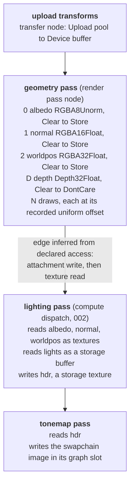
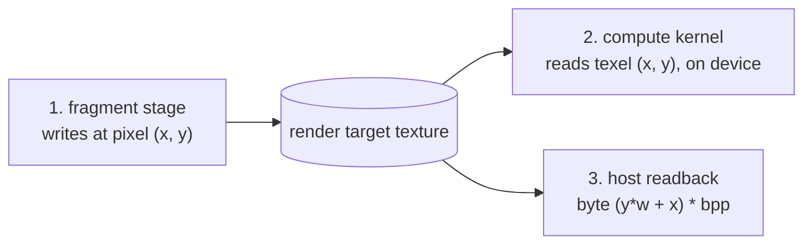

# Graphics

The rasterization half of layer 1: how a render pipeline is described, how a
render pass becomes a node in the graph of [003](003-command-graph.md), how draws
are issued, how a rasterized G-buffer is handed to a compute pass without leaving
the device, and how a frame reaches a screen.

**Status: normative and frozen, not built at v0.**
[`000-decisions.md`](000-decisions.md)'s v0 milestone is compute only. This spec
is written now, and its API shape is settled now, because attachment formats,
blend state, and stencil operations are compile-time pipeline inputs on every
backend: adding them after callers have written pipeline descriptors is a
breaking change, which is the same argument [002](002-compute-model.md) makes for
designing the compute model in rather than retrofitting it. What v0 defers is the
implementation, and with it the CPU reference rasterizer, the surface and present
path, and the Metal drawable path. [004](004-kernel-authoring.md) correspondingly
keeps the vertex and fragment directives reserved and unimplemented, which
removes the contradiction between the two specs: this one describes a stage
language 004 does not yet compile, and says so.

The design target is a deferred renderer: a geometry pass writing several colour
attachments plus depth, then compute doing the shading. That target is chosen
because it is the case the predecessor project could not complete, and because it
exercises every part of this spec at once.

## What this spec inherits

- Textures, formats, pools, and transfers come from
  [001](001-device-resources.md). Texture-to-buffer and buffer-to-texture
  transfers are first class there, and this spec depends on that.
- Shader stages are authored in Go, per [`000-decisions.md`](000-decisions.md)
  decision 5, and compute passes follow [002](002-compute-model.md).
- Nothing here executes when it is called. A render pass is recorded, like every
  other node. [`000-decisions.md`](000-decisions.md) decision 1 already argues
  this costs graphics nothing: every backend records a render pass into a
  command buffer anyway, and GL, which has no command buffer at all, records and
  replays on its context thread regardless (see
  [`conventions.md`](../docs/conventions.md)).

## Render pipeline

A render pipeline is a compiled object. Creating one is expensive on every
backend (it compiles shaders and specialises fixed-function state), so it is
created once, outside the frame loop, and referenced by nodes.

### Vertex input

A pipeline declares its vertex input as a set of **buffer layouts**, each with a
stride and a step mode (per vertex or per instance), and within each a set of
**attributes** with a format, a byte offset, and a shader location.

Step mode being part of the layout rather than the draw is what makes instancing
free: an instance transform buffer is just a layout stepping per instance.

A pipeline may declare **no vertex buffers at all**, in which case the vertex
stage runs off its vertex index alone. This is not a curiosity: it is how a
full-screen pass is drawn (three vertices, positions computed from the index),
and the deferred renderer in this spec uses it for the resolve.

Attribute formats are a distinct enumeration from buffer dtypes, for the same
reason texture formats are in 001: a `unorm8x4` vertex colour and a `u8`
buffer element have the same width and different meanings.

### Shader stages

Two stages, vertex and fragment, both authored in Go. The kernel language and
its directives are [004](004-kernel-authoring.md)'s subject, which defers the
graphics stages and reserves `//accel:vertex` and `//accel:fragment` for them.
What this spec fixes is the shape those stages must have, since the pipeline is
what consumes them.

- The vertex stage returns a clip-space position plus a struct of **varyings**.
- The fragment stage takes the interpolated varyings and returns a struct whose
  fields map, in order, onto the pipeline's colour attachments. One struct field
  per attachment is how MRT is expressed, and it is what the predecessor proved
  on Metal.

Integer varyings must be flat-interpolated. This is not an accel choice, it is
true on every backend, and the kernel compiler rejects a perspective-interpolated
integer varying with an error naming the restriction rather than letting the
driver do it.

**The fragment stage cannot write a storage buffer.** Not "should not": the API
has no way to express it. [`conventions.md`](../docs/conventions.md) records why:
fragment buffer writes are unordered with respect to other fragments covering the
same pixel, so a G-buffer written that way holds a nondeterministic winner
wherever geometry overlaps, while the depth buffer looks perfectly correct.
Render targets with the depth test on do not have this problem, because the ROP
applies the depth test and the colour write as one indivisible operation. A
fragment stage writes attachments, and only attachments. Where rasterizer-ordered
access is genuinely needed it is a queryable capability and absent by default.

### Rasterizer state

- **Front-face winding**, stated explicitly, meaning the same thing on every
  backend. Metal's default disagrees with GL's, and getting it backwards keeps
  back faces instead of front faces: the silhouette stays right while every
  per-pixel attribute comes from the wrong surface, so it reads as a shading bug.
  See [`conventions.md`](../docs/conventions.md). There is no "backend default";
  the field has no unset state.
- **Cull mode**: none, front, or back.
- **Fill mode**: filled or wireframe, where wireframe is a capability (Metal has
  it, GLES 3.1 does not).
- **Depth bias**: constant, slope, and clamp. Present because shadow mapping is
  unusable without it and because emulating it in the vertex stage is wrong for
  sloped geometry.
- **Primitive topology**: triangle list, triangle strip, line list, line strip,
  point list.

### Depth and stencil state

Depth test enable, compare function, and depth write enable, as three separate
fields, because read-only depth (test on, write off) is a real and useful
configuration: it is how a second pass shades exactly the surfaces the geometry
pass kept.

Stencil is specified now rather than added later: compare function, read and
write masks, and the fail/depth-fail/pass operations, per face. It is fixed
function on all four target backends, and adding it later changes the shape of
the pipeline descriptor, which is a breaking change for every caller. The
stencil **reference value** is the one piece that is dynamic; see the fixed
versus dynamic table.

A pipeline declares the **format** of its depth or depth-stencil attachment, or
none. Depth formats carry backend constraints colour formats do not, including
macOS requiring depth textures to be device-private; 001 makes the backend
enforce that rather than the caller discovering it.

### Blend and colour attachments

Each colour attachment carries its own format, write mask, and blend state
(separate colour and alpha factors and operations, or blending disabled).
Per attachment rather than per pipeline, because a G-buffer's albedo target and
its accumulation target want different answers in the same pass.

The **blend constant** is dynamic; everything else about blending is compiled in.

Attachment count is capped by a device-reported limit. Requesting more attachments
than the device supports is a pipeline creation error naming the limit, per
[`000-decisions.md`](000-decisions.md) decision 6.

### Fixed at creation, and what is not

The second column is **not** 003's list of what varies between submissions. Most
of it is recorded values, which is to say graph structure, fixed once the graph is
built. Only bind group contents and buffer contents vary between submissions of a
built graph. The per-object section below makes the same distinction concretely.

| Fixed at pipeline creation | Recorded per pass or per draw, or bound |
| --- | --- |
| Vertex input layout and attributes | Vertex and index buffer bindings |
| Vertex and fragment stage code | Bind group contents (through 003's rebinding) |
| Topology class, winding, cull, fill, depth bias | Buffer contents |
| Depth test, compare, write, stencil ops and masks | Stencil reference value |
| Blend state and write mask, per attachment | Blend constant |
| Colour attachment formats and count, depth format | Viewport and scissor (per pass) |
| Sample count | Draw counts, first index, instance count |

The split is not a taste decision, it is what backends require. D3D12 compiles a
pipeline state object, Vulkan compiles a `VkPipeline`, Metal compiles a
`MTLRenderPipelineState`, and each of them takes attachment formats, blend, and
vertex layout as compile-time inputs. The dynamic column is close to the
intersection of what all four can change without recompiling. Exposing more as
dynamic would mean either a backend that silently recompiles mid-frame (a
notorious stutter source) or a backend that fails at a call the API said was
legal.

Attachment formats being compiled in has a consequence worth stating: a pipeline
is valid only in a pass whose attachments match its declared formats and count.
That agreement is checked at graph build, and the error names the pipeline, the
node, and the attachment index.

## Render passes as graph nodes

**One render pass is one node.** All the draws inside it are recorded into that
node. A draw is not a node.

This is the single most consequential structural decision in the spec, and the
reason is that the render pass, not the draw, is the unit at which
synchronisation is expressible. Vulkan cannot barrier inside a render pass in the
general case, tile-based hardware physically cannot (the attachment contents live
in tile memory until the pass ends), and Metal's encoder has the same shape. Draw
granularity in the graph would promise an ordering the hardware cannot provide.
Pass granularity promises exactly what it can.

Two rules follow, and both are caller-visible:

1. **Draws inside a pass execute in recorded order** and the builder never
   reorders them. Blending is order dependent, and so is any caller reasoning
   about overdraw.
2. **The builder inserts no barriers inside a pass.** Per-pixel ordering between
   draws is the ROP's job, which is exactly the guarantee
   [`conventions.md`](../docs/conventions.md) says fragment buffer writes lack.

### Load and store actions

Each attachment declares what happens at the start and the end of the pass.

| Load | Meaning |
| --- | --- |
| `Clear` | Clear to a stated value. |
| `Load` | Preserve existing contents. |
| `DontCare` | Contents are undefined at pass start. |

| Store | Meaning |
| --- | --- |
| `Store` | Contents are readable after the pass. |
| `DontCare` | Contents are undefined after the pass. |

These are not decoration. On a tiler, `Clear` costs nothing while a full-screen
clear draw costs a full write of tile memory, and `DontCare` on a depth
attachment that nothing reads after the pass saves writing the whole depth buffer
out to memory every frame. A depth attachment used only for occlusion within its
own pass should be `Clear` then `DontCare`, and stating it is the caller's, not
the backend's guess.

`DontCare` is also load-bearing for the graph: an attachment loaded `DontCare`
carries no data dependency on whatever wrote it last, so the read-after-write edge
disappears. The write-after-write edge does not: an earlier node's writes to the
same memory still have to be ordered before this pass's, or they land afterwards.
And where the attachment is a builder-owned transient, its live range starts at
the pass rather than earlier, so it can alias unrelated transients.
Caller-created textures are never aliased, per 003.

Clear values come from the attachment's format. Clearing depth to 0 by leaving a
field zero-valued is a real hazard (the predecessor defaulted zero to 1.0 for
exactly this reason), so a `Clear` load action carries an explicit value with no
zero-value special case, and the graph builder rejects a depth clear outside the
stored depth range.

That range is `[0, 1]`, and it is a different thing from the clip convention.
`[-1, 1]` is clip space and NDC. Every target backend applies the viewport depth
transform to a **stored window depth in `[0, 1]`**, which is why
[`conventions.md`](../docs/conventions.md)'s fragment-side recovery
`position.z * 2 - 1` type-checks on GL and Metal alike. Depth clear values and
depth compares operate in `[0, 1]`; vertex kernels emit `[-1, 1]`.

### Declared access, inferred edges

A render pass node declares:

- each colour attachment, with its load and store action, so an attachment loaded
  `Load` is a read plus a write while one loaded `Clear` or `DontCare` is a write
  only;
- the depth-stencil attachment, which is a read plus a write when depth writes are
  on and a read only when the pipeline tests without writing;
- the union of every resource bound by every draw in the pass, as reads: vertex
  buffers, index buffers, uniform and storage buffers, sampled textures, and any
  indirect argument buffer;
- its render area, which must be within every attachment's extent.

From that the builder infers edges and computes barriers exactly as it does for a
dispatch, which is the point of 003 declaring access rather than order. A geometry
pass writing a G-buffer and a compute pass reading it produce an edge with no
caller involvement, and the barrier that makes the render target readable by
compute is computed, not written.

**A pass may not read a resource it writes.** A texture bound for sampling while
also an attachment of the same pass is a feedback loop, undefined on every
backend, and it is a build error naming both uses.

The one exception is narrow and worth stating precisely, because two different
things are easy to confuse here. A depth attachment with **write disabled**, so
that the ROP tests against it and nothing writes it, is legal everywhere and is
declared as a read; it is not a feedback loop, and it is expressible only because
depth write enable is a separate field from depth test enable. A depth attachment
**sampled by the fragment stage of the same pass** is the feedback loop, is
undefined on several backends, and stays rejected.

## Draw commands

Recorded into a pass node:

- **Draw**: vertex count, instance count, first vertex, first instance.
- **DrawIndexed**: index count, instance count, first index, vertex offset, first
  instance. The index buffer and its index type (16 or 32 bit) are bound per
  draw.
- **Indirect** forms of both, reading their arguments from a device-written
  buffer.

Instancing is not a separate call, it is the instance count, which is why the
non-instanced case is the instanced case with a count of one. A caller never
picks between two entry points for the same drawing.

### Per-object data without re-recording

A scene of a thousand objects, replayed every frame with new transforms, is the
case that decides whether this design actually works under 003's immutability. It
works like this:

Object `i`'s draw is recorded with a **fixed byte offset** `i * stride` into a
uniform buffer. The offsets are structure, so they are baked into the graph. The
transforms are contents, so they are rewritten every frame through 003's first
kind of variation. Nothing is re-recorded, and the graph replays.

This is why **there are no push constants in v0**. Push constants (Vulkan push
constants, D3D12 root constants, Metal `setVertexBytes`) put per-draw values into
the command stream itself, which makes changing them a re-record. That is
precisely the cost decision 1 exists to avoid, and offering them would make the
convenient path the one that defeats the model. The recorded-offset mechanism has
a native expression everywhere (dynamic uniform buffer offsets in Vulkan, buffer
offsets in Metal, root descriptor offsets in D3D12).

The honest cost: **the object count is baked in**. A scene that gains an object
needs either a rebuilt graph or a graph recorded for a fixed maximum, with absent
objects issuing zero-instance draws. Zero-instance draws are cheap but not free.
This is 003's "cache graphs keyed by shape" applied to scenes, and a renderer with
genuinely churning object counts will feel it.

### Indirect draws, and the count problem

Indirect **arguments** (vertex count, instance count, offsets) written by a
compute pass fit the model with no tension at all. The graph structure is
unchanged, only numbers vary, and that is 003's third kind of variation, which
already covers dispatch counts. **This spec proposes an amendment to 003**:
its third kind of variation reads "dispatch counts" and should read "dispatch and
draw counts". Someone reading 003 alone will not find draw counts there.
The argument buffer is declared as an indirect read, which is its own access kind
(the barrier from compute-write to indirect-read is a distinct stage on Vulkan and
D3D12 and getting it wrong is a classic hang).

Indirect **draw count**, where the device decides how many draws happen, is
genuinely in tension with immutability, since the number of commands is no longer
a property of the graph. The resolution: a multi-draw-indirect node records a
**build-time maximum draw count** and reads the actual count from a device-written
buffer, clamped to that maximum. The graph's structure stays bounded and
plannable, validation still has numbers to check, and the device still decides.
A count exceeding the maximum is clamped rather than silently truncating, and the
clamp is reported through [003](003-command-graph.md)'s run-time statistics.
Reporting is opt-in there, because reading a device-written count back costs a
transfer and a `Readback` allocation: a graph that did not ask still clamps, and
does so silently, which makes the maximum a caller obligation in release mode.

This is a capability, not a guarantee. D3D12 `ExecuteIndirect` and Vulkan
`vkCmdDrawIndirectCount` provide it directly, Metal has indirect command buffers,
and GLES 3.1 has single indirect draws but no count buffer. Absence is reported,
per decision 6, and a caller without the capability falls back to a fixed draw
count with zero-instance draws for the unused slots.

003 lists conditional and iterative execution as an open question. This spec does
not resolve it. It resolves only the bounded case, which is the one GPU-driven
culling actually needs.

## The render-to-compute handoff

This is the worked example, and it is the case the predecessor could not do: it
had no on-device texture-to-buffer transfer, so a G-buffer went out to the host
and back every frame.

The graph, in full:



Nothing in that graph touches the host between the upload and the present. The
edges are inferred from the declared access, the barriers that make attachments
readable by compute are computed, and the depth attachment's `DontCare` store
tells the builder nothing downstream needs it, so on a tiler it never leaves tile
memory.

Two variants of the handoff exist, and both are supported:

1. **Compute reads the attachments as textures.** The normal path, and the one
   the diagram shows. No copy at all.
2. **A transfer node copies an attachment into a buffer.** For a consumer that
   wants linear memory, which includes anything in layer 2. This is 001's
   first-class texture-to-buffer transfer, recorded as a node, participating in
   dependency tracking like everything else. It is a device-to-device copy: still
   no host round trip.

Variant 2 is also the **only** way to read a depth attachment back on macOS,
where depth textures must be device-private. A private texture cannot be mapped
by the host but can be copied on device, so depth readback is spelled as a
transfer node plus a buffer read, never as a direct texture readback. The API
does not offer the direct form for depth, so the macOS constraint cannot be
discovered by hitting it.

### One pixel origin, in all three places

A caller names a pixel of a render target in three different places, and they
must agree:

1. the fragment stage's pixel coordinate,
2. a compute kernel's texel index or sample coordinate on that texture, entirely
   on device, with no host involved,
3. host readback of that texture.



**Guarantee: row 0 is the top row in all three.** The correction is the backend's
responsibility and its mechanism is the backend's choice (transforming the
coordinate in emitted shader code, or storing top-origin through a flipped
viewport and skipping the readback flip). This spec fixes the observable, not the
implementation, exactly as [`conventions.md`](../docs/conventions.md) does.

Point 2 is the one this spec has to add. `conventions.md` guarantees the readback
path, and records that a compute kernel reading a G-buffer from a storage buffer
never sees the flip while the same data read from a texture does. The handoff
above reads a render target from a compute kernel on device, which is precisely
the combination neither guarantee covered, and it is where the predecessor's bug
would reappear in a document that claims to have learned from it.

## Surfaces and present

A **surface** is a swapchain: a rotation of presentable textures, acquired one per
frame, rendered into, and presented.

### The acquired image is a binding slot

A graph cannot name a swapchain texture at record time, because which texture the
frame gets is decided at acquire time. So the swapchain image is recorded as a
**binding slot** ([003](003-command-graph.md) gives slots their API), declared
with the surface's format so the builder can validate attachment agreement
without a texture, and each frame binds the acquired texture into it before
submitting. That is 003's second kind of variation used exactly as specified, and
it means a frame graph is built once and replayed for the life of the window.

Frame loop:

```go
// Recorded once, when the frame graph is built:
swap := rec.Slot(accel.SlotDescriptor{
	Name: "swapchain", Kind: accel.BindingAttachment,
	Access: accel.AccessWrite, Format: surface.Format(),
})

// Per frame, for the life of the window:
frame, err := surface.Acquire(timeout) // texture plus an acquire fence
graph.Bind(accel.Binding{Slot: swap, Texture: frame.Texture})
fence := queue.SubmitAfter(graph, frame.Acquired)
surface.Present(frame, fence)
```

`Acquire` can block (the swapchain is full, the compositor has not released an
image) so it takes a timeout and can report expiry, rather than blocking forever
inside a call the API described as non-blocking.

### Present in the graph and in fences

Present is **not** a graph node. It is a queue operation taking the submission
fence it must follow.

The reason is that present is not work on the device, it is a handoff to a
compositor whose completion is not the device's to signal, and a graph that
contained a present could not be submitted twice in flight without the second
submission's present racing the first. Keeping it outside means a graph is a
description of rendering and stays replayable, and the ordering that does matter
(rendering finishes before the image is shown) is expressed by the fence.

What the graph does contain is the write to the bound swapchain image. The
builder knows that image is presentable, so it inserts the transition to
present-ready as the pass's store, which is the part that genuinely is device
work.

### Headless surfaces

A surface with no window rotates ordinary offscreen textures and "presents" by
making the frame's pixels available for readback. The frame loop code is
identical. This is the predecessor's design and it earned its keep: it is what
lets the entire frame path, acquire, render, present, rotate, resize, run in CI
on every platform with no display and no compositor.

### Resize

`Resize` reallocates the swapchain. It also invalidates any transient sized to
the old extent, and attachment extents are validated at build, so **a resize
means rebuilding the graphs that render into the surface**. Stated plainly
because it is a cost: it is cheap per resize event and would be unacceptable per
frame.

A backend may also report the swapchain as out of date on acquire (the window
changed underneath it). That is an explicit error value, not a silent
reallocation, because the caller has to rebuild graphs either way and hiding it
would leave stale graphs pointing at freed textures.

### Windowing is out of scope, and where the line is

**accel does not create windows.** The caller supplies a native handle and accel
owns everything from the swapchain inward.

| Caller owns | accel owns |
| --- | --- |
| The OS window and its lifetime | The swapchain and its textures |
| The event loop, input, DPI changes | `EGLSurface`, `CAMetalLayer` drawables, DXGI swapchain |
| Choosing a window visual (accel reports the constraint) | Present, acquire, resize |

Window creation is an operating system and event loop concern with no relation to
GPU work: input, focus, DPI, menu bars, and main-thread affinity. Absorbing it
would drag a windowing library, its own cross-platform test matrix, and an
opinion about event loops into a library whose subject is device work, and it
would do so in a codebase that cannot use cgo, where every windowing backend is
hand-written syscall or `purego` binding.

The boundary needs traffic in both directions, and the predecessor proved this
concretely: its `WindowVisualID` reports the native visual an X11 window must be
created with for the EGL config to be compatible. So accel reports its
constraints (required visual or pixel format, supported present modes, supported
extents) and accepts a platform-tagged native handle: `Display*` plus window XID
on X11, `wl_display` plus `wl_surface` on Wayland, `HWND` on Windows,
`CAMetalLayer*` or `NSView*` on macOS.

**Caller obligation on macOS**: a `CAMetalLayer` must be created and resized on
the main thread. accel accepts a layer the caller created and attached, and
documents the requirement. Given an `NSView*` it will create the layer, and then
the call itself must be made on the main thread, and says so.

**The honest cost**: accel cannot ship a runnable windowed example without either
a second package or a test-only window shim. That is not hypothetical, it is
exactly why the predecessor needed an `app/` package. The v0 answer is a
test-only shim, small and unexported, sufficient for the present tests described
below and explicitly not a windowing library.

**The known gap to close.** The predecessor implemented on-screen present for
X11/EGL and Win32/ANGLE, and never implemented Metal's `CAMetalLayer` drawable
path, so present worked on GL and not on Metal. That is a warning, not a detail:
Metal is the backend where present differs most from the others (the drawable is
owned by the layer, `nextDrawable` can block or return nothing, and the
completion-handler lifetime rule in
[`conventions.md`](../docs/conventions.md) applies directly). v0 must prove the
Metal drawable path or present is not portable, and it should be proven early
rather than left as the last brick again.

## Convention guarantees

Restating the ones this spec depends on, in one place, with the detail and the
reasoning in [`conventions.md`](../docs/conventions.md):

- **Clip space.** One convention, presented to kernels: `z` in `[-1, 1]`. The
  backend remaps for Metal, Vulkan, and D3D12, whose native NDC range is
  `[0, 1]`. A caller never adjusts a projection matrix for the backend, and never
  sees near geometry vanish for the reason `conventions.md` describes. This is a
  statement about clip space and NDC only: the depth attachment stores `[0, 1]`
  on every backend, and clears and compares are in that range.
- **Winding.** Explicit in the pipeline descriptor, meaning the same thing
  everywhere, with no unset state.
- **Pixel origin.** Row 0 is the top row in the fragment stage, in an on-device
  compute read, and in host readback. See the handoff section above, which
  extends the readback guarantee to the on-device case.
- **Depth textures are device-private** where the backend requires it, so depth
  readback goes through a transfer node.
- **Bytes per pixel comes from the format**, always. Attachment size validation,
  transfer size computation, and readback buffer sizing all derive it, and none
  of them assumes 4.

## Out of scope for v0

Each of these is excluded for a reason, not by omission.

- **Ray tracing.** The abstraction is not obvious (acceleration structure build
  and update, shader binding tables, an entirely separate pipeline type), the
  hardware support is a strict subset of target devices, and there is no CPU
  oracle short of writing a path tracer. Excluding it costs nothing structurally:
  it is an additional pipeline type, not a change to this one.
- **Mesh and task shaders.** They replace the vertex input and primitive assembly
  this spec specifies, so they are a second pipeline model rather than an
  extension. Neither GL nor the CPU backend has any equivalent, so nothing could
  be verified against the oracle.
- **Tessellation.** Metal implements it through a compute pre-pass with a
  genuinely different authoring model, GLES 3.1 lacks it, and the workloads that
  want it are better served by compute today.
- **Geometry shaders.** Metal does not have them at all, they are slow where they
  do exist, and every use has a compute or instancing formulation.
- **Multisampling.** Deliberately deferred rather than designed out: sample count
  is already a pipeline field, and the store action enumeration reserves a
  resolve. What is excluded is resolve attachments, per-sample shading, sample
  masks, and alpha-to-coverage. The reason is the CPU oracle: an MSAA reference
  rasterizer has to match a sample pattern that is not standardized across
  vendors, so the oracle would be weaker for the paths MSAA touches while the
  API surface grew.
- **Queries** (occlusion, pipeline statistics, timestamps). Useful, and a
  profiling concern rather than a rendering one.
- **Sparse and virtual texture memory**, consistent with 001.

## Open questions

- **Reverse-Z within a `[-1, 1]` clip convention.** The remap itself is one
  multiply-add and loses nothing. What the convention complicates is the standard
  fix for depth precision at long view distances, which is placing the near plane
  at the far end of a float depth range with a `greater` compare. That is
  expressible today: clip `+1` (near) stores as `1.0`, clip `-1` (far) stores as
  `0.0`, so reverse-Z is "clear to `0.0`, `greater` compare, float depth format"
  with no API change at all. So this may be a documentation problem rather than
  an API one. The alternative, changing the single presented clip convention to
  `[0, 1]`, is a breaking change to every authored vertex kernel and to
  `conventions.md`. Unresolved, and worth resolving before the first caller
  writes a projection matrix.
- ~~**Rebindable slots versus concurrent submission.**~~ **Resolved in
  [003](003-command-graph.md)**, which took the second of the two options this
  spec offered: a graph has one submission in flight at a time, and that holds for
  every graph rather than only those with rebindable slots, because transient
  aliasing has the same race from the other direction. Snapshotting bindings at
  submit was rejected as fixing half the race for the price of a per-submission
  copy of the binding set. The frame loop above is unaffected: one graph per
  surface, one frame in flight per graph.
- **Whether the vertex input layout should be derived from the Go vertex kernel
  signature.** Declaring it twice, once in the kernel and once in the descriptor,
  is a mismatch waiting to happen, and the compiler already knows the types.
  Against: byte offsets, strides, and step modes are properties of the buffer, not
  of the kernel, and inferring them would either guess a packing or need
  annotations that are a descriptor by another name.
- **Pass merging on tilers.** Vulkan subpasses and Metal imageblocks let a
  deferred renderer keep its G-buffer in tile memory and never write it to main
  memory at all, which on mobile hardware is the difference between viable and
  not. The graph builder has the information to detect the pattern (a pass writing
  attachments consumed by exactly one following pass at the same pixel). Whether
  it attempts the merge automatically, exposes it as a hint, or ignores it, is
  undecided, and the compute-consumer shape in the handoff section above does not
  merge on any backend.
- **Whether a resize can avoid a graph rebuild.** If render area and attachment
  extents were dynamic rather than validated at build, a swapchain resize would
  rebind rather than rebuild. That trades a validation guarantee for convenience
  at an event that happens rarely, and the current answer (rebuild) is chosen for
  now rather than settled.
- **Bindless resource access.** A geometry pass over many materials wants to index
  a table of textures from the fragment stage. Vulkan descriptor indexing, D3D12
  bindless, and Metal argument buffers all provide it; GLES 3.1 has nothing
  comparable, and the CPU backend would need a matching model. A capability, if it
  arrives at all.

## Testing

### The CPU backend rasterizes

**Decision: yes.** The CPU backend implements the full graphics path, not just
compute.

The case is not aesthetic. [`000-decisions.md`](000-decisions.md) decision 3
makes the CPU backend the correctness oracle, and
[`conventions.md`](../docs/conventions.md) testing rule 1 says every convention in
that document is a way for a GPU backend to disagree with it. Half of those
conventions are graphics conventions: clip-space depth range, face winding,
readback origin, depth texture storage. A CPU backend that does not rasterize
leaves exactly the entries that cost the predecessor hours of debugging with no
oracle at all, and leaves every graphics test needing a device, which is the
provisioning problem decision 3 exists to end.

The cost is real and known rather than speculative: a conformant reference
rasterizer means clipping, a fill rule, perspective-correct interpolation, depth
and stencil test, per-attachment blend, and MRT. The predecessor project is a
software rasterizer, so the size of the job is measured, not guessed.

Scope, stated so it is not mistaken for a performance path: the CPU rasterizer is
a **reference** implementation. Triangles, lines, and points; top-left fill rule;
perspective-correct interpolation; depth and stencil; blending; multiple render
targets; no multisampling. It is not expected to be fast and no optimisation work
is planned for it.

**The fill rule is an accel guarantee**, not an implementation detail. Without a
stated rule, two triangles sharing an edge can double-shade or leave a gap, and
any coverage comparison against the oracle is meaningless. accel guarantees
top-left. Honest limit: on-edge sample tie-breaking is not identical across GPU
vendors even with the rule stated, so shared-edge pixels remain a tolerance
comparison.

### What the oracle proves exactly, and what within tolerance

This distinction is what makes the CPU rasterizer credible, and conflating the
two would produce a test suite that either fails constantly or proves nothing.

**Exact**, on every backend:

- occlusion ordering (which surface wins a pixel),
- attachment routing (which fragment output lands in which attachment),
- winding and cull behaviour,
- clip-range survival (which geometry is clipped),
- pixel origin agreement across the three places named above,
- graph structure (which nodes exist, which edges were inferred).

**Within a stated tolerance**:

- interpolated attribute values and shaded colours, since interpolation rounding
  differs between implementations,
- coverage at shared and near-degenerate edges, per the fill-rule limit above.

### Tests

- **Triangle.** A clip-space triangle renders to an offscreen target and the
  interior pixels match. The smallest end-to-end proof, and the predecessor's
  first milestone.
- **Occlusion is draw-order independent.** Two overlapping triangles, one near and
  one far, drawn in both orders into a colour plus depth target: the near one wins
  the overlap both times. This fails without a working depth attachment, which is
  what makes it worth writing.
- **MRT attachments are distinct.** A fragment stage writing a different constant
  to each of three attachments, read back separately, each holding its own value.
  Catches aliased attachments, which a single-target test cannot.
- **Winding flip empties coverage.** The same geometry with the front face
  reversed and back-face culling on produces no coverage. This is the test that
  catches the Metal winding divergence, which otherwise presents as a shading bug.
- **Near-plane survival.** Geometry straddling the near plane keeps its near half
  on every backend. This is the exact symptom `conventions.md` describes: a
  `[-1, 1]` matrix on a `[0, 1]` backend produces no coverage at all for near
  geometry, and it reads like a broken transform.
- **Origin agreement, the discriminating form.** Render a G-buffer whose written
  value encodes row position (top half distinct from bottom half). Path A: a
  compute kernel reads texel `(x, 0)`, writes it to a storage buffer, and the host
  reads the buffer. Path B: the host reads the texture at row 0. Assert `A == B`
  and assert both hold the top-row value. On GL and Metal exactly one of these
  needs a correction, and `conventions.md` testing rule 2 records that the
  predecessor's compute-path test passed while the texture path was mirrored.
- **Handoff stays on device.** The deferred graph above is built and its nodes
  inspected: no host transfer node exists between the geometry pass and the
  tonemap. Structural, and it is the regression test for the predecessor's actual
  failure. It is not sufficient on its own, which is why the origin test above
  checks values: a handoff with zero host transfers that reads the wrong rows is
  still wrong.
- **Depth readback on a private-depth backend.** Reading depth through a transfer
  node produces the expected values on macOS, where the direct path is impossible.
- **Load and store actions are observed.** `Load` preserves prior contents,
  `Clear` does not, and `DontCare` is not asserted about (it is undefined, so the
  test asserts the graph aliased the memory, not what is in it).
- **Per-object replay.** A graph of N objects at recorded uniform offsets,
  submitted twice with different transform contents, produces two different and
  individually correct frames with no re-recording.
- **Indirect draw.** A compute pass writes draw arguments, the draw consumes them,
  and the result matches the equivalent direct draw. On a device with the count
  capability, a device-written count below the build-time maximum draws that many,
  and a count above it clamps and reports.
- **Feedback loop rejected.** A texture bound for sampling and as an attachment of
  the same pass is a build error naming both uses.
- **Headless surface frame loop.** Acquire, render, present, and rotate for
  several frames, with double buffering and a resize in the middle, verified by
  readback. Runs everywhere with no display, on every backend.
- **On-screen present per platform.** X11/EGL and Win32/ANGLE are verifiable in CI
  headlessly, which the predecessor demonstrated. Metal's drawable path needs a
  real display session, so it is an honest, separately tracked state:
  "headless render verified" and "windowed present verified on a display" are not
  the same claim and are not reported as one.
- **Determinism.** The same graph submitted twice on the same backend produces
  identical images, per 003.

When a comparison does fail, the diagnostic order from
[`conventions.md`](../docs/conventions.md) applies: coverage counts and overlap
between competing interpretations first, mathematics last. Equal pixel counts with
roughly half overlap is the flip fingerprint, and it identifies an origin bug in
one measurement.

## Amendment: the worked G-buffer is not portable as written

[001](001-device-resources.md) caught that this spec's deferred example uses
`RGBA32Float` as a colour attachment, and colour-renderable 32-bit float is a
capability on GLES 3.1 rather than a guarantee (it needs an extension there). So
the example as written is not guaranteed to run on the GL backend, which is the
CI oracle for graphics.

The example stands, because it illustrates the handoff and not a portable
G-buffer layout, but it needs the caveat and the workaround beside it:
reconstruct world position from depth rather than storing it, which drops the
widest attachment and is what a production deferred renderer does anyway for
bandwidth reasons.

The general rule this is an instance of: an attachment format has to be checked
against `Device.FormatInfo` rather than assumed, and a spec example that assumes
one is a portability claim it has not earned.
