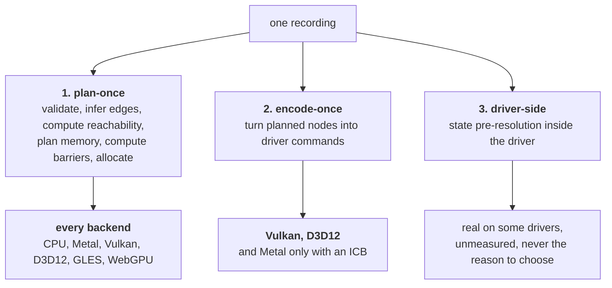

# Backends

**What is built — 2026-08-23.** The CPU backend in full, which is §5: both
generated execution strategies, the definition tracking and barrier
instrumentation, emulated subgroups, atomics, and the developer/strict/mimic
modes. R1 through R8 and R10 of §1 are implemented for it. The plan crosses the
seam as a value, which is §4's answer to 003's open question about graph
lowering.

**What is not — corrected 2026-08-23.** Two backends meet the contract now, not
one: §2.2's Metal is built, and §4.3's re-encode-per-submission is the strategy
it uses. R9's convention corrections turned out to have something to correct
after all — four Metal divergences are recorded in
[`conventions.md`](../docs/conventions.md), measured rather than remembered.

What remains is every backend in §2 other than the CPU and Metal, and §4's
lowering strategies for those. This spec is *in progress* on that basis: the
contract is settled and two of six backends meet it.

What a backend has to do, which backends exist, what each one can and cannot do,
and how [003](003-command-graph.md)'s graph reaches each one.

This spec answers 003's open question about graph lowering, and 002's open
question about whether f16 storage and f16 arithmetic are one capability or two.
It answers both concretely enough that the answers can be wrong and be caught.

## The oracle rule, stated once

The CPU backend enforces the **intersection** of what every backend allows, and
computes the **exact** semantics every backend is required to produce.

This generalises [002](002-compute-model.md)'s shared-memory definition checks into
a principle. A rule that only one backend enforces is a rule callers discover by
shipping. So: `Device` memory is not mappable on the CPU backend even though it
trivially could be, non-uniform barrier arrival fails there even though it would
merely be undefined elsewhere, and a workgroup larger than the portable floor is
rejected under the oracle's strict mode. The oracle is the strictest device, not
the most permissive one.

The cost is that a kernel can pass on a GPU and fail on the CPU. That is the
intended direction: a portability bug should surface on the device that runs
everywhere, on a laptop, with no provisioning.

---

## 1. What a backend is responsible for

A backend implements an unexported interface. Adding one touches no public API
([`000-decisions.md`](000-decisions.md) layering rule 2), and no backend-specific type
appears in a public signature (rule 3). Restated as responsibilities:

**R1. Existence, identity, and diagnostics.** Probe each compiled-in backend and
return two separate collections: openable adapters and per-backend probe
diagnostics. Every adapter has an opaque `AdapterID`, backend, name, vendor, and
hardware-or-software identity. A missing library, driver initialization failure,
or backend with no compute-capable adapter is a diagnostic, never a fake device.
Probing must not panic when the driver is absent, stale, or broken; native-driver
probes run in an isolated helper process so an abort becomes a diagnostic rather
than taking down enumeration. Section 6 defines identity lifetime and the API.

**R2. Capabilities and limits.** Fill `Capabilities` with boolean/finite-set
support and `Limits` with numeric bounds by **querying the device**, never by
assuming from the platform. Every `cap` and every `?` in section 3's matrix is
resolved here. A backend that cannot determine a capability reports it absent.
An unknown required limit is an adapter-open failure, not zero and not a guessed
portable minimum. Numeric maxima, sizes, counts, and alignments never live in
`Capabilities`.

**R3. Memory.** Allocate pools of the four memory kinds in
[001](001-device-resources.md), suballocate buffers from them, and map the kinds
that are host-visible. A backend that cannot honour a kind reports it absent, and
the caller gets an error naming the kind, rather than an allocation that quietly
behaves differently.

**R4. Resources.** Buffers, views, textures, samplers, and their lifetime,
including the platform constraints that belong in the backend rather than in the
caller (macOS depth textures must be private, bytes per pixel comes from the
format).

**R5. Shader ingestion.** Declare which shader IR the backend consumes and turn a
compiled kernel into a pipeline object. The backend does **not** compile Go.
[004](004-kernel-authoring.md) owns the emitter and its IR; the backend is a
consumer of whatever 004 produces for its target:

| Backend | Consumes |
| --- | --- |
| CPU | generated, instrumented Go lowering from the typed IR |
| Metal | MSL source text |
| Vulkan | SPIR-V binary |
| D3D12 | DXBC or DXIL binary (see 2.4) |
| OpenGL ES | GLSL ES source text |
| WebGPU | WGSL source text |

**R6. Pipelines.** Consume the generated `Kernel`'s static metadata: workgroup
size, shared-memory layout, binding layout and inferred access, requirements, and
target artifact. The kernel owns those facts; a public pipeline descriptor does
not repeat them. Pipeline creation checks `Capabilities` and `Limits`, then bakes
the metadata into the backend object.

**R7. Graph lowering.** Turn a built, validated `Graph` into whatever this
backend can resubmit cheaply, and expose the rebinding points that
[003](003-command-graph.md) promises stay cheap. Section 4 is this responsibility
in detail.

**R8. Queues, submission, and completion.** Report the device's queue topology
rather than letting callers assume it, per [001](001-device-resources.md):
whether compute and graphics are separate queues, and whether transfers have
their own. The four backends disagree completely (Vulkan exposes queue families
with capability bits, D3D12 has typed command queues, Metal has one general
queue, GL and the CPU backend have exactly one), so this is reported, never
inferred from the platform. Then: submit, return a fence, and keep a
submission's resources alive until the fence signals.

**R9. Convention correction.** Every divergence in
[`conventions.md`](../docs/conventions.md) is corrected inside the backend:
clip-space depth range, face winding, readback row order, GLSL reserved words and
integer literal rules, Objective-C pool discipline. A backend that leaks one of
these to the caller is broken, not merely different.

**R10. Teardown.** Release everything on the thread allowed to release it and
implement the ordered close contract in section 6.5. Closing a resource in flight
retires the caller handle and defers physical release to its last fence; closing
a device with live children or submissions fails without half-closing it.

### Required core, optional interfaces

The predecessor put everything on one interface and expressed absence as a stub
that fails when called: `newWindowSurface` returned `ErrUnsupported` on Metal,
`setComputeTexture` was an empty method on GL, and the Vulkan backend's whole
texture, sampler, and render half returned `ErrUnsupported`. That is absence
discovered at the call, which is exactly what decision 6 forbids.

So the contract splits:

- A **core** interface every backend implements in full: R1 to R8 for compute,
  plus R9 and R10. There is no stub in the core. A backend that cannot do
  something in the core is not a backend.
- **Optional** interfaces discovered by type assertion, each mirrored by a
  capability bit so the answer is available before anything is called:
  graphics and render passes, presentation to a window, texture sampling in
  compute, native graph replay, subgroup operations, indirect dispatch.

One more shape lesson from the predecessor, worth naming because it looks
harmless: `backendBuffer.bytes() []byte` returned the buffer's contents as a Go
slice. That worked only because the Metal backend created every buffer with
`StorageModeShared`. There is no `bytes()` for device-local memory on a discrete
GPU, so this one method quietly foreclosed [001](001-device-resources.md)'s
memory kinds. Buffer access here is a mapping operation on a pool whose kind
permits mapping, and mapping a `Device` pool is an error on every backend
including the CPU.

---

## 2. The backend set

### 2.1 CPU (pure Go)

**Reached cgo-free**: it is Go. No driver, no library, no build tags
([`000-decisions.md`](000-decisions.md) layering rule 4).

**Can**: everything in the compute model, exactly, including the parts real
hardware treats as undefined. Every dtype, every atomic including float add,
subgroups at a configurable size, shared memory with per-element definition
tracking, and deterministic non-uniform-barrier diagnostics. It executes the
generated CPU lowering from [004](004-kernel-authoring.md), never the authored
function directly.

**Cannot**: be fast in the way a GPU is fast (section 5), and cannot validate
anything about a driver. A backend bug that is a driver quirk is invisible here
by construction, which is why parity tests still need real devices.

**Difficulty**: moderate, and none of it is in the API. The work is the execution
model and the exactness contract, both in section 5.

### 2.2 Metal (darwin)

**Reached cgo-free**: `purego` plus an Objective-C runtime shim, calling
`objc_msgSend` against `Metal.framework`. Proven in the predecessor
(`gpu/backend_darwin.go`, `gpu/mtl`), including compute, render to texture, MRT,
and depth.

**Can**: the whole model. Metal is the most complete of the GPU backends because
MSL is the least restrictive shading language of the set (it can pass buffers to
functions, which GLSL ES cannot), unified memory makes `Shared` genuinely free on
Apple silicon, and the API is already a command-buffer API.

**Cannot**: resubmit a command buffer. `MTLCommandBuffer` is single-submit, so
Metal has no reusable command object without indirect command buffers, which have
their own cost (section 4.3).

**Difficulty**: moderate, with a sharp edge. The edge is object lifetime:
completion handlers run after the enclosing autorelease pool has drained, and
getting that wrong crashes inside `objc_msgSend` with a useless stack. See
[`conventions.md`](../docs/conventions.md).

### 2.3 Vulkan

**Reached cgo-free**: `purego` against `libvulkan.so.1` or `vulkan-1.dll`, with
create-info structs marshalled as C-layout Go structs. Proven in the predecessor
for the entire compute path (`gpu/backend_vk.go`): instance, device, memory,
descriptor sets, pipeline, command buffer, dispatch, readback, verified in CI on
lavapipe.

**Can**: more of the compute model than anything else, and it is the only backend
where the advanced capabilities (subgroups, f16, atomic float add, cooperative
matrix) are reachable through a documented, queryable extension mechanism rather
than a vendor deal.

**Cannot**: consume text. Vulkan takes SPIR-V, so this backend is blocked on
Go-to-SPIR-V, which is why [004](004-kernel-authoring.md) makes SPIR-V the
argument for having a real IR rather than an AST walk. The predecessor
sidestepped it by compiling GLSL with `glslang` in CI, which is fine for a proof
and not shippable, because it makes a build-time external tool part of the
runtime story, and there is no cgo-free GLSL-to-SPIR-V path.

**Difficulty**: large. Roughly forty structs marshal correctly through purego
before anything runs, and descriptor sets, memory type selection, and
synchronisation are each a subsystem. The predecessor showed the marshalling
works, which removes the risk but not the labour.

### 2.4 D3D12 (windows)

**Reached cgo-free**: `syscall` directly. Windows exposes its API through
`syscall.SyscallN` with no purego needed, and D3D12 objects are COM: a pointer to
a vtable, called as `vtbl[index](obj, args...)`. Device creation on WARP is
proven in the predecessor on a stock runner (`gpu/dxprobe_windows_test.go`).

**Can**: everything the model needs, in principle, and it is the only backend
that runs on Windows with zero provisioning because WARP ships in the OS.

**Cannot**, and this is the column's real constraint: **reach shader model 6
through the compiler that is present.** `D3DCompile` in `d3dcompiler_47.dll` tops
out at SM 5.1. SM 5.1 has no wave intrinsics and no native 16-bit types, so on
that path the D3D12 column loses subgroups, f16 arithmetic, and the packed 8-bit
dot product. SM 6 means DXIL, which means `dxcompiler.dll` (DXC), which is not on
a stock Windows install or a stock runner, and unsigned DXIL needs developer mode
enabled. Loading DXC by syscall is cgo-free but it is a shipped binary
dependency, which cuts against the same lean bet that ruled out cgo. Emitting
DXIL directly from the kernel compiler avoids the dependency and is a large piece
of work of the same weight as Go-to-SPIR-V. This is unresolved (open question 4).

**Difficulty**: large. COM vtable indices are transcribed by hand from header
inheritance order, one interface at a time, and a wrong index is an immediate
crash with no diagnostic. The shader question above sits on top of that.

### 2.5 OpenGL ES 3.1

**Reached cgo-free**: `purego` against `libGLESv2` plus EGL for the context, or
`syscall` on Windows. Fully proven in the predecessor (`gpu/backend_gl.go`, 829
lines): compute with SSBOs and UBOs, render to texture, MRT, depth, float
targets, and windowed present, all green in CI on Mesa llvmpipe.

**Can**: the baseline compute model. Compute shaders, shared memory, barriers,
integer atomics, and indirect dispatch are all GLES 3.1 core.

**Cannot**: any of the modern capabilities. No subgroups in core GLES 3.1, no
f16 or bf16 arithmetic, no float atomics, and no memory kinds, because GL buffers
are opaque and its usage hints are advisory. It also has no command buffer at
all, so the backend owns a `runtime.LockOSThread` goroutine holding the context
and replays a recorded list onto it. GLSL ES adds its own restrictions that the
kernel compiler must respect: no buffer parameters on helper functions, no mixing
`uint` and `int` literals, reserved words that are ordinary Go identifiers. All
three are in [`conventions.md`](../docs/conventions.md).

**Difficulty**: moderate, and the lowest-risk of the GPU backends because it is
the one the predecessor finished. Its value is reach, not capability: it is the
fallback for hardware and drivers too old for Vulkan.

### 2.6 WebGPU and WASM

**Reached cgo-free**: under `GOOS=js`, `syscall/js` against the browser's
`navigator.gpu`. This satisfies decision 2 trivially, since there is no C
anywhere in the path.

The alternative, a native WebGPU implementation (`wgpu-native` or Dawn) loaded by
purego on desktop, is technically cgo-free and is **rejected for v0**: it makes a
large third-party shared library a runtime dependency on platforms that already
have Vulkan, Metal, and D3D12, which is the dependency posture cgo-free exists to
avoid.

**Can**: the WGSL compute baseline, which is deliberately the portable
intersection: workgroups, workgroup storage, barriers, i32 and u32 atomics,
indirect dispatch.

**Cannot**: float atomics (WGSL atomics are i32 and u32 only, architecturally),
bf16 arithmetic, or `Shared` memory in [001](001-device-resources.md)'s sense.
Two more problems are structural rather than featural. First, WebGPU is
asynchronous where v0 `accel` is synchronous: adapter request, device request,
buffer mapping, and error delivery are promises, and blocking the single-threaded
JS event loop waiting for one deadlocks it. Therefore WebGPU is deferred together
with an explicit pending-operation API; it will not implement synchronous
`Enumerate`, `OpenDevice`, or mapping by spinning the event loop. The reserved
shape is a typed `Pending[T]` with completion channel/poll and
`Await(context.Context)`, used by `EnumerateAsync`, `OpenDeviceAsync`, and
`MapAsync`. Exact names belong to the WebGPU child spec, but asynchronous
completion is a constraint, not an open choice.

Second, every `syscall/js` call crosses a boundary that costs orders of magnitude
more than a Go call, so a software-replayed graph of a thousand nodes pays a
thousand crossings per submission. The mitigation, encoding the node list into a
typed array and replaying it with a loop on the JS side in one crossing, is
plausible and unproven (open question 5).

**Difficulty**: unknown, and the honest estimate is large for reasons unrelated
to graphics. Deferred past v0 until the pending-operation child spec is
validated; the synchronous API does not claim browser support in the meantime,
and the graph model must not foreclose the batched-crossing trick.

### 2.7 Not in the set

CUDA, per [`000-decisions.md`](000-decisions.md): reachable without cgo in principle,
not in the first milestone, and the largest single gap for training workloads.
Metal on iOS, OpenCL, and WebGL are not planned.

---

## 3. Capability matrix

**How to read a cell.**

| Mark | Meaning |
| --- | --- |
| `yes` | Architecturally guaranteed. Every device on this backend has it. |
| `cap` | Queryable. Present on some devices, absent on others, reported per device. |
| `emul` | Provided by the backend on top of something else, at a stated cost. |
| `no` | Architecturally absent. The API reports it absent and errors if required. |
| `gated` | Present in the hardware and the API, unreachable through the shader compiler that ships with the OS. See 2.4. |
| `n/a` | The question does not apply, because a prerequisite capability is `no`. |
| `?` | **Unknown.** Resolved by measurement at first contact, then recorded. |

A `?` here is a completed cell, not a gap: it names something that must be
measured rather than remembered. Every `cap` and `?` is resolved by the query
listed under the table during adapter probing and confirmed at device open. Once
measured on real hardware the result belongs in
[`conventions.md`](../docs/conventions.md), which is what that
document is for. Version-pinned extension claims are deliberately absent from
this table, because a confidently wrong version pin in a normative spec is worse
than an unknown: it gets built on.

### Compute model (from [002](002-compute-model.md))

| Capability | CPU | Metal | Vulkan | D3D12 | GLES 3.1 | WebGPU |
| --- | --- | --- | --- | --- | --- | --- |
| Shared (workgroup) memory | yes | yes | yes | yes | yes | yes |
| Execution + memory barriers | yes | yes | yes | yes | yes | yes |
| Atomics i32/u32, storage | yes | yes | yes | yes | yes | yes |
| Atomics i32/u32, shared | yes | yes | yes | yes | yes | yes |
| Atomic float add, storage | yes | cap | cap | no | no | no |
| Atomic float add, shared | yes | ? | cap | no | no | no |
| Subgroup ops (shuffle, ballot, reduce) | yes | cap | cap | gated | no | cap |
| f16 storage | yes | yes | yes | emul | emul | emul |
| f16 arithmetic | yes | yes | cap | gated | no | cap |
| bf16 storage | yes | emul | emul | emul | emul | emul |
| Denormals preserved f32 | yes | ? | ? | ? | ? | ? |
| Denormals preserved f16 | yes | ? | ? | ? | ? | ? |
| Inf/NaN produced | yes | ? | ? | ? | ? | ? |
| bf16 arithmetic | yes | ? | cap | ? | no | no |
| i8/u8 storage | yes | yes | yes | emul | emul | emul |
| i8 packed dot product | yes | ? | cap | gated | no | no |
| Indirect dispatch | yes | yes | yes | yes | yes | yes |
| FP contraction control | yes | ? | yes | yes | ? | ? |

`gated` means the capability exists in the hardware and the API but is
unreachable through the shader compiler that ships with the OS; see 2.4. It is
not `cap`, because no query resolves it: a distribution decision does.

`emul` on the narrow dtypes is the important entry, and it is what answers
002's open question. **f16 storage and f16 arithmetic are two capabilities, not
one.** Storage is universally available because a 16-bit float is reachable by
bit packing on every backend in the table (`packHalf2x16` in GLSL ES,
`f32tof16` in HLSL, `pack2x16float` in WGSL), at the cost of a shift and a
convert per access. bf16 uses the upper f32 bits plus the explicit
round-to-nearest-even adjustment required by 008; truncating to the upper half
does not satisfy the conversion contract.
Arithmetic is not emulable at any acceptable cost and is a real capability.

The design consequence is the one 002 already wanted: narrow dtypes are storage
formats that convert to f32 on load and back on store, that default works
everywhere, and native narrow arithmetic is an opt-in that requires a capability.
This makes the storage mechanisms needed by a future quantized design available
on every backend in the table. Quantized tensor representation, kernels, and
numeric contracts remain post-v0 work; this matrix does not claim a model path
before that separate spec exists.

**Packed emulation preserves logical-element independence.** Backends that pack
two 16-bit or four 8-bit elements into one `u32` must not lower a narrow store to
an ordinary word read-modify-write: two invocations writing different logical
elements in the same word would lose one update even though the source accesses
do not overlap. Every emulated packed write uses a word-sized compare-exchange
loop, and accesses that can race with such a write use the matching atomic word
load. Writes to the same logical element remain a caller/kernel race unless the
API exposes a narrow atomic, which v0 does not. A conformance test concurrently
writes every lane of one packed word and requires all lane values to survive.

### Numeric limits and reported properties

Numeric values are not capabilities. `DeviceInfo.Limits` and `Device.Limits()`
carry, at minimum:

- maximum workgroup size per axis, invocations per workgroup, workgroup count per
  axis, and workgroup-shared bytes;
- minimum and maximum subgroup size when subgroups exist;
- maximum storage binding bytes, uniform block bytes, bindings per kind, buffer
  bytes, pool bytes, pool count, and texture extents/layers;
- every buffer, uniform, copy, row-pitch, and texture-placement alignment from
  [001](001-device-resources.md).

Backend, hardware/software identity, and queue topology are reported properties,
not capabilities. The distinction is enforced structurally: `Capabilities` has
only booleans and finite feature sets; `Limits` has only numeric bounds. Kernel
requirements compare feature sets to the first and numeric requirements to the
second. The CPU strict mode computes its `Limits` from an explicit target set
rather than burying a portable floor in feature flags.

### Graph lowering (see section 4)

| Property | CPU | Metal | Vulkan | D3D12 | GLES 3.1 | WebGPU |
| --- | --- | --- | --- | --- | --- | --- |
| Native replayable object | no | cap | yes | yes | no | no |
| Lowering strategy | replay | re-encode, ICB optional | reusable primary CB | closed command list | replay on context thread | replay, batched crossing |
| Rebinding without re-record | yes | yes | yes | yes | yes | yes |

### Memory kinds (from [001](001-device-resources.md))

| Kind | CPU | Metal | Vulkan | D3D12 | GLES 3.1 | WebGPU |
| --- | --- | --- | --- | --- | --- | --- |
| `Device` | yes (enforced) | yes | yes | yes | emul | yes |
| `Upload` | yes | yes | yes | yes | yes | yes |
| `Readback` | yes | yes | yes | yes | yes | yes |
| `Shared` | yes | cap | cap | cap | no | no |

`Device` is `emul` on GL because GL buffers are opaque and its usage hints are
advisory: the backend cannot make the memory device-local, and cannot prevent a
read. It reports the kind as satisfiable, does not pretend the hint did anything,
and is the reason the CPU backend enforces non-mappability instead: without one
device enforcing it, nothing does until a discrete GPU does.

`Shared` is never assumed from the platform. An Apple silicon Mac has it and an
Intel Mac does not, and both are darwin.

### Graphics

| Property | CPU | Metal | Vulkan | D3D12 | GLES 3.1 | WebGPU |
| --- | --- | --- | --- | --- | --- | --- |
| Render passes, rasterization | yes (reference) | yes | yes (unbuilt) | yes (unbuilt) | yes | yes |
| Presentation to a window | no | cap | cap | cap | cap | n/a |
| Multisampling | no | cap | cap | cap | cap | cap |
| Rasterizer-ordered access | emul | cap | cap | cap | cap | no |

[005](005-graphics.md) decides that the CPU backend rasterizes, so the graphics
half has an oracle too, and the reasoning there is the reasoning here: half the
entries in [`conventions.md`](../docs/conventions.md) are graphics conventions,
and those are exactly the ones that cost the predecessor hours. This spec adopts
that decision rather than restating it, and the graphics rows above are the
backend-side view of 005's surface. Multisampling is excluded by 005 because the
sample pattern is not standardized across vendors, so the oracle would be weaker
precisely where MSAA is used.

**Rasterizer-ordered access** is in the table because
[`conventions.md`](../docs/conventions.md) names it as a queryable capability and
this spec owns the matrix. It is `ARB_fragment_shader_interlock` or
`GL_EXT_fragment_shader_interlock` on GL, raster order groups on Metal,
`VK_EXT_fragment_shader_interlock` on Vulkan, and rasterizer ordered views on
D3D12. WGSL has no equivalent, so WebGPU is `no`. The CPU backend can emulate it
by rasterizing in primitive order, but reports it only after the stage-ABI and
reference-rasterizer child specs implement and test that ordering. It is absent
from the baseline fragment API, per [005](005-graphics.md): unordered fragment
writes are not offered as a way to produce a deterministic buffer.

The predecessor's Vulkan and D3D12 backends never grew a render path at all, so
`unbuilt` is a statement about evidence: the API supports it, nobody in this
lineage has done it cgo-free, and the estimate is unproven.

### Where the answers come from

Each backend resolves its `cap` and `?` cells while producing `DeviceInfo` and
confirms them at device open:

- **Metal**: `supportsFamily:` for feature sets,
  `maxTotalThreadsPerThreadgroup` on the pipeline state,
  `maxThreadgroupMemoryLength`, `threadExecutionWidth` for the SIMD group size,
  `hasUnifiedMemory` for `Shared`, `supportsIndirectCommandBuffers` in the family
  query.
- **Vulkan**: `VkPhysicalDeviceLimits` (`maxComputeWorkGroupSize`,
  `maxComputeWorkGroupInvocations`, `maxComputeSharedMemorySize`,
  `maxStorageBufferRange`, `maxPerStageDescriptorStorageBuffers`),
  `VkPhysicalDeviceSubgroupProperties` for size and supported operation classes,
  the feature structs for 16-bit storage, float16, atomic float, and integer dot
  product, `VkPhysicalDeviceMemoryProperties` heaps for `Shared`,
  `VkPhysicalDeviceType` for software versus hardware.
- **D3D12**: `D3D12_FEATURE_DATA_D3D12_OPTIONS1` (`WaveOps`, `WaveLaneCountMin`,
  `WaveLaneCountMax`), `OPTIONS4.Native16BitShaderOpsSupported`,
  `D3D12_FEATURE_DATA_ARCHITECTURE` (`UMA`, `CacheCoherentUMA`) for `Shared`,
  `D3D12_FEATURE_DATA_SHADER_MODEL` for the reachable model, and the adapter's
  software flag. Workgroup limits are fixed by the API rather than queried.
- **GLES**: `GL_MAX_COMPUTE_WORK_GROUP_SIZE`,
  `GL_MAX_COMPUTE_WORK_GROUP_INVOCATIONS`, `GL_MAX_COMPUTE_SHARED_MEMORY_SIZE`,
  `GL_MAX_SHADER_STORAGE_BLOCK_SIZE`, `GL_MAX_COMPUTE_SHADER_STORAGE_BLOCKS`,
  the extension string, and `GL_RENDERER` for software detection.
- **WebGPU**: `GPUAdapter.limits`, `GPUAdapter.features` for `shader-f16` and
  subgroups, and the adapter's fallback flag.
- **CPU**: its own configuration. See section 5.

The API-guaranteed minimums differ enough that portability is not obvious
(GLES 3.1 and Vulkan guarantee far less per workgroup than D3D12 fixes by
contract, and WebGPU sits between them), so the strict oracle mode in section 5
exists to make a kernel's portability testable rather than assumed.

---

## 4. How a graph lowers

[003](003-command-graph.md) leaves this open and says the answer constrains how
much replay is worth. Here is the answer, decomposed, because the parts have very
different distributions.

Replay saves three separable things:

1. **Plan-once**: validation, DAG construction, barrier computation, transient
   live-range analysis, pool assignment, and allocation. This is `accel`'s own
   work, it is the largest of the three for a graph of any size, and **every
   backend gets it, including software replay.**
2. **Encode-once**: turning planned nodes into driver commands. Only a backend
   with a resubmittable command object gets this.
3. **Driver-side**: state pre-resolution inside the driver when it is handed a
   pre-built object. Real on some drivers, unmeasured, and never the reason to
   choose the model.



**The conclusion**: (1) is backend-independent and is most of the value, so the
recording model is justified even where lowering is software replay. That is the
sentence 003 was waiting for. (2) is a bonus on two backends out of six. A design
that depended on (2) would be a design that only pays off on Vulkan and D3D12,
and this one does not.

### 4.1 Vulkan: a reusable primary command buffer

003 names secondary command buffers. That framing is worth correcting: a
**primary** command buffer recorded without `ONE_TIME_SUBMIT` is already
resubmittable, and it is the natural lowering of a `Graph`. Secondary command
buffers are for *composition*, so they are the right tool if `Graph` later gains
sub-graphs, and not the right tool for the base case. Some drivers also charge
real overhead for `vkCmdExecuteCommands`, so using secondaries for the base case
would be paying for composition nobody asked for.

**Rebinding without re-recording** is the constraint that makes this work.
[003](003-command-graph.md) promises bound resources can change between
submissions. If the command buffer baked in a descriptor, that promise would cost
a re-record. So a binding slot lowers to an entry in a `VkDescriptorSet` that the
command buffer references by handle: the set's *contents* are updated host-side
between submissions, the command buffer stays valid, and rebinding costs a
descriptor write. Push descriptors and push constants are baked into the recorded
commands and are therefore usable only for values that do not vary.

**Honest caveat**: re-recording a primary command buffer in Vulkan is itself
cheap, and for a small graph it may beat the bookkeeping that keeps a recorded one
valid. Which wins is a measurement, not a deduction (open question 1).

### 4.2 D3D12: a closed command list, and bundles mostly do not apply

Same shape as Vulkan: a command list that has been closed can be executed many
times, so that is the replayable object.

**Bundles are not the answer**, and the reason is specific: a bundle cannot
contain a resource barrier, and cannot change render targets. `accel`'s graph is
dispatches separated by computed barriers, so a graph with any dependency between
its nodes cannot be one bundle. Bundles would apply to a barrier-free run of
nodes inside a graph, which is a narrow case, and their documented benefit is
amortising CPU recording of small repeated command sequences, which is the thing
the closed command list already gives us. Bundles are therefore not planned;
revisit only if measurement shows recording cost dominating.

Rebinding lowers to descriptor heap writes with the heap bound by the command
list, mirroring 4.1.

### 4.3 Metal: re-encode by default, indirect command buffers as an option

Metal is the interesting case because it has the least to gain. A
`MTLCommandBuffer` is single-submit, so every submission needs a fresh command
buffer and fresh encoders no matter what. Replay's category (2) saving is
therefore **zero by default on Metal**: the graph is re-encoded per submission
from the planned node list.

That is fine, and stating why matters. Metal encoding is a cheap CPU-side call
per command, and for a graph of a hundred nodes the re-encode is a rounding error
next to the plan-once saving. It stops being fine somewhere in the thousands of
nodes, which a large model reaches.

**Measured 2026-08-25, and the first cost was not Metal's.** A consumer running
a 596M model reported the submit interval as 15.6% of a decode step on a graph
of about 790 nodes. Attributing it found the cost is per node, and that most of
it was the *foreign call*, not the encoder: every Objective-C call went through
purego's `reflect.MakeFunc` dispatch, which rebuilds an argument frame per call
from a signature it re-reads every time. One dispatch node is five such calls,
each wrapped in an autorelease pool that is two more.

| M2, otherwise idle | before | after |
| --- | ---: | ---: |
| one message send | 667 ns | 180 ns |
| an autorelease pool, push and pop | 941 ns | 389 ns |
| 790 nodes, one encoder | 11.6 ms | 5.55 ms |
| 790 nodes, a barrier between each | 15.4 ms | 9.76 ms |

**A second pass, 2026-08-26**, took 790 nodes from 2.14 ms to about 1.7 ms on a
quiet machine. Not the pool *hoisting* the options described: a selector
returning **void** autoreleases nothing, and every call a dispatch makes per node
returns void, so those were paying a push and a pop for objects that do not
exist. The constructors keep their pools and are paid once a submission. Checked
rather than argued — peak resident memory over 4000 submissions is the same with
the pools and without, and the same as over 200.

The machine's own state is part of that table and is stated rather than
assumed: the same pair measured while the machine was under a load average of
200 reads 40 ms against 8 ms, because the reflected path allocates per call and
an allocating path degrades further under contention than one that does not.
The idle figures are the conservative ones and are the ones quoted. The row for
the encoder constructors, `retain`/`release` and the buffer copy landed after
the idle measurement and is not in it, so the "after" column is an upper bound
on what the path costs now.

Calling `objc_msgSend` directly took the per-node cost from 14.7 µs to 7.0 µs,
and this is a **rule about where to look**: on a cgo-free backend, a
per-operation cost is the FFI binding before it is the driver. Two calls keep
the reflected form and the reason is the ABI rather than taste — a struct passed
by value and a Go pointer both need a signature the reflected path reads and a
`uintptr` cannot carry. `BenchmarkFFICost` in `internal/mtl` and
`BenchmarkSubmitAttribution` in `internal/metal` are the measurement, kept so
the next change to this path has a baseline.

What remains after that is genuinely the encoder, and it is still per node.

#### The last reflected call, and what the per-node cost is made of — 2026-08-27

`SetBytes` was still using the reflected send after the rest of the path moved
to direct `objc_msgSend`, and its comment said why: it passes a **Go** pointer,
and a `uintptr` is not a reference the collector honours. That reasoning was
right and its conclusion was not — the address does not have to be *assumed*
stable, it can be *made* stable. `runtime.Pinner` prevents the object being moved
or freed until `Unpin`, which covers both halves and keeps it alive across the
call without a `KeepAlive`.

It was the only reflected call left on the per-node path, and it ran at least
twice per node (the binding lengths, then each uniform block).

**Measured in allocations, not in nanoseconds, and that is deliberate.** This
machine's load average sat above 200 for the whole session, which made wall
times swing by 4× between runs of the same benchmark — the contamination
[009](009-sequencing.md) already records once. Allocations per submission are
load-independent, so they are what the claim is stated in:

| 790 nodes, `Submit` | allocs/op | per node |
| --- | ---: | ---: |
| before | 22946 | 29.0 |
| after the pinned send | 18997 | 24.0 |
| after reusing the lengths scratch | 18206 | 23.0 |

**No wall-clock claim is made here.** The change removes work — a reflected call
and an allocation per node — so it cannot be slower, but how much faster is not
something this machine can currently answer.

**The pin is released, and that is checked rather than reasoned.** `Unpin`
releases *every* object its Pinner holds, so the pattern is only safe because
`Submit` holds the executable's mutex for its whole body: one object is pinned
at a time and no call re-enters. A missed `Unpin` would not error — it would
retain one slice per message send, forever, and show only as growth.
`TestPinnedBytesDoNotAccumulate` submits a 256-node plan 300 times and requires
the heap not to grow, which over 76 800 sends it does not; removing the `Unpin`
fails it.

**Where the remaining 23 per node are is not established.** They are not in
accel's encode path: after these two changes it allocates nothing per node.
They are below it, in the variadic slice `purego.SyscallN` takes, which is one
per message send and there are about ten sends per node. That is a hypothesis
with an obvious test and it has not been run, so it is recorded as a hypothesis.

**This does not close the ICB question, it re-prices it.** The cost is still per
node — `BenchmarkSubmitAttribution` shows `ns/node` flat from 64 to 790 nodes,
and flatness is a shape rather than a magnitude, so it survives the load the
absolute numbers do not.

`MTLIndirectCommandBuffer` is the escape: compute commands encoded once into an
ICB, then executed from a fresh command buffer per submission with a single
`executeCommandsInBuffer`. The costs are real: it requires argument buffers for
resource binding, it requires explicit residency calls for every resource the ICB
touches, and it is a capability, not a guarantee. So ICB lowering is behind the
same optional interface as everything else in this spec, is off by default, and
ships only with a measurement against re-encode. This is the one place where the
graph model's value on a backend depends on an optimisation that is not yet
written.

### 4.4 OpenGL ES: software replay on the context thread

GL has no command buffer at all, so the recorded node list is replayed by the
backend onto its context-owning thread.

What replay saves here is entirely category (1), plus one thing that is not on
the list and is worth naming: the recorded list crosses to the context thread
**once per submission** instead of once per command. The predecessor's backend
marshalled each `backend` method onto the context thread and waited, which is a
channel round trip per call. Submitting a planned graph turns N round trips into
one. This is why [`conventions.md`](../docs/conventions.md) says the recording
model costs GL nothing: GL was going to record anyway, and now it records for a
reason.

### 4.5 CPU and WebGPU

CPU replays the planned node list directly. Category (1) only, and it is enough:
the CPU backend's per-submission overhead is dominated by kernel execution.

WebGPU replays into a fresh `GPUCommandEncoder` per submission. Compute has no
equivalent of render bundles, so there is no native object. The interesting
variable is the crossing cost from 2.6: the difference between a per-node
`syscall/js` call and a single crossing carrying an encoded op list could be an
order of magnitude, and it makes the graph model *more* valuable on WebGPU than
on any backend with a native object. Unproven (open question 5).

---

## 5. The CPU backend in depth

### Two generated execution strategies

**Cooperative kernels** (any use of shared memory, barriers, or subgroup
operations) use [004](004-kernel-authoring.md)'s generated resumable lowering.
Each invocation has explicit locals and a program counter, and the workgroup
scheduler advances it to a barrier or subgroup suspension point. Workgroups are
distributed across a bounded worker pool sized from `GOMAXPROCS`; invocation
state does not require one goroutine per lane.

**Flat kernels** (no shared memory, no barriers, no subgroups) run as a **plain
generated loop over invocations** on one worker per workgroup. There is nothing
to suspend, so there is nothing to pay a scheduler for. This is ordinary Go code
over ordinary slices, with explicit typed-IR rounding operations.

The strategies must agree. A conformance test runs a set of flat kernels under
both strategies and requires identical results, which keeps the fast path from
drifting into a second implementation.

### Barriers, and what the oracle catches

A barrier is a reusable counting barrier over the workgroup's invocations. Three
behaviours make it an oracle rather than an implementation:

- **Non-uniform arrival is detected.** At one dynamic rendezvous epoch every
  active invocation must reach the same generated barrier ID. Returning or
  reaching another ID reports both source positions and the invocation IDs, not
  a hang or timeout. [002](002-compute-model.md) calls this out as a large part
  of why the CPU backend is worth having: on real hardware this is undefined
  behaviour that usually appears to work.
- **Shared memory carries a definition bitmap.** Loads and atomic read-modify-
  writes check the element's bit; stores set it. A poison byte pattern may aid
  debugging but cannot prove initialization because every integer bit pattern is
  valid and floating poison can propagate.
- **Missing barriers are diagnosed by explicit access tracking.** The generated
  CPU operations retain source locations and report overlapping unordered
  accesses deterministically. `go test -race` validates concurrency inside the
  runtime implementation; it is not the semantic mechanism for kernel races.

A shuffle mode permutes invocation advancement under a fixed seed to exercise
ordering assumptions reproducibly. Correct kernels remain deterministic; a race
is reported with the conflicting source accesses rather than inferred from a
different final value.

### Subgroups

Emulated at a **configurable fixed size, defaulting to 4**. Not 1: a subgroup
size of 1 makes shuffle and ballot degenerate and hides exactly the bugs the
emulation exists to find. Small enough that a normal workgroup spans several
subgroups, so cross-subgroup errors and tail handling are exercised.

The size is configurable because a kernel that assumes a subgroup size is wrong
on the next device. A kernel whose semantic result is subgroup-size independent
runs at 1, 4, 32, and 64 and matches its no-subgroup fallback. Individual
shuffle, ballot, or subgroup-reduction results may legitimately differ with lane
count; the invariant belongs to the complete algorithm, not each intrinsic.

### CPU options and an explicit portability target

The oracle enforces an intersection, but there is no timeless meaning of
"portable": v0 targets CPU and Metal, a server may target Vulkan only, and a
browser build eventually includes WebGPU. Strict mode therefore requires a
target set instead of silently intersecting every row in this document.

```go
type CPUMode int
const (
	CPUDeveloper CPUMode = iota
	CPUStrict
	CPUMimic
)

type CPUOptions struct {
	Mode         CPUMode
	StrictTargets []Backend      // required and non-empty for CPUStrict
	Mimic        *DeviceProfile  // required for CPUMimic
	SubgroupSize int             // 0 selects the mode/profile default
	ShuffleSeed  uint64          // 0 disables shuffled advancement
}

func OpenCPU(opts CPUOptions) (*Device, error)
```

- **Developer** (the zero value): generous limits and every CPU-emulatable
  feature, for development. Its default subgroup size is 4.
- **Strict**: `Capabilities` are the intersection and `Limits` are the minimum
  guaranteed bounds of exactly `StrictTargets`. The list rejects duplicates,
  `BackendCPU`, and a backend without a published baseline profile. Order does
  not affect the result and is normalized in `DeviceInfo`. A kernel that builds
  here is portable to that stated set, not to an implied future backend.
- **Mimic**: loads both capabilities and limits from a captured `DeviceProfile`,
  including backend/compiler policy, so a remote-device failure can be
  reproduced locally.

`SubgroupSize` must be 1 or a power of two within the selected mode/profile's
subgroup bounds. It controls CPU emulation only and never changes the reported
target intersection. `OpenDevice` on the enumerated CPU adapter is equivalent to
`OpenCPU(CPUOptions{})`; automatic selection never fabricates non-default CPU
options.

### Exactness, and the one thing that threatens it

Integer results are bit-exact everywhere and that is a hard requirement.

Floating point is not, and promising it would be a lie. FMA contraction, sqrt and
transcendental implementations, and reduction order all legitimately differ
between a GPU artifact and the generated CPU lowering. So the contract is:

- **Exact**: integer kernels, and f32 kernels restricted to `+`, `-` and `*` with
  contraction forbidden and a fixed reduction order. **Division is not in this
  list**, and leaving it out is deliberate: SPIR-V specifies `OpFDiv` at 2.5 ULP
  rather than correctly rounded, and Metal's default floating-point mode may
  compute `x/y` as `x * (1/y)`. See [008](008-numerics.md) §2.
- **ULP-bounded**: everything else, with the bound stated per operation class
  (transcendentals, `rsqrt`, `fma`-permitted paths), and the bound is part of the
  conformance suite rather than a per-test constant someone tuned until it
  passed.

Forbidding contraction is a **requirement on the emitter**, and its feasibility
is not uniform: SPIR-V has the `NoContraction` decoration, HLSL has `precise`,
Metal has a compiler floating-point mode whose default is the wrong one, and GLSL
ES 3.1 and WGSL have no equivalent at all. The Metal case is wider than
contraction and is [008](008-numerics.md) §4.2's finding: the default fast mode
also permits reassociation and assumes no NaNs or infinities, so this backend must
compile in the safe mode to deliver what [002](002-compute-model.md) §6.3 already
promises. That makes `InfNaNProduced` on Metal a property of accel's compile
options rather than of the device.
[004](004-kernel-authoring.md) carries this as an open question from the emitter
side and puts `a*b+c` in its class B; this is the same question seen from the
device side, and it is why FP contraction control is a matrix row with `?` cells
rather than an assumption. It is a real risk to the exact tier, not a formality.

**The oracle can also disagree with itself.** Go permits fusing a multiply and an
add into an FMA unless a conversion specifies the rounding, so the same Go kernel
can produce different f32 results on arm64 (which has FMA) and amd64 (which may
not fuse). An oracle that differs between the developer's machine and CI is worse
than no oracle. The CPU backend therefore requires an explicit `float32(...)`
conversion at each rounding point in its evaluation of a kernel's f32 arithmetic,
and a conformance test runs the same kernels on arm64 and amd64 and requires
bit-identical results. This is a stated obligation of the kernel compiler's CPU
target, not an accident of how the Go code is written.

### Parallel dispatch, and what keeps it deterministic

Added 2026-08-25. A dispatch's workgroups do not depend on each other, so the
grid walk is parallel by construction, and this backend takes it. An
elementwise f32 scale over a million elements went from 11.8 to 118.9 Melem/s
on eight cores, and the same measurement taken through the public surface —
buffers, a pipeline, a recorded dispatch — is 7.5x, which is the number a
caller gets.

The oracle rule above says the answer may not depend on how the answer was
computed, so the pool has to be invisible in the output. Three rules carry
that, and each one is checked:

1. **A kernel whose result can depend on workgroup order runs on one worker.**
2. **Workgroups keep the numbering the serial loop visited them in**, x
   fastest, so "workgroup n" names one workgroup whatever the worker count is.
3. **When several workgroups fail, the reported failure is the lowest numbered
   one**, which is the one the serial loop would have reported. A panic outranks
   an error at the same index.

#### Rule 1 is about atomics, and it is per kernel

The property is the **absence of any atomic**, not the absence of a
non-associative one. Every atomic accel offers returns the value the location
held before it, so an atomic increment is a ticket dispenser:

```
                   counter: 0 ──┐
  workgroup 0 ── AddU32 ──▶ 0   │  total = n, in every order
  workgroup 1 ── AddU32 ──▶ 1   ├─ but tickets[g] = the order g ran in
  workgroup 2 ── AddU32 ──▶ 2   │
                   ...        ──┘
```

`counter` reaches `n` whatever the order, because addition is associative and
commutative. `tickets[g]` does not, because the value the atomic *returned*
records the schedule. A kernel that stores its ticket therefore has a
schedule-dependent result even though its accumulator is associative. So
associativity is the wrong question, and the answer attaches to the kernel
rather than to the operation:

$$\text{OrderIndependent}(K) \;=\; \bigwedge_{\text{op} \in K} \neg\,\text{atomic}(\text{op})$$

The kernel compiler infers this and writes it into the generated kernel; it is
not a field an author sets. `false` is what a kernel gets when the compiler
cannot tell, which costs speed and never correctness.

#### The threshold is measured, on the cheapest kernel there is

A pool is not free, so a dispatch below `parallelThreshold` invocations runs on
one worker. The number is measured rather than guessed, and measured on an
elementwise f32 scale — one multiply per invocation — because a pool's cost is
fixed while a workgroup's work is not. The invocation count at which a pool
starts paying for itself is therefore **highest** when the work per invocation
is lowest, so a threshold that holds for a single multiply holds for every
heavier kernel.

On an eight-core M2 the crossover is between 128 and 256 invocations. The
threshold is 1024, four times that, and the margin is the point rather than the
number: below it a dispatch pays nothing at all, and at it the same scale
dispatch is already about 1.7x faster, so nothing lands where the answer is
arguable.

It counts **invocations, not workgroups**, because a workgroup is not a fixed
amount of work: 4 workgroups of 1024 invocations is worth a pool and 64
workgroups of 1 invocation is not.

#### Why rule 1 is asserted on the decision and not only on the output

A test that dispatches an order-dependent kernel on eight workers and reads the
tickets back watches the rule from outside. It is worth having and **it is not
a gate**: with the rule removed it reports the violation in about 19 runs out
of 20, because whether two workers overlap at all is the scheduler's to decide,
and one worker draining a queue of cheap workgroups before its peers wake is a
legal schedule that happens to produce grid order. A guard that holds most of
the time is waiting to be the flake somebody deletes.

So the rule is also asserted where it is written down — on the function that
chooses the worker count — where there is no race to lose. That one fails every
run. This generalises: **a rule about a concurrent outcome should be checked on
the decision that produces the outcome**, and the end-to-end test kept as
evidence that the decision is wired to something.

The end-to-end test earns that second job only if it can fail. The one here
runs the same dispatch at one processor and at every processor and requires the
bytes to match, and its first version could not: the output buffer survives
between the two runs, so an element the second run never wrote still held the
first run's correct value and read as agreement. **A test that compares two runs
sharing a buffer must clear it between them**, or it compares a run against
itself. Found by making every worker but the first skip its chunk and watching
the test pass.

### Performance expectations

It is a correctness tool. Stating the shape anyway, because "how slow" decides
whether it is usable for real work:

- **Flat kernels**: within a small factor of hand-written Go over slices, and
  parallel across workgroups. This is genuinely usable for small real work: a
  modest tensor operation, a test fixture, a unit-test-sized model. It will not
  compete with a BLAS.
- **Cooperative kernels**: dominated by state save/restore, access
  instrumentation, and barrier scheduling, roughly one scheduler step per
  invocation per barrier interval. Usable for correctness at thousands to low
  millions of invocations, not for production work. A tiled GEMM will run and
  will be slow, and that is the correct tradeoff for the thing whose job is to be
  right.

The disclosed goal: the CPU backend must be fast enough that the full conformance
suite runs in the time a Go test suite is allowed to take, and fast enough that
layer 2 can be developed against it before any GPU backend is finished
([`000-decisions.md`](000-decisions.md) decision 3). Beyond that, it is not optimised
at the cost of exactness or of the checks in this section.

---

## 6. Selection, enumeration, and lifetime

**`AdapterID` carries a `String` method**, added 2026-08-23. The token behind it
is unexported, and a layer above the device layer needs the identity:
[007](007-tensor-layer.md) requires a plan cache's key to include the device,
and the alternative a caller has otherwise is the device's *name*, which two
identical GPUs in one machine share. It is stable within a process and
comparable across enumerations, which is what §6.1's token promises; it is not
stable across machines or driver versions, and is an identity rather than a
fingerprint.

### 6.1 Enumeration result

Enumeration returns adapters and diagnostics separately:

```go
type AdapterID struct { /* opaque and comparable */ }

type DeviceInfo struct {
	ID           AdapterID
	Backend      Backend
	Name, Vendor string
	Software     bool
	Capabilities Capabilities
	Limits       Limits
}

type ProbeStage int // LoadLibrary, CreateInstance, EnumerateAdapters, QueryDevice
type ProbeDiagnostic struct {
	Backend Backend
	Stage   ProbeStage
	Err     error
}

type Enumeration struct {
	Devices     []DeviceInfo
	Diagnostics []ProbeDiagnostic
}

func Enumerate() Enumeration
func OpenDevice(id AdapterID) (*Device, error)
```

`AdapterID` is minted by accel, embeds a backend namespace internally, and is
stable for the process lifetime and across repeated enumerations while the
adapter remains present. Callers may compare and retain it in memory but may not
serialize or parse it; cross-process stable identifiers are not available on all
backends. `OpenDevice` rejects an ID from an earlier process or a removed adapter
with an error containing the last known identity. The opened device's
`Info().ID` is the same value.

Enumeration discovers adapters without creating logical devices. Query-only
handles needed to read features and limits are allowed and released before
return. A backend whose library is missing, whose instance creation fails, or
which reports no compute queue contributes a `ProbeDiagnostic`, not a synthetic
`DeviceInfo`. Multiple diagnostics may coexist with valid adapters from the same
backend. Native probes run through a small helper subprocess with a versioned
wire record; abnormal exit, signal, malformed output, and timeout become probe
diagnostics. CPU probing is in-process. WebGPU does not participate in this
synchronous API and will use the pending API from section 2.6.

### 6.2 Explicit open

`OpenDevice` is the unambiguous explicit operation. The old `Open(Backend)` shape
is removed: enumeration may report two discrete GPUs and a software adapter for
one backend, so a backend name cannot select one without an undocumented policy.
Callers that only care about a backend filter `Enumeration.Devices`, choose an
ID, and open it. No explicit open ever falls back to another adapter or backend.

**Open the best available** is a separate call that takes an explicit policy: a
preference order, whether software devices are acceptable, whether the CPU
backend is a candidate, required capabilities, and numeric minimum limits. It
selects from one enumeration snapshot and opens that adapter ID; it fails rather
than descending into something the caller did not sanction.

```go
type Policy struct {
    Prefer        []Backend
    AllowCPU      bool
    AllowSoftware bool
    Require       Capability
    Limits        LimitConstraints
}

type LimitConstraints struct {
    AtLeast Limits
    AtMost  Limits
}

func OpenBest(p Policy) (*Device, error)

type AdapterRejection struct {
    ID     AdapterID
    Reason string
}

type SelectionReport struct {
    Selected           AdapterID
    EnvironmentBackend string
    Rejected           []AdapterRejection
}

func (d *Device) SelectionReport() (SelectionReport, bool)
```

Both constraint records are partial: zero fields mean unconstrained, unlike the
fully populated positive `Limits` on `DeviceInfo`, and array components are
checked independently. Capacity maxima normally go in `AtLeast`; required-small
alignment or other lower-is-better values go in `AtMost`. This avoids pretending
that every numeric limit has the same comparison direction. `OpenBest` reports
every rejected candidate and constraint when no candidate remains. A
successfully selected device exposes the same decisions through
`SelectionReport`; explicit opens return `false` because no selection occurred.

Two constraints on the defaults:

- **The CPU backend is never selected automatically unless the policy names it.**
  It is a first-class backend and it is not a fast path, and a caller who wanted
  a GPU and got the CPU should hear about it as an error.
- **Software GPU devices are treated as their own class.** lavapipe and WARP are
  real devices that report as software, and one may well be slower than the CPU
  backend. Automatic selection must be able to see that distinction, which is why
  it is a matrix row.

### 6.3 Automatic selection and environment override

`ACCEL_BACKEND` may **restrict the candidate
set for automatic selection only**. It never redirects an explicit request, since
that would reintroduce the exact mystery decision 3 exists to prevent. The
selected adapter ID and the applied environment restriction appear in the
selection report, so a surprising device is self-explaining in a log.

### 6.4 Probe diagnostics are not open errors

Probe diagnostics explain why candidates are absent; they do not make
`Enumerate` itself fail and do not prevent healthy backends from being used.
`OpenBest` includes relevant diagnostics in its error only when no candidate
satisfies the policy. `OpenDevice` reports the open failure for that adapter
directly. This separation prevents "Vulkan missing" from hiding a valid Metal
adapter while still distinguishing it from "Vulkan present, no compute queue".

### 6.5 Close semantics

Close follows [001](001-device-resources.md)'s ordered lifetime model:

- Resource `Close` atomically retires that caller handle. If submissions or a
  pending immediate-transfer batch retain it, physical destruction is deferred
  until their fences signal and `Close` returns a `LifetimeError` describing the
  retain. A second `Close` and every later use report that the handle is closed.
- `Device.Close` succeeds only when no pending immediate-transfer batch, live
  pool, resource, pipeline, graph, frame, mapping, or submission remains.
  Otherwise it returns one stable `LifetimeError` summary, leaves the device
  fully open, and closes no children. It neither starts hidden asynchronous work,
  waits indefinitely, nor recursively destroys caller-owned objects. The caller
  flushes and waits each queue explicitly before teardown.
- After successful `Device.Close`, every device and queue entry point reports a
  closed-device error without entering backend code. Backend destruction occurs
  on the required context/main thread before success is returned.

These rules make a close attempted during in-flight work recoverable: wait the
reported fences, close children, and retry. No backend may turn it into a
use-after-free or a partially closed device.

---

## 7. Testing and CI

### One conformance suite, parameterized over backends

There is one suite. It runs against the CPU backend first, where a failure is a
bug in the suite or in the model, and then against every device enumeration
found, where a failure is a backend bug or a convention divergence.

Its content is 001, 002, and 003's testing sections plus the capability
discipline of this spec:

- **Every capability-gated path is exercised present and absent.** The absent
  case is the one that regresses, because it is the code nobody runs on their
  own machine. The CPU backend's strict mode makes both cases runnable on any
  machine.
- **Every capability the matrix marks `cap` or `?` and every required numeric
  limit is measured and recorded** in `DeviceInfo`, confirmed at device open,
  and reported by the run, so section 3 is corrected by evidence rather than by
  memory.
- **Each path with its own convention is covered separately.** Readback origin is
  the standing example: a compute-buffer test passes while the texture path is
  mirrored. See [`conventions.md`](../docs/conventions.md).
- **The oracle comparison uses the two-tier numeric contract** from section 5,
  exact where exactness is required and ULP-bounded elsewhere, never a tolerance
  chosen until the test went green.

### What CI should depend on, and the rule the ANGLE break taught

The predecessor provisioned four software drivers to get device coverage: Mesa
llvmpipe for GLES, Mesa lavapipe for Vulkan, WARP for D3D12, and ANGLE for GL on
Windows. Three of those were stable for years. The fourth broke, and how it broke
is the useful part: **ANGLE was not installed, it was scavenged** from whatever
browser happened to be on the runner image. When an image dropped the DLL the job
failed for reasons unrelated to the change that triggered it, and the fix (search
Edge, then Chrome, then the WebView runtime, then sweep Program Files) is a job
that depends on Microsoft's browser packaging decisions. As of the 2026-08
runner image, Edge and Chrome no longer ship `libEGL.dll` at all, and Firefox is
the only remaining source. Copying the DLLs out also fails, because every shipped
ANGLE build links siblings that live beside it.

The rule that generalises:

> **A CI job may be blocking only if its driver comes from a package the workflow
> installs explicitly at a pinned version, or from the operating system itself.
> Anything scavenged from software installed for another purpose is
> non-blocking.**

Applied:

| Tier | Jobs | Provisioning |
| --- | --- | --- |
| **1, blocking, every commit** | CPU backend on linux, macOS, windows; `CGO_ENABLED=0` build gate for every `GOOS`; a grep for `import "C"` across the module including tests | none |
| **2, blocking** | Vulkan on lavapipe (apt `mesa-vulkan-drivers`); GLES on llvmpipe (apt `libegl1 libgles2 libgl1-mesa-dri`, `EGL_PLATFORM=surfaceless`); D3D12 on WARP (in the OS); Metal on a macOS runner (in the OS) | one apt install, or nothing |
| **3, non-blocking, reported** | GLES on Windows via ANGLE; WebGPU in a headless browser | scavenged or heavyweight |
| **4, manual or nightly** | real hardware: discrete NVIDIA and AMD, Apple silicon, an Android or mobile GPU if reachable | not GitHub-hosted |

Tier 1 is what makes decision 3 pay. It needs no provisioning at all, it runs on
every platform, and it is the reason a broken tier 2 job never blocks a fix.

**Windows GLES is dropped to non-blocking, and the coverage hole is stated
plainly** rather than papered over with a better scavenging script. Windows is
already covered by D3D12 on WARP and by Vulkan, GLES on Windows exists for old
drivers rather than for capability, and a blocking job whose input is a browser
vendor's packaging decision will break again. The Windows GLES backend stays
build-gated and compile-verified; its runtime path is verified on Linux and on
hardware, not in CI on Windows.

### Green CI does not prove hardware correctness

Every tier 2 GPU job except Metal runs on a **software rasterizer**, and software
implementations have the most forgiving memory models in existence. A missing
barrier, a race on shared memory, or an assumption about subgroup size can pass
on llvmpipe, lavapipe, and WARP, and fail on the first real mobile GPU. Metal on
a macOS runner is the only tier 2 job touching a real driver, and it is one
vendor.

So: tier 2 proves the *plumbing* (the calls marshal, the pipeline compiles, the
result comes back). It does not prove the *memory model*. Tier 4 exists for that,
its findings go into [`conventions.md`](../docs/conventions.md), and no claim of
the form "verified on Vulkan" is made from a lavapipe run alone.

### Per-backend entry gate

Before a backend joins the conformance run it must pass, in this order: a
probe (the library loads, a device is created) run in CI; a capability report
that populates every row of section 3's matrix for that device; a buffer
round trip for every dtype; a barrier-and-shared-memory reduction matching the
oracle; and a tiled GEMM, which [002](002-compute-model.md) names as the proof
that the model is sufficient. A backend that cannot run the GEMM is not
finished, whatever else it can do.

---

## 8. Open questions

1. **Does a reusable Vulkan primary command buffer actually beat re-recording?**
   Vulkan re-recording is cheap, and keeping a recorded buffer valid across
   rebinding costs descriptor bookkeeping. Section 4.1 asserts the reusable
   buffer is the right lowering; that assertion is a hypothesis until a graph of
   realistic size is measured both ways. If re-recording wins, the graph model
   still pays through plan-once, but 003's framing of native replay as the
   payoff needs softening.

2. **Can the generated cooperative path be optimized without weakening its
   instrumentation?** The selected design is explicit resumable state plus
   definition and access tracking. Removing source-position tracking, merging
   epochs, or bypassing shadow state may make it faster and would weaken the
   oracle. Measurement should identify optimizations that preserve identical
   diagnostics; a goroutine-per-invocation fallback is not a separate semantic
   mode.

3. ~~**What exactly is the numeric contract, per operation class?**~~
   **Answered by [008](008-numerics.md)**, which owns the two tiers this section
   names, derives reduction bounds from a stated error model rather than choosing
   them, and forbids a test from carrying a hardcoded tolerance at all. The part
   that is not answered is the part that was never a design question: whether
   contraction can actually be forbidden on Metal is a measurement, it is 008's
   first open question, and until it is taken this backend's exact tier is a
   hypothesis. If it fails, the exact tier here shrinks to integers and
   conversions, which is a materially weaker oracle and would be visible
   immediately, because 008 makes the collapse fail loudly rather than widen a
   tolerance.

4. **How does D3D12 get a shader model 6 shader?** `D3DCompile` reaches SM 5.1,
   which costs the column its subgroups, native f16, and packed 8-bit dot
   product. The options are shipping or locating `dxcompiler.dll` (cgo-free by
   syscall but a binary dependency, and unsigned DXIL needs developer mode), or
   emitting DXIL from the kernel compiler (no dependency, and a piece of work the
   size of Go-to-SPIR-V). [004](004-kernel-authoring.md) carries the same
   asterisk from the emitter side, so this needs one decision taken jointly, not
   two. Until it is taken, four cells in the D3D12 column read `gated` and the
   backend is a compute baseline only.

5. **Does the WebGPU batched crossing work?** WebGPU is deferred past v0 and its
   pending-operation shape is required, so neither is open. Section 2.6's
   mitigation for `syscall/js` overhead, encoding a graph's node list into a
   typed array and replaying it in one crossing, is plausible and unmeasured. If
   it works, WebGPU is a good fit for the recording model and browsers become a
   target. If it does not, WebGPU is a per-node crossing cost that no amount of
   planning recovers, and `GOOS=js` runs the CPU backend.

6. **Where does cooperative matrix support land?** [002](002-compute-model.md)
   defers it and notes it is where most GEMM throughput lives. It is a Vulkan
   extension, a Metal simdgroup matrix type, and a D3D wave matrix, with no
   portable shape and no emulation that is worth writing on the CPU backend
   beyond a correctness stand-in. It is not in this matrix because adding a row
   of `cap` and `?` would imply a design that does not exist yet.

## Testing

Consolidated, since sections 5 and 7 carry the detail:

- Every backend that opens passes the same conformance suite, compared against
  the CPU oracle under the two-tier numeric contract.
- The CPU backend's flat and cooperative execution strategies produce identical
  results on kernels eligible for both.
- The same class-A f32 kernel within 008's proved exact domain is bit-identical on
  arm64 and amd64; other kernels use their derived bounds.
- A subgroup-using kernel produces the same result at emulated subgroup sizes
  1, 4, 32, and 64, and matches its no-subgroup fallback.
- Non-uniform barrier arrival, a read of unwritten shared memory, and unordered
  overlapping accesses fail deterministically on the CPU backend with source
  positions, workgroup, and invocation IDs.
- A packed-emulation test concurrently writes every 8-bit and 16-bit lane of one
  backing word and observes every value; a non-atomic word update fails it.
- A kernel that passes under `CPUStrict` runs on every enumerated device in the
  exact `StrictTargets` set; changing the set changes the reported intersection.
  A kernel needing an absent capability or exceeding a limit fails at graph
  build with the feature/limit and adapter named.
- Two adapters on one backend receive distinct IDs; `OpenDevice` opens exactly
  the chosen ID. A stale or removed ID fails and never selects a sibling.
- A missing, broken, crashed, and no-compute-queue backend each produces a
  stage-specific probe diagnostic without suppressing healthy adapters.
- `ACCEL_BACKEND` cannot change the result of an explicit open.
- Closing a resource in flight defers destruction and reports it. Device close
  with any live child or submission leaves the device usable; after ordered
  teardown a retry succeeds and every later entry point reports closed.
- Under `GOOS=js`, no synchronous path waits for a WebGPU promise; pending
  adapter, device, and mapping operations complete or cancel through their
  explicit asynchronous API.
- The module contains no `import "C"`, verified by a CI grep over all files
  including tests, and every `GOOS` builds with `CGO_ENABLED=0`.

## Amendment: numeric behaviour rows

[002](002-compute-model.md) added denormal preservation (f32 and f16) and
Inf/NaN production to the matrix. All three vary by backend, all three change
results, and none of them can be discovered except by asking, so they are
capabilities rather than assumptions.

Every GPU cell starts `?`. That is deliberate and follows this spec's own rule
about confidently wrong numbers: flush-to-zero behaviour is exactly the kind of
detail that is easy to state from memory and wrong on the device in front of you.
The CPU backend is `yes` for all three because its generated float32 operations
preserve denormals and produce infinities and NaNs explicitly, which also makes
it the strictest oracle of the set: a kernel that relies on a denormal surviving
will pass there and may not elsewhere.

Filling these in is a measurement task, one small kernel per cell, and it should
happen before any kernel is written that depends on the answer.
