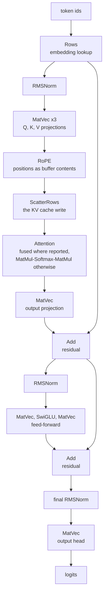
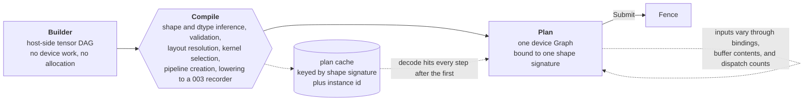

# Tensor layer

This is layer 2 of [`000-decisions.md`](000-decisions.md)'s two-layer split, and it is
the reason layer 1 has the shape it does. It is written entirely in terms of
[001](001-device-resources.md), [002](002-compute-model.md) and
[003](003-command-graph.md), and contains no backend-specific code. If anything
here needs a backend to know about tensors, this spec is wrong.

The target workload is transformer inference. Every decision below is judged
against one question: what does a token cost in a decode loop, in device work, in
host work, and in memory.

## What this layer is, and is not

It is: dtypes, shapes, views, an operator set, a host-side graph, a compile step
that lowers to a device `Graph`, and memory planning on top of 003's planner.

It is not a model runtime. File formats (GGUF, safetensors), tokenizers,
sampling policy, and multi-sequence scheduling live above this layer and are out
of scope (see [Out of scope](#out-of-scope)). This is the layer they are built
from.

## The core types

Four types carry everything.

```go
// Runtime owns the device, the pools tensors are allocated from, the compiled
// kernel cache, and the plan cache. One per device.
type Runtime struct{ ... }

// Builder records a tensor DAG on the host. It executes nothing and touches no
// device memory. One Builder belongs to one goroutine, matching 003's recorder.
type Builder struct{ ... }

// Tensor is a handle: dtype, shape, layout, and the builder node that produces
// it. It holds no data. Values exist only in device buffers after a Plan runs.
type Tensor struct{ ... }

// Plan is immutable, wraps exactly one device Graph, and is replayed per step.
type Plan struct{ ... }
```

Operators are package-level functions taking the builder first, not methods on
`Tensor`:

```go
func Add(b *Builder, x, y *Tensor) *Tensor
func MatMul(b *Builder, x, w *Tensor) *Tensor
func RMSNorm(b *Builder, x, gain *Tensor, eps float32) *Tensor
func Rows(b *Builder, table, ids *Tensor) *Tensor
```

**Why functions rather than methods.** A method set is a closed list. ollama's
`Tensor` is an interface with roughly eighty methods because each backend
supplies its own implementation, and every new operator is a breaking change to
everyone who implements it. Here there is exactly one `Tensor` implementation,
because all backend variation was already absorbed by layer 1, so an interface
buys nothing and costs extensibility. Package functions let composite operators
live in other packages with exactly the same standing as built-in ones, and let
the primitive set stay small.

The cost is real: Go has no method-call syntax for free functions, so a long
chain reads as nested calls rather than a pipeline. Model code written against
this is noisier than the equivalent ggml-style chain. That is accepted in
exchange for an operator set anyone can extend without touching this package.

**Errors are accumulated, not returned per operator.** An operator that cannot be
typed (shape mismatch, illegal view, absent capability) records the first error
on the `Builder`, captures its call site, and returns a poisoned `Tensor` that
propagates. `Compile` returns the error, naming the operator, the operand, and
the originating call site. This follows 003's rule that a build error must be
diagnosable from its message alone. The alternative, an `error` return on every
operator, makes a forward pass unreadable for a class of mistake that is always a
programming error rather than a runtime condition.

## Where this follows ollama, and where it diverges

ollama's `ml` package is the closest existing design and the right reference. Its
`Context` records with `Forward`, executes with `Compute`, and pre-plans with
`Reserve`, which is the same shape as record, submit, and memory-requirement
here. The divergences all trace to one fact: ollama sits on GGML through cgo, so
its tensor layer is a facade over a C library that already owns the graph,
allocator, and kernels. This library sits on its own cgo-free device layer, so
the tensor layer must lower to device graph nodes itself.

| Aspect | ollama `ml` | Here | Why |
| --- | --- | --- | --- |
| Record then execute | `Forward` / `Compute` | `Builder` / `Compile` / `Submit` | Same idea. This is what 003 exists to support. |
| Memory pre-planning | `Reserve` on a worst-case graph | `Plan.Memory()` after compiling the worst-case plan | Same need, but the number comes from 003's planner rather than from a C allocator. |
| `Tensor` | interface, about 80 methods | concrete struct, operators are functions | One implementation here. Backend variation is layer 1's. |
| Backend | loads a model file, `Get(name)` by tensor name | `Runtime` owns a device only | File formats are layer 3. Keeping them out is what keeps this layer backend-free and format-free. |
| Naming | `ml.Context` | `Builder` | `Context` next to `context.Context` in the same file is a genuine readability defect in Go. |
| Execution target | GGML cgraph, planned per `Compute` | device `Graph`, planned once per shape signature | The cgraph is rebuilt per call because it is cheap in C. Here the plan is cached, see [Building and running](#building-and-running). |
| Dim order | inner-first `ne[]`, inherited from GGML | outer-first row-major | See [Layout](#layout-dtypes-shapes-strides). ollama's own `Dump` reverses the shape to print it, which is the tell. |
| Quantized weights | GGML block structs | split quant and scale planes | Layer 1 types buffers by dtype (001). A struct-of-blocks buffer has no dtype. See [Quantization](#quantization). |
| Fused attention | optional `ScaledDotProductAttention` interface | `Attention` operator, capability-gated, composed fallback | Same pattern. 002 already requires every capability-gated kernel to have a portable path. |
| Operator breadth | conv, SSM, pooling, interpolate, triangular solve | transformer set only at v0 | Scope, not principle. See [Out of scope](#out-of-scope). |

## Layout: dtypes, shapes, strides

### Dtypes

The tensor dtypes are 002's buffer dtypes (`f32`, `f16`, `bf16`, `i32`, `u32`,
`i8`, `u8`) plus the quantized logical dtypes in [Quantization](#quantization).
Nothing else. In particular there is no `f64`: it exists for training numerics
and no inference kernel here wants it.

Arithmetic follows 002: narrow types are storage formats, accumulation is f32
unless the kernel explicitly asks otherwise. A dot product over 4096 elements
accumulated in f16 is wrong by a wide enough margin to change a token, so the
default has to be the sound one.

### Shape order is a guarantee, not a preference

**Dimensions are listed outer to inner, and the last dimension varies fastest.**
Row-major, like a Go multidimensional slice, like NumPy, like the model
literature. Contiguous strides are the suffix products of the shape.

Worked example. A tensor shaped `[batch, seq, heads, headDim]` stores `headDim`
contiguously; two elements adjacent in `headDim` are adjacent in memory, and
advancing `seq` by one moves `heads*headDim` elements. Its contiguous strides are
`[seq*heads*headDim, heads*headDim, headDim, 1]`.

This is a deliberate divergence from GGML's inner-first `ne[]` order, which
ollama inherits. It is called out with an example because
[`conventions.md`](../docs/conventions.md) exists precisely for convention
mismatches that present as mathematics bugs, and axis-order mismatch is exactly
that: a permuted attention score matrix is not obviously wrong, it is just
subtly wrong. A backend, kernel, or operator that assumes another order is
broken, not merely different.

Everything axis-addressed obeys this one statement: `Permute` takes a permutation
of axis indices in this order, reductions and `Softmax` name an axis in this
order and default to the last, and negative indices count from the end.

### Strides are in elements

Not bytes. Layer 1 buffers and views are typed by dtype and addressed in elements
(001), so byte strides would reintroduce dtype-width arithmetic at exactly the
boundary that was designed to remove it, and they are actively wrong for
sub-byte quantized data. ggml's byte-valued `nb[]` is a C-pointer-arithmetic
artifact.

Quantized tensors have no element strides at all; see
[Quantization](#quantization).

## Views and broadcasting

A view shares its parent's memory. A layout is a base offset plus one stride per
axis, and the set of legal layouts is deliberately restricted to those reachable
from a contiguous base by:

- slicing an axis with step 1,
- permuting axes,
- inserting or removing axes of size 1,
- broadcasting an axis of size 1 to size n, which is stride 0.

Not legal: negative strides, non-unit slice steps, and any self-overlapping
layout other than broadcast. Negative and stepped strides multiply the index
arithmetic every kernel has to handle, in exchange for reversal and striding
operations that a transformer forward pass never performs. A caller who needs one
copies.

A view with a zero stride is not writable. Writable views must be injective, or
two invocations race on one element, which 002 gives no way to order.

| Operator | Result | Note |
| --- | --- | --- |
| `Permute`, `Transpose` | view | always |
| `Slice` (step 1) | view | on any axis |
| `Squeeze`, `Unsqueeze` | view | always |
| `Broadcast` | view | stride 0, read-only |
| `Split`, `Chunk` | views | one per part |
| `Reshape` | view or build error | view when the merged or split axes are contiguous; otherwise a build error telling the caller to insert `Contiguous` |
| `Contiguous` | copy | the explicit materialization |
| `Cast` | copy | dtype conversion |
| `Concat` | copy | two buffers cannot be one view |
| `Repeat` | copy | prefer `Broadcast` where the consumer accepts it |

`Reshape` failing rather than silently copying is the same principle as
`Contiguous` being explicit in ggml and ollama: a hidden copy of an activation
tensor is a hidden bandwidth cost, and bandwidth is the entire game. Costs the
caller did not write do not appear.

### How a view reaches the device

Two mechanisms, and which one applies is decided at compile time.

1. **A contiguous subrange becomes a 001 buffer view**: offset, length, dtype.
   This covers the cases that matter structurally, one layer's slab of a KV
   cache, one expert's weight block, one sequence's rows, which is exactly what
   001 says views are for.
2. **Everything else travels as a layout descriptor**: base offset and per-axis
   strides in a small uniform buffer bound alongside the data, with the kernel
   indexing generically.

Generic indexing is slower than hard-coded contiguous indexing, so kernels come
in a contiguous fast path and a strided general path. The choice is not a runtime
branch: because a `Plan` is compiled for one concrete shape signature, every
layout in it is a compile-time constant, so the specialization is a pipeline
selection made once at `Compile`.

### Broadcasting

NumPy right-aligned rules for elementwise binary operators: ranks are padded with
leading axes of size 1, an axis of size 1 expands to match, and any other
mismatch is a build error. Broadcasting never materializes data. `MatMul`
broadcasts its batch axes only, never the two matrix axes.

## Quantization

Quantized weights are not a feature to add later. They are how inference fits in
memory, and the representation constrains every kernel that reads a weight.

**A quantized tensor is one `Tensor` with a quantized logical dtype, backed by
two or three separate plane buffers**: the quants (`i8` or packed `u8`), the
scales (`f16`), and for asymmetric schemes the zero points. Not one buffer of
GGML-style block structs.

Why split planes: 001 types every buffer by dtype, and an interleaved block
struct has no dtype, so it could only be smuggled through as an opaque byte
buffer, giving up the size and type validation that 003 does at build. Split
planes make each plane a first-class layer 1 buffer, keep both planes naturally
aligned for coalesced loads, and let a per-layer slab of a quantized weight still
be a plain 001 view of each plane.

Why one `Tensor` rather than a pair passed to every operator: a pair bifurcates
the signature of every operator that can accept a weight and doubles the operator
table for no expressive gain.

The cost, stated: a `Tensor` is no longer "one buffer view", so the internal
representation carries up to three, and importing a GGUF file requires repacking
interleaved blocks into planes. Repacking is a streaming transform at load, so
peak extra memory is one block rather than one model, but it is a full extra pass
over the weights and it means the on-device bytes are not the file bytes.

### Schemes at v0

Blocks run along the reduction axis (the last axis), block size 32, and the last
dimension must be a multiple of the block size.

| dtype | Quants | Scale | Zero point | Dequant | Bits per weight |
| --- | --- | --- | --- | --- | --- |
| `q8_b32` | `i8`, one per byte | `f16` per block | none | `w = q * s` | 8.5 |
| `q4_b32` | `u4`, two per `u8` | `f16` per block | implicit, fixed at 8 | `w = (q - 8) * s` | 4.5 |
| `q4z_b32` | `u4`, two per `u8` | `f16` per block | `f16` per block | `w = q*s + z` | 5.0 |

Quantized tensors are contiguous only. Element strides are undefined for them,
and the only legal views are slices on outer axes at block-aligned boundaries,
which is what per-layer and per-expert addressing needs and nothing more.

### Dequantization happens inside the consuming kernel

There is no pass that materializes an f16 copy of a weight. Materializing defeats
the entire purpose, which is reducing the bytes moved from device memory into the
compute units. The quantized GEMM loads a block of quants and its scale, converts
in registers, and accumulates in f32 per 002.

This means the quantized matmul is a different kernel from the f32 one, not the
f32 one with a preprocessing step. That is a real cost: each scheme multiplies
the GEMM kernel count, which is why v0 has three schemes and not ten.

An explicit `Dequantize` operator exists for debugging and as the testing oracle,
and is documented as not the fast path.

**Activations are not quantized at v0.** Weight-only quantization, activations in
f16 or f32. Activation quantization needs per-tensor dynamic scaling on the hot
path and calibration data to be accurate, and it doubles the kernel matrix again.
The memory win is in the weights; the activation win is throughput, and
throughput work comes after a competitive GEMM.

## The operator set

Enough for a transformer forward pass, and nothing speculative. "Primitive" means
it has its own kernel; "composed" means it is built from primitives on the host
and has no kernel of its own.

### Elementwise

| Operator | Kind | Note |
| --- | --- | --- |
| `Add`, `Sub`, `Mul`, `Div` | primitive | broadcasting binary, one kernel family |
| `Scale`, `AddScalar` | primitive | scalar arrives as buffer contents, so it varies without recompiling |
| `Neg`, `Sqr`, `Sqrt`, `Exp`, `Recip` | primitive | unary map family |
| `Clamp`, `Where` | primitive | |
| `Cast` | primitive | dtype conversion, includes dequantize |

### Activations

| Operator | Kind | Note |
| --- | --- | --- |
| `SiLU`, `GELU`, `ReLU`, `Sigmoid`, `Tanh` | primitive | unary map family, one kernel per function |
| `SwiGLU`, `GEGLU` | primitive (fused) | activation and gate multiply in one kernel, because the unfused form reads and writes the activation twice |
| `Softplus`, `QuickGELU` | composed | rarely on a hot path |

### Normalization

| Operator | Kind | Note |
| --- | --- | --- |
| `RMSNorm` | primitive | workgroup reduction, per 002 |
| `LayerNorm` | primitive | mean and variance in one pass |
| `L2Norm` | composed | from `Sum` and `Mul` |

### Matrix multiplication

| Operator | Kind | Note |
| --- | --- | --- |
| `MatMul` | primitive | tiled, shared memory, f32 accumulate. The motivating kernel of 002. |
| `MatMulQ` | primitive | quantized weight operand, one per scheme, dequant in the inner loop. Selected automatically by `MatMul` from the weight dtype. |
| `MatVec` | primitive | the decode-step shape, `M = 1`. A separate kernel because the tiled GEMM is bandwidth-bound and badly shaped here. |
| `MatMulID` | primitive | gathered weight selection for mixture of experts, indices as data |
| `Linear` (matmul plus bias) | primitive (fused epilogue) | bias add is free in the epilogue and costs a full pass separately |

### Reduction

| Operator | Kind | Note |
| --- | --- | --- |
| `Sum`, `Max`, `Min` over an axis | primitive | workgroup reduction, subgroup path where reported (002) |
| `Mean`, `Variance` | composed | from `Sum` |
| `ArgMax`, `TopK` | primitive | sampling support, small k |
| `CumSum` | primitive | scan, needed for sampling |

### Shape

| Operator | Kind | Note |
| --- | --- | --- |
| `Reshape`, `Permute`, `Transpose`, `Slice`, `Split`, `Squeeze`, `Unsqueeze`, `Broadcast` | none | pure layout, no device work at all |
| `Contiguous` | primitive | strided copy |
| `Concat`, `Repeat`, `Pad` | primitive | strided copy variants |

### Indexing

| Operator | Kind | Note |
| --- | --- | --- |
| `Rows` | primitive | embedding lookup, gathers rows by index, dequantizes on the fly if the table is quantized |
| `ScatterRows` | primitive | the KV cache write |

### Attention

| Operator | Kind | Note |
| --- | --- | --- |
| `RoPE` | primitive | position encoding, positions arrive as buffer contents |
| `Softmax` | primitive (fused) | with optional scale, additive mask, and causal flag, because a separate mask add costs a full read-modify-write of the score matrix |
| `Attention` | primitive (fused) where reported, composed otherwise | the fused kernel avoids materializing the full score matrix; the composed form is `MatMul`, `Softmax`, `MatMul` and is the oracle for the fused one |

A transformer decode step uses exactly this, and the list is the acceptance
criterion for this section:



Everything between `Rows` and the final norm repeats once per layer, which is
where the node count that motivates
[`000-decisions.md`](000-decisions.md) decision 1 comes from: a hundred or so
operations per layer, dozens of layers, rebuilt per token under a one-shot
encoder and built once here.

## Building and running

This is the crux of the spec: the tensor graph is built dynamically in Go, while
003's device `Graph` is immutable and planned once. They reconcile through a
compile step and a cache.

### The pipeline



`Compile` does, in order: shape and dtype inference, validation, layout
resolution, kernel selection (specialization, capability paths, fused operator
choice), pipeline creation, and lowering to a 003 recorder. Building the device
graph then performs 003's own work: validation, memory planning, and barrier
computation. All of it once.

### A Plan is bound to a shape signature

Nothing about a `Plan` is shape-polymorphic. Its shape signature is the concrete
shape and dtype of every input. This falls directly out of 003: workgroup counts,
transient sizes, and layout specializations are all baked into an immutable
graph.

The reconciliation is a **plan cache keyed by shape signature**, and it works
because the signature space of an inference loop is tiny:

- Decode is always one token per sequence, so the decode signature is constant
  and the cache hits every step after the first.
- Prefill is bucketed to a small ladder of token counts (32, 64, 128, 256, 512),
  with the tail padded and masked out. Bucketing trades a bounded amount of
  wasted work for a bounded number of plans.

The cache is per `Runtime`, and its size is a caller-visible number, because each
plan owns a transient pool (see [Memory planning](#memory-planning-and-the-kv-cache)).
The cache key is the shape signature plus a caller-supplied instance id, defaulted
to zero. The instance id exists because of the one-in-flight rule in
[Lifetime and concurrency](#lifetime-and-concurrency): a server wanting N
concurrent requests asks for N instances of the same signature and gets N plans
with N transient pools, rather than N references to one plan it may not submit
concurrently.

### What varies without recompiling

003 permits exactly three kinds of variance, and everything an inference loop
needs maps onto them:

| What varies per step | 003 mechanism | Example |
| --- | --- | --- |
| Token ids, positions, mask, current cache length, KV write index, RoPE base, softmax scale | buffer contents | one small per-step parameter buffer plus the input buffer |
| Weight set, KV cache slab, output buffer | bound resources | selecting a sequence's cache in a batched server, swapping an adapter |
| Work proportional to current cache length | dispatch count | attention dispatches over `ceil(len/tile)` tiles rather than over capacity |

**The KV write offset arrives as buffer contents, not as a rebound view.** Both
are legal under 003, and the choice matters. Rebinding a view per token means
updating two bindings per layer per step, 128 binding updates per token for a
64-layer model, plus the view objects to hold them. Passing the write index as a
`u32` in the parameter buffer costs one small upload and lets the scatter kernel
compute the address. The rebinding route stays available at the granularity it
suits, per submission, for selecting which sequence's cache a plan runs against.

**Dynamic dispatch counts here are host-supplied.** The host knows the current
cache length at submit time, which is 003's third variance and nothing more.
Device-written indirect dispatch is a separate feature, open in both
[002](002-compute-model.md) and [003](003-command-graph.md), and this spec does
not depend on it or resolve it.

### What one token costs

After warm-up, a decode step is: write ids and parameters into the upload buffer,
submit the cached decode plan, wait on the fence, read logits from the readback
buffer. No graph building, no shape inference, no pipeline creation, no barrier
computation, no memory planning, and no allocation in the tensor layer.

That is the payoff of decision 1. ollama rebuilds a ggml cgraph on every
`Forward` and lets ggml re-plan, which is affordable in C and would not be
affordable here; instead the work happens once per bucket.

### What forces a new plan

A new shape signature, a different dtype, or a structural change: adding an
adapter path, turning fused attention on or off, changing the operator graph at
all. 003 says plainly that a different set of nodes is a different graph and that
callers with dynamic structure cache graphs by shape. This layer is that caller.

Data-dependent *values* never force a recompile. Mixture-of-experts routing is
the interesting case and it stays static: `MatMulID` takes routing indices as
data, so the graph shape is fixed while the experts selected vary per token.
Data-dependent *structure* (early exit, a device-decided loop count) is not v0,
and is the same open question 003 already carries.

## Memory planning and the KV cache

Three classes of memory, with different rules.

| Class | Owner | Aliased | Lifetime |
| --- | --- | --- | --- |
| Weights | caller | never (001, 003) | the runtime's |
| Persistent state (KV cache) | caller | never | the session's |
| Transients (activations) | the plan | yes, by 003's planner | within one submission |

Transients are why 003 plans live ranges and aliases. A 32-layer forward pass has
hundreds of intermediate tensors and the peak live set is a small handful of
them, so aliasing is the difference between a model that fits and one that does
not.

`Plan.Memory()` reports the peak transient requirement before any submission.
This is 003's exposed requirement and it is the analogue of ollama's `Reserve`.
The procedure for sizing a machine is: compile the worst-case plan (the largest
prefill bucket) first, ask it, then decide how much is left for the cache.

The number is per device, not per model. Kernel selection changes the transient
set: composed `Attention` materializes the full score matrix and the fused one
does not, so the same model at the same shapes has a different peak on a device
without the fused-attention capability. Size against the device that will run it.

### Sizing a KV cache in advance

The cache is allocated up front at full capacity and never grows. Capacity is a
caller decision, running past it is a caller error reported clearly, and this
follows 001's lean toward fixed pools with the requirement reported in advance.

$$
\text{bytes} = 2 \cdot L \cdot H_{kv} \cdot d_{head} \cdot S_{max} \cdot \text{sizeof}(\text{dtype})
$$

where $L$ is the layer count, $H_{kv}$ the number of key-value heads, $d_{head}$
the head dimension, $S_{max}$ the context capacity, and the leading factor of two
is keys and values.

A 32-layer model with 8 key-value heads, head dimension 128, 4096 tokens of
context, in f16:

$$
2 \cdot 32 \cdot 8 \cdot 128 \cdot 4096 \cdot 2 = 536{,}870{,}912 \ \text{bytes} = 512 \ \text{MiB}
$$

Note that it is linear in context length, so the same model at 32k context needs
4 GiB of cache, which is why the quantized-cache question below is worth more than
any activation optimization. The library exposes this as a function of a cache configuration so
the caller gets the number without transcribing the formula.

Layout: two buffers, keys and values, each shaped `[layers, maxSeq, kvHeads,
headDim]`. One layer's slab is a contiguous subrange, so it is a plain 001 buffer
view, which is what makes per-layer addressing free. Two buffers rather than one
per layer, because 001 is explicit that pools exist so that thousands of
allocations do not.

Paged or block-allocated caches, which is what a server with many short sequences
actually wants, are out of scope for v0 and are the first thing to add for
multi-sequence serving.

## Fusion

**v0 fuses by authorship, not by analysis.** The fused operators are the ones
named as fused in the operator table: `RMSNorm`, `LayerNorm`, `Softmax` with
scale and mask, `SwiGLU`, `Linear` with bias, `Attention`, and dequantization
folded into the quantized GEMM (which is not a fusion at all, it is how the
kernel is written). There is no pattern matcher and no automatic rewriting.

**What the graph shape makes possible later.** Because the whole tensor DAG
exists on the host before anything is lowered, a fusion pass is a pure host-side
rewrite with no device involvement: recognizing an elementwise chain, or
recognizing the composed attention pattern and substituting the fused kernel, is
graph surgery before `Compile` reaches the recorder. Decision 5's Go-subset
kernel compiler could in principle emit a fused elementwise kernel for an
arbitrary chain.

**Why not at v0.** Automatic elementwise fusion means generating and compiling
shader code at runtime, which adds compile latency to the first token and adds a
code generation path that must be exactly correct on every backend, and it needs
a cost model to decide when fusing is a loss. If kernel compilation stays ahead
of time, runtime fusion is not an unimplemented pass, it is a new capability the
kernel compiler does not have. None of that is worth doing before a competitive
GEMM exists, and [`000-decisions.md`](000-decisions.md) is explicit that the GEMM comes
first. Authored fusion captures most of the available win in a transformer
because the profitable fusions are a short, known list.

The honest cost of authored fusion: the operator count grows, and every fused
operator has to keep its unfused decomposition alive as a testing oracle.

## Capabilities and dtype policy

Two different things, and conflating them would violate decision 6.

**A requested dtype the device does not support is a `Compile` error**, naming the
dtype, the capability, and the device. There is no silent promotion of f16 to
f32. A silent promotion doubles memory traffic and changes the memory
requirement the caller already sized against, and it turns "why is this slow"
into a mystery, which is the same failure mode 001 rejects for device selection.
A caller who wants the best dtype a device runs well asks the runtime and gets a
typed answer.

**An optional capability with a portable path is a kernel selection, not a
fallback.** Subgroup reductions, fused attention, and atomic float add all have
required no-capability paths per 002, and `Compile` picks one for the target
device. The results agree within the stated tolerance. This is selection within a
device the caller already chose, not the silent device fallback 001 forbids, and
`Plan` reports which paths it selected so nobody has to guess which ran.

## Lifetime and concurrency

`Runtime`, `Plan`, and caller buffers have an explicit `Close`, per 001. Nothing
is finalizer-managed.

`Plan.Close` releases the plan's transient pool and its pipelines. `Tensor`
handles a `Builder` produced are dead once `Compile` returns: they name nodes in
a built graph, not memory, and using one with another `Builder` is an error. A
`Builder` belongs to one goroutine, matching 003's recorder.

**One in-flight submission per `Plan` at v0.** 003 permits a device `Graph` to be
submitted concurrently from several goroutines, and that permission is real, but
it holds for graphs whose transients are not shared between submissions. A
`Plan`'s transients are aggressively aliased into one pool, so two overlapping
submissions of the same plan would race on activation memory. The restriction is
documented rather than detected only in production. A server wanting N concurrent
requests compiles N plans, at the cost of N transient pools; giving one plan N
transient sets is deferred (see [Open questions](#open-questions)).

## Out of scope

**Autodiff and training**, per [`000-decisions.md`](000-decisions.md). What would have
to change is not a list of extra operators:

- Every operator needs a backward rule, which roughly doubles the operator set
  and adds operators with no forward use.
- Forward transients must survive until backward consumes them, which removes
  most of the live-range disjointness that 003's aliasing depends on. The memory
  model changes shape, it does not merely grow.
- Gradient accumulation needs either atomics or a deterministic reduction order,
  and 002 makes atomic float add a capability rather than a guarantee.
- In-place operators become illegal wherever the overwritten value is needed for
  a backward pass, so several v0 kernels would need non-mutating variants.

That is a different design, which is why it is not a flag on this one.

Also out of scope at v0, with the reason:

| Not in v0 | Why |
| --- | --- |
| Model file formats and tokenizers | layer 3, and format-specific |
| Sampling policy and multi-sequence scheduling | above this layer, uses it |
| Convolution, pooling, interpolation, `im2col` | vision models, a separate operator family with its own memory behaviour |
| State-space scan (`SSMScan`) | Mamba-family models, worth doing after transformers work |
| Paged KV cache | needed for many-sequence serving, not for a single session |
| Activation quantization | needs calibration and dynamic scaling, doubles the kernel matrix |
| Sparse tensors | no inference path here needs them yet |
| Multi-device and tensor parallelism | 001 already scopes to one device per instance |
| Autotuning kernel parameters | needs a benchmark harness and a persistent cache; fixed heuristics at v0 |

## Open questions

- **Prefill buckets multiply transient pools.** Each plan owns its own pool, so K
  buckets cost K pools until 003's cross-graph aliasing question is answered.
  With five buckets and a 200 MiB peak, that is a gigabyte of transients for a
  model whose activations need 200 MiB. The mitigation not chosen is a single
  plan at the maximum bucket with masking, which costs wasted work on short
  prompts in exchange for one pool. Leaning toward pool sharing across plans
  compiled from one runtime, which 003 has to permit first.
- **Whether GEMM accepts a strided reduction axis.** The current decision is that
  both operands must have unit stride on the reduction axis, so a transposed
  weight needs either an explicit `Contiguous` or a transposed layout chosen at
  load. A general strided tile loader roughly doubles the GEMM kernel matrix. The
  unresolved part is how much the explicit copy actually costs for attention's
  key transpose in the decode shape, where the tensor is small but the copy is
  per step.
- **Whether dynamic dispatch counts lower cheaply on every backend.** If a
  backend bakes counts into its native replayable object, cache-length
  proportional dispatch degrades to either recompilation or masking to full
  capacity, and attention's cost model changes with it. 003 leaves per-backend
  lowering open; this is where that openness reaches layer 2.
- **Whether the KV cache should be quantized.** It is the largest single
  allocation in a long-context session, so q8 halving it is worth more than any
  activation optimization. The difficulty is that it puts a quantize on the write
  path every token and the error accumulates across the sequence, unlike weight
  quantization where the error is fixed at load and measurable once.
- **Whether accumulated errors with poisoned tensors are diagnosable enough.**
  Chosen for readability, but it only works if the captured call site is as
  informative as an immediate error would have been. If in practice the first
  error's site is not enough to locate the mistake, this decision is wrong and
  operators should return errors.
- ~~**The numerics contract across backends.**~~ **Answered by
  [008](008-numerics.md).** Bitwise f32 equality is indeed not achievable when the
  reduction order differs, and the resolution is that no per-operator tolerance is
  chosen at all: a reduction of length K is compared against the error bound its
  evaluation order implies, computed by the harness from K, against an f64
  reference. A tiled GEMM and a naive loop are then two orders both required to
  lie within their own bound, rather than being compared to each other. What
  remains open there and matters here is whether an f64 host reference is tight
  enough at very large K, which transformer shapes do not reach.

## Testing

### The oracle chain

[`000-decisions.md`](000-decisions.md) decision 3 calls the CPU backend the correctness
oracle, and for cross-backend divergence it is exactly that. But decision 5 means
the CPU backend runs the *same kernel source* as every GPU backend, so it is not
an independent check on the mathematics: a kernel with a wrong formula is wrong
identically everywhere, and cross-backend parity passes. The testing strategy is
built around that distinction.

1. **Per kernel, against an independent reference.** Every primitive is checked
   against a naive implementation written separately in the test, not derived
   from the kernel source. This is the level that catches wrong mathematics, and
   it is the level the CPU backend cannot provide by itself.
2. **Cross-backend, against the CPU backend.** Every GPU backend against CPU:
   exact for `i32` and `u32`, within a stated tolerance for f32 (reduction order)
   and f16. This is the level that catches the convention divergences in
   [`conventions.md`](../docs/conventions.md).
3. **Fused against composed.** Every fused operator against its unfused
   decomposition on the same backend. `Attention` against `MatMul`, `Softmax`,
   `MatMul` is the important one.
4. **Views against materialization.** Every view-producing operator checked by
   `Contiguous` plus a naive indexed reference, and `Broadcast` against explicit
   `Repeat`.
5. **Whole model, against a golden.** A small transformer (two layers, small
   dimensions, fixed pseudorandom weights) with committed reference logits.

### Specific cases

- **Incremental decode equals prefill.** Decoding N tokens one at a time produces
  the same logits, within tolerance, as a single prefill of the same N tokens.
  This is the strongest single test in the suite: it exercises the cache write
  index, the mask, position encoding, and dispatch-count dynamism together, and
  almost any mistake in that arrangement breaks it.
- **Plan cache transparency.** A freshly compiled plan and a cached replayed plan
  give identical results, and a plan submitted N times with N different inputs
  matches N single-shot runs.
- **Memory planning.** `Plan.Memory()` equals the pool high-water mark actually
  used, and a plan whose transient live ranges are disjoint reports less than the
  sum of its transients.
- **Quantization.** Dequantize round-trips within each scheme's error bound;
  quantized matmul agrees with an f32 matmul over the dequantized weights within
  tolerance; the per-scheme error is reported as a number so a regression shows
  up as a measurement rather than a pass or fail flip.
- **Capability gating.** A device without f16 rejects an f16 plan with an error
  naming the capability and the device, and never promotes silently.
- **Layout.** A tensor built as `[batch, seq, heads, headDim]` has the strides
  this spec states, and a permuted view read back element by element matches the
  reference indexing. Axis order is a guarantee, so it gets an explicit test.
- **Determinism.** The same inputs on the same backend produce bitwise identical
  outputs across runs and across repeated submissions of one plan.
- **Concurrency restriction.** Two overlapping submissions of one plan are
  reported, not silently raced.
