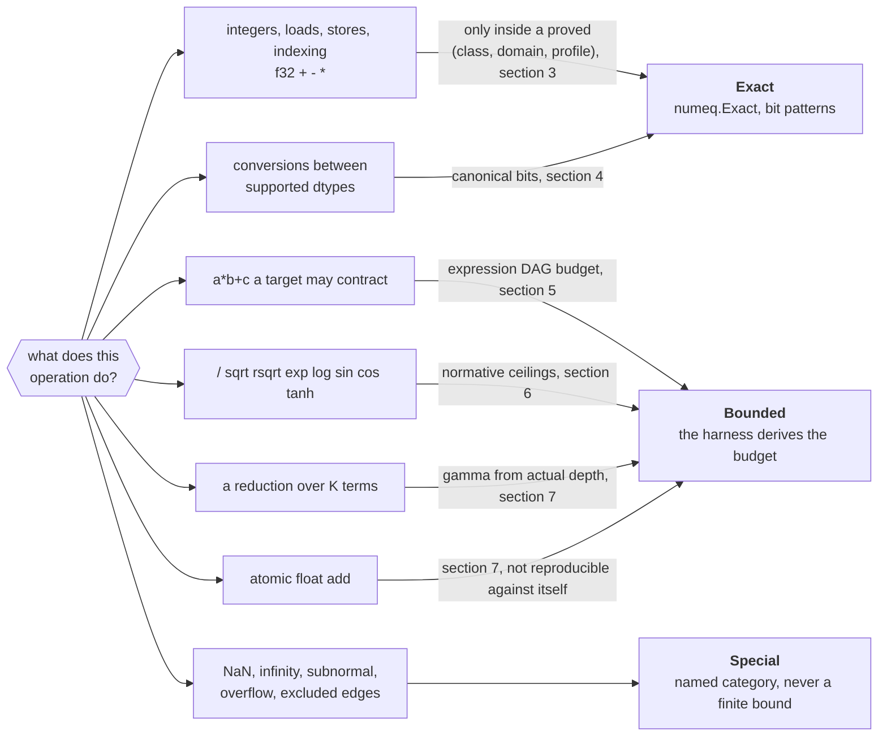

# Numerics

This spec defines what a conformance test may assert when a kernel runs on two
backends. A tolerance is never selected after observing a failure. Exactness is
limited to operations and input domains for which the implementation establishes
bit identity; every other comparison uses a normative primitive ceiling and a
problem-size-derived error budget.

[`011-conformance-harness.md`](011-conformance-harness.md) implements this
contract. Operator and model tests compose these primitive budgets rather than
inventing a separate tolerance.

## 1. Comparison tiers

| Tier | Meaning | Assertion |
| --- | --- | --- |
| **Exact** | Bit-identical within the operation's stated portable domain. | Compare bits, including signed zero where the operation promises it. |
| **Bounded** | Distance from a higher-precision reference is no greater than the derived budget. | Compare absolute error and report budget ingredients. |
| **Special** | NaN, infinity, subnormal, overflow, or an excluded integer edge. | Assert the separately specified category/canonical bits; never feed it through an ordinary finite bound. |

There is no “close enough” tier. A primitive without an exact proof or normative
ceiling cannot be used by a conformance-tested kernel.



## 2. Operation classes

The letters retain 004's meanings, narrowed where 004's summary was too broad.
This table is normative.

| Class | Contents | Contract |
| --- | --- | --- |
| **A** | Integer operations, loads/stores/indexing, comparisons; proven f32 `+`, `-`, `*` with fixed order and no contraction | Exact within §3 |
| **B** | Implicitly contractible `a*b+c`; explicit `accel.FMA` | Implicit form bounded by §5; explicit FMA exact within §3 when the target exposes correctly rounded FMA |
| **C** | f32 division/reciprocal, `sqrt`, `rsqrt`, `exp`, `log`, `sin`, `cos`, `pow`, `tanh` | Bounded by normative per-operation ceilings and domains in §6 |
| **D** | Conversions between supported scalar dtypes | Exact canonical conversion in §4 |
| **E** | Atomic float add | Bounded reduction and non-deterministic against itself |
| **R** | Reductions and dot products | Bounded from the actual reduction depth in §7 |

Classes A–E match 004's emitter metadata. R is a harness-level algorithm class,
not a new scalar instruction class. A class cannot silently change by backend.

## 3. Exact portable domains

### Integer operations

Exact integer operations are 32-bit wrapping add, subtract, and multiply;
bitwise operations; comparisons; and shifts with a count in `[0,31]`. Integer
division is exact only for a non-zero divisor and excludes signed
`MinInt32 / -1`. Narrowing conversions follow §4. Out-of-range indexing and the
excluded division/shift cases are build errors or strict-mode execution errors,
not numeric comparisons.

### f32 add, subtract, and multiply

Class-A f32 arithmetic is exact across a pair of backends only when all of these
hold:

1. input bit patterns are finite;
2. strict mode has applied the same subnormal policy to both inputs;
3. the mathematical result is finite and either zero or normal;
4. evaluation order is fixed and every language-level rounding point is emitted;
5. contraction is forbidden; and
6. both backend probes have established round-to-nearest-even for the operation.

If any condition is absent, the test is Special or Bounded; `numeq.Exact` refuses
the comparison. Exactness is a property of `(class, domain, backend profile)`,
not of the Go operator spelling.

## 4. Conversions and special values

Conversion tests compare output bits. The conversion contract from 002 is made
fully testable by canonicalizing narrowing NaNs:

| Conversion | Finite rule | NaN rule |
| --- | --- | --- |
| f32 to f16 | round-to-nearest-even; overflow to signed infinity | canonical quiet `0x7e00` |
| f32 to bf16 | round-to-nearest-even | canonical quiet `0x7fc0` |
| f16/bf16 to f32 | exact widening | preserve the source quiet-NaN sign/payload bits where representable |
| float to integer | round toward zero, saturate; out-of-range clamps | NaN becomes zero |
| integer narrowing | low bits, wrapping | n/a |

Signed zero is preserved by storage and conversion. Arithmetic tests for signed
zero live in the Special suite because targets can differ in zero-sign selection
for cancellation even when their ordinary finite results agree.

NaN payloads are **not** a general cross-backend guarantee. Arithmetic special
tests assert `isNaN`, not payload identity. Infinity production, subnormal
preservation/flush, divide-by-zero, zero-over-zero, and overflow each have named
cases in the backend profile. Strict and permissive modes are never compared to
one another.

## 5. Contraction

The emitter forbids implicit contraction wherever the target permits it: explicit
f32 rounding points in generated Go, `-ffp-contract=off` or the verified Metal
equivalent, SPIR-V `NoContraction`, and HLSL `precise`. A per-target probe uses
inputs for which fused and unfused evaluation differ and records which class is
available before another numeric test runs.

Where contraction cannot be forbidden, the harness compares both implementations
to a higher-precision evaluation of the actual expression. It does not use a
single “terms” count. Generated metadata describes the multiply-add expression
DAG, and the budget propagates each product-rounding error through later
operations using §8. The local product contribution is at most half an f32 ULP
for a finite normal product; final rounding and later-operation contributions are
added separately. Overflow and subnormal products go to the Special suite.

An explicit `accel.FMA` requests one fused, correctly rounded operation. A target
that cannot meet that contract rejects the kernel rather than lowering it to a
multiply and add.

## 6. Normative primitive ceilings

The ceiling is the library contract; measurement only proves that an
implementation meets it. A backend whose measured worst case exceeds a ceiling
does not join conformance until it uses a more accurate lowering or rejects that
primitive.

For v0, over finite inputs and finite normal-or-zero results:

| Primitive | Domain | Normative ceiling |
| --- | --- | --- |
| f32 `/`, reciprocal | non-zero normal denominator | 2.5 ULP of correctly rounded f32 |
| `sqrt` | finite `x > 0` after the backend profile's input-subnormal policy; correctly rounded result normal | at most one representable f32 step from the correctly rounded result; zero is Special |
| `rsqrt` | `x > 0` normal | 4 ULP |
| `exp` | result finite and normal | 4 ULP |
| `log` | `x > 0` normal | 4 ULP |
| `tanh` | finite x | 4 ULP |
| `sin`, `cos` | finite `abs(x) <= 2^16` | absolute error at most `2^-20` |

The sin/cos domain covers v0 RoPE positions and bases only while the generated
maximum angle remains within `2^16`; `Compile` rejects a larger declared
capacity/domain. `pow` is not required by the v0 tensor kernel corpus and has no
portable ceiling yet. A later spec must state its argument domain and ceiling
before admitting it. Trigonometric tests use an absolute bound because argument
reduction dominates and a ULP count near zero is not meaningful.

The `sqrt` ceiling is deliberately a library quality target, not the weakest
accuracy promised by every shader language. For an admitted input bit pattern
`x`, let `r` be the round-to-nearest-even f32 value of the exact real square
root. The result must be `r` or either immediately adjacent finite f32 value;
equivalently, its ordered-bit ULP distance from `r` is at most one. This
definition remains unambiguous at binade boundaries, where the absolute sizes of
the two neighboring steps differ. Positive f32 inputs cannot produce a
subnormal square root. `sqrt(+0)` must produce `+0`; `-0`, negative inputs,
infinities, and NaNs belong to named Special-tier cases.

One ULP is the v0 compromise for CPU and Metal. Requiring `r` exactly would turn
rare double-rounding or compiler/library differences into portability failures
without improving the tensor-model contract. Allowing two or more representable
steps would weaken the test enough to hide an accidental approximate lowering
such as `x * rsqrt(x)`. The Metal emitter therefore uses the precise `sqrt`
operation with fast-math transformations disabled and must not substitute a
reciprocal-square-root sequence. The CPU lowering uses its most accurate native
operation: after profile preprocessing it evaluates
`float32(math.Sqrt(float64(x)))`, making the f32 rounding point explicit. Each
lowering must pass the committed oracle corpus; a future backend that cannot meet
the ceiling must emit a corrected implementation or reject the primitive.

Ceilings are checked against correctly rounded reference values generated with a
higher-precision oracle. The committed conformance corpus contains input bits and
reference bits produced at at least 256-bit precision. Runtime CI therefore does
not depend on MPFR, while the corpus generator records its oracle version and is
reproducible.

A dense probe over the exponent/domain range plus hard cases reports maximum
observed ULP as **regression evidence only**. It never becomes the ceiling and is
never used to make the same run pass. Results belong in generated test artifacts;
`conventions.md` may summarize them but is not executable configuration.

## 7. Reductions and dot products

For f32 summation of $K$ finite terms with unit roundoff $u = 2^{-24}$, a
sequential path uses

$$
\gamma(n) = \frac{n u}{1 - n u},
\qquad
\text{budget} = \gamma(K-1) \sum_{i=1}^{K} |x_i|
$$

provided $(K-1)u < 1$ and no intermediate overflows. The count is $K-1$ because
$K$ terms take $K-1$ additions. A balanced pairwise tree of maximum path depth
$d$ uses $\gamma(d)$, which is why a workgroup tree reduction is more accurate
than a sequential loop rather than less. The kernel metadata records its maximum
actual addition depth; the harness does not infer “tree” from a name.

A dot product adds multiplication error for every product unless the product is
an exact class-A multiplication or explicit FMA. The reference computes exact
products and their sum at higher precision. GEMM applies the dot-product budget
per output element using that element's K and `sum(abs(a_i*b_i))`.

f16-storage kernels are defined over the values represented by the bound f16
bits. The higher-precision reference widens those stored values exactly, so no
input-conversion error is added. If a separate test begins with f32 source values
and tests quantization to f16, that conversion is a class-D operation tested
before the reduction; the two questions are not mixed.

Atomic f32 addition uses the sequential `gamma(K-1)` bound because its order is
unknown. It is excluded from same-backend determinism tests. Integer atomics
remain exact.

## 8. Composed operator budgets

Primitive bounds compose by forward absolute-error propagation. For a computed
value `y = f(x_1...x_n)`, the harness evaluates a higher-precision reference and
adds

```
local primitive error + sum_i(sensitivity_i * inputBudget_i)
```

where `sensitivity_i` is a conservative bound on `abs(df/dx_i)` over the interval
`reference_i +/- inputBudget_i`. Reduction nodes add §7's magnitude bound. Casts
round the interval outward to the destination format. The harness records each
term so a failed model comparison identifies the operator that spent the budget.

For v0:

- elementwise functions use analytic derivative bounds over each actual input
  interval;
- RMSNorm and Softmax references expose their max/reduction/normalization
  intermediates, so their reduction and transcendental contributions are
  composed rather than hidden in one tolerance;
- MatMul/Linear use the per-output dot-product budget;
- composed Attention propagates score MatMul, Softmax, and value MatMul budgets;
- a fused kernel must fit the same composed budget as its semantic definition;
  and
- the golden model composes the per-operator budgets along the exact model DAG.

If an interval crosses a singularity or a derivative bound is unavailable, the
harness refuses the comparison. The test must narrow its input domain or add a
new proved operator rule. This is intentionally stricter than a global relative
tolerance.

## 9. Comparison API

The harness makes class, backend profile, and reference domain explicit. The
package is `numeq`, not `cmp`: a conformance file comparing numbers is exactly
the file most likely to also want the standard library's `cmp` or `go-cmp`, and a
shadowed import in a test that is already about subtle numeric differences is a
bad trade for three saved characters.

```go
type Context struct {
	Backend BackendProfile
	Oracle  OracleID
}

numeq.Exact(t, ctx, numeq.ClassA, got, want, domain)
numeq.Special(t, ctx, caseID, got, wantCategory)
numeq.Division(t, ctx, got, highPrecisionWant)
numeq.Primitive(t, ctx, numeq.Exp, got, highPrecisionWant)
numeq.Reduction(t, ctx, got, reference, numeq.Sequential(K), magnitudes)
numeq.Operator(t, ctx, got, reference, budgetTrace)
```

There is no public tolerance parameter. Every failure reports backend/device,
class, input index, got/reference bits, absolute and ULP error, allowed budget,
and the budget trace. `numeq.Exact` fails immediately if the backend profile has
not proved that class/domain exact.

A static check rejects direct approximate-comparison helpers and numeric
tolerance arguments in conformance tests. Golden input/reference bit patterns and
mathematically exact constants are allowed; the check targets comparison call
sites rather than banning every float literal.

## 10. Open measurements

- Verify contraction control and class-A rounding on CPU arm64, CPU amd64, and
  Metal before M4 and M6 claim their respective exact domains.
- Measure v0 division and transcendental primitives across the required corpus;
  a miss changes the lowering or supported domain, not the ceiling.
- Establish a domain and normative ceiling for `pow` before a kernel corpus adds
  it, and revisit the bounded sin/cos domain before supporting larger RoPE angles.
- Revisit exact/high-precision reduction infrastructure before K approaches
  `1/u`; v0 transformer shapes are far below it.

## 11. Testing this contract

- Probe fused versus unfused evaluation on every target and both CPU
  architectures before enabling class A/B metadata.
- Assert every conversion boundary and halfway case by bits, including canonical
  narrowing NaNs, signed zero, saturation, and bf16 round-to-nearest-even.
- Unit-test `gamma` and composition arithmetic against exact rational or
  high-precision results, including K=0/1, cancellation, overflow rejection, and
  tree depths that are not powers of two.
- Test budgets monotonically: a synthetic result at the budget passes and the
  next representable value beyond it fails. Do not require a naturally rounded
  summation to exhibit a non-zero fraction of its worst-case bound.
- A deliberately wrong reduction adds an error greater than its computed budget
  plus one output ULP and must fail.
- Check every normative primitive ceiling over the committed high-precision
  corpus; separately record maximum observed ULP as regression telemetry.
- For positive normal-reference `sqrt` cases, assert that `r` and each finite
  adjacent f32 value pass and that the second representable value on either side
  fails. Assert `sqrt(+0)` is exactly `+0` and all other excluded cases route to
  `numeq.Special`. Include a committed adversarial input for which an
  `x * rsqrt(x)` lowering exceeds the one-step ceiling.
- Inspect the generated Metal artifact and compile options: `sqrt` must remain a
  precise operation, fast-math transformations must be disabled, and no
  reciprocal-square-root sequence may replace it.
- Force a backend profile without class-A proof and assert `numeq.Exact` refuses.
- Ensure composed Softmax, RMSNorm, MatMul, Attention, and golden-model budget
  traces are stable and every injected primitive error is attributed.
- Mechanically reject ad hoc tolerance APIs in the conformance corpus.
