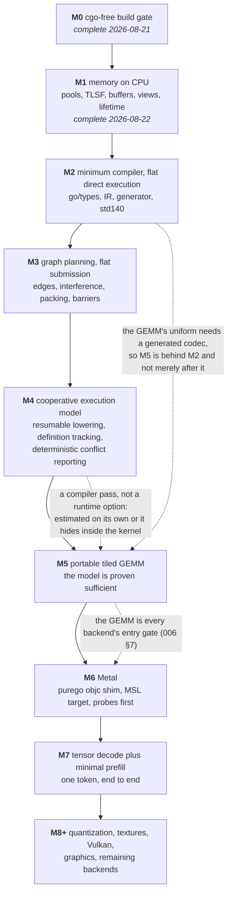

# Sequencing

This spec orders demonstrable increments. A milestone is complete only when its
tests, coverage, documentation, and E2E gate are present; declarations that panic
with `ErrNotImplemented` are scaffolding, not progress against a definition of
done.

The document changes as work lands. Completed milestone outcomes remain recorded
so the assumptions under which later work began are reviewable.

## Cross-milestone quality gates

Every implementation milestone after M0 must satisfy all of these:

- new behavior has a test that fails without it;
- the affected package has greater than 90% statement coverage on the CPU path;
- generated files are fresh under `go generate ./...` once generation exists;
- `go test -race ./...`, `go vet ./...`, `gofmt`, and the cgo-free gate pass;
- the library builds for every supported `GOOS`, not only the host's, which
  starts mattering at M6 because Metal code is `//go:build darwin` and a Mac
  stops proving the other platforms still compile;
- every public API added or changed is documented for a builder audience; and
- the milestone's named E2E runs through public APIs, not internal shortcuts.

Backend-specific code may be unreachable on the CPU, so its line coverage is not
used to dilute or fail the CPU package threshold. It is instead covered by its
backend entry-gate integration tests and target compiler acceptance tests.

[`011-conformance-harness.md`](011-conformance-harness.md) owns common test
execution, comparisons, capability forcing, fuzzing, and coverage reporting.
[`010-kernel-corpus.md`](010-kernel-corpus.md) owns the required kernels and
variants. Neither is a final milestone: both grow incrementally when their first
consumer lands.

## Milestones

The dotted edges are the ones the numbering does not show, and they are why §1
exists.

### M0. The cgo-free build gate — complete 2026-08-21

Shipped: `.github/workflows/ci.yml` builds, vets, and tests with
`CGO_ENABLED=0` on Linux, macOS, and Windows; checks formatting; and rejects
`import "C"` across Go files.

Implements: [`000-decisions.md`](000-decisions.md) decision 2.

Outcome: the non-functional device API surface compiles on all three v0 host
platforms and the cgo-free constraint is mechanically enforced. There were no
runtime tests because all operations remained design-stage stubs. The workflow's
negative cgo check is the acceptance test for this milestone.

### M1. Memory on the CPU backend — complete 2026-08-22

Build:

- CPU enumeration/open, device identity, capabilities, and limits;
- general TLSF and linear allocators;
- pools, buffers, typed views, `ViewAs`, lifetimes, and retain sets; and
- synchronous buffer read/write plus recorded host/device copy data ownership.

Implements: 001 §§1–3 and §§5–8, excluding textures.

Harness increment: CPU device discovery, strict/permissive mode selection,
exact byte/dtype comparisons, capability overrides, allocator fuzz plumbing, and
coverage reporting from 011.

Done:

- round trips at every v0 dtype and memory kind;
- view/reinterpretation bit patterns and every alignment/overlap rejection;
- TLSF fragmentation and bounded-operation tests plus allocator fuzzing;
- lifetime/close/retain races under `-race`; and
- E2E: public `OpenCPU(CPUOptions{})` → allocate → queue write → queue read →
  close.

Textures and formats remain deferred until graphics work; no earlier milestone
reads one.

#### M1 outcome

Built in five slices, each committed on its own:

| Slice | State |
| --- | --- |
| Backend seam, enumeration, device open, selection, dtype widths, capability and limit profiles | done |
| `internal/alloc`: TLSF and bump allocators | done |
| Pools, buffers, views, lifetime | done |
| Transfers and the M1 E2E | done |
| The 011 M1 harness increment and the coverage gate | done |

Every item in the definition of done above is satisfied. The E2E runs through
public APIs: `OpenCPU(CPUOptions{})` → allocate → queue write → queue read →
close. Coverage on the CPU path, under [011](011-conformance-harness.md) §10.1's
checked exclusions: `accel` 95.6%, `internal/alloc` 99.0%, `internal/cpu` 98.6%.
`go test -race`, `go vet`, gofmt, and the cgo-free gate all run on every commit,
which they did not before this milestone despite being named above since M0.

Four bugs are worth recording because none was a coding slip and each was found
by a test written to the spec rather than to the code:

- The TLSF size classes indexed the exponent over **bytes**, so a block spanning
  fewer bits than the mantissa shifted by a negative amount. Unreachable at the
  256-byte default granularity and reachable at every smaller one, which is why
  the fuzz target varies the granularity. Its input is a permanent seed.
- The device's live-allocation count was read under one lock and written under
  another, and `Device.Close` marked the handle dead before discovering its
  children and rolled back. Both violate [001](001-device-resources.md) §1.2's
  concurrency contract, and both were found by writing §11.7's case as it is
  actually specified: the operations *together* rather than one at a time.
- `Device.Close` then reintroduced the second of those in the branch that had no
  test. A buffer from the implicit pool is not in the explicit pool list, so
  `Close` decided it could proceed, marked the handle dead, and only then met a
  pool that refused. Corrected after this milestone was first recorded complete:
  the implicit pool's children are counted like any other, per §7.2's rule that a
  live handle means report and free nothing.
- Every element offset was scaled to bytes before being bounded, so a large one
  wrapped, landed back inside the buffer, and addressed element zero. It applied
  to `Queue.WriteBuffer`, `Queue.ReadBuffer`, `Buffer.View`, `Buffer.ViewAs`, and
  a hand-constructed `BufferView`, and §7.3 promises the worst outcome there is a
  rejection. Also corrected after the fact. The lesson generalizes: every offset
  this design carries is in elements and every device address is in bytes, so the
  scaling between them is a validation boundary and not arithmetic.

The last two landed after M1 was first recorded complete. They are corrections
to the outcome rather than edits to it, because the maintenance rule below
exists to keep this file a build history and not a tidied one.

**The package split.** The backend contract is `internal/driver`, the pure-Go
backend is `internal/cpu`, and the reusable allocator machinery will be
`internal/alloc`. accel links its backends in, so a backend cannot import
accel: everything crossing the seam is declared below both, and the duplicated
`Limits` and `Capabilities` declarations are kept in step by the compiler
rather than by a test, since Go permits the whole-struct conversion between
them only while the field lists are identical.

`Limits` and `Capabilities` cross the seam because [001](001-device-resources.md)
§1.1 requires every field to be queried at device open. A seam that carried
only raw allocations would push that query back into the public package, and
M6's Metal backend would have to reopen it.

**Where the strict-mode baselines come from.** [006](006-backends.md) §5 has
strict mode reject a backend without a published baseline profile but does not
say what one is. It is resolved as: the capability half is derived mechanically
from 006's own matrix by the rule `yes`/`emul` present, `cap`/`?`/`gated`/`no`
absent; the limit half is [002](002-compute-model.md) §1.5's portable floor
plus [001](001-device-resources.md) §3.1's alignments, since 006 declines to
pin per-backend numeric bounds until they are measured. Nothing is invented and
nothing is claimed as measured, and a measured value replaces its row at first
contact with that backend.

**Deviation 1, from [001](001-device-resources.md) §8.2: no staging ring at
M1.** §8.2 stages queue writes into a fixed ring of `Upload` blocks recycled by
a *completed submission*, and has `WriteBuffer` block when the ring is full.
There are no submissions until M3, so that recycle edge does not exist yet. At
M1 a write to a host-visible kind memcpys into the mapping and a write to
`MemoryDevice` stages into a per-batch buffer that `Flush` releases, so
`WriteBuffer` never blocks. The ring and its one blocking path land with M3's
submissions. Every observable §8.2 semantic holds at M1 unchanged: the caller's
slice is copied out before the call returns, a read flushes first, and closing
a pending destination reports `pending transfer`.

**Deviation 2, from [001](001-device-resources.md) §7.3: the per-use view check
has no public use site yet.** "Every use of a view checks the buffer" needs a
use, and M1's immediate transfers address buffers rather than views. The rule is
implemented and tested white-box, including a hand-constructed view with an
out-of-range count and a view of a closed buffer whose offsets have since been
reallocated, so wiring it to `Recorder.CopyBuffer` at M3 is wiring rather than
design. §11.3's two view cases are satisfied at that point and not before.

**Deviation 3, recorded in [011](011-conformance-harness.md) §10.1 rather than
here:** design-stage stubs are excluded from the coverage gate by a checked
syntactic rule. It is written into the owning spec because a threshold that
passes because of an undocumented exclusion is the failure mode that spec exists
to prevent.

**Deferred inside M1's own owning spec.** Textures and formats (001 §4, §11.5)
wait for graphics work, as stated above. Device-loss fault injection (001 §7.4,
§11.6) waits for M3: there is no submission to inject a loss at until one
exists, and the CPU backend cannot lose a device on its own.

### M2. Minimum compiler and flat direct CPU execution — complete 2026-08-22

Build:

- `go/types` package loading and subset validation;
- the typed structured IR required for flat control flow;
- generated registration, source hashes, binding metadata, and std140
  encoder/decoder;
- the generated Go adapter; and
- a **direct flat CPU executor** that invokes that adapter over independent
  invocations without a device Graph, shared memory, barriers, atomics, or
  subgroups.

The direct executor is test infrastructure and compiler bring-up, not a public
submission API. It disappears behind the common harness after M3. Its restricted
kernel descriptor rejects shared parameters and all cooperative intrinsics.

Implements: the CPU/flat subset of 004 and the first flat kernels from 010.

Harness increment: generated-kernel discovery, source-position negative tests,
exact/primitive bounded comparison contexts, generated-source freshness, and a
flat direct-execution adapter.

Done:

- generated flat `Add` accepts slice and uniform-struct parameters and matches an
  independent reference through the direct executor;
- std140 encode/decode round-trips structs containing scalar/vector/array fields;
- one negative test per rejected v0 construct asserts message and position;
- editing a kernel without regenerating fails freshness checks naming it; and
- E2E: source package → generator → registered adapter → direct CPU execution →
  independently checked output.

004 fixes the tool placement, closed structured-IR node set, intrinsic object
table, and internal corpus package boundary. M2 implements those decisions; it
does not reopen them inside the estimate.

#### M2 outcome

All three children are complete. A kernel written in the Go subset compiles to a
generated lowering that runs and is checked against the source it came from, and
`go generate` plus a freshness gate keep the two from drifting.

**The split was worth taking.** 009's risk table said compiler scope is
underestimated, and each child found things the others would have buried:
[012](012-kernel-pipeline.md) found a Go 1.27 alias change and a typed-nil bug,
[013](013-kernel-subset.md) found a helper-ordering bug and a naming conflict
with a shipped constant, [014](014-kernel-uniforms.md) found a flat rule where a
recursive one was needed. Delivered as one milestone, every one of those would
have arrived at the same time as the others.

**Coverage on the CPU path**, all above the gate: `kernelc` 91.5%,
`kernelc/front` 90.6%, `kernelc/emit` 94%, `kernelc/std140` 99%,
`kernelc/ir` and `kernelc/intrin` 100%, `kmath` 100%, `conformance/direct` 100%,
`cmd/accel-kernel` 95.8%.

**One obligation is carried forward rather than closed.** 014 §4's device-side
std140 check needs a kernel's reading of a block compared against a second,
independent consumer of the same bytes, and the first one is a GPU backend. It
lands with Metal at M6, and 014 records why.

#### M2 is split, per the risk table below

| Child | Scope |
| --- | --- |
| [012](012-kernel-pipeline.md) | The whole pipeline for one straight-line kernel: tool, front end, IR, intrinsic table, generated adapter, registration, digests, freshness, direct flat executor — **complete 2026-08-22** |
| [013](013-kernel-subset.md) | The rest of the authored subset: all three `for` forms, `break`/`continue`, helpers, the full scalar set, and the positioned rejection corpus — **complete 2026-08-22** |
| [014](014-kernel-uniforms.md) | Uniform structs: std140 codecs, `UniformBuffer[T]`, typed bindings, and the device-side layout check — **complete 2026-08-22**, except the device-side check, which needs a second consumer of the bytes and lands with Metal at M6 |

The cut is vertical: each child ends with source → generator → execution →
independently checked output. A horizontal cut, front end and IR first and the
lowering second, was rejected because the front end's only possible evidence is
a golden of the IR it produced, and a wrong IR passes its own golden. That is
[011](011-conformance-harness.md) §6's argument for why the generated lowering
is compared against the authored function, applied one level up. Repairing the
horizontal cut means giving the front end a second independent consumer of the
IR to check against, and that consumer is an interpreter over the typed IR,
which is the direct flat executor: pulling it in produces this split. The
vertical cut is where the horizontal one lands once its evidence has to be able
to fail.

**The order inside the split is forced, not chosen.** Uniforms cannot be first,
because [001](001-device-resources.md) §11.2 requires std140 to be checked
against the device rather than against the encoder, which needs kernel
execution. They cannot be second, because the uniform that matters is a loop
bound, and a storage-buffer substitute would make it appear non-uniform to the
barrier analysis. So 014 lands after 013 because the only honest test of it
requires control flow to exist.

### M3. Graph planning and flat compute/transfer submission — complete 2026-08-23

Build:

- recorder, slots, copy and **flat compute** dispatch nodes;
- edge inference, reachability interference, greedy transient packing, barrier
  planning, validation, binding/rebinding, queues, fences, and plan statistics;
- CPU lowering for transfers and flat kernels only.

Shared-memory parameters and cooperative kernels remain rejected until M4. This
keeps M3's whole-plan oracle executable without pretending barriers inside a
kernel already work.

Implements: 003 for transfer and flat compute nodes on one backend.

Harness increment: graph-plan golden comparison, naive non-aliasing/full-barrier
oracle mode, graph fuzz generation, binding failure helpers, and public queue E2E.

Done:

- 003's worked graph asserts 22 MiB unaliased, 12 MiB peak, 16 MiB allocated,
  and seven planned barriers;
- the diamond case proves unsafe transients do not alias;
- every applicable validation row has a focused negative test;
- whole-plan fuzz compares optimized execution with the naive plan; and
- E2E: public recorder with upload → flat Add dispatch → readback, retained and
  replayed with a rebound input.

#### M3 outcome

All five done criteria are met. 003's worked graph is asserted at its own sizes,
22 MiB unaliased, 12 MiB peak and 16 MiB allocated, with every transient's user
set matching the spec's compatibility table; its edge set and barrier positions
are asserted separately at reduced sizes, nine hazards and seven barriers with
no edge between the two GEMMs. The diamond proves unsafe transients do not
alias, asserted on the placement rather than the output, because a backend that
executes serially cannot observe the race an unsound layout would create on one
that overlaps. Every applicable validation row has a focused negative test, and
015 §4 maps all 24 of 003's rows to a child or to a written deferral. The
whole-plan fuzz compares optimized execution against the naive plan and ran 13.9
million executions clean after the bugs below.

**What the whole-plan oracle found, and why it is the model for later
milestones.** Three bugs in minutes, all of them in the implementation and none
in the specs. The interference relation had been implemented per pair where 003
asks for a uniform direction. Reading a transient nothing wrote was undefined
rather than refused, in three variants the oracle found in order. And a kernel
panic aborted the process instead of reaching the fence. None was predicted by
the spec that owns them; all three were found by comparing two plans that
disagree only in the thing under test. That is the argument for keeping 015's
planner rather than deleting it, and it is why the same shape is worth building
before M5's GEMM rather than after.

**Deviation 2 is closed.** The per-use view check now has its public use site:
`Recorder.CopyBuffer` and every other recording call check a view's range
against its buffer, and 001 §11.3's two view cases are satisfied. As predicted,
it was wiring rather than design.

**Deviation 4: the naive planner is a public entry point.** 003 describes the
naive plan as an oracle mode, and what shipped is `Recorder.BuildNaive` on the
public API rather than a test-only hook. The reason is that a caller who
suspects a planning bug has no other way to bisect one, and an oracle available
only to this repository's tests is not available to the person who actually hits
the bug. It costs one exported method and no state; nothing else changes, and
the conservative plan it produces is the one 015 shipped and proved correct.

**A validation row 003 does not list.** Reading a transient nothing wrote is a
build error, checked per byte range. It is recorded in
[017](017-graph-aliasing.md) §8.1 with what the oracle found, and it belongs in
003's table the next time that table is revised.

#### M3 is split, on the same rule that split M2

| Child | Scope |
| --- | --- |
| [015](015-graph-recording.md) | Recorder, node and payload IR, access declaration, slots and rebinding, build validation, submission, fences, device loss, per-use view checks, copy lowering, statistics. Plans conservatively: no aliasing, one barrier per node — **complete 2026-08-22** |
| [016](016-graph-execution.md) | Edge inference, reachability, hazard classification, sub-ranges, the barrier state machine and batching, the flat dispatch node and its lowering. Carries M3's E2E and the barrier-position assertion — **complete 2026-08-23** |
| [017](017-graph-aliasing.md) | Interference over reachability, greedy packing, `GraphMemory`'s three fields diverging, aliasing handovers, and the whole-plan differential fuzz — **complete 2026-08-23** |

The cut is vertical: each child ends with something that records, plans,
submits, and produces bytes, so each is evidenced by execution rather than by a
golden of its own intermediate output. That is the rule M2's split settled, and
re-deriving it per milestone is not worth the user's time.

Two things about this cut were not obvious and are recorded because a later
reader would otherwise read them as accidents.

**The fuzz is not its own child.** The risk table below says graph aliasing is
unsound until the naive-plan fuzz and the diamond golden retire it. A child that
shipped aliasing and left the fuzz for a fourth would be recorded complete with
that risk live, which is what the maintenance rule above exists to prevent. So
the optimizer and the test that refutes it land together.

**That is affordable because 015's plan *is* the oracle.** 003 defines the naive
plan as no aliasing and a full barrier between consecutive nodes in record
order, which is exactly what 015 produces, and 015 §3 proves it correct from the
fact that record order is a topological order of any inferred DAG. 017 retains
it rather than replacing it. The benefit is not only cost: an oracle written
before the optimizer, under different constraints, cannot have inherited the
optimizer's reachability bug, and an oracle written after it is under constant
pressure to share exactly that code.

**Two M3 obligations carried from 001 are homed rather than left implicit.**
Device loss (001 §7.4) lands in 015 with the fence, since the fence is where a
caller sees it; the per-use view check (001 §7.3) lands in 015 with the access
declaration, since a graph's "use" is a declaration rather than a call. Neither
is deferred.

**"Every applicable validation row" is made concrete** in 015 §4, which maps all
24 of 003's rows to a child or to a written deferral. V7 waits on textures and
V12–V16 are 005; the rest are assigned. V24 is split across 015 and 017, because
its "including a transient" term cannot exist before placements do, and a V24
missing a term silently is a check passing for the wrong reason.

### M4. Cooperative execution model on the CPU

The cooperative lowering is a compiler pass, not a runtime option, so it is its
own milestone rather than a line item under the GEMM. 004 replaces
goroutine-per-invocation with a generated resumable lowering: the structured IR
is split at barriers and subgroup rendezvous into states, each invocation carries
a program counter and its locals, and a workgroup scheduler advances every active
invocation to its next suspension point. That transform, its instrumentation, and
the analyses that decide when it is required are the work here. Splitting it out
keeps a compiler pass from being estimated as part of a kernel.

The transform is bounded by a rule this design already imposes: 002 §3.1 requires
every barrier to sit in uniform control flow, so suspension points form a
sequence rather than an arbitrary graph and no relooper is needed. That is why
this is a milestone and not a project.

Build:

- the resumable cooperative lowering and the flat lowering, both generated from
  one IR, with the flat path selected when no shared memory, barrier, or subgroup
  operation appears;
- shared-memory definition tracking (a shadow initialized bit per element), the
  deterministic barrier-generation check, and deterministic conflicting-access
  reporting;
- atomics, emulated subgroups, and the CPU developer/strict/mimic modes; and
- uniformity and capability inference over the IR.

Implements: 002, the CPU requirements in 006 §5, 008's CPU numeric profile, and
010's `reduce_sum`.

Harness increment: cooperative diagnostics, subgroup sweeps, contraction and
rounding probes, and reduction budgets.

Done:

- CPU arm64 and amd64 numeric probes establish the available exact domain before
  another test relies on it;
- `reduce_sum` matches its higher-precision reference under 008 at lengths that
  are not multiples of the workgroup size;
- a kernel reading shared memory it never wrote fails for **every** stored bit
  pattern, so the test cannot pass because a sentinel happened to compare
  unequal;
- non-uniform arrival, two invocations reaching different barrier IDs, and an
  unordered conflicting access pair are each reported deterministically with
  source position, workgroup, and invocation, on the first offending run rather
  than on an unlucky interleaving;
- the flat and cooperative lowerings agree on every kernel eligible for both; and
- subgroup paths and their fallbacks agree at sizes 1, 4, 32, and 64.

`go test -race` runs over this milestone, and it checks the CPU **runtime**, not
the kernel. Kernel races are found by the instrumentation above, which is why
they are found deterministically.

#### M4 is split, per the risk table below

| Child | Scope |
| --- | --- |
| [018](018-cooperative-lowering.md) | The uniformity analysis, shared memory and `Thread.Barrier` as authored constructs, the state split, the workgroup scheduler, and selection between the flat and cooperative lowerings — **complete 2026-08-23**, including barriers inside loops; a barrier inside a conditional is refused, since a branch has no back edge to resume on |
| [019](019-cooperative-diagnostics.md) | Shared-memory definition tracking, deterministic barrier-arrival checking, and deterministic conflicting-access reporting — **complete 2026-08-23** |
| [020](020-cooperative-atomics.md) | Atomics, emulated subgroups and their sweeps, capability inference and the CPU modes, the numeric probes, and `reduce_sum` — **built 2026-08-23**, except subgroup shuffles and scans, and strict mode narrowing the capability set |

The risk table's response to this risk is "split M4 again", so the split is
taken before implementation rather than after an estimate slips, as it was for
M2 and M3.

**The uniformity analysis is in the first child, not with the other
diagnostics**, and that placement is the whole reason this is a milestone rather
than a project. 002 §3.1 requires every barrier to sit in uniform control flow,
which is what makes suspension points a sequence rather than a graph; a sequence
needs a program counter and a graph needs a relooper. So the analysis is the
transform's *precondition*, not a check bolted on beside it.

**M4's done criterion is a differential oracle**, and that is now an evidenced
choice rather than a hopeful one. The risk row already named "flat-versus-
cooperative agreement" as what retires it; what M3 added is direct evidence that
the shape works, since 017's whole-plan oracle found three real bugs within
minutes of first running — including one in a relation this repository had
written down correctly and implemented wrongly. Both lowerings are generated
from one IR, so a disagreement is the transform's and nothing else's.

#### M4 outcome

Four of the six done criteria are met. The numeric probes establish the exact
domain before anything relies on it, and they are shown *detecting* seven kinds
of divergent arithmetic rather than only reporting this machine's — a detector
nobody has seen detect anything is a detector nobody should believe.
`reduce_sum` matches its higher-precision reference at eleven lengths that are
not multiples of the workgroup size, under a budget derived from the operation's
addition depth rather than tuned. A read of shared memory nothing wrote is
reported for every stored bit pattern, which a sentinel implementation fails on
the first one. And non-uniform arrival, two invocations at different barriers,
and an unordered conflicting access are each reported deterministically with
position, workgroup, and invocation.

**The flat-versus-cooperative agreement is met for kernels eligible for both**,
which is every flat corpus kernel driven through the cooperative scheduler.

**Two criteria are partly met, and the gap is stated rather than rounded up.**
The subgroup sweep runs at 1, 4, 32 and 64 against a fallback that uses no
subgroup operation, which is the criterion — but only over the operations
[020](020-cooperative-atomics.md) §6.3 builds. Shuffles, scans, and
broadcast-from-a-chosen-lane are deferred, because each is defined in terms of
inactive lanes and emulating that means modelling an active set no two backends
agree on.

**What this milestone's oracles found.** Three bugs in
[018](018-cooperative-lowering.md), three in [020](020-cooperative-atomics.md),
and every one of them a wrong answer that compiled and ran. The pattern that
found them is the same one M3 established: build the checker before the thing it
checks, and confirm it by reinstating the bug rather than by watching it pass.
Twice the first version of a test passed against the bug it was written for —
the bring-up kernel whose publisher happened to run first, and the id comparison
that recorded only the global id — which is the argument for that confirmation
step being routine rather than occasional.

**Carried forward.** Strict mode narrowing its reported capability set to the
intersection of its declared targets is [006](006-backends.md)'s contract and is
not built; a mimicked profile already refuses a kernel it cannot run, which is
the half that gates correctness.

### M5. The portable tiled GEMM on the CPU — complete 2026-08-23

Build: 010's `matmul` tiled variant and the guarded-tail machinery it needs.

Implements: 002 §7 and the tiled family of 010.

Done:

- the tiled f16-storage, f32-accumulate GEMM matches an independently written
  higher-precision reference under 008's per-output dot-product budget, at
  dimensions that are not multiples of any tile dimension;
- removing either of its two barriers fails: the first through conflicting-access
  reporting, the second through definition tracking or the in-band sentinel
  kernel; and
- E2E: public graph submission runs upload → portable tiled GEMM → readback in
  strict mode.

This is the first point at which the portable compute model is proven, and it is
000's second v0 proof obligation.

#### M5 outcome

All three criteria are met. The tiled f16-storage, f32-accumulate GEMM matches an
independently written higher-precision reference at eight shapes, including
3x5x7 and 17x19x23 where no dimension is a multiple of any tile dimension, under
a per-output budget computed from that element's own K and its own sum of
magnitudes. Both barriers are load-bearing and **fail differently** — the first
through definition tracking, the second through conflicting-access reporting —
which is the half of the criterion that shows the diagnostics distinguish what
went wrong rather than merely that something did. And a public graph runs upload
to GEMM to readback in strict mode.

**What this milestone needed from the ones before it.** The mid-loop state split
from [018](018-cooperative-lowering.md), because both barriers sit inside the K
loop; the diagnostics from [019](019-cooperative-diagnostics.md), because the
barrier criterion is stated in terms of them; and the derived bound from
[020](020-cooperative-atomics.md)'s reduction work, because a per-output
dot-product budget is the same machinery. That the GEMM needed no new compiler
work is the evidence that M4's split was drawn in the right place.

**One limit found and recorded.** A cooperative kernel whose barriers sit inside
a loop cannot be run invocation-by-invocation as a reference, because the
whole-function emulation is exact only while the loop runs once. That is
[018](018-cooperative-lowering.md) §3's stated limit reached in practice, and it
is why the general criterion is flat-versus-cooperative agreement rather than
authored-versus-generated. The authored GEMM is checked at a bounded K where the
emulation holds, with the tails on M and N still exercised.

**Three stale gates removed**, each of which had been correct when written: the
plan validator and pipeline creation both required a flat entry point, and the
generated-source type check read a fixed list of corpus files that went stale
silently whenever the corpus grew.

#### After M5: the remaining sections of shipped specs

Rather than open M6, which needs hardware this environment does not have, the
work after M5 closed gaps in specs already shipped. Both are recorded here
rather than by reopening a milestone: a milestone recorded complete stays
complete, and its remainder is tracked forward.

**[001](001-device-resources.md) §4, textures**, is built, which makes 001
`implemented` — every section of it. What remains in that API is the sampler,
which has nothing to sample with until a render pass exists.

**[010](010-kernel-corpus.md)'s kernel list is built on the CPU**, which is one
of M7's three prerequisites. Every flat and cooperative kernel in that spec's
tables exists, each against an independent higher-precision reference. What is
not built is the *registry* — §4's deterministic selection, the variant records
and the stable IDs — which belongs with [007](007-tensor-layer.md)'s `Runtime`.

That leaves M7 blocked on two things rather than one: the tensor layer, and the
Metal backend its done criteria name in every clause ("on CPU and Metal", "on
both backends"). The kernels are the half that could be proved here, and they
are.

#### 003's remaining sections

Indirect dispatch, the run-time counters, and `SubmitAfter` were M3's remainder
— [016](016-graph-execution.md) recorded that V9 was written and the payload was
not — and they are built, on 2026-08-23. They are listed here rather than
reopening M3, because a milestone recorded complete stays complete and its
remainder is tracked forward.

**What still stands between 003 and `implemented`:** the render-pass payloads and
their validation rows, which belong to [005](005-graphics.md) and are post-v0.

### M6. Metal — complete 2026-08-23

**Correction, 2026-08-23.** This section previously opened *"this milestone
needs hardware, and cannot be completed without it"*, and carried a table
splitting its criteria into verifiable-without-a-device and needs-a-device. Both
are deleted, because the premise was false: the development machine is an Apple
M2, `Metal.framework` is present, and a four-line spike opened a device,
compiled MSL, dispatched, and read back the right answer.

**What that is worth recording is not the mistake but its class.** It is the
same class as the bugs this file already lists: *an assumption nobody checked,
believed because it was written down.* The plan asserted a property of the
environment, then reasoned for several paragraphs about how to work around it,
and the check that disproved it cost four lines. The generalization is that an
environment constraint is a claim like any other, and the cost of testing one is
usually smaller than the cost of the first paragraph written on top of it.

**The Metal toolchain is not installed** — `xcrun metal` reports it missing —
and that is not a gap. `newLibraryWithSource:options:error:` compiles MSL on the
device at runtime, which is the path this backend needs anyway and is stronger
evidence than a parse: the Metal compiler itself accepts or rejects the emitted
text. What it does mean is that there is no offline compile of a golden file, so
goldens stay text comparisons and the compile check is a runtime one.

**The risk row still decides the order**, and it is worth reading before cutting
children: *MSL cannot meet exact/contraction or primitive ceilings | M6 probes
before other Metal numeric tests | Change lowering/domain or reject primitive;
never widen from observation.* So the numeric probes of
[008](008-numerics.md) run against Metal and the profile is recorded before
anything numeric downstream is derived from it — and a probe that misses a
normative ceiling is answered by changing the lowering, never by loosening a
bound from what the device happened to report.

One expectation to carry in: Apple silicon's SIMD width is 32, so the CPU
subgroup sweep at 1, 4, 32 and 64 does not map one-to-one onto this device.

Build:

- Objective-C runtime shim over `purego` and Metal object lifetime management;
- Metal resources, queue, graph lowering by re-encoding per submission, and
  capability/limit queries; and
- MSL target for every v0 kernel variant already required by 010.

Implements: 006 §§2.2 and 4.3, the MSL subset of 004, and Metal profiles in 008
and 011.

#### M6 is split, and the cut is vertical

| Child | Scope |
| --- | --- |
| [021](021-metal-bringup.md) | The Objective-C shim and its ownership rule, enumeration and the capability/limit mapping, storage modes, a straight-line MSL emitter, and one corpus kernel dispatched on the GPU and compared against the CPU backend — **built 2026-08-23**; its one deviation, a dispatch carrying uniforms, was retired the same day in 022 |
| [022](022-msl-target.md) | The rest of the MSL target — threadgroup memory, barriers, atomics, subgroups, helpers and intrinsics — opening with 008's numeric probes and the recorded Metal profile, then corpus-wide agreement against the CPU oracle. **built 2026-08-23**: the Metal numeric profile is recorded, all 29 corpus kernels lower and compile on the device, and every one agrees with the CPU oracle — 22 bit for bit. Ballot, f32 atomics and array uniform members are refused by name |
| [023](023-metal-graph.md) | Multi-node graph lowering by re-encoding, indirect dispatch, completion-handler lifetime under repeated early close, and the M6 E2E — **built 2026-08-23** except the encoder-barrier measurement and indirect command buffers, both of which 006 §4.3 keeps behind a measurement |

**The cut is vertical rather than by layer**, which is the same argument
[012](012-kernel-pipeline.md) made and the reason it is worth repeating. A
horizontal split — the whole emitter, then the whole runtime — defers every
piece of device evidence to the second child, and the first child would be
checked by reading it. A vertical first child instead makes the device an
oracle on day one: after 021, a Metal disagreement with the CPU backend is a
test failure rather than an observation, and 022 and 023 are both built against
that.

The probes land in 022 rather than 021 because they need what 021 builds. The
risk row's ordering constraint is satisfied inside 022: probes first, then
anything numeric derived from them.

Done, in order:

1. load/probe and complete device profile;
2. contraction, rounding, division, and v0 transcendental probes;
3. buffer round trip at every v0 dtype;
4. barrier/shared-memory reduction against the oracle;
5. portable tiled GEMM against the higher-precision reference; and
6. E2E: the same public upload → GEMM → readback scenario as CPU, selected by
   enumerating a Metal `AdapterID` and calling `OpenDevice`.

**Six of six are met as of 2026-08-23**, and the list is checked off here rather
than left for a later session to re-derive:

| | Where |
| --- | --- |
| 1 | `Enumerate` reports `Apple M2`; the capability and limit table is queried, not tabled, and the SIMD width comes from a compiled pipeline |
| 2 | [022](022-msl-target.md)'s recorded profile, and [008](008-numerics.md) §10 — see the correction below, which is where division and the transcendentals were actually measured |
| 3 | All seven `DType`s round-trip, including `bf16`, `i8` and `u8`, which have no kernel and would never appear in a compute test |
| 4 | The corpus differential covers eight barrier-and-shared-memory kernels |
| 5 | Four shapes against a straight triple loop, three with tails on every axis |
| 6 | A recorded graph runs upload → dispatch → readback through the public API on an adapter opened by id |

**M6's six done criteria are met, and two things it did not promise remain.**
[023](023-metal-graph.md) built multi-node re-encoding, indirect dispatch with
its clamp on the device, and sticky device loss. What is outstanding is the
measurement of whether a memory barrier inside one encoder would serve where an
encoder boundary is used today, and `MTLIndirectCommandBuffer` — and
[006](006-backends.md) §4.3 already puts both behind a measurement rather than a
schedule, off by default, shipping only with a number against re-encode. Neither
is a milestone criterion.

The numeric probes run before the GEMM. If Metal misses a normative ceiling, the
lowering or supported domain changes; tests are not widened. Completion-handler
lifetime is exercised under repeated early closes and asynchronous completion.

#### M6 outcome — complete 2026-08-23

**All six done criteria are met**, and the milestone is complete in the sense
this file means: what it promised is built and proved, not that Metal has no
work left. The two outstanding items — whether a memory barrier inside one
encoder would serve where an encoder boundary is used, and
`MTLIndirectCommandBuffer` — are ones [006](006-backends.md) §4.3 already keeps
behind a measurement rather than a schedule.

**The milestone's premise was wrong and that is the most useful thing it
produced.** This section opened by asserting that M6 needed hardware nobody
here had, and reasoned for several paragraphs about how to work around it. A
four-line spike disproved it. The generalization is that an environment
constraint is a claim like any other, and testing one usually costs less than
the first paragraph written on top of it.

**What the differential is worth.** All 29 corpus kernels run on both backends
from one generated record: 22 agree bit for bit and 7 within a ceiling derived
from [008](008-numerics.md) §6 for the bounded primitive each reaches. The CPU
runs a resumable state machine with a program counter and Metal runs the
authored structure with a real barrier, so a disagreement is the transform's and
nothing else's. Every check here was confirmed by reinstating its fault rather
than by watching it pass — an edited MSL body, a clamp that does not clamp, a
shifted std140 offset, `exp` swapped for `exp2`.

**Four divergences, each measured rather than remembered**, and all four in
[`conventions.md`](../docs/conventions.md):

1. `-contents` is non-nil for private storage on Apple silicon, contradicting
   what Metal documents. Trusting the object over the requested mode would have
   made every buffer mappable here and not on an Intel Mac.
2. `MTLMathMode.safe` does not disable contraction. It governs reassociation and
   denormals, so §5's requirement is met by a pragma in every emitted kernel.
3. Apple GPUs flush a subnormal *result* to zero while preserving a stored one,
   which narrows Metal's exact domain and widens no bound.
4. A SIMD width belongs to a compiled pipeline, not a device.

**Three bugs whose shape generalizes past Metal.** A class resolved in a `var`
initializer runs before its image is mapped, which made Metal abort the process
on an assertion rather than return the error this code reads carefully — a
selector may be registered before anything loads, because registering one
creates it, and a class may not. A symbol resolver that installed as it resolved
let a test's fakes overwrite the real function pointers. And **dead code was
found twice, both times by the coverage gate, both times a check that
`Plan.Validate` already made unreachable** — which is an argument for the gate
being about more than a number.

**Two existing tests caught real problems**, which is the argument for the CPU
milestones having built them first: one rejected a zero-valued subgroup limit
and forced the width to be measured, and one failed on a premise Metal falsified
and was rewritten to check its rule rather than its premise.

**Carried forward.** `Ballot` (a `simd_vote` rather than an integer), f32
atomics (a Metal *version* capability), and array members of uniform blocks (a
std140 stride that would need the index expression rewritten) are each refused
by name with a reason rather than emitted approximately. An outstanding fence is
not signalled at the moment of device loss, only when waited on, which would
need the completion handler [021](021-metal-bringup.md) §2 deliberately avoids.

#### Correction to M6, appended 2026-08-23

Per the maintenance rule at the foot of this file: a correction landing after a
milestone was recorded complete is appended, never edited in.

**M6's done item 2 was checked off against a measurement that had not been
made.** The item names "contraction, rounding, division, and v0 transcendental
probes". What existed measured contraction and rounding — four booleans — and
nothing measured division or any transcendental against a higher-precision
reference. The corpus differential does not substitute, and
[022](022-msl-target.md)'s own outcome says why: it bounds the divergence
*between two lowerings*, not either one's distance from correctly rounded. Had
Metal's `exp` sat far from the truth and `kmath.Exp` drifted the same way, that
comparison would have passed while Metal violated its normative bound.

This is the same transitive-argument hole that was refused for the GEMM —
*"the transitive argument is true and is not the same evidence"* — and then
accepted for the transcendentals a few paragraphs later.

**The probe was built and Metal missed three ceilings.** Measured against f64
rounded once to f32, over each primitive's stated domain:

| Primitive | Ceiling ([008](008-numerics.md) §6) | Default namespace | `precise::` |
| --- | --- | --- | --- |
| `exp` | 4 ULP | **18 ULP** | within |
| `sin` | 2⁻²⁰ absolute | **1.9 × 10⁻³** at large arguments | within |
| `cos` | 2⁻²⁰ absolute | **1.8 × 10⁻³** at large arguments | within |
| `sqrt`, `rsqrt`, `log`, `tanh`, `/` | 1, 4, 4, 4, 2.5 ULP | within | — |

**Answered by changing the lowering, which is what the rule requires.** The
emitter now emits `precise::` for `sqrt`, `exp`, `log`, `sin`, `cos` and `tanh`.
`rsqrt` stays in the default namespace: it meets its ceiling there and
`precise::` has no `rsqrt`. No bound was widened and no domain narrowed.

**The sin and cos misses were argument reduction giving up on large arguments**,
which is exactly where v0 RoPE positions live — §6 admits arguments out to 2¹⁶
in magnitude *because* that is the range RoPE reaches. The fast versions would have been wrong
precisely where this corpus needs them, and the corpus differential passed
anyway, because the CPU and Metal disagreed by less than the ceiling that
covered their shared error.

**What generalizes.** A milestone item that names four things is met when four
things are measured. The item was read as "probes exist" rather than as its own
list, and the profile that did exist made that reading feel complete.

**Also corrected.** [023](023-metal-graph.md)'s item 3, "survives repeated early
closes", was checked off against a test whose comment said it closed early and
whose next line waited first. `Submit` is asynchronous, so closing immediately
raced the queue worker's *start* rather than the GPU and caught an in-flight
submission once in twenty attempts. The test now yields until the submission is
observably running, catches it twenty times in twenty, and asserts what actually
happens: an in-flight close is **refused** with a `LifetimeError`, not tolerated.

### M7. Tensor decode plus minimal prefill

Prerequisites: 007's v0 API is stable, 010's complete unquantized v0 tensor
kernel list is implemented on CPU and Metal, and 011's operator/model budget and
E2E layers are operational.

Build:

- `Runtime`, `Builder`, `Tensor`, persistent `State`, and caller-owned `Plan`;
- creation/input/weight/state/output ports, concrete shape/dtype inference,
  views, binding validation, lowering, and reported kernel selections;
- contiguous caller-owned KV cache and versioned ScatterRows mutation;
- the exact-shape decode plan; and
- the exact-shape minimal prefill plan needed for parity.

No automatic plan cache, quantization, sampling, production prefill buckets, or
multi-sequence scheduler is in M7.

Done:

- every 007 v0 operator contract has unit and plan-level coverage;
- a two-layer fixed-weight model produces committed higher-precision reference
  logits on CPU and Metal within its composed budget;
- incremental decode for N tokens equals the minimal prefill of the same N
  tokens within the composed Attention/model budget on both backends;
- retained plan replay, state hazards, binding errors, memory reports, selection
  reports, and one-in-flight rejection are covered; and
- E2E: caller allocation of weights/KV/input/output → compile explicit prefill
  and decode plans → prefill → repeated decode → logits readback.

This completes the v0 proof in 000. It is an unquantized correctness milestone,
not a production model-runtime claim.

### M8 and later

Independently scoped later work includes:

- a quantization representation/numerics spec followed by quantized Rows/GEMM;
- production prefill bucketing and, only then, an optional stable-identity plan
  cache;
- textures/formats and graphics;
- Vulkan plus the SPIR-V emitter, then remaining backends;
- sampling primitives and policy integration; and
- paged KV, multi-sequence scheduling, and additional transient sets.

Vulkan is the first backend priority because it gives the CPU oracle a second
vendor/API opinion and pays the cost of the real SPIR-V IR.

## An unverified commit range

**Everything after `accel: textures, formats, and the row-pitch guarantee` has
passed local gates only.** GitHub Actions stopped running mid-session — every
job failed to start with a billing message, not a test failure — so those
commits have not been through the matrix.

That matters more here than it would elsewhere, because CI has caught three
things in this repository that local runs could not:

- Windows line endings breaking a golden comparison, twice.
- Windows' coarse clock turning an allocation timing ratio into 2,637,200.
- An allocation timing test that passed five times locally and failed on all
  four platforms.

The unverified work includes texture row pitch, which reads
`MinBufferCopyRowPitchAlignment` from a device profile, and
`kernel.RunAuthored`, which runs one goroutine per invocation — both exactly the
shape of thing that behaves differently elsewhere. A session with CI working
should re-run the matrix over that range before treating any of it as verified.

## Risks and retirement tests

| Risk | Retired by | Failure response |
| --- | --- | --- |
| Compiler scope is underestimated | M2's direct flat E2E and explicit IR/intrinsic decisions | Split M2; do not hide compiler design in M3/M4. **Split taken 2026-08-22 into 012, 013, and 014**, before implementation rather than after the estimate slipped. |
| Graph planning scope is underestimated | M3's transfer E2E landing before any planning exists | Split M3. **Split taken 2026-08-22 into 015, 016, and 017**, on the same vertical rule and before implementation. |
| The cooperative resumable transform is larger than one milestone | M4's flat-versus-cooperative agreement and diagnostic gates | Split M4 again; do not fold the remainder into M5's GEMM. **Split taken 2026-08-23 into 018, 019, and 020**, before implementation. |
| MSL cannot meet exact/contraction or primitive ceilings | M6 probes before other Metal numeric tests | Change lowering/domain or reject primitive; never widen from observation. |
| Uniformity analysis rejects correct cooperative code | M4 negative/positive corpus | Specify a CPU-checked assertion intrinsic in a later scoped change. |
| Graph aliasing is unsound | M3 naive-plan fuzz and diamond golden, **both owned by [017](017-graph-aliasing.md)**, the child that introduces the aliasing | Block later milestones until fixed. |
| Metal objects outlive autorelease ownership incorrectly | M6 close/completion stress E2E | Fix retain-set ownership before backend acceptance. |
| Tensor state mutation escapes graph hazards | M7 versioned-state negatives and prefill/decode parity | Fix State lowering; never add an untracked in-place escape hatch. **Checked ahead of M7 on 2026-08-23**: a graph recording `scatter_rows` then `rows` over one buffer produces a read-after-write edge and a barrier, because a dispatch's accesses come from the kernel's binding layout and the compiler inferred them from the body. 007's `State` routes through what exists; no escape hatch is needed, and the test is what would notice one being added. |
| CPU oracle has no second opinion | Vulkan after v0 | Keep strict portable mode conservative and state the limitation. |

## Maintenance rule

Once implementation starts, its definition of done is not rewritten to match
what happened. Split a milestone or record a scoped deviation. On completion,
append its date and actual outcome, update the owning specs, and keep this file as
the historical build order rather than a second source of behavioral truth.
