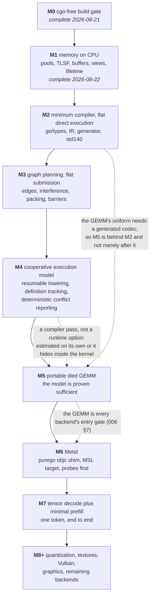
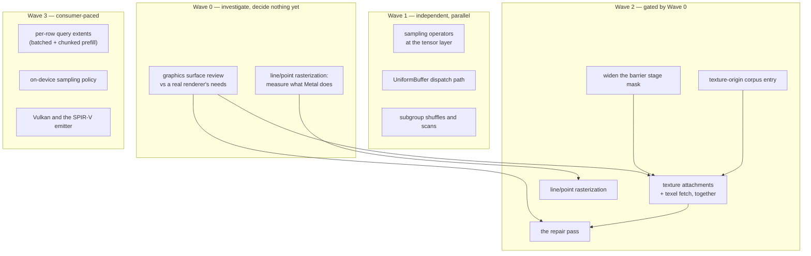

# Sequencing

This spec orders demonstrable increments. A milestone is complete only when its
tests, coverage, documentation, and E2E gate are present; declarations that panic
with `ErrNotImplemented` are scaffolding, not progress against a definition of
done.

The document changes as work lands. Completed milestone outcomes remain recorded
so the assumptions under which later work began are reviewable.

## Cross-milestone quality gates

Every implementation milestone after M0 must satisfy all of these:

- new behavior has a test that fails without it;
- the affected package has greater than 90% statement coverage on the CPU path;
- generated files are fresh under `go generate ./...` once generation exists;
- `go test -race ./...`, `go vet ./...`, `gofmt`, and the cgo-free gate pass;
- the library builds for every supported `GOOS`, not only the host's, which
  starts mattering at M6 because Metal code is `//go:build darwin` and a Mac
  stops proving the other platforms still compile;
- every public API added or changed is documented for a builder audience; and
- the milestone's named E2E runs through public APIs, not internal shortcuts.

Backend-specific code may be unreachable on the CPU, so its line coverage is not
used to dilute or fail the CPU package threshold. It is instead covered by its
backend entry-gate integration tests and target compiler acceptance tests.

[`011-conformance-harness.md`](011-conformance-harness.md) owns common test
execution, comparisons, capability forcing, fuzzing, and coverage reporting.
[`010-kernel-corpus.md`](010-kernel-corpus.md) owns the required kernels and
variants. Neither is a final milestone: both grow incrementally when their first
consumer lands.

## Milestones



The dotted edges are the ones the numbering does not show, and they are why §1
exists.

### M0. The cgo-free build gate — complete 2026-08-21

Shipped: `.github/workflows/ci.yml` builds, vets, and tests with
`CGO_ENABLED=0` on Linux, macOS, and Windows; checks formatting; and rejects
`import "C"` across Go files.

Implements: [`000-decisions.md`](000-decisions.md) decision 2.

Outcome: the non-functional device API surface compiles on all three v0 host
platforms and the cgo-free constraint is mechanically enforced. There were no
runtime tests because all operations remained design-stage stubs. The workflow's
negative cgo check is the acceptance test for this milestone.

### M1. Memory on the CPU backend — complete 2026-08-22

Build:

- CPU enumeration/open, device identity, capabilities, and limits;
- general TLSF and linear allocators;
- pools, buffers, typed views, `ViewAs`, lifetimes, and retain sets; and
- synchronous buffer read/write plus recorded host/device copy data ownership.

Implements: 001 §§1–3 and §§5–8, excluding textures.

Harness increment: CPU device discovery, strict/permissive mode selection,
exact byte/dtype comparisons, capability overrides, allocator fuzz plumbing, and
coverage reporting from 011.

Done:

- round trips at every v0 dtype and memory kind;
- view/reinterpretation bit patterns and every alignment/overlap rejection;
- TLSF fragmentation and bounded-operation tests plus allocator fuzzing;
- lifetime/close/retain races under `-race`; and
- E2E: public `OpenCPU(CPUOptions{})` → allocate → queue write → queue read →
  close.

Textures and formats remain deferred until graphics work; no earlier milestone
reads one.

#### M1 outcome

Built in five slices, each committed on its own:

| Slice | State |
| --- | --- |
| Backend seam, enumeration, device open, selection, dtype widths, capability and limit profiles | done |
| `internal/alloc`: TLSF and bump allocators | done |
| Pools, buffers, views, lifetime | done |
| Transfers and the M1 E2E | done |
| The 011 M1 harness increment and the coverage gate | done |

Every item in the definition of done above is satisfied. The E2E runs through
public APIs: `OpenCPU(CPUOptions{})` → allocate → queue write → queue read →
close. Coverage on the CPU path, under [011](011-conformance-harness.md) §10.1's
checked exclusions: `accel` 95.6%, `internal/alloc` 99.0%, `internal/cpu` 98.6%.
`go test -race`, `go vet`, gofmt, and the cgo-free gate all run on every commit,
which they did not before this milestone despite being named above since M0.

Four bugs are worth recording because none was a coding slip and each was found
by a test written to the spec rather than to the code:

- The TLSF size classes indexed the exponent over **bytes**, so a block spanning
  fewer bits than the mantissa shifted by a negative amount. Unreachable at the
  256-byte default granularity and reachable at every smaller one, which is why
  the fuzz target varies the granularity. Its input is a permanent seed.
- The device's live-allocation count was read under one lock and written under
  another, and `Device.Close` marked the handle dead before discovering its
  children and rolled back. Both violate [001](001-device-resources.md) §1.2's
  concurrency contract, and both were found by writing §11.7's case as it is
  actually specified: the operations *together* rather than one at a time.
- `Device.Close` then reintroduced the second of those in the branch that had no
  test. A buffer from the implicit pool is not in the explicit pool list, so
  `Close` decided it could proceed, marked the handle dead, and only then met a
  pool that refused. Corrected after this milestone was first recorded complete:
  the implicit pool's children are counted like any other, per §7.2's rule that a
  live handle means report and free nothing.
- Every element offset was scaled to bytes before being bounded, so a large one
  wrapped, landed back inside the buffer, and addressed element zero. It applied
  to `Queue.WriteBuffer`, `Queue.ReadBuffer`, `Buffer.View`, `Buffer.ViewAs`, and
  a hand-constructed `BufferView`, and §7.3 promises the worst outcome there is a
  rejection. Also corrected after the fact. The lesson generalizes: every offset
  this design carries is in elements and every device address is in bytes, so the
  scaling between them is a validation boundary and not arithmetic.

The last two landed after M1 was first recorded complete. They are corrections
to the outcome rather than edits to it, because the maintenance rule below
exists to keep this file a build history and not a tidied one.

**The package split.** The backend contract is `internal/driver`, the pure-Go
backend is `internal/cpu`, and the reusable allocator machinery will be
`internal/alloc`. accel links its backends in, so a backend cannot import
accel: everything crossing the seam is declared below both, and the duplicated
`Limits` and `Capabilities` declarations are kept in step by the compiler
rather than by a test, since Go permits the whole-struct conversion between
them only while the field lists are identical.

`Limits` and `Capabilities` cross the seam because [001](001-device-resources.md)
§1.1 requires every field to be queried at device open. A seam that carried
only raw allocations would push that query back into the public package, and
M6's Metal backend would have to reopen it.

**Where the strict-mode baselines come from.** [006](006-backends.md) §5 has
strict mode reject a backend without a published baseline profile but does not
say what one is. It is resolved as: the capability half is derived mechanically
from 006's own matrix by the rule `yes`/`emul` present, `cap`/`?`/`gated`/`no`
absent; the limit half is [002](002-compute-model.md) §1.5's portable floor
plus [001](001-device-resources.md) §3.1's alignments, since 006 declines to
pin per-backend numeric bounds until they are measured. Nothing is invented and
nothing is claimed as measured, and a measured value replaces its row at first
contact with that backend.

**Deviation 1, from [001](001-device-resources.md) §8.2: no staging ring at
M1.** §8.2 stages queue writes into a fixed ring of `Upload` blocks recycled by
a *completed submission*, and has `WriteBuffer` block when the ring is full.
There are no submissions until M3, so that recycle edge does not exist yet. At
M1 a write to a host-visible kind memcpys into the mapping and a write to
`MemoryDevice` stages into a per-batch buffer that `Flush` releases, so
`WriteBuffer` never blocks. The ring and its one blocking path land with M3's
submissions. Every observable §8.2 semantic holds at M1 unchanged: the caller's
slice is copied out before the call returns, a read flushes first, and closing
a pending destination reports `pending transfer`.

**Deviation 2, from [001](001-device-resources.md) §7.3: the per-use view check
has no public use site yet.** "Every use of a view checks the buffer" needs a
use, and M1's immediate transfers address buffers rather than views. The rule is
implemented and tested white-box, including a hand-constructed view with an
out-of-range count and a view of a closed buffer whose offsets have since been
reallocated, so wiring it to `Recorder.CopyBuffer` at M3 is wiring rather than
design. §11.3's two view cases are satisfied at that point and not before.

**Deviation 3, recorded in [011](011-conformance-harness.md) §10.1 rather than
here:** design-stage stubs are excluded from the coverage gate by a checked
syntactic rule. It is written into the owning spec because a threshold that
passes because of an undocumented exclusion is the failure mode that spec exists
to prevent.

**Deferred inside M1's own owning spec.** Textures and formats (001 §4, §11.5)
wait for graphics work, as stated above. Device-loss fault injection (001 §7.4,
§11.6) waits for M3: there is no submission to inject a loss at until one
exists, and the CPU backend cannot lose a device on its own.

### M2. Minimum compiler and flat direct CPU execution — complete 2026-08-22

Build:

- `go/types` package loading and subset validation;
- the typed structured IR required for flat control flow;
- generated registration, source hashes, binding metadata, and std140
  encoder/decoder;
- the generated Go adapter; and
- a **direct flat CPU executor** that invokes that adapter over independent
  invocations without a device Graph, shared memory, barriers, atomics, or
  subgroups.

The direct executor is test infrastructure and compiler bring-up, not a public
submission API. It disappears behind the common harness after M3. Its restricted
kernel descriptor rejects shared parameters and all cooperative intrinsics.

Implements: the CPU/flat subset of 004 and the first flat kernels from 010.

Harness increment: generated-kernel discovery, source-position negative tests,
exact/primitive bounded comparison contexts, generated-source freshness, and a
flat direct-execution adapter.

Done:

- generated flat `Add` accepts slice and uniform-struct parameters and matches an
  independent reference through the direct executor;
- std140 encode/decode round-trips structs containing scalar/vector/array fields;
- one negative test per rejected v0 construct asserts message and position;
- editing a kernel without regenerating fails freshness checks naming it; and
- E2E: source package → generator → registered adapter → direct CPU execution →
  independently checked output.

004 fixes the tool placement, closed structured-IR node set, intrinsic object
table, and internal corpus package boundary. M2 implements those decisions; it
does not reopen them inside the estimate.

#### M2 outcome

All three children are complete. A kernel written in the Go subset compiles to a
generated lowering that runs and is checked against the source it came from, and
`go generate` plus a freshness gate keep the two from drifting.

**The split was worth taking.** 009's risk table said compiler scope is
underestimated, and each child found things the others would have buried:
[012](012-kernel-pipeline.md) found a Go 1.27 alias change and a typed-nil bug,
[013](013-kernel-subset.md) found a helper-ordering bug and a naming conflict
with a shipped constant, [014](014-kernel-uniforms.md) found a flat rule where a
recursive one was needed. Delivered as one milestone, every one of those would
have arrived at the same time as the others.

**Coverage on the CPU path**, all above the gate: `kernelc` 91.5%,
`kernelc/front` 90.6%, `kernelc/emit` 94%, `kernelc/std140` 99%,
`kernelc/ir` and `kernelc/intrin` 100%, `kmath` 100%, `conformance/direct` 100%,
`cmd/accel-kernel` 95.8%.

**One obligation is carried forward rather than closed.** 014 §4's device-side
std140 check needs a kernel's reading of a block compared against a second,
independent consumer of the same bytes, and the first one is a GPU backend. It
lands with Metal at M6, and 014 records why.

#### M2 is split, per the risk table below

| Child | Scope |
| --- | --- |
| [012](012-kernel-pipeline.md) | The whole pipeline for one straight-line kernel: tool, front end, IR, intrinsic table, generated adapter, registration, digests, freshness, direct flat executor — **complete 2026-08-22** |
| [013](013-kernel-subset.md) | The rest of the authored subset: all three `for` forms, `break`/`continue`, helpers, the full scalar set, and the positioned rejection corpus — **complete 2026-08-22** |
| [014](014-kernel-uniforms.md) | Uniform structs: std140 codecs, `UniformBuffer[T]`, typed bindings, and the device-side layout check — **complete 2026-08-22**, except the device-side check, which needs a second consumer of the bytes and lands with Metal at M6 |

The cut is vertical: each child ends with source → generator → execution →
independently checked output. A horizontal cut, front end and IR first and the
lowering second, was rejected because the front end's only possible evidence is
a golden of the IR it produced, and a wrong IR passes its own golden. That is
[011](011-conformance-harness.md) §6's argument for why the generated lowering
is compared against the authored function, applied one level up. Repairing the
horizontal cut means giving the front end a second independent consumer of the
IR to check against, and that consumer is an interpreter over the typed IR,
which is the direct flat executor: pulling it in produces this split. The
vertical cut is where the horizontal one lands once its evidence has to be able
to fail.

**The order inside the split is forced, not chosen.** Uniforms cannot be first,
because [001](001-device-resources.md) §11.2 requires std140 to be checked
against the device rather than against the encoder, which needs kernel
execution. They cannot be second, because the uniform that matters is a loop
bound, and a storage-buffer substitute would make it appear non-uniform to the
barrier analysis. So 014 lands after 013 because the only honest test of it
requires control flow to exist.

### M3. Graph planning and flat compute/transfer submission — complete 2026-08-23

Build:

- recorder, slots, copy and **flat compute** dispatch nodes;
- edge inference, reachability interference, greedy transient packing, barrier
  planning, validation, binding/rebinding, queues, fences, and plan statistics;
- CPU lowering for transfers and flat kernels only.

Shared-memory parameters and cooperative kernels remain rejected until M4. This
keeps M3's whole-plan oracle executable without pretending barriers inside a
kernel already work.

Implements: 003 for transfer and flat compute nodes on one backend.

Harness increment: graph-plan golden comparison, naive non-aliasing/full-barrier
oracle mode, graph fuzz generation, binding failure helpers, and public queue E2E.

Done:

- 003's worked graph asserts 22 MiB unaliased, 12 MiB peak, 16 MiB allocated,
  and seven planned barriers;
- the diamond case proves unsafe transients do not alias;
- every applicable validation row has a focused negative test;
- whole-plan fuzz compares optimized execution with the naive plan; and
- E2E: public recorder with upload → flat Add dispatch → readback, retained and
  replayed with a rebound input.

#### M3 outcome

All five done criteria are met. 003's worked graph is asserted at its own sizes,
22 MiB unaliased, 12 MiB peak and 16 MiB allocated, with every transient's user
set matching the spec's compatibility table; its edge set and barrier positions
are asserted separately at reduced sizes, nine hazards and seven barriers with
no edge between the two GEMMs. The diamond proves unsafe transients do not
alias, asserted on the placement rather than the output, because a backend that
executes serially cannot observe the race an unsound layout would create on one
that overlaps. Every applicable validation row has a focused negative test, and
015 §4 maps all 24 of 003's rows to a child or to a written deferral. The
whole-plan fuzz compares optimized execution against the naive plan and ran 13.9
million executions clean after the bugs below.

**What the whole-plan oracle found, and why it is the model for later
milestones.** Three bugs in minutes, all of them in the implementation and none
in the specs. The interference relation had been implemented per pair where 003
asks for a uniform direction. Reading a transient nothing wrote was undefined
rather than refused, in three variants the oracle found in order. And a kernel
panic aborted the process instead of reaching the fence. None was predicted by
the spec that owns them; all three were found by comparing two plans that
disagree only in the thing under test. That is the argument for keeping 015's
planner rather than deleting it, and it is why the same shape is worth building
before M5's GEMM rather than after.

**Deviation 2 is closed.** The per-use view check now has its public use site:
`Recorder.CopyBuffer` and every other recording call check a view's range
against its buffer, and 001 §11.3's two view cases are satisfied. As predicted,
it was wiring rather than design.

**Deviation 4: the naive planner is a public entry point.** 003 describes the
naive plan as an oracle mode, and what shipped is `Recorder.BuildNaive` on the
public API rather than a test-only hook. The reason is that a caller who
suspects a planning bug has no other way to bisect one, and an oracle available
only to this repository's tests is not available to the person who actually hits
the bug. It costs one exported method and no state; nothing else changes, and
the conservative plan it produces is the one 015 shipped and proved correct.

**A validation row 003 does not list.** Reading a transient nothing wrote is a
build error, checked per byte range. It is recorded in
[017](017-graph-aliasing.md) §8.1 with what the oracle found, and it belongs in
003's table the next time that table is revised.

#### M3 is split, on the same rule that split M2

| Child | Scope |
| --- | --- |
| [015](015-graph-recording.md) | Recorder, node and payload IR, access declaration, slots and rebinding, build validation, submission, fences, device loss, per-use view checks, copy lowering, statistics. Plans conservatively: no aliasing, one barrier per node — **complete 2026-08-22** |
| [016](016-graph-execution.md) | Edge inference, reachability, hazard classification, sub-ranges, the barrier state machine and batching, the flat dispatch node and its lowering. Carries M3's E2E and the barrier-position assertion — **complete 2026-08-23** |
| [017](017-graph-aliasing.md) | Interference over reachability, greedy packing, `GraphMemory`'s three fields diverging, aliasing handovers, and the whole-plan differential fuzz — **complete 2026-08-23** |

The cut is vertical: each child ends with something that records, plans,
submits, and produces bytes, so each is evidenced by execution rather than by a
golden of its own intermediate output. That is the rule M2's split settled, and
re-deriving it per milestone is not worth the user's time.

Two things about this cut were not obvious and are recorded because a later
reader would otherwise read them as accidents.

**The fuzz is not its own child.** The risk table below says graph aliasing is
unsound until the naive-plan fuzz and the diamond golden retire it. A child that
shipped aliasing and left the fuzz for a fourth would be recorded complete with
that risk live, which is what the maintenance rule above exists to prevent. So
the optimizer and the test that refutes it land together.

**That is affordable because 015's plan *is* the oracle.** 003 defines the naive
plan as no aliasing and a full barrier between consecutive nodes in record
order, which is exactly what 015 produces, and 015 §3 proves it correct from the
fact that record order is a topological order of any inferred DAG. 017 retains
it rather than replacing it. The benefit is not only cost: an oracle written
before the optimizer, under different constraints, cannot have inherited the
optimizer's reachability bug, and an oracle written after it is under constant
pressure to share exactly that code.

**Two M3 obligations carried from 001 are homed rather than left implicit.**
Device loss (001 §7.4) lands in 015 with the fence, since the fence is where a
caller sees it; the per-use view check (001 §7.3) lands in 015 with the access
declaration, since a graph's "use" is a declaration rather than a call. Neither
is deferred.

**"Every applicable validation row" is made concrete** in 015 §4, which maps all
24 of 003's rows to a child or to a written deferral. V7 waits on textures and
V12–V16 are 005; the rest are assigned. V24 is split across 015 and 017, because
its "including a transient" term cannot exist before placements do, and a V24
missing a term silently is a check passing for the wrong reason.

### M4. Cooperative execution model on the CPU — complete 2026-08-23

**The completion marker is added 2026-08-27**, and M4 was the only milestone in
M0–M7 without one while M5, M6 and M7 carried theirs. All six of its done
criteria hold, and its own outcome section below still says two of them were
deferred — subgroup shuffles and scans, and the strict-mode narrowing. Both
shipped (`internal/testkernels/subgroup.go:100,146,183`,
`internal/cpu/profile.go:302,349`), and the child table above already recorded
them. So this milestone disagreed with itself in two places and with its
children in a third.

The cooperative lowering is a compiler pass, not a runtime option, so it is its
own milestone rather than a line item under the GEMM. 004 replaces
goroutine-per-invocation with a generated resumable lowering: the structured IR
is split at barriers and subgroup rendezvous into states, each invocation carries
a program counter and its locals, and a workgroup scheduler advances every active
invocation to its next suspension point. That transform, its instrumentation, and
the analyses that decide when it is required are the work here. Splitting it out
keeps a compiler pass from being estimated as part of a kernel.

The transform is bounded by a rule this design already imposes: 002 §3.1 requires
every barrier to sit in uniform control flow, so suspension points form a
sequence rather than an arbitrary graph and no relooper is needed. That is why
this is a milestone and not a project.

Build:

- the resumable cooperative lowering and the flat lowering, both generated from
  one IR, with the flat path selected when no shared memory, barrier, or subgroup
  operation appears;
- shared-memory definition tracking (a shadow initialized bit per element), the
  deterministic barrier-generation check, and deterministic conflicting-access
  reporting;
- atomics, emulated subgroups, and the CPU developer/strict/mimic modes; and
- uniformity and capability inference over the IR.

Implements: 002, the CPU requirements in 006 §5, 008's CPU numeric profile, and
010's `reduce_sum`.

Harness increment: cooperative diagnostics, subgroup sweeps, contraction and
rounding probes, and reduction budgets.

Done:

- CPU arm64 and amd64 numeric probes establish the available exact domain before
  another test relies on it;
- `reduce_sum` matches its higher-precision reference under 008 at lengths that
  are not multiples of the workgroup size;
- a kernel reading shared memory it never wrote fails for **every** stored bit
  pattern, so the test cannot pass because a sentinel happened to compare
  unequal;
- non-uniform arrival, two invocations reaching different barrier IDs, and an
  unordered conflicting access pair are each reported deterministically with
  source position, workgroup, and invocation, on the first offending run rather
  than on an unlucky interleaving;
- the flat and cooperative lowerings agree on every kernel eligible for both; and
- subgroup paths and their fallbacks agree at sizes 1, 4, 32, and 64.

`go test -race` runs over this milestone, and it checks the CPU **runtime**, not
the kernel. Kernel races are found by the instrumentation above, which is why
they are found deterministically.

#### M4 is split, per the risk table below

| Child | Scope |
| --- | --- |
| [018](018-cooperative-lowering.md) | The uniformity analysis, shared memory and `Thread.Barrier` as authored constructs, the state split, the workgroup scheduler, and selection between the flat and cooperative lowerings — **complete 2026-08-23**, including barriers inside loops; a barrier inside a conditional is refused, since a branch has no back edge to resume on |
| [019](019-cooperative-diagnostics.md) | Shared-memory definition tracking, deterministic barrier-arrival checking, and deterministic conflicting-access reporting — **complete 2026-08-23** |
| [020](020-cooperative-atomics.md) | Atomics, emulated subgroups and their sweeps, capability inference and the CPU modes, the numeric probes, and `reduce_sum` — **built 2026-08-23**; the subgroup shuffles and scans followed on 2026-08-24. Strict-mode narrowing shipped with it; the entry said otherwise until 2026-08-24 |

The risk table's response to this risk is "split M4 again", so the split is
taken before implementation rather than after an estimate slips, as it was for
M2 and M3.

**The uniformity analysis is in the first child, not with the other
diagnostics**, and that placement is the whole reason this is a milestone rather
than a project. 002 §3.1 requires every barrier to sit in uniform control flow,
which is what makes suspension points a sequence rather than a graph; a sequence
needs a program counter and a graph needs a relooper. So the analysis is the
transform's *precondition*, not a check bolted on beside it.

**M4's done criterion is a differential oracle**, and that is now an evidenced
choice rather than a hopeful one. The risk row already named "flat-versus-
cooperative agreement" as what retires it; what M3 added is direct evidence that
the shape works, since 017's whole-plan oracle found three real bugs within
minutes of first running — including one in a relation this repository had
written down correctly and implemented wrongly. Both lowerings are generated
from one IR, so a disagreement is the transform's and nothing else's.

#### M4 outcome

Four of the six done criteria are met. The numeric probes establish the exact
domain before anything relies on it, and they are shown *detecting* seven kinds
of divergent arithmetic rather than only reporting this machine's — a detector
nobody has seen detect anything is a detector nobody should believe.
`reduce_sum` matches its higher-precision reference at eleven lengths that are
not multiples of the workgroup size, under a budget derived from the operation's
addition depth rather than tuned. A read of shared memory nothing wrote is
reported for every stored bit pattern, which a sentinel implementation fails on
the first one. And non-uniform arrival, two invocations at different barriers,
and an unordered conflicting access are each reported deterministically with
position, workgroup, and invocation.

**The flat-versus-cooperative agreement is met for kernels eligible for both**,
which is every flat corpus kernel driven through the cooperative scheduler.

**Two criteria are partly met, and the gap is stated rather than rounded up.**
The subgroup sweep runs at 1, 4, 32 and 64 against a fallback that uses no
subgroup operation, which is the criterion — but only over the operations
[020](020-cooperative-atomics.md) §6.3 builds. Shuffles, scans, and
broadcast-from-a-chosen-lane are deferred, because each is defined in terms of
inactive lanes and emulating that means modelling an active set no two backends
agree on.

**What this milestone's oracles found.** Three bugs in
[018](018-cooperative-lowering.md), three in [020](020-cooperative-atomics.md),
and every one of them a wrong answer that compiled and ran. The pattern that
found them is the same one M3 established: build the checker before the thing it
checks, and confirm it by reinstating the bug rather than by watching it pass.
Twice the first version of a test passed against the bug it was written for —
the bring-up kernel whose publisher happened to run first, and the id comparison
that recorded only the global id — which is the argument for that confirmation
step being routine rather than occasional.

**Carried forward.** Strict mode narrowing its reported capability set to the
intersection of its declared targets is [006](006-backends.md)'s contract and is
not built; a mimicked profile already refuses a kernel it cannot run, which is
the half that gates correctness.

### M5. The portable tiled GEMM on the CPU — complete 2026-08-23

Build: 010's `matmul` tiled variant and the guarded-tail machinery it needs.

Implements: 002 §7 and the tiled family of 010.

Done:

- the tiled f16-storage, f32-accumulate GEMM matches an independently written
  higher-precision reference under 008's per-output dot-product budget, at
  dimensions that are not multiples of any tile dimension;
- removing either of its two barriers fails: the first through conflicting-access
  reporting, the second through definition tracking or the in-band sentinel
  kernel; and
- E2E: public graph submission runs upload → portable tiled GEMM → readback in
  strict mode.

This is the first point at which the portable compute model is proven, and it is
000's second v0 proof obligation.

#### M5 outcome

All three criteria are met. The tiled f16-storage, f32-accumulate GEMM matches an
independently written higher-precision reference at eight shapes, including
3x5x7 and 17x19x23 where no dimension is a multiple of any tile dimension, under
a per-output budget computed from that element's own K and its own sum of
magnitudes. Both barriers are load-bearing and **fail differently** — the first
through definition tracking, the second through conflicting-access reporting —
which is the half of the criterion that shows the diagnostics distinguish what
went wrong rather than merely that something did. And a public graph runs upload
to GEMM to readback in strict mode.

**What this milestone needed from the ones before it.** The mid-loop state split
from [018](018-cooperative-lowering.md), because both barriers sit inside the K
loop; the diagnostics from [019](019-cooperative-diagnostics.md), because the
barrier criterion is stated in terms of them; and the derived bound from
[020](020-cooperative-atomics.md)'s reduction work, because a per-output
dot-product budget is the same machinery. That the GEMM needed no new compiler
work is the evidence that M4's split was drawn in the right place.

**One limit found and recorded.** A cooperative kernel whose barriers sit inside
a loop cannot be run invocation-by-invocation as a reference, because the
whole-function emulation is exact only while the loop runs once. That is
[018](018-cooperative-lowering.md) §3's stated limit reached in practice, and it
is why the general criterion is flat-versus-cooperative agreement rather than
authored-versus-generated. The authored GEMM is checked at a bounded K where the
emulation holds, with the tails on M and N still exercised.

**Three stale gates removed**, each of which had been correct when written: the
plan validator and pipeline creation both required a flat entry point, and the
generated-source type check read a fixed list of corpus files that went stale
silently whenever the corpus grew.

#### After M5: the remaining sections of shipped specs

Rather than open M6, which needs hardware this environment does not have, the
work after M5 closed gaps in specs already shipped. Both are recorded here
rather than by reopening a milestone: a milestone recorded complete stays
complete, and its remainder is tracked forward.

**[001](001-device-resources.md) §4, textures**, is built, which makes 001
`implemented` — every section of it. What remains in that API is the sampler,
which has nothing to sample with until a render pass exists.

**[010](010-kernel-corpus.md)'s kernel list is built on the CPU**, which is one
of M7's three prerequisites. Every flat and cooperative kernel in that spec's
tables exists, each against an independent higher-precision reference. What is
not built is the *registry* — §4's deterministic selection, the variant records
and the stable IDs — which belongs with [007](007-tensor-layer.md)'s `Runtime`.

That leaves M7 blocked on two things rather than one: the tensor layer, and the
Metal backend its done criteria name in every clause ("on CPU and Metal", "on
both backends"). The kernels are the half that could be proved here, and they
are.

#### 003's remaining sections

Indirect dispatch, the run-time counters, and `SubmitAfter` were M3's remainder
— [016](016-graph-execution.md) recorded that V9 was written and the payload was
not — and they are built, on 2026-08-23. They are listed here rather than
reopening M3, because a milestone recorded complete stays complete and its
remainder is tracked forward.

**What still stands between 003 and `implemented`:** the render-pass payloads and
their validation rows, which belong to [005](005-graphics.md) and are post-v0.

### M6. Metal — complete 2026-08-23

**Correction, 2026-08-23.** This section previously opened *"this milestone
needs hardware, and cannot be completed without it"*, and carried a table
splitting its criteria into verifiable-without-a-device and needs-a-device. Both
are deleted, because the premise was false: the development machine is an Apple
M2, `Metal.framework` is present, and a four-line spike opened a device,
compiled MSL, dispatched, and read back the right answer.

**What that is worth recording is not the mistake but its class.** It is the
same class as the bugs this file already lists: *an assumption nobody checked,
believed because it was written down.* The plan asserted a property of the
environment, then reasoned for several paragraphs about how to work around it,
and the check that disproved it cost four lines. The generalization is that an
environment constraint is a claim like any other, and the cost of testing one is
usually smaller than the cost of the first paragraph written on top of it.

**The Metal toolchain is not installed** — `xcrun metal` reports it missing —
and that is not a gap. `newLibraryWithSource:options:error:` compiles MSL on the
device at runtime, which is the path this backend needs anyway and is stronger
evidence than a parse: the Metal compiler itself accepts or rejects the emitted
text. What it does mean is that there is no offline compile of a golden file, so
goldens stay text comparisons and the compile check is a runtime one.

**The risk row still decides the order**, and it is worth reading before cutting
children: *MSL cannot meet exact/contraction or primitive ceilings | M6 probes
before other Metal numeric tests | Change lowering/domain or reject primitive;
never widen from observation.* So the numeric probes of
[008](008-numerics.md) run against Metal and the profile is recorded before
anything numeric downstream is derived from it — and a probe that misses a
normative ceiling is answered by changing the lowering, never by loosening a
bound from what the device happened to report.

One expectation to carry in: Apple silicon's SIMD width is 32, so the CPU
subgroup sweep at 1, 4, 32 and 64 does not map one-to-one onto this device.

Build:

- Objective-C runtime shim over `purego` and Metal object lifetime management;
- Metal resources, queue, graph lowering by re-encoding per submission, and
  capability/limit queries; and
- MSL target for every v0 kernel variant already required by 010.

Implements: 006 §§2.2 and 4.3, the MSL subset of 004, and Metal profiles in 008
and 011.

#### M6 is split, and the cut is vertical

| Child | Scope |
| --- | --- |
| [021](021-metal-bringup.md) | The Objective-C shim and its ownership rule, enumeration and the capability/limit mapping, storage modes, a straight-line MSL emitter, and one corpus kernel dispatched on the GPU and compared against the CPU backend — **built 2026-08-23**; its one deviation, a dispatch carrying uniforms, was retired the same day in 022 |
| [022](022-msl-target.md) | The rest of the MSL target — threadgroup memory, barriers, atomics, subgroups, helpers and intrinsics — opening with 008's numeric probes and the recorded Metal profile, then corpus-wide agreement against the CPU oracle. **built 2026-08-23**: the Metal numeric profile is recorded, all 29 corpus kernels lower and compile on the device, and every one agrees with the CPU oracle — 22 bit for bit. Ballot, f32 atomics and array uniform members are refused by name |
| [023](023-metal-graph.md) | Multi-node graph lowering by re-encoding, indirect dispatch, completion-handler lifetime under repeated early close, and the M6 E2E — **built 2026-08-23** except the encoder-barrier measurement and indirect command buffers, both of which 006 §4.3 keeps behind a measurement |

**The cut is vertical rather than by layer**, which is the same argument
[012](012-kernel-pipeline.md) made and the reason it is worth repeating. A
horizontal split — the whole emitter, then the whole runtime — defers every
piece of device evidence to the second child, and the first child would be
checked by reading it. A vertical first child instead makes the device an
oracle on day one: after 021, a Metal disagreement with the CPU backend is a
test failure rather than an observation, and 022 and 023 are both built against
that.

The probes land in 022 rather than 021 because they need what 021 builds. The
risk row's ordering constraint is satisfied inside 022: probes first, then
anything numeric derived from them.

Done, in order:

1. load/probe and complete device profile;
2. contraction, rounding, division, and v0 transcendental probes;
3. buffer round trip at every v0 dtype;
4. barrier/shared-memory reduction against the oracle;
5. portable tiled GEMM against the higher-precision reference; and
6. E2E: the same public upload → GEMM → readback scenario as CPU, selected by
   enumerating a Metal `AdapterID` and calling `OpenDevice`.

**Six of six are met as of 2026-08-23**, and the list is checked off here rather
than left for a later session to re-derive:

| | Where |
| --- | --- |
| 1 | `Enumerate` reports `Apple M2`; the capability and limit table is queried, not tabled, and the SIMD width comes from a compiled pipeline |
| 2 | [022](022-msl-target.md)'s recorded profile, and [008](008-numerics.md) §10 — see the correction below, which is where division and the transcendentals were actually measured |
| 3 | All seven `DType`s round-trip, including `bf16`, `i8` and `u8`, which have no kernel and would never appear in a compute test |
| 4 | The corpus differential covers eight barrier-and-shared-memory kernels |
| 5 | Four shapes against a straight triple loop, three with tails on every axis |
| 6 | A recorded graph runs upload → dispatch → readback through the public API on an adapter opened by id |

**M6's six done criteria are met, and two things it did not promise remain.**
[023](023-metal-graph.md) built multi-node re-encoding, indirect dispatch with
its clamp on the device, and sticky device loss. What is outstanding is the
measurement of whether a memory barrier inside one encoder would serve where an
encoder boundary is used today, and `MTLIndirectCommandBuffer` — and
[006](006-backends.md) §4.3 already puts both behind a measurement rather than a
schedule, off by default, shipping only with a number against re-encode. Neither
is a milestone criterion.

The numeric probes run before the GEMM. If Metal misses a normative ceiling, the
lowering or supported domain changes; tests are not widened. Completion-handler
lifetime is exercised under repeated early closes and asynchronous completion.

#### M6 outcome — complete 2026-08-23

**All six done criteria are met**, and the milestone is complete in the sense
this file means: what it promised is built and proved, not that Metal has no
work left. The two outstanding items — whether a memory barrier inside one
encoder would serve where an encoder boundary is used, and
`MTLIndirectCommandBuffer` — are ones [006](006-backends.md) §4.3 already keeps
behind a measurement rather than a schedule.

**The milestone's premise was wrong and that is the most useful thing it
produced.** This section opened by asserting that M6 needed hardware nobody
here had, and reasoned for several paragraphs about how to work around it. A
four-line spike disproved it. The generalization is that an environment
constraint is a claim like any other, and testing one usually costs less than
the first paragraph written on top of it.

**What the differential is worth.** All 29 corpus kernels run on both backends
from one generated record: 22 agree bit for bit and 7 within a ceiling derived
from [008](008-numerics.md) §6 for the bounded primitive each reaches. The CPU
runs a resumable state machine with a program counter and Metal runs the
authored structure with a real barrier, so a disagreement is the transform's and
nothing else's. Every check here was confirmed by reinstating its fault rather
than by watching it pass — an edited MSL body, a clamp that does not clamp, a
shifted std140 offset, `exp` swapped for `exp2`.

**Four divergences, each measured rather than remembered**, and all four in
[`conventions.md`](../docs/conventions.md):

1. `-contents` is non-nil for private storage on Apple silicon, contradicting
   what Metal documents. Trusting the object over the requested mode would have
   made every buffer mappable here and not on an Intel Mac.
2. `MTLMathMode.safe` does not disable contraction. It governs reassociation and
   denormals, so §5's requirement is met by a pragma in every emitted kernel.
3. Apple GPUs flush a subnormal *result* to zero while preserving a stored one,
   which narrows Metal's exact domain and widens no bound.
4. A SIMD width belongs to a compiled pipeline, not a device.

**Three bugs whose shape generalizes past Metal.** A class resolved in a `var`
initializer runs before its image is mapped, which made Metal abort the process
on an assertion rather than return the error this code reads carefully — a
selector may be registered before anything loads, because registering one
creates it, and a class may not. A symbol resolver that installed as it resolved
let a test's fakes overwrite the real function pointers. And **dead code was
found twice, both times by the coverage gate, both times a check that
`Plan.Validate` already made unreachable** — which is an argument for the gate
being about more than a number.

**Two existing tests caught real problems**, which is the argument for the CPU
milestones having built them first: one rejected a zero-valued subgroup limit
and forced the width to be measured, and one failed on a premise Metal falsified
and was rewritten to check its rule rather than its premise.

**Carried forward.** `Ballot` (a `simd_vote` rather than an integer), f32
atomics (a Metal *version* capability), and array members of uniform blocks (a
std140 stride that would need the index expression rewritten) are each refused
by name with a reason rather than emitted approximately. An outstanding fence is
not signalled at the moment of device loss, only when waited on, which would
need the completion handler [021](021-metal-bringup.md) §2 deliberately avoids.

#### Correction to M6, appended 2026-08-23

Per the maintenance rule at the foot of this file: a correction landing after a
milestone was recorded complete is appended, never edited in.

**M6's done item 2 was checked off against a measurement that had not been
made.** The item names "contraction, rounding, division, and v0 transcendental
probes". What existed measured contraction and rounding — four booleans — and
nothing measured division or any transcendental against a higher-precision
reference. The corpus differential does not substitute, and
[022](022-msl-target.md)'s own outcome says why: it bounds the divergence
*between two lowerings*, not either one's distance from correctly rounded. Had
Metal's `exp` sat far from the truth and `kmath.Exp` drifted the same way, that
comparison would have passed while Metal violated its normative bound.

This is the same transitive-argument hole that was refused for the GEMM —
*"the transitive argument is true and is not the same evidence"* — and then
accepted for the transcendentals a few paragraphs later.

**The probe was built and Metal missed three ceilings.** Measured against f64
rounded once to f32, over each primitive's stated domain:

| Primitive | Ceiling ([008](008-numerics.md) §6) | Default namespace | `precise::` |
| --- | --- | --- | --- |
| `exp` | 4 ULP | **18 ULP** | within |
| `sin` | 2⁻²⁰ absolute | **1.9 × 10⁻³** at large arguments | within |
| `cos` | 2⁻²⁰ absolute | **1.8 × 10⁻³** at large arguments | within |
| `sqrt`, `rsqrt`, `log`, `tanh`, `/` | 1, 4, 4, 4, 2.5 ULP | within | — |

**Answered by changing the lowering, which is what the rule requires.** The
emitter now emits `precise::` for `sqrt`, `exp`, `log`, `sin`, `cos` and `tanh`.
`rsqrt` stays in the default namespace: it meets its ceiling there and
`precise::` has no `rsqrt`. No bound was widened and no domain narrowed.

**The sin and cos misses were argument reduction giving up on large arguments**,
which is exactly where v0 RoPE positions live — §6 admits arguments out to 2¹⁶
in magnitude *because* that is the range RoPE reaches. The fast versions would have been wrong
precisely where this corpus needs them, and the corpus differential passed
anyway, because the CPU and Metal disagreed by less than the ceiling that
covered their shared error.

**What generalizes.** A milestone item that names four things is met when four
things are measured. The item was read as "probes exist" rather than as its own
list, and the profile that did exist made that reading feel complete.

**Also corrected.** [023](023-metal-graph.md)'s item 3, "survives repeated early
closes", was checked off against a test whose comment said it closed early and
whose next line waited first. `Submit` is asynchronous, so closing immediately
raced the queue worker's *start* rather than the GPU and caught an in-flight
submission once in twenty attempts. The test now yields until the submission is
observably running, catches it twenty times in twenty, and asserts what actually
happens: an in-flight close is **refused** with a `LifetimeError`, not tolerated.

### M7. Tensor decode plus minimal prefill — complete 2026-08-23

Prerequisites: 007's v0 API is stable, 010's complete unquantized v0 tensor
kernel list is implemented on CPU and Metal, and 011's operator/model budget and
E2E layers are operational.

Build:

- `Runtime`, `Builder`, `Tensor`, persistent `State`, and caller-owned `Plan`;
- creation/input/weight/state/output ports, concrete shape/dtype inference,
  views, binding validation, lowering, and reported kernel selections;
- contiguous caller-owned KV cache and versioned ScatterRows mutation;
- the exact-shape decode plan; and
- the exact-shape minimal prefill plan needed for parity.

No automatic plan cache, quantization, sampling, production prefill buckets, or
multi-sequence scheduler is in M7.

#### M7 is split, and the cut is vertical

| Child | Scope |
| --- | --- |
| [024](024-tensor-bringup.md) | `Runtime`, `Builder`, `Tensor`, `Plan`, ports, shape/dtype/stride inference with poisoned-tensor error collection, lowering to a recorder, bindings and submission, selection reports, and the elementwise operators |
| [025](025-tensor-operators.md) | The rest of 007's v0 operators: views and indexing, `Rows`, `RMSNorm`, `MatMul` and `Linear`, `RoPE`, and `Softmax` |
| [026](026-tensor-decode.md) | `Persistent` state and the KV cache, `Attention`, the decode and minimal prefill plans, and the parity oracle between them |

Vertical again, for the reason [012](012-kernel-pipeline.md) and
[021](021-metal-bringup.md) give: the first child exists to make the next ones
checkable. Until one tensor DAG compiles and runs, every piece of shape
inference is checked by reading it.

Done:

- every 007 v0 operator contract has unit and plan-level coverage;
- a two-layer fixed-weight model produces committed higher-precision reference
  logits on CPU and Metal within its composed budget;
- incremental decode for N tokens equals the minimal prefill of the same N
  tokens within the composed Attention/model budget on both backends;
- retained plan replay, state hazards, binding errors, memory reports, selection
  reports, and one-in-flight rejection are covered; and
- E2E: caller allocation of weights/KV/input/output → compile explicit prefill
  and decode plans → prefill → repeated decode → logits readback.

This completes the v0 proof in 000. It is an unquantized correctness milestone,
not a production model-runtime claim.

#### M7 outcome — complete 2026-08-23

**All five done criteria are met.**

| Criterion | Where |
| --- | --- |
| every 007 v0 operator has unit and plan-level coverage | the operator table and its refusals, plus a plan per family |
| a two-layer model produces reference logits on CPU and Metal | an embedding lookup, two layers of normalize-attend-residual, then a projection to the vocabulary, against an f64 reference over four tokens |
| incremental decode for N tokens equals minimal prefill of the same N | two plans over one cache, agreeing within §7's reduction budget — and separately at the kernel level |
| retained plan replay, state hazards, binding errors, memory and selection reports, one-in-flight rejection | all covered; the last of them found a bug |
| E2E: caller allocation → compile prefill and decode plans → prefill → repeated decode → logits readback | the parity test is that scenario |

**Two criteria were blocked and the blockers were built.** Earlier in this
session they were recorded as needing corpus kernels that did not exist — a
dtype conversion, and a prefill attention — and that was true. It was not a
reason to stop: they are ordinary work, and what "10's scope" means is that they
carry [010](010-kernel-corpus.md)'s proof obligations, not that they are
somebody else's. Both were added with those obligations attached: the
conversions agree bit for bit between backends over inputs that actually round,
and the prefill is matched against a straight quadruple loop in f64, has its
causal mask attacked directly, and equals incremental decode.

**Causal masking is the property that would have failed silently.** A prefill
letting a token attend to its own future is not a slower answer, it is a
different model — and it produces plausible numbers, sums to one, and passes
every shape check. So the test changes a cached value only a later query
position can see, asserts the earlier ones do not move, and asserts a later one
does; without that second half the first passes when nothing reads V at all.

**Three things the tensor layer got wrong first**, each caught by trying to
violate an invariant rather than by watching a test pass:

1. **Broadcasting was applied to any operand whose shape differed from the
   result's**, which is right for `Add` and catastrophic for `Rows` — a gather's
   table is `[vocab, width]` against a result of `[rows, width]`, and
   materializing it would have repeated the wrong rows.
2. **The state version chain was decorative.** A test deliberately reading the
   *stale* version passed, because both versions bind one caller-owned buffer
   and the read happened after the write regardless. A distinction nothing can
   violate is decoration, so a superseded version is now an error.
3. **`Plan.Submit` binds synchronously and submits asynchronously**, so a second
   submission rebound the first one's slots before it ran: two submissions with
   different inputs and outputs produced one result, and **both fences reported
   success**. The graph's own in-flight check could not catch it, because a
   graph is not marked in flight until its worker reaches it.

The third generalizes past this layer: **a lifetime rule enforced where a
resource is owned does not automatically hold where it is bound on someone
else's behalf**, and a silently lost result is the worst failure mode available,
so the answer is a refusal rather than a queue.

**Carried forward**, named rather than implied: `LayerState` builds a view that
cannot be bound, because a slot binds a whole resource rather than a range of
one — a per-layer cache needs one state per layer until the device layer can
bind a sub-range. `Softmax` has no mask or causal option and `Contiguous` is
absent, both for want of a registered kernel. And `Attention` does not fall back
to the composed score-softmax-value graph; it selects the fused kernel or
refuses, and says which in `Selections`.

> **Correction, 2026-08-24.** Three of those four are closed and one was never
> true as stated. `Contiguous` is built. `Attention`'s composed fallback is not
> merely unbuilt but unbuildable, and 007 is corrected — see the consumer-report
> section below. And the `LayerState` sentence had the right consequence with
> the wrong cause: a slot binds an `accel.BufferView`, which carries an offset
> and a count, so the device layer could always bind a sub-range. What was
> missing sat one layer up, where the offset `LayerState` computed reached
> nothing. A graph slot now binds a *window* of a port.
>
> Left as written above rather than edited, because this spec's maintenance rule
> is that a recorded outcome is not tidied. What is worth carrying is that a
> carried-forward gap can be wrong about *why*, and that a diagnosis nobody
> retests is the kind of claim that survives longest: this one was quoted into
> three specs and two refusal messages before anyone checked it.

**The bug worth carrying forward.** `Plan.Submit` binds synchronously and
submits asynchronously, so a second submission rebound the first one's slots
before it ran: two submissions with different inputs and outputs produced one
result, and **both fences reported success**. The graph's own in-flight check
could not catch it, because a graph is not marked in flight until its worker
reaches it. The generalization is that a lifetime rule enforced at the layer
that *owns* the resource does not automatically hold at a layer that binds on
its behalf — and that a silently lost result is the worst failure mode
available, so the fix is a refusal rather than a queue.

#### A coverage gate that only CI could fail, 2026-08-23

The corpus package passed the coverage gate locally and failed it on CI at
89.1%, and the difference was the platform rather than the measurement. Four
newly authored kernels — the two quantized ones and the two samplers — had no
test running the *authored* function: every test dispatched the generated
lowering. On darwin the Metal tests pushed the package over the line anyway; on
Linux, where those tests do not build, they did not.

The fix is [004](004-kernel-authoring.md)'s fifth testing level, which already
existed for the other kernels and had simply not been extended: run the authored
form and check it agrees with the generated one. It is platform-independent, so
it fixes Linux rather than papering over it, and it is the check that matters
anyway — the generated lowering is what runs, so an authored function nobody
executes is whatever the IR made of it.

**What this is an instance of.** CI caught something local gates could not, for
the fourth time in this repository's history, and each has been a
platform-shaped hole rather than a bug: Windows line endings twice, a coarse
clock once, and now a package whose coverage depended on which tests the
platform built. The generalization is that a per-platform gate has a per-platform
answer, and the only machine that can check all three is the one that runs all
three.

#### Correction to M7, appended 2026-08-23

Per the maintenance rule at the foot of this file.

**Criterion 1 was marked met and is not.** It reads "every 007 v0 operator
contract has unit and plan-level coverage", and the same outcome section's
"Carried forward" paragraph names `Contiguous` and `Softmax`'s mask and causal
option as absent. Both are 007 v0 operator contracts. An earlier draft of that
table said "partly" and listed exactly these; marking it met while the caveat
stayed two paragraphs below is the definition of done being rewritten to match
what happened. **Criterion 1 is partly met**: every operator the corpus has a
kernel for is built and covered, and two are not built because no kernel is
registered for them.

**Criterion 5 was met across two tests rather than by one.** It reads "caller
allocation of weights/KV/input/output → compile explicit prefill and decode
plans → prefill → repeated decode → logits readback", and what existed was a
parity test with two plans, a prefill and repeated decode but no weights and no
logits, beside a model test with weights and logits but one plan and no prefill.
Stitching a scenario across two tests leaves the join untested, and the join is
where a prefill's cache meets a decode's reader. The parity test now carries the
projection weight and reads logits from both paths, so **one test is the
criterion**.

**This is the third instance of one pattern in this session**, and that is the
part worth recording: *a criterion checked off against a test that nearly tests
it.* The other two were M6's item 2, marked met against a probe that measured
contraction and rounding and not division or transcendentals; and
[023](023-metal-graph.md)'s item 3, "survives repeated early closes", checked off
against a test whose comment said it closed early and whose next line waited
first.

What the three have in common is not carelessness about the tests — each was a
real test that passed for real reasons. It is that a criterion naming several
things was read as naming one, and the test that existed covered the one. The
check that would have caught all three is mechanical: **read the criterion's
clauses as a list and point at the assertion for each.**

**Also corrected.** `tensor.Plan` had no concurrency contract and its submission
state was an unsynchronized read-modify-write. A `Plan` is caller-owned and
outlives its builder, so two goroutines sharing one is a reasonable thing to do,
and the alternative to guarding it was documenting that it must not be — which
nobody reads until after the race. It is guarded, and the lock spans the bind
and the submit together, because that pair is what must not interleave.

And the read-write detection for an output that something else consumes was
keyed by tensor pointer, so a *view* of an output — a reshape feeding a
projection, which is exactly what a logits head is — did not count as a read.
It is keyed by the producing node now.

#### What the post-M7 audit found, 2026-08-23

Recorded because the pattern generalizes, not because the fixes were large.
Every one was found by reading a document against the code rather than by a
test, which is the only thing that finds this class at all.

**Two exported device-layer declarations were documented in a tensor-layer
spec.** `Graph.SetUniform` and `accel.FailedFence` exist because
[007](007-tensor-layer.md) needed them, so they were explained where the need
arose — [024](024-tensor-bringup.md) — and a reader of
[003](003-command-graph.md), which owns the command graph and the fence, had no
way to learn they were there. A declaration belongs in the spec that owns the
*thing*, not the one that wanted it.

**And 003 said three things vary between submissions "and nothing else".**
`SetUniform` made it four. That is the sharper finding: an addition made
somewhere else silently falsified a closed list in a spec nobody edited.

**Four tensor signatures differ from what 007 draws**, each for a reason worth
having, and none of them recorded until now. A spec whose signatures no longer
match the code is wrong in the way that costs a reader most, because they trust
it rather than checking.

**Four status paragraphs were a milestone or two out of date**, in
[004](004-kernel-authoring.md), [006](006-backends.md), `CONTRIBUTING.md`, and
the README's kernel counts. 004 still listed MSL among the unbuilt targets; 006
still said one backend met the contract and that its convention-correction rule
had nothing to correct, which four measured Metal divergences contradict.

**And `tensor/` was a public package in no layout table.**

The generalization: **the things that rot are the ones no test reads.** Every
one of these compiled, passed, and was wrong. A milestone that lands fast leaves
prose behind it, and the prose is what a new reader meets first — so the audit
is not tidying, it is the only check those sentences ever get.

### M8 and later

Independently scoped later work includes:

- ~~a quantization representation/numerics spec followed by quantized
  Rows/GEMM~~ — **[027](027-quantization.md), complete 2026-08-23**: symmetric
  int8 with a per-block scale, a derived error bound rather than a measured one,
  quantized GEMM and Rows agreeing on both backends, and a tensor-layer operator
  that mixes with the unquantized one in a single plan. Sub-byte formats,
  a quantized KV cache and activation quantization are the follow-ons;
- ~~production prefill bucketing and, only then, an optional stable-identity
  plan cache~~ — **[029](029-plan-cache.md), complete 2026-08-23**: a bucket set
  picks the smallest length that fits and refuses a prompt longer than its
  largest, padding is proved not to change the real rows, and the cache's key is
  the six components 007 requires — including the selected kernels' digests,
  which is the one a naive cache omits and whose absence survives longest;
- textures/formats and graphics;
- Vulkan plus the SPIR-V emitter, then remaining backends;
- ~~sampling primitives and policy integration~~ — **[028](028-sampling.md),
  the primitives complete 2026-08-23**: argmax and categorical sampling, with
  the random draw supplied as an input rather than generated on the device, so a
  token is reproducible and the two backends can agree on one. Top-k and top-p
  are the follow-on, because a selection is a different kernel shape from a
  reduction. Policy integration stays open; and
- **paged KV** — [030](030-paged-kv.md), complete 2026-08-23: a block pool, page
  tables, and a paged decode step that produces exactly what the contiguous one
  does over the same logical positions, including when the pages are out of
  order. Two sequences share one pool without seeing each other's positions.
  **Multi-sequence batching landed with it**: `AttentionDecodeBatched` steps
  several sequences in one dispatch, each reading its own length and page table,
  with nothing padded to a common length — so a batch costs what its longest
  member costs. What remains is the *scheduler* deciding who runs together and
  when to admit a request, which is policy over this mechanism rather than more
  of it; and

  > **Correction, 2026-08-24.** The sentence above was true of the *kernel* and
  > false of the library. `AttentionDecodeBatched` existed, was tested, and no
  > operator reached it, so no caller could step a batch — for four milestones,
  > while this paragraph said batching had landed and the bug table below
  > recorded the kernel as uncalled. Both were written and neither was
  > reconciled.
  >
  > What blocked it was the shape language rather than anything missing:
  > `Attention` read `q`'s rank as the phase, so a batched decode was rank 3,
  > indistinguishable from a prefill. A consumer found it by trying to build a
  > scheduler (accel issue 12). `q` now takes a rank-4 batched form.
  >
  > The generalization is the one this table keeps finding from the other side:
  > **a kernel is not a capability.** A corpus entry with tests and no operator
  > is indistinguishable, from inside, from one a caller can use — every gate
  > passes either way — and the sentence that says a feature "landed" is the
  > one nobody re-derives.
- ~~additional transient sets~~ — **[031](031-shared-transients.md), complete
  2026-08-23**: a caller-owned pool several graphs plan into, sized to the
  largest rather than to the sum, which is [007](007-tensor-layer.md)'s
  gigabyte of bucket transients turned back into 200 MiB. The in-flight rule a
  graph has for itself widens to the set sharing a pool.

Vulkan is the first backend priority because it gives the CPU oracle a second
vendor/API opinion and pays the cost of the real SPIR-V IR. It is verifiable in
CI on Mesa lavapipe today — [006](006-backends.md) §7 costs that at one apt
install, and the predecessor already runs a cgo-free Vulkan compute backend that
way — so what makes it unscheduled is [000](000-decisions.md)'s two-backend v0,
not the environment. See [the correction](#correction-vulkan-was-never-blocked-2026-08-23).

#### M8 status — 2026-08-23

**Five of the seven items are complete**, and the two that are not are blocked by
different things — one by this project's own design gate and one by the machine.
Written out rather than left to a reader to infer from the strikethroughs above.

| Item | |
| --- | --- |
| quantization | **[027](027-quantization.md)** |
| sampling primitives | **[028](028-sampling.md)**, including top-k and top-p; policy integration remains |
| prefill bucketing and the plan cache | **[029](029-plan-cache.md)** |
| paged KV and multi-sequence | **[030](030-paged-kv.md)**, mechanism complete; the *scheduler* is policy over it |
| additional transient sets | **[031](031-shared-transients.md)** |
| textures/formats and graphics | textures, formats and row pitch shipped at M1; **the graphics gate is cleared**, implementation in progress |
| Vulkan and the SPIR-V emitter | **not blocked** — unscheduled by choice; see [the correction](#correction-vulkan-was-never-blocked-2026-08-23) |

**Graphics was gated by [000](000-decisions.md), not by effort, and the gate is
now cleared.** That file promised no graphics public API "until its stage ABI,
render API, surface/present contract, and CPU rasterizer have their own
implementation-ready child specs". Those four are
[032](032-stage-abi.md), [033](033-render-api.md),
[034](034-surface-present.md) and [035](035-cpu-rasterizer.md), written
2026-08-23, and 000 records the gate as met rather than revised — the condition
it named is the condition that was done.

Three things about how it was cleared are worth recording, because each was a
way to clear it wrongly.

1. **005's four open questions were closed in the direction 005 argued**, not
   reopened. Each had a worked answer in the parent already; the children state
   the reasoning and the cost rather than re-deriving it. Reverse-Z needs no API
   change, the vertex layout stays a descriptor whose formats are now validated
   against the stage, pass merging is not attempted while the only handoff in the
   corpus merges on no backend, and a resize rebuilds.
2. **004's sampler refusal was not quietly overridden.** 005's flagship handoff
   reads an attachment from a compute kernel, and 004 defers *sampled* textures
   on measured evidence. [032](032-stage-abi.md) admits an integer-coordinate
   unfiltered **texel fetch** and still refuses sampling, because a fetch is an
   indexed load with nothing to reconcile where a sample carries half-texel
   addressing, an LOD off-by-one, and truncating lerps. Widening the refusal to
   cover the fetch would have made the worked example unimplementable; ignoring
   it would have put a permanent tolerance in the oracle.
3. **The corpus is split before it is written.** 005 makes an exact-versus-bounded
   distinction normative; [035](035-cpu-rasterizer.md) requires every entry to
   declare its side and says an entry with no declared side is not in the corpus.
   That is aimed at this file's own recurring finding — a criterion checked off
   against a test that nearly tests it — which is recorded three times above.

The cost 000 attached stands until the rasterizer lands: the graphics half of
[`conventions.md`](../docs/conventions.md) — clip depth, face winding, readback
origin — is still unverified. What changed is that the predecessor's never-written
Metal present path is scheduled rather than open, and [034](034-surface-present.md)
puts it before every other on-screen backend for exactly the reason that project
left it last.

Implementation follows [035](035-cpu-rasterizer.md) §8's order: an offscreen
triangle, then depth, then fixed-function breadth, then the graph integration,
then the headless surface, and Metal last — against a corpus that is by then an
oracle rather than an aspiration.

**Vulkan is blocked by the machine**, and that was checked rather than assumed,
twice. Re-measured 2026-08-23: no `libvulkan` in `/usr/local/lib`,
`/opt/homebrew/lib` or `/usr/lib`; no `libMoltenVK`; no `~/VulkanSDK`; no ICD
manifest directory under either Homebrew prefix; no `spirv-val`, `spirv-as`,
`spirv-dis` or `glslangValidator` on `PATH`; and no `VK_*` in the environment. [004](004-kernel-authoring.md)
makes SPIR-V a *binary* target with no source level, so without a device, a
validator, or a driver compiler an emitter would be code nobody ran — the
failure mode [M6's outcome](#m6-outcome--complete-2026-08-23) names.

> **Corrected 2026-08-23, see [the correction below](#correction-vulkan-was-never-blocked-2026-08-23).**
> Every measurement above is accurate and the conclusion drawn from it is not.

**What the completed items have in common** is worth recording, because it
is the same shape four times: each turned out to rest on a decision that the
obvious implementation gets wrong, and each was confirmed by reinstating that
mistake rather than by watching a test pass.

| Item | The decision | What reinstating it showed |
| --- | --- | --- |
| quantization | clamp to ±127, so the range is symmetric | a weight one ulp below the peak wraps to the most negative value |
| sampling | ties go to the lowest index | a non-strict comparison sends them to the highest, and both backends disagree |
| top-k | select by extraction, not by a threshold | a threshold keeps four entries where two were asked |
| paged KV | `pages[j/B]·B + j mod B` | dropping the multiply fails all five cases — and *ignoring* the table does not compile |
| shared transients | claim the pool inside the function that *executes* a graph | claiming it in `Queue.Submit` leaves `Queue.SubmitAfter` unguarded, and both entry points then run while another graph holds the pool |
| shared transients | release the pool's memory and its graph count in one place | two places drift in both directions: a graph with no transients decremented a count it never incremented, and a `Build` that failed after reserving never gave one back. [031](031-shared-transients.md) section 7 records this as a correction, because it landed after that spec was recorded complete |

The last of those is the one to remember: **the kernel compiler refused a
mutation before a test could see it**, because a binding that is never read is
an error. A guarantee in the compiler is worth more than the same guarantee in a
test.

**Vulkan is blocked in this environment, measured rather than assumed.** There
is no Vulkan loader, no MoltenVK, and no SPIR-V validator on the development
machine. Unlike M6 — whose premise that no Metal device existed turned out to be
false and cost several paragraphs of workaround before a four-line spike
disproved it — this one was checked first. It matters more here than it would
elsewhere, because [004](004-kernel-authoring.md) makes SPIR-V a *binary* target
with no source level: without a device, a validator, or a driver compiler, an
emitter would be code nobody ran, which is the failure mode M6's outcome names.

> **Corrected 2026-08-23, see [the correction below](#correction-vulkan-was-never-blocked-2026-08-23).**

So M8 started with quantization, which this environment can prove end to end.

#### Correction: Vulkan was never blocked — 2026-08-23

**The paragraphs above are wrong, and they are left standing because this file's
maintenance rule says a correction is appended and never edited in.** A tidied
history is one nobody can trust, and the shape of this mistake is worth more than
the paragraphs it replaces.

Every measurement in them is accurate. The conclusion drawn from them is not.
What was measured is the **development Mac**; what was claimed is a fact about
the project. Those are different, and the second does not follow from the first.

Three things establish it:

1. **[006](006-backends.md) §7 already said so.** Its CI tier table lists
   *"Vulkan on lavapipe (apt `mesa-vulkan-drivers`)"* in tier 2, blocking, at a
   cost of *"one apt install, or nothing"*. This file contradicted a normative
   spec in its own repository.
2. **The predecessor has already done it.** [polyred](https://github.com/polyred/polyred)
   carries a cgo-free Vulkan compute backend — `gpu/backend_vk.go`, reached
   through `purego`, consuming SPIR-V — and a `vk-probe` workflow that runs it
   headless on `ubuntu-latest` against Mesa lavapipe. Green as of 2026-08-21.
   [000](000-decisions.md) names polyred as the source of this project's
   lessons; not looking there was the omission.
3. **accel's own CI already runs `ubuntu-latest`.** Tier 1 has linux jobs today.
   The delta is an apt line and a probe, not an environment.

**What was actually true**, and all that is:

| Claim | Status |
| --- | --- |
| No Vulkan loader, ICD, or SPIR-V tools on the development Mac | true, and irrelevant to whether the work can be done |
| An emitter would be "code nobody ran" | false — lavapipe runs it, `spirv-val` and `glslangValidator` check it, both one apt install away |
| Vulkan is blocked | **false** |
| Vulkan is unscheduled | true, and a choice: [000](000-decisions.md) puts it post-v0 |

**The generalizable part**, which is why this is recorded rather than deleted.
This is the same error as [M6's](#m6-outcome--complete-2026-08-23), and it was
made *while citing M6 as the thing to avoid*. Checking harder was not the fix,
because the check was already correct — it answered a question about the wrong
machine. Two rules follow:

- **A measurement's scope is part of the measurement.** "No loader on this Mac"
  and "no loader available to this project" are different propositions, and
  writing the first while meaning the second is how "measured" becomes a word
  that adds false confidence rather than evidence.
- **Before recording an environmental blocker, check the specs and the
  predecessor.** Both already had the answer here. A blocker that contradicts
  a normative spec in the same repository is a bug in the blocker.

#### The first graphics milestone: an offscreen triangle — 2026-08-24

**A triangle renders through the public API and the interior pixels match.**
[035](035-cpu-rasterizer.md) §8 step 1, and the first thing graphics does rather
than describe. The path is whole: `NewRenderPipeline` → `Recorder.RenderPass` →
`Draw` → `Build` → `Submit`, through `driver.OpRenderPass`, into the CPU
backend, out through `internal/raster`.

What the assertion checks, and why each half is separate:

| Assertion | What its absence would hide |
| --- | --- |
| a covered pixel is the shaded colour | coverage dropped |
| an uncovered pixel is the clear colour | coverage ignored, every pixel written |
| the covered count is 28 of 64 | the fill rule inverted on the diagonal |
| the depth buffer holds 0.75 inside and 1 outside | a depth buffer tested but never written, or written but never read |
| `LoadKeep` leaves prior contents | the load action treated as a graph annotation only |

The triangle covers half the target rather than all of it on purpose: a stage
that covers everything cannot separate a working rasterizer from one that
ignores its input. Its hypotenuse runs corner to corner, so it passes exactly
through the centre of every pixel where $x = y$ — the fill rule decides those,
not the coverage arithmetic. It is a right edge, and the top-left rule excludes
it:

$$
|\{(x,y) : y > x\}| = 28 \qquad\text{not}\qquad |\{(x,y) : y \ge x\}| = 36
$$

**Three bugs worth recording, because what found each generalizes.**

1. **`Plan.Validate` demanded a destination operand of every op but a dispatch.**
   True while a dispatch was the only many-operand op, and it silently demanded
   one of the next such op added — every plan containing a render pass was
   refused before a backend saw it. The exemption form was the bug, not the
   missing case: `PlanOp.HasDestination` now states which ops write through
   `Dst`, and `internal/cpu` asks it rather than repeating the assumption. Found
   by the end-to-end test on its first run; the same wrong sentence appeared
   twice in the tree, which is what made centralizing it the fix.

2. **A draw's by-value uniforms were placed by slice order, not by index.**
   `RenderPass.Draw` took a `uniforms ...UniformValue` variadic and appended
   values in the order the caller wrote them, ignoring `UniformValue.Index`.
   Two uniforms passed out of order bound to each other's parameters. The channel
   was unspecified API — [033](033-render-api.md) §6 describes a uniform buffer
   at a recorded offset — so it was removed rather than fixed, recorded as
   [033](033-render-api.md) deviation 1. Found by asking what a test for the
   placement rule would look like and discovering the two stages each index
   their own uniform space from zero, so no single slice can serve both.

3. **A depth attachment's extent was never checked at build.** `checkAttachment`
   looped the colour attachments only, so an undersized depth view reached the
   backend and was caught there — on one backend, in that backend's words. Found
   by review rather than by a test, which is the note: the colour check existing
   made the depth one look present.

The generalizable rule from the first and third: **a guard written as an
exemption is a guard that will be wrong once, silently, at the moment something
new is added.**

**A fourth, about the gates rather than the code.** `recNode.pass` — the field
every render-pass commit depends on — was never staged. Eight commits went out
and none of them compiled from a clean checkout; every local gate had run
against a working tree that carried the file. CI caught it at the first job that
checked out what was pushed.

Staging explicit paths is required here ([CONTRIBUTING](../CONTRIBUTING.md), and
`git add -A` is what it exists to prevent), so the miss is a cost of the rule
rather than a violation of it. The guard is cheap and belongs before a push:
`git status --short` must be empty, or what is about to be pushed is not what
was tested. Running the gates in a fresh clone is the stronger form and is worth
it before a batch. Both were exemption-shaped — "every op but a dispatch", "the
colour attachments" — and both failed on the first case outside the shape.

**What a stage still cannot do, and where it is refused.** Neither vertex
attributes nor by-value uniforms reach a stage: the vertex layout and §6's
uniform buffer are the same unbuilt milestone. Graph build refuses a draw whose
stage declares either, naming the parameter and the deviation. Refused rather
than passed an empty slice, because the generated adapter would index past its
end and the diagnostic would come from the backend instead.

#### A frame, end to end on the CPU backend — 2026-08-24

Everything between the triangle and a frame, in one day and in this order:
the vertex input layout, by-value stage parameters, the load-action edges,
blend state, indexed draws, and the headless surface. What runs now is
[034](034-surface-present.md) §1's loop, character for character:

```
 acquire ──▶ BindPresent ──▶ SubmitAfter(g, frame.Acquired) ──▶ Present(frame, fence)
     ▲                                                                    │
     └──────────────────── the image rotates back ────────────────────────┘
```

| Built | Where the design lives |
| --- | --- |
| vertex input layout, validated against the stage record | [033](033-render-api.md) §2, §2.2 |
| by-value stage parameters, one slice per stage | [033](033-render-api.md) deviation 1 |
| indexed draws with `BaseVertex` | [033](033-render-api.md) §4 |
| blend state, fixed at pipeline creation | [033](033-render-api.md) §2.1 |
| load-action edges asserted on the graph | [033](033-render-api.md) §3 |
| headless surface, present slot, generation counter | [034](034-surface-present.md) §2, §5 |

**Five bugs, and three of them share one shape.**

1. **A guard written as an exemption, three times.** `Plan.Validate` demanded a
   destination of "every op but a dispatch". `renderOperands` checked the extent
   of "the colour attachments". `checkAttachment` checked a size "unless it is a
   slot". Each was true when written and wrong at the first case outside its
   shape. The rule, now stated twice in this file and worth stating once more:
   **an exemption-shaped guard is wrong exactly once, silently, at the moment
   something new is added.** State what the guard covers, not what it skips.

2. **A field accepted and ignored, twice more.** A draw's `UniformValue.Index`
   was dropped, and the CPU backend received `BaseVertex` and never applied it.
   Both are the `ShuffleSeed` shape from M8: a value the caller supplies, the API
   documents, and nothing reads. The second is the more instructive — the
   parameter was *in the closure signature*, unused, and Go says nothing about an
   unused function parameter.

3. **A pass declared no reads for what its draws read.** §3's table requires
   every vertex and index buffer bound by any draw to be declared; the pass node
   declared only its attachments. The reason is structural and worth recording:
   the node exists before any draw is recorded, so there is nothing to declare
   when the node is made. Declaring at draw time fixed it. Until then a pass ran
   unordered against whatever uploaded its geometry, and the picture would have
   been right most of the time — which is the worst failure mode a hazard bug has.

4. **The generator blanked its own output tree-wide.** The overlay that lets a
   broken generated file be regenerated removed the generated declarations from
   every *other* package too. Checking one package passed; the CI gate, which
   checks `./...`, failed. The gap was that every local check was per-package, so
   nothing exercised the shape the gate uses. That gate is now a test.

5. **An unstaged file shipped in eight commits.** Recorded above under the
   triangle. The guard — a clean `git status` before a push — held for every
   batch after it.

**What is not built, and why each is not merely unwritten.** Feedback rejection
is *blocked*: a stage cannot read a texture until [032](032-stage-abi.md) §5's
texel fetch exists, so there is no way to construct the case. The Metal render
path waits on [032](032-stage-abi.md) §12.1's MSL stage target. Indirect draws
and transient attachment aliasing are unbuilt with nothing in the way.

#### Indirect draws, aliasing, and the MSL stage target — 2026-08-24

Three pieces after the frame, each with one finding worth keeping.

**Indirect draws.** [033](033-render-api.md) §4.2's clamp, in every build mode.
The test that matters is not the one that proves the clamp: it is the second
one, proving a count *below* the maximum is used as given. Without it a backend
that ignored the argument buffer entirely and always drew the maximum passes the
clamp test. **A bound is two claims, and a test of one of them is half a test.**

**A transient's live range excluded the pass writing it.** Every node-creating
call site had to call `Recorder.touch` for the accesses it declared, and the
render pass — the first node kind added after that rule existed — did not. A
transient used only as an attachment had a live range of one node, and the
aliasing pass was free to place another transient over bytes the pass writes.
Fixed by touching inside `Recorder.node`, so no node kind can forget. This is
the same shape as the missing access declaration a day earlier: **a duty spread
across call sites is a duty the next call site will not know about.**

**The MSL stage target.** [032](032-stage-abi.md) §12.1. Nine of ten corpus
stages compiled on a real device and the tenth did not, which found that one IR
type has two MSL spellings — a `vec4` local is `float4`, a `vec4` in a std140
block is `float[4]`, because std140's `vec3` is 12 bytes where MSL's `float3` is
16. A text golden would have accepted every one of the ten. **The value of
compiling generated text with the real compiler is the case the author did not
think of**, and that is why `-newLibraryWithSource:` is in the test suite rather
than a parser.

Recorded because it is a trap for the next piece: **`newRenderPipelineStateWithDescriptor:`
aborts the process on an invalid descriptor** rather than returning nil with an
error, which a throwaway probe found by handing it an empty one. Metal's
validation layer calls `assert`. So the Metal render path must validate a
descriptor itself before handing it over — an omission there is not a bad error
message, it is the caller's process gone.

#### Graphics on the GPU — 2026-08-24

Metal runs a render pass. The pass renders into private textures and blits them
into the caller's buffers, because `MTLRenderPassDescriptor` takes textures and
[033](033-render-api.md) makes an attachment a buffer view — the texture is
entirely inside the backend, which is what 033's "the shape a caller writes does
not change" licenses.

**And with it, the graphics differential.** The CPU rasterizer is now an oracle
for Metal rather than the only implementation: seven cases render the same graph
on both and compare pixel by pixel, within a derived bound because the two are
free to compute barycentric weights differently.

```
   one IR ──┬──▶ generated Go ──▶ internal/raster ──▶ pixels ──┐
            │                                                  ├──▶ compared
            └──▶ MSL ──▶ Metal render encoder ──▶ pixels ──────┘
```

**It found two bugs on its first run, and nothing else could have found either.**
Both compiled, both built a pipeline, and both drew a picture.

1. **The vertex uniform index collided with vertex buffer zero.** A Metal vertex
   stage's uniforms and its vertex buffers share one buffer index space, and the
   emitter put uniform $i$ at `buffer(i)`. The stage read its geometry as a
   transform. Neither side errs: the MSL compiles and the pipeline builds.

2. **The clip depth range was Metal's, not this project's.**
   [032](032-stage-abi.md) §2.3 fixes $-w \le z \le w$; Metal's is $0 \le z \le w$.
   Geometry straddling the near plane lost its near half, which reads as a broken
   projection rather than a convention mismatch — the symptom
   `docs/conventions.md` names, met for real.

**The rule both illustrate.** A text golden accepts anything that looks right; a
compiler check accepts anything that parses; only running both lowerings on the
same input catches a *disagreement*. Each rung catches what the one below cannot,
and the corpus now stands on all three:

| Rung | Catches |
| --- | --- |
| golden | the emitter changed |
| device compiler | the emitter emits something Metal rejects |
| differential | the two lowerings disagree about what a program means |

**Two hazards recorded before they cost anything.**
`newRenderPipelineStateWithDescriptor:` aborts the process on an invalid
descriptor rather than returning an error, so every field Metal's validator
inspects is checked in Go first. And a Metal class looked up at package
initialization is zero, because the framework is not loaded yet — and a message
to nil is answered with zero rather than crashing, so the symptom was a
descriptor that "could not be created" from a call that never reached Metal.

#### The Metal drawable path — 2026-08-24

[034](034-surface-present.md) §7 called this the risk, because the predecessor
implemented on-screen present for X11/EGL and Win32/ANGLE and **never
implemented it on Metal**, so present worked everywhere except the backend where
it differs most. It is built.

`NewWindowSurface` takes a `CAMetalLayer*` the caller owns and reuses the entire
headless state machine. That is the payoff the headless surface was built for:
the frame loop does not change when the pixels start going to a screen.

**A measurement that corrected the spec.** §7 said the drawable path needs a
display session, so it could only ever be a machine claim. Measured: a
`CAMetalLayer` attached to no window hands out drawables and presents them. So
there are **three** claims, not two, and the middle one runs anywhere Metal
does:

| Claim | Where it can be checked |
| --- | --- |
| headless render | anywhere |
| the drawable lifetime — acquire, render, present on the command buffer, release | anywhere Metal runs |
| the compositor handoff — bounded pool, blocking acquire, vsync | a display session only |

The third is still a machine claim, and the measurement is why: an unattached
layer handed out **eight** drawables without presenting any, and
`maximumDrawableCount` did not bound it. So an unattached layer agrees with the
interface and disagrees with the state machine — which is the argument
`surface.go` already makes about why the headless surface is not a mock, met
from the other direction. **A measurement's scope is part of the measurement**,
recorded on day one and applied here to avoid claiming the pool was tested.

**Two bugs, both the shapes already on this page.**

1. **`NewRenderTarget` computed bytes per pixel as "sixteen unless it is
   depth".** True while every render target was `RGBA32Float`; the first
   `BGRA8Unorm` one took a stride four times too large and the blit reading it
   back wrote past the end of its destination. The **exemption-shaped guard**,
   for the fourth time. It is a table now, and an unlisted format is refused
   rather than guessed.

2. **An acquired frame that was never presented leaked its drawable.**
   `Present` released it and nothing else did, so a caller who abandoned a frame
   — a graph that failed to build, a resize noticed after acquire — lost one
   from the pool. The symptom is a frame loop that *stops*: no error, no stack,
   nothing to bisect. `Surface.Discard` is the counterpart the API was missing.

**And one thing deliberately not built.** `NativeNSView` is refused rather than
implemented, because reaching a view's layer needs AppKit and AppKit will not
load without a display session — so the branch could not be tested at all. An
untestable branch a caller can reach is the **field-that-reaches-nothing** shape
this page records four times, arrived at from a new direction: not a value
nobody reads, but a path nobody can prove. It also saves the caller nothing,
since they have AppKit loaded already. The refusal says what to pass instead.

#### Two follow-ons that are post-v0 by [007](007-tensor-layer.md), not deferred here

Two of the completed items name a follow-on, and both are already placed after
v0 by the tensor layer's own scope section rather than by this milestone
running out of time. Recorded so the question is not re-opened from the
strikethroughs above:

| Follow-on | Where it is placed |
| --- | --- |
| sampling **policy** — temperature, repetition penalties, a seeded generator | 007 "Post-v0 scope": *sampling operators and policy* |
| a **scheduler** deciding which sequences batch together and when to admit one | 007 "Post-v0 scope": *multi-sequence scheduling* |

Both are policy over a mechanism that is built and tested. The primitives they
would call — `Argmax`, `SampleCategorical`, top-k, top-p, `AttentionDecodeBatched`
over a paged cache — take their inputs explicitly, including the random draw, so
a policy layer is a caller of this API and not a change to it. That is the
property worth having at the boundary, and it is why deferring them costs
nothing that has to be undone.

### M9. Two consumers, and the asymmetry between them — planned 2026-08-24

M8 closed against a consumer. This milestone starts by asking whether that is
true of both halves of the library, and the answer decides the order below.

#### Readiness, assessed rather than assumed

**The inference side is unblocked.** `tgo` filed sixteen issues; fifteen are
closed and the consumer verified the closures by value against their own oracle
rather than by reading refusals. Their scheduler spec carried `status: blocked`
and no longer does. What remains open on their register is throughput work
([#6](https://github.com/golang-design/accel/issues/6), on-device sampling
policy) and one capability they explicitly say is not urgent
([#16](https://github.com/golang-design/accel/issues/16), a batched *prefill*
and a dispatch mixing prefill chunks with decode steps). Neither stops them
building.

**The graphics side has no consumer at all, and this is the finding that orders
M9.** `polyred` is named throughout this project as the graphics consumer. It
does not depend on accel: no entry in its `go.mod`, and it carries its own
GL, Vulkan and darwin backends under `gpu/`. Its specs' references to `accel/`
are to a BVH package of its own, not to this library.

**polyred is a lesson of practice, not a specification.** It is one renderer,
with its own history and its own dated choices, and designing this surface to
fit it would trade one kind of blindness for another. What it is good for is
evidence: where it works around something, reimplements a concept three times,
or carries an idea accel has no name for, the *underlying need* is real even
when its spelling is not. Its Vulkan and GL backends are worth more than its
Metal one here, precisely because they are not the backend accel already has.

So the graphics surface — 124 exported declarations, never reviewed
([042](042-surface-completion.md) §5) — is in exactly the condition the compute
surface was in before `tgo` arrived. Every defect class that consumer found was
invisible from inside: a field accepted that reaches nothing (**seven** of
those), a kernel with tests and no operator reaching it, a check named in a
validation table and never implemented, a spec sentence saying a feature landed
when only its kernel had. **None of them failed a gate.** There is no reason to
believe the graphics half is different in kind, and one strong reason to believe
it is worse: nothing has ever tried to draw a real frame with it.

The conclusion is not "stop building graphics". It is that **the first graphics
work is a review, not another feature** — and the review asks a larger question
than "does it compile for a caller".

Three questions, in increasing order of what they are worth:

1. **Does every declaration reach something?** The defect class above, applied
   to a surface nobody has swept. Cheapest to answer and certain to find
   something.
2. **Is the surface narrower than the abstraction it claims to be?** accel means
   to span Metal, Vulkan, GL and D3D-shaped backends. That is a claim about
   resource state, pass structure, binding models, synchronisation and format
   handling — and it is checkable against those APIs rather than against any
   consumer.
3. **Is the surface accidentally shaped by its one implemented backend?** There
   is a CPU rasterizer and there is Metal. A concept that exists because Metal
   spells it that way, or that a Vulkan or D3D backend could not implement as
   specified, is a design defect worth more than a missing feature — because a
   missing feature is added and a wrong shape is *migrated*.

Adding features to an unaudited surface is how 124 declarations happened, and
answering only question 1 is how a surface stays parochial while passing every
test.

#### The waves

Sequential where something genuinely blocks something else, parallel otherwise.
The blocking edges are few, and naming them is most of the value of this
section.



**Wave 0 — two investigations.** Both produce a decision and no code. The
graphics review is the gate on Wave 2: it decides whether that surface is fit to
build on, and by the three questions above rather than by a consumer's feature
list. The rasterization measurement exists because
[035](035-cpu-rasterizer.md) §10 deliberately leaves a rule open, and a rule the
CPU states that Metal does not follow makes the differential fail on lines
forever — so the hardware is asked first.

**Wave 1 — three independent items**, none touching the others' files.

| Item | Owner | Why it is not blocked |
| --- | --- | --- |
| Sampling operators | [028](028-sampling.md) | the kernels exist and are tested; only the operator is missing, which is `tgo`'s C3 |
| `UniformBuffer` — see the note below | [042](042-surface-completion.md) §3.1 | **moved to Wave 2.** The missing half is a *draw* at a recorded offset, not a dispatch; 042 §3.1 said dispatch and its own argument does not support it |
| Subgroup shuffles and scans | [020](020-atomics-subgroups.md) | intrinsics a kernel author cannot call; compute-side, both backends |

`UniformBuffer[T]` is worth naming as the eighth instance of the defect class,
and the one this project shipped itself: it is exported, allocates, encodes, and
returns a `BufferView` that no draw can be parameterised by, because
[033](033-render-api.md) deviation 1 removed the draw-time uniform channel and
replaced it with pass state — one value per pass where the case needs one per
draw. Found while sequencing this milestone, by asking what the item in Wave 1
actually connected to.

**Wave 2 — the graphics chain, and Wave 0 made it shorter and stricter.**

The review landed ([042](042-surface-completion.md) §5.2) and its verdict is
**not ready**. The chain is not "texel fetch, then attachments, then the rest":
the attachment model is the item **everything else is downstream of**, and it is
not an additive change. Anything built on the buffer attachment is built to be
rebuilt — the format fields become real, V13 becomes implementable, sRGB becomes
possible, feedback rejection unblocks, the per-pass staging copies and the
present conversion draw disappear.

So Wave 2 is exactly two things, in order, and **every other graphics feature
waits behind them**:

1. **texture attachments and texel fetch in a stage**, together, because a
   stage that cannot read a texture cannot demonstrate that attachments became
   textures;
2. the **repair pass** over what the review found — eight declarations accepted
   that reach nothing, four implemented-and-unreachable paths, eleven pieces of
   spec/code drift.

Two items move *ahead* of both, because doing them later is more expensive than
doing them now:

- ~~**widen the barrier stage mask**~~ **done.** It was two bits, transfer and
  compute, and every render pass was classified as transfer by fallthrough.
  Inert while the only backends are a CPU rasterizer with no barriers and a
  Metal backend that tracks hazards itself — and live the moment a Vulkan
  backend exists, which needs six stages. It is seven bits now, carried per
  access rather than per node, which is what a render pass needs since its five
  accesses sit in four different stages.

  The reason given for doing it early was wrong, and the item was still worth
  doing early. Widening it changed **no** inferred edge, hazard count or barrier
  count — inference reads the access mode and the range and never the stage — so
  there was no corpus to re-validate. What deferring would have cost is a wrong
  barrier to debug during a bring-up, which is the worse of the two. See
  [042](042-surface-completion.md) §5.3 and
  [003](003-command-graph.md#what-the-builder-classifies-and-what-it-does-not-yet).
- **write the texture-origin corpus entry.** Origin is per *resource kind*, not
  per backend, and this library has one kind on the render path today. The day
  it has two, a bug that survives its own tests becomes available. The entry
  goes in before the feature.

Line and point rasterization joins this wave once Wave 0's measurement says what
rule to state.

**Wave 3 — paced by a consumer rather than by this list.** Per-row query
extents are the last per-dispatch value in the batching story and the same move
[043](043-per-row-values.md) made for lengths, pages and positions; the consumer
has asked for the *shape* before building admission around it, which is cheaper
to give than the feature. On-device sampling policy is throughput over a working
host path. Vulkan is unscheduled rather than blocked — `polyred` already runs
cgo-free Vulkan on lavapipe in CI, so the prior art exists.

#### Progress — 2026-08-24

**Wave 0 is closed.** The graphics review ran and its verdict reshaped Wave 2;
[042](042-surface-completion.md) §5.2 records it. The rasterization measurement
was **not** run and is deferred rather than done: measuring it means bypassing
the refusal being measured, and no consumer wants lines — the renderer this
project reads as evidence keeps its own CPU line path and bypasses its GPU
entirely. It stays in Wave 2 behind the attachment change.

**Wave 1 is closed**, all three items:

| Item | Outcome |
| --- | --- |
| sampling operators | built and batched. Also found that `Builder.Identity` did not cover a value an operator records, so a plan cache served a top-40 plan for a top-5 request — in three shipped operators |
| subgroup shuffles, broadcasts and scans | built, Metal differential bit for bit. Also found [002](002-compute-model.md) §5.2 wrong twice: rule 3 is unusable as literally written, and rule 5's justification was false |
| `UniformBuffer` | **moved to Wave 2**, because its missing half is a draw and not a dispatch |

**Wave 2's two pre-items are closed**, and the first corrected this spec:

- the barrier stage moved off the node and onto the access. Widening it changed
  **no** inferred edge, no hazard count and no barrier count — measured over six
  graphs, byte-identical. The M9 text above said it would change every one of
  them; that was reasoning presented as measurement, and both places that
  claimed it now say so. The schedule was right and the stated reason was not;
  what deferring would have cost is a wrong barrier to debug during a bring-up;
- the texture-origin entry is written and **skips**, self-activating the day
  Metal lowers a texture copy. Writing it found that the texture path has no GPU
  comparison at all.

**Wave 2 proper is under way.** [045](045-texture-attachments.md) is drafted and
its §5 step 1 — `TextureView`, and the format-compatibility rule — is built.

**The CPU backend now dispatches in parallel** —
[issue #20](https://github.com/golang-design/accel/issues/20), landed
2026-08-25, and in no wave above because nothing gated it. An elementwise f32
scale over a million elements went from 11.8 to 118.9 Melem/s on eight cores,
and 7.5x through the public surface, which is the number a caller gets.
[006](006-backends.md) §5 carries the rule set that keeps the answer independent
of the worker count, and two things found while building it are worth carrying
forward:

- **The brief was wrong about atomics.** It said integer atomics are
  order-independent because addition is associative. Every atomic accel offers
  *returns the value the location held before it*, so a kernel that stores what
  its increment returned has a schedule-dependent result even though the total
  the counter reaches does not depend on the order. Order-independence is
  therefore a property of a kernel — the absence of any atomic — rather than of
  an operation.
- **A rule about a concurrent outcome cannot be gated on observing that
  outcome.** The end-to-end test dispatches an order-dependent kernel on eight
  workers and checks the tickets 4096 workgroups drew. With the rule removed it
  catches the violation in about 19 runs out of 20, because one worker draining
  a queue of cheap workgroups before its peers wake is a legal schedule that
  happens to produce grid order. That is a flake waiting to be deleted, not a
  gate. The rule is asserted a second time on the function that chooses the
  worker count, where there is no race to lose, and that assertion fails every
  run. **This generalises to every rule this project states about a concurrent
  outcome**: check the decision, and keep the end-to-end test as evidence that
  the decision is wired to something.

- **A test comparing two runs that share a buffer must clear it between them.**
  The end-to-end check runs one dispatch at one processor and at every
  processor and requires the bytes to match. Its first version could not fail:
  the output buffer survives between runs, so an element the second run never
  wrote still held the first run's correct value.

All three were found by reinstating the bug and watching the test pass — the
practice this milestone already applies to fixes, applied to three tests that
were about to be trusted.

**A fourth, and a second method — 2026-08-25.** `TestTheFloatAtomicAdds` summed
the same values in two orders and *skipped* when they matched, to show that an
exact total is the wrong assertion for a float reduction. Its addend was `1e-8`,
which is far below half an ulp at 1.0, so both orders round to 1.0 on every
machine: it reported SKIP everywhere and the point was never made. The addend is
now picked from the format — `4e-8`, under half an ulp alone and over it in
pairs — so the demonstration is IEEE-754 rather than a property of the machine,
and an equal result is a failure.

Reinstating a bug could not have found this one, because there was no bug to
reinstate: the code was right and the test declined to check it. **The method
that found it is sweeping what skips.** A skip is invisible in a green run, so a
test that skips for a reason that is always true is indistinguishable from one
that never existed — and unlike an inert test, it does not even have to be
wrong to be worthless. Worth running periodically: `go test ./... -v` and read
every SKIP, asking whether the condition is genuinely occasional.

**A third method, and a fifth finding — 2026-08-26.** Reading coverage for
*refusals nobody triggers* found something else instead: `UniformWriter.I32` at
**0.0%**. [014](014-kernel-uniforms.md) admits three scalar uniform types and
the emitter maps each to a writer method, but every uniform in this corpus was
float32 or uint32 — so that method, the emitter's `int32` case, and the MSL
spelling of a signed uniform had all been declared and never executed. A kernel
author writing an `int32` field would have been the first caller of the path.
Closed with `ElemBias`, a corpus kernel carrying one.

**The instructive part is that the first version of that kernel did not test
what it claimed.** It added the offset, on the reasoning that adding a negative
number to a positive one would expose a uniform read as unsigned. It does not:
two's-complement addition is sign-agnostic, so `int32(-3)` and
`uint32(4294967293)` produce identical bits and a Metal side declaring the field
`uint` passed the differential unchanged. Signedness is observable only where
the *operation* differs — comparison, division, modulo, right shift — so the
kernel now branches on the sign, and the same mutation fails.

That is reasoning-presented-as-verification again, and reinstating the bug is
what caught it, on a test written the same hour by someone who had just written
down that reinstating is how you catch it. **The rule: a test for a
representation must use an operation that the representation changes.** Storing
a value back, or adding it, proves the bits survived and nothing about how they
were read.

**What the zero-coverage sweep found, in the order severity fell — 2026-08-26.**
Reading every function no test calls turned out to be the most productive of the
three methods, and it graded itself: the findings got smaller as the list
shortened, which is how a sweep says it is done.

| Found | Severity |
| --- | --- |
| the six **signed atomics**, none reached by any kernel | an emitter path and an MSL mapping, unrun |
| `UniformWriter.I32`, and with it the `int32` **uniform** type | a scalar type in the ABI, specified and never executed |
| `accel.AddF32`, and the **capability refusal** it is gated by | a documented promise nothing exercised |
| `poolBlock.Write`/`Read`, with a **use-after-free** guard | a refusal nobody had reached |
| `Buckets.Sizes`, and its constructor's **wrong doc comment** | an accessor, and a sentence that lied |

Two of those found something other than what they were looking for. `AddF32`'s
entry found that the *refusal* was the untested part, not the operation. And
writing a test for `Buckets.Sizes` found `NewBuckets` documented as
"de-duplicates" when it refuses a duplicate — a defect no coverage number could
show, because the code was covered and the sentence about it was wrong.

**A sixth method, and a mostly negative result — 2026-08-26.** The `NewBuckets`
finding above was an accident: a doc comment claiming behaviour the code did not
have, which no coverage number can show because the code was covered and only
the sentence was wrong. Three of those landed in one week — the tutorial's
`rng.Float32()` advice, `UniformBuffer`'s "it exists so that a value may
change", and `NewBuckets` — so the class was worth a deliberate sweep.

The systematic form: extract the distinctive wording from every refusal on the
public path and grep the tests for it. Twelve phrases appeared in no test, and
**ten of them are defensive internal guards a caller cannot reach** — a nil pass
node, a default branch in a lowering switch, a binding that resolved to nothing.
Two were caller-facing and are now checked: a memory kind outside the enum, and
mips above the base level.

**The negative result is the useful part.** The refusals that a caller can meet
are, with those two exceptions, already tested; what is untested is code that
exists so a future mistake has somewhere to land. That is a reasonable state for
this surface to be in, and it says this lens does not need running again soon.
It also bounds the earlier finding: doc comments that lie are real and were found
three times, but they are not concentrated in the refusal messages, which are the
part of the documentation the tests already hold to account.

**The generalisation is that coverage points at code and the finding is often
next to it.** A function at 0% is a question, not an answer: asking why nothing
calls it is what produces the finding, and three of the five above were larger
than the uncovered function itself.

Two of the skips that sweep found are deliberate and self-activating — the
disjoint-subresource permission and the draw-time uniform channel — which is the
distinction to keep: a skip that names a condition somebody will lift is a
marker, and a skip that names a condition that never changes is a deletion
nobody performed.

**Metal's submit cost was the FFI binding, not the encoder** —
[issue #21](https://github.com/golang-design/accel/issues/21), measured and
half-closed 2026-08-25. A consumer reported the submit interval as 15.6% of a
decode step on a ~790-node graph. [006](006-backends.md) §4.3 predicted the
shape — it says re-encoding "stops being fine somewhere in the thousands of
nodes" — and the prediction was right about *where* and wrong about *what*: the
cost was per node, and most of it was purego's reflected call path rather than
Metal. Calling `objc_msgSend` directly halved the host time, 11.6ms to 5.55ms at
790 nodes.

Three things this leaves behind:

- **On a cgo-free backend, a per-operation cost is the FFI binding before it is
  the driver.** Nothing about this was visible from the consumer's side, and
  nothing about it was visible from the spec either, which had already written
  down the explanation it expected to find.
- **A measurement that names a cause has to decompose it.** The first
  attribution here blamed the autorelease pool, on the evidence that an empty
  `withPool` costs most of a microsecond. `withPool` makes two foreign calls of
  its own, so that evidence measures the foreign call twice and says nothing
  about the pool. The corrected benchmark keeps the two apart, and it is kept
  rather than deleted so the next change to the path has a baseline.
- **The remaining cost is real and still per node**, so §4.3's indirect command
  buffer is not withdrawn. It is now behind a smaller number.

### M10. The four open reports, in the order the arithmetic gives — planned 2026-08-26

M9 closed [#16](https://github.com/golang-design/accel/issues/16) and the
expressible half of [#17](https://github.com/golang-design/accel/issues/17).
Four reports remain and they are not equally urgent, which two numbers decide
rather than a preference.

**What blocks the model the consumer actually named.** Qwen3.8-27B at the
representations that exist:

| | resident |
| --- | ---: |
| bf16 | 50.3 GiB |
| int8, what `quant` has | 26.7 GiB |
| int4, scale + zero per 128 | **13.4 GiB** |

Only the last fits a 24 GiB card, and the checkpoint published for that model is
a 13 GiB 4-bit file — so one format removes both the fit problem and a 50 GiB
download. [#22](https://github.com/golang-design/accel/issues/22) is therefore
the only remaining **hard** blocker, and the question asked of the consumer
("download size or card fit?") has an answer derivable without them: for this
model both point at the asymmetric group-128 format.

**What makes the layer M9 built unusable for prefill.** The sequential scan
gives a device `batch × heads` workgroups and nothing more:

```
batch  1:   48 workgroups, and the tokens inside each are serial
batch  8:  384
batch 32: 1536
```

At batch 1 a prefill of *any length* runs 48 workgroups. Length buys no
parallelism, which is not a constant factor — it is the difference between using
a GPU and not. §4 of [047](047-linear-attention.md) deferred the chunked form as
"fast rather than expressible"; this is the number that says how much.

#### The order, and what each needs

| | | needs |
| --- | --- | --- |
| 1 | **#22**, a 4-bit representation | a derived bound for an **asymmetric** representation, which [027](027-quantization.md) §3 does not have: its bound is stated for a symmetric one and without the special case a zero point introduces |
| 2 | **#17**, the chunked scan | its own summation order, so its numeric bound is derived against M9's sequential kernel rather than measured |
| 3 | **#21**, Metal's remaining encode cost | a decision, not a discovery: pool hoisting touches the completion-handler lifetime rule, and the indirect command buffer is a second lowering path |
| 4 | **#18**, grouped GEMM | nothing new — [046](046-segmented-extents.md)'s extent is its shape and is built. What is left is a GEMM whose row extent is device data |

**#18 is last despite being cheapest**, and that is deliberate: it serves a model
class no consumer here is running, where the three above serve the one they are.

#### Outcome — 2026-08-27

All four built, in the planned order, plus one the work itself produced.

| | | outcome |
| --- | --- | --- |
| 1 | **#22** int4 | [048](048-int4.md). 13.4 GiB at 27B against int8's 26.7, so the model fits a 24 GiB card. Asymmetric, group 128, with its own derived bound |
| 2 | **#17** the chunked scan | **not built, and the plan was wrong about why.** See below |
| 3 | **#21** Metal's encode cost | 2.14 ms → ~1.7 ms on top of the earlier 11.6 → 5.55. Not the pool *hoisting* the options described |
| 4 | **#18** grouped GEMM | [049](049-grouped-gemm.md). No new concept: `segmentOffsets`'s third caller |
| — | **#23** the f16 ragged cache | filed by a consumer against work from the same day, and closed the same day |

**The plan was wrong about #17, and the derivation is what said so.** It listed
the chunked scan as needing "its own summation order", implying a
reassociation. Splitting each output into a prior-state part and a within-chunk
part puts the first into a GEMM over the chunk and leaves the second needing
$u_j = S_{j-1}k_j$ — the recurrence again. A chunked kernel therefore needs the
WY / UT-transform representation, which is a **derivation before it is a
kernel**. Recorded in [047](047-linear-attention.md) §6 rather than attempted: a
chunked scan that is fast and subtly wrong is worse than a slow one that is
right, and nobody has measured the slow one.

**Two of the four were smaller than the options offered for them.** #21's
remaining cost needed neither pool hoisting nor an indirect command buffer: a
selector returning **void** autoreleases nothing, and that describes every call
a dispatch makes per node. #22's blocking question — "download size or card
fit?" — had an answer derivable without the consumer, because for that model
both point at the same format. **An option list is a claim that the alternatives
are the alternatives**, and twice here the real answer was outside it.

**The extent paid for itself three times.** [046](046-segmented-extents.md) was
built for #16 and became the shape of #17's scan, #18's router, and #23's narrow
variant without changing. [043](043-per-row-values.md) §9 predicted exactly that
and it is the clearest case this project has of a primitive built once being
cheaper than three features built separately.

#### What this milestone kept getting wrong

Three of a kind, all the same shape and all caught:

- **The Linux coverage gate, twice.** The Metal differential inflates
  `internal/testkernels` on darwin, so a kernel whose *authored* form nothing
  calls passes locally and fails in CI. Both times the missing test was the
  authored-versus-generated one that [010](010-kernel-corpus.md) §6 already
  requires. The second time it was measured before pushing.
- **Refusals shipped untested.** The three operators added for #17, #18 and #22
  sat at 69–80%, and the uncovered statements were almost entirely their own
  diagnostics — the same "a refusal nobody has seen printed" class this project
  swept for a week earlier, added back by the same hand that swept.
- **Mutations that did not reach the code.** Twice a reinstatement failed to
  apply — once a substitution did not match, once the mutated kernel was outside
  the subset so `go generate` failed with its error hidden by a redirect — and
  the passing test was read as evidence. **A mutation that does not reach the
  code is indistinguishable from a test that does not check it**, so a
  reinstatement now asserts it applied before the test runs.

#### A note on the review's own reliability

Three of its findings did not survive contact, and that is worth recording
because the next audit will be read the same way:

- the panic it reported was real and its reported *message* was not, which was
  found by reproducing it rather than quoting it;
- its undeclared-vertex-slot finding named a real defect and the **wrong fix**;
  the refusal it asked for broke a legitimate pattern, and an existing test said
  so;
- it called `capability_truth_test.go` vacuous. The test compares the capability
  against what the device accepts, which is the right shape; it cannot fail only
  because both backends currently agree.

Everything else it found held under spot-checking, including the three that
decided the wave order. **An audit is evidence, not a verdict** — the same rule
this project applies to a consumer's reports, applied to its own.

#### What this milestone must not repeat

Every M9 item lands with the checks M8 learned the hard way, because each was
added after a miss:

- an exported declaration that reaches nothing fails a test, not a review —
  `tensor/reaches_test.go` is the pattern, driven by reflection so a *new* field
  fails until someone says which it is;
- a capability is closed against a **value asserted through the public surface**
  and a `Selections()` reading, never against a graph that compiles;
- a kernel is not a capability: a corpus entry with no operator reaching it is
  recorded as unreachable in [010](010-kernel-corpus.md), not as done;
- the Linux coverage number is checked locally before pushing, because the Metal
  differential inflates it on darwin and the gate is the slowest useful signal
  there is.

#### Correction — 2026-08-27: the extent invariant was never enforced

Appended rather than edited into the outcome above, per the maintenance rule.

M10 built [046](046-segmented-extents.md)'s segmented extent and reported it as
paying for itself three times. It did, and all three callers shipped a
memory-safety bug, filed by the consumer as
[#24](https://github.com/golang-design/accel/issues/24).

The lookup finds a token's row by counting the rows that end at or before it.
For a token past every row that count is $R$, one index past the end of
`offsets`, of `lengths`, and of the page table's rows — a panic on the CPU
backend, and on a GPU another sequence's cache returned as this token's answer.
`AttentionRagged`, `AttentionRaggedF16` and `GroupedMatVec` all had it;
`LinearAttention` takes its row from the group id and never did.

**The wrong assumption was written down as a guarantee.** 046 §5 asserted that
`sum(n) != q.shape[0]` was *refused at record time*, naming both numbers. No
code implemented it and no test checked it, and none could: the counts are a
tensor, so the sum is device data by [043](043-per-row-values.md) §2 and the
host has no value to compare against. Three kernels then took the invariant as
given, which is exactly what a stated guarantee invites.

What found it: the consumer, with a probe. What would have found it here:
grepping each Done bullet for the code that implements it. **An assertion naming
a specific refusal is a claim that some code refuses**, and that claim is
checkable mechanically. This is the second time a gap survived because prose had
no accepting half — the first was recorded above — and the shape is the same
both times.

The fix makes padding *legal* rather than clamping the index: a row past the
total attends nothing and writes zero, which a caller can assert, where a stray
token added to the last row is a wrong answer nothing can distinguish from a
right one. It also buys the bucketed-batch case for free.

**A second bug, one layer down.** The guard is the first kernel construct to
return early *and* hold barriers, and the generator lowered a bare `return` into
the resumable form, whose Go signature returns "did this invocation suspend".
The corpus stopped compiling, which is loud. The quiet part is that the pairing
of two supported features had no test until a kernel happened to use both, and
the feature matrix is where that generalizes.

## The refusal audit — 2026-08-27

Run because [046](046-segmented-extents.md)'s correction prescribed it: *an
assertion naming a specific refusal is a claim that some code refuses.* The
inverse turned out to be the larger gap.

**65 refusal sites in `tensor/` and `quant/` have no test.** Not missing
refusals — refusals that exist in code and that nothing has ever made fire. The
method, which is worth keeping because the obvious version of it is wrong:

```sh
go test -coverprofile=cover.out -coverpkg=./... ./...
```

Then **merge each block across test binaries before calling it uncovered**. With
`-coverpkg=./...` every binary reports every block, so a naive scan for `count
== 0` reports nearly every refusal in the repository and is useless. A block is
uncovered only when its counts sum to zero.

Two kinds came out, and they need different fixes:

1. **Reachable and untested** — the bulk. An untested refusal may have the wrong
   condition, name the wrong value, or panic formatting its own message, and
   nothing would say so. This is the recorded "refusals shipped untested" mode
   with a number against it for the first time.
2. **Unreachable by construction** — a claim that was mostly wrong. See the
   correction below.

### Correction — 2026-08-27, same day

The "unreachable by construction" family above was wrong, and wrong in a way
worth keeping.

It said `tensor.GroupedMatVec`'s "w declares no experts" could not fire, because
`Input` refuses a dimension of zero. That is true of `Input` and says nothing
about the operand, because **`Slice` permits an empty half-open range**:
`Slice(w, 0, 0, 0)` is legal and yields a zero-element tensor that reaches the
refusal directly. The rank-zero guards named alongside it are the same story —
`Reshape(x, Shape{})` produces a rank-zero tensor, its element count still
matching because an empty product is one.

Both now have tests. So do twelve others; 65 untested sites are 51.

**"Unreachable" concluded from one construction path is not a conclusion.** The
check I ran built the operand with `Input`, found it refused, and stopped. Every
view operator is another way to build one, and views are exactly where the
degenerate shapes live. The generalizable form: a reachability argument has to
name the *set* of ways a value arrives, and for a tensor library that set always
includes the views.

Two sites survive as genuinely dominated, and they are dominated by a line in
the same function rather than by a constructor:

- `Attention`'s ragged f16 branch — the dtype was already narrowed to f32-or-f16
  a hundred lines earlier, so its `else if` cannot fire. Kept: if that earlier
  set is ever widened to bf16, this is what stops bf16 reaching a kernel that
  cannot read it.
- `Contiguous`'s rank-zero guard — it sits behind an early return for an
  already-contiguous layout, and a rank-zero tensor has no strides to be
  non-contiguous with.

### Closed — 2026-08-27

**The count was measuring two different things.** A `b.fail` records a refusal
against the *caller's* line: something a caller can provoke and should be told
about. A plain `error` return in `compile.go` or `plan.go` is an invariant of
the lowering, reached only if the builder handed the compiler something it does
not construct. Both matched the audit's grep, and only the first is debt.

Split that way, and after the work: **every caller-facing refusal in `tensor`
and `quant` is now exercised**, except four that are dominated and carry their
reasoning where it can be checked — `attention.go`'s ragged f16 branch (the
dtype was narrowed a hundred lines earlier), `pack.go`'s two (an early return
for a packed layout, and a stride nothing produces), and `policy.go`'s
empty-history guard (no operator makes a zero-element `State`). `tensor` went
89.9% → 94.8% across the sweep.

Eleven internal error returns remain untested and are **not** counted as debt.
Reaching them means constructing invalid internal state, which would mean
exporting internals to test them — a worse trade than leaving a guard
unexercised. Two of the ten in `compile.go` turned out to be caller-facing after
all and are now tested: compiling against no runtime, and a strided operand
reaching a kernel that indexes contiguously.

**The unreachability mistake tried to happen a third time.** `LayerState`'s
"has no shape" guard looks dead: `NewState` refuses a shape with no axes, so no
state can start rank-zero. But `LayerState` *reduces* rank — it indexes a layer
off the front — so applying it twice to a rank-1 state reaches the guard. Same
shape as the `Slice` case: reasoning from how a value is *declared* rather than
from every operator that *produces* one. The rule earned its third confirmation:
enumerate the producers.

### M11. The four open reports' remainders — complete 2026-08-27

Each of #17, #18, #21 and #22 had its primary ask shipped in M10 and stayed open
on a remainder. Three of the four turned out to be **one theme**: the decode
shape was built and the prefill shape was not.

| # | Remainder | Outcome |
| --- | --- | --- |
| 22 | tiled int4 GEMM | built — `QuantMatMulInt4` |
| 18 | tiled grouped GEMM | built — `GroupedMatMul` |
| 21 | the per-node submit cost | attributed and reduced; ICB re-priced, still unbuilt |
| 17 | chunked linear attention | derivation done and guarded; kernel unbuilt |

**The tiled forms were mechanical and their specs say the weaker true thing.**
Both were derived from an existing kernel — `MatMulTiledF32`'s body with the
weight fetch changed. Twice a first draft claimed more than the code did, and
both corrections are the same shape: a comment that sounds like an invariant but
names no test. `int4tiled.go` said its zero pad prevents a bias; it does not, on
its own, because the other tile is zeroed at the same $k$ and the product is
zero either way. Found by mutating it and watching the test pass.
`groupedtiled.go`'s first draft claimed the weight tile is loaded once per
expert; it is once per token *block*, because the $K$ loop is inside the block
loop.

**#18 reopened a memory-safety question #24 had closed.** Moving from a
token-blocked grid to one workgroup per expert changes where the row index comes
from: `GroupedMatVec` takes it from a grid derived from `x.shape[0]`, so it
cannot leave the buffer however wrong the counts are, while `GroupedMatMul`
takes it from the offsets, which are device data. The over-sum direction is a
wrong answer in the first and a stray **write** in the second. I had published
on #24 that over-sum is bounded and safe; that was true of every kernel then
existing and would have been false the moment this one shipped. A `Tokens`
uniform — `x.shape[0]`, which the host does know — is the bound the offsets
cannot give. **What generalizes: a published boundary is a claim about the
kernels that exist, and it has to be re-checked by anything that changes where
an index comes from.**

**#21 was worked by attribution rather than by building what was asked for.**
The indirect command buffer is what the issue points at, and the cost it removes
had already fallen 5× in M10. Before building it, `SetBytes` turned out to be
the last reflected message send on the per-node path — kept that way for a
correct reason, that it passes a Go pointer and a `uintptr` is not a reference
the collector honours. The conclusion was wrong even though the reasoning was
not: the address does not have to be *assumed* stable, `runtime.Pinner` makes it
stable. Allocations per 790-node submission went 22946 → 18206.

**Measured in allocations rather than nanoseconds, deliberately.** This machine
sat above load 200 for the whole session and wall times swung 4× between runs of
one benchmark. Allocations are load-independent, so the claim is stated in them,
and no wall-clock claim is made at all. The load contamination is the same one
recorded for M8's benchmarks; the difference is that this time a load-independent
measure was available and used instead of waiting for a quiet machine.

**#17's remainder was a derivation, not a kernel**, which §6 had already said.
The UT transform: writing the recurrence's write vector as
$w_t = \beta_t(v_t-u_t)$ and unrolling $S_t$ makes the $u_j$ cancel, leaving
$(I+A)W = B$ with $A$ strictly lower triangular and built from one Gram matrix
of the chunk's keys. It is checked against the sequential kernel at seven chunk
sizes rather than against a restatement, and two mutations confirm the check
discriminates. The kernel remains unbuilt and 010 says so — it now needs a
residency plan rather than a derivation.

**What did not get built, and is tracked rather than implied:**
`linear_attention_chunked` and the Metal ICB, both carried in the specs that own
them with the measurement or derivation that re-prices them.

## The consumer reports, and what they were actually about — 2026-08-24

A consumer building an inference framework on this library filed nine issues.
Six are closed, and [043](043-per-row-values.md) and
[044](044-unbounded-context.md) are the specs behind them. What is worth
recording here is not the fixes but what found them, because that generalizes.

**Every gap was a place the library was only ever exercised at a shape no real
workload has.** One sequence, 128 cached positions, f32 everything, one state
per layer. Each is a legitimate test shape and each was the *only* shape, so a
parameter that had to vary per row could be a scalar and nothing noticed. The
corpus tests all passed throughout.

**Drift runs in both directions and nothing checks either.** In three of the
nine the spec was right and the code stopped short of it: 007 drew RoPE with a
positions tensor and the kernel took a scalar offset; 030 registered
`AttentionDecodeBatched` and no operator called it; 007 specified the composed
attention fallback and no path lowered it. In the other direction, this session
found 003's check **V23** specified and never implemented — and then found it
was not implementable, since the alias it forbids is how in-place work is
expressed. A spec ahead of the code and a spec that overreached the code look
identical from inside the code.

**A refusal-based probe cannot see an accepted-and-wrong case, and most of these
were that.** The consumer recorded what this library supports by building a
graph and reading what it refused — a reasonable method, and the one that found
five of the nine. It is blind to the largest class here: a field that is
accepted and reaches nothing compiles, so it reads as supported. They changed
their rule to assert a value against a host oracle and to check `Selections()`,
and reported the method change alongside the bug, which is why it is recorded
here rather than only in the issue.

The answer on this side is `TestEveryAttentionOptionReachesTheKernelOrIsRefused`:
setting a field must change the plan's identity or be refused, driven by
reflection over the options struct so a field with no row fails the test. The
reflection is the point — this defect is wrong exactly once, silently, when
somebody adds the next field, and a hand-written list of today's fields would
have passed on the day `Pages` was added. Its first run found a second instance
nobody was looking for, and writing it found a third: the plan digest did not
cover which layer of a cache a value addressed.

**The wall was not the hardest report, and it was ranked last.** Issue 8 —
`Attention` capping the cache at 128 positions — was worked after five others
because those were the more interesting surface questions. The reporter's own
ranking was right: at 128 positions no model is servable and no test against
real weights is writable, so every other fix improved something that could not
run. Prioritise by what a consumer cannot do at all, not by which change is the
most orthogonal.

### Bugs worth recording

| Bug | What found it | Why it generalizes |
| --- | --- | --- |
| `ToFloat16` OR-ed the rounded mantissa into the exponent instead of adding it, so every value in a band below every power of two came back halved | building the f16 KV cache and seeing a 35% discrepancy | it reached weight conversion, the f16 GEMM corpus and quantization scales. The fix is an oracle over all 65536 halves, not a case |
| the attention block loop's shared arrays are loop-carried, and a pass's writes race the previous pass's reads | reasoning, then confirmed by removing the barrier | 002 §3.4's rendezvous check finds an invocation that fails to *arrive*; this is a race between arrivals, so nothing would have reported it |
| V23 unimplemented | binding one buffer to a read binding and a write binding of one dispatch, and watching it succeed | a check named in a spec's validation table is not evidence it exists |
| — | — | **A rule's accepting half decides when it can be built.** Three rules here have been withdrawn for one shape: V23, 033 §6's undeclared-vertex-slot rule, and 042's uniform-block array-member refusal. Each sounded right, forbade something a caller legitimately does, and had never been run against a caller who does it. The generalization is a scheduling rule rather than a review one — 033 §3.3's feedback rejection cannot be built before mip levels above one, not because it needs them, but because *"a different mip is legal"* cannot be constructed while every view of a texture is the same subresource. A rule whose accepting half is untestable is a withdrawal waiting to happen, so the feature that makes it testable is the prerequisite |
| `Pack` carried no MSL artifact, so `tensor.Contiguous` was CPU-only and a graph that sliced anything died at plan compile — after the consumer had uploaded 1.4 GB of weights | the consumer, on a Metal device, after every gate here had passed | **the guard was one-directional.** The corpus checked that a kernel *lowering* to MSL appears in a differential case, so a lowering could not go unverified — and nothing checked that a kernel lowers *at all*. The missing direction is now a portable test, deliberately not in the darwin file: the differential runs only where there is a Metal device, so a darwin-only guard is one the Linux job cannot fail, and the Linux job runs on every push |
| `Attention` accepted a page table on a prefill, ignored it, and answered over the pool in order | a consumer comparing a value against a host oracle, after their refusal-based probe had recorded the case as working | the first accepted-and-silently-wrong report here. The checks lived inside the decode selection, below the prefill branch's return — a check inside one branch is a check the other branch does not have. Fixed twice: the refusal first, so the wrong answer stopped, then the kernel |
| `BaseName` set on a decode was accepted and read by nothing | the generalized test written for the case above, on its first run | the same defect one field over, and it had been there since the field was added |
| `LayerState` was refused for four milestones because "a slot binds a whole resource", which was never true — `accel.SlotBinding` takes a `BufferView` with an offset and a count | checking the claim instead of the code, when the consumer's report finally forced the question | a diagnosis nobody retests outlives the condition it described. This one was quoted into three specs and two refusal messages, and each quotation made it look better attested |
| `Builder.Identity` did not cover values an operator *recorded* and passed to its kernel through a uniform closure, so `PlanCache` served a top-40 plan for a top-5 request — and three shipped operators already had it: `RMSNorm.eps`, `RoPE.rotaryDim`, `AttentionOptions.Block` | promoting the sampling kernels, whose `k` and `p` are exactly such values | **the second time in one day** this digest was found short — the first was the window a layer view addresses. A cache key is checked by nothing except somebody noticing, so the guard is now per attribute: `TestARecordedAttributeReachesTheIdentity` has a row for each and each row fails when its attribute stops reaching the key |
| the README claimed two capabilities a caller could not reach — sampling, and a batched step — while their kernels existed and no operator did | reading the table against the code during a docs pass, a day after it was written | **the third surface this pattern appears on.** It was found in the code (a kernel with no operator), in the specs (a paragraph saying batching had landed), and now in the document a new reader trusts most. The doc guard checks that every identifier a document names exists; it cannot check that a *claim* is true, and these rows name no identifier |
| a new kernel's **authored** form was called by no test, so `internal/testkernels` fell below the coverage gate on Linux while reading 97% on a Mac | CI, twice — the Metal differential runs only on darwin and is what exercises many lowerings | a platform-dependent gate reports a percentage rather than a name, which is the slowest useful signal there is. The local reproduction is in CONTRIBUTING now: run the package with `-skip 'Metal\|Darwin'` and read the total |
| a timing test asserted `Elapsed > 0` for eight small dispatches, and failed on Windows only | CI, intermittently — the work finished inside one tick of a coarse monotonic clock | a duration assertion is an assertion about the *platform* unless the test knows the clock's resolution. `Elapsed == 0` also turned out to be overloaded: it means both "no timing collected" and "faster than the clock", and nothing above can tell them apart |
| the attention block loop bounded `base` and not `base+lane`, so a length past the binding's reach was scored by the last block's lanes — reading the next sequence's page-table row, or off the end of the cache | writing the test for a claim that had already been written into two specs | a bound on a loop variable is not a bound on an index derived from it. Where a lane offsets the loop variable, the mask carries the bound |

## An unverified commit range

**Everything after `accel: textures, formats, and the row-pitch guarantee` has
passed local gates only.** GitHub Actions stopped running mid-session — every
job failed to start rather than failing a test — so those
commits have not been through the matrix.

That matters more here than it would elsewhere, because CI has caught three
things in this repository that local runs could not:

- Windows line endings breaking a golden comparison, twice.
- Windows' coarse clock turning an allocation timing ratio into 2,637,200.
- An allocation timing test that passed five times locally and failed on all
  four platforms.

The unverified work includes texture row pitch, which reads
`MinBufferCopyRowPitchAlignment` from a device profile, and
`kernel.RunAuthored`, which runs one goroutine per invocation — both exactly the
shape of thing that behaves differently elsewhere. A session with CI working
should re-run the matrix over that range before treating any of it as verified.

### Closed — 2026-08-27

Actions recovered and the range has been through the matrix many times over: the
work since has pushed repeatedly with both `ci` (Linux, macOS, Windows) and
`ci-metal` green, including the texture row pitch and `kernel.RunAuthored` this
section named. One `ci-metal` failure in that period was the same runner-acquisition
fault rather than a test, and passed on re-run.

Kept rather than deleted, because the three things CI caught and local runs could
not are the argument for the gate, and a section that records why a gap mattered
is worth more than the absence of one. **What was wrong was leaving it stating a
present-tense risk after the risk closed** — a reader arriving today was told the
range is unverified, which stopped being true and nothing said so.

## Risks and retirement tests

| Risk | Retired by | Failure response |
| --- | --- | --- |
| Compiler scope is underestimated | M2's direct flat E2E and explicit IR/intrinsic decisions | Split M2; do not hide compiler design in M3/M4. **Split taken 2026-08-22 into 012, 013, and 014**, before implementation rather than after the estimate slipped. |
| Graph planning scope is underestimated | M3's transfer E2E landing before any planning exists | Split M3. **Split taken 2026-08-22 into 015, 016, and 017**, on the same vertical rule and before implementation. |
| The cooperative resumable transform is larger than one milestone | M4's flat-versus-cooperative agreement and diagnostic gates | Split M4 again; do not fold the remainder into M5's GEMM. **Split taken 2026-08-23 into 018, 019, and 020**, before implementation. |
| MSL cannot meet exact/contraction or primitive ceilings | M6 probes before other Metal numeric tests | Change lowering/domain or reject primitive; never widen from observation. |
| Uniformity analysis rejects correct cooperative code | M4 negative/positive corpus | Specify a CPU-checked assertion intrinsic in a later scoped change. |
| Graph aliasing is unsound | M3 naive-plan fuzz and diamond golden, **both owned by [017](017-graph-aliasing.md)**, the child that introduces the aliasing | Block later milestones until fixed. |
| Metal objects outlive autorelease ownership incorrectly | M6 close/completion stress E2E | Fix retain-set ownership before backend acceptance. |
| Tensor state mutation escapes graph hazards | M7 versioned-state negatives and prefill/decode parity | Fix State lowering; never add an untracked in-place escape hatch. **Checked ahead of M7 on 2026-08-23**: a graph recording `scatter_rows` then `rows` over one buffer produces a read-after-write edge and a barrier, because a dispatch's accesses come from the kernel's binding layout and the compiler inferred them from the body. 007's `State` routes through what exists; no escape hatch is needed, and the test is what would notice one being added. |
| CPU oracle has no second opinion | Vulkan after v0 | Keep strict portable mode conservative and state the limitation. |

## Maintenance rule

Once implementation starts, its definition of done is not rewritten to match
what happened. Split a milestone or record a scoped deviation. On completion,
append its date and actual outcome, update the owning specs, and keep this file as
the historical build order rather than a second source of behavioral truth.
