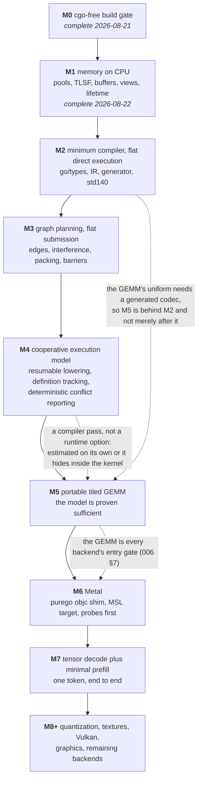

# Sequencing

This spec orders demonstrable increments. A milestone is complete only when its
tests, coverage, documentation, and E2E gate are present; declarations that panic
with `ErrNotImplemented` are scaffolding, not progress against a definition of
done.

The document changes as work lands. Completed milestone outcomes remain recorded
so the assumptions under which later work began are reviewable.

## Cross-milestone quality gates

Every implementation milestone after M0 must satisfy all of these:

- new behavior has a test that fails without it;
- the affected package has greater than 90% statement coverage on the CPU path;
- generated files are fresh under `go generate ./...` once generation exists;
- `go test -race ./...`, `go vet ./...`, `gofmt`, and the cgo-free gate pass;
- every public API added or changed is documented for a builder audience; and
- the milestone's named E2E runs through public APIs, not internal shortcuts.

Backend-specific code may be unreachable on the CPU, so its line coverage is not
used to dilute or fail the CPU package threshold. It is instead covered by its
backend entry-gate integration tests and target compiler acceptance tests.

[`011-conformance-harness.md`](011-conformance-harness.md) owns common test
execution, comparisons, capability forcing, fuzzing, and coverage reporting.
[`010-kernel-corpus.md`](010-kernel-corpus.md) owns the required kernels and
variants. Neither is a final milestone: both grow incrementally when their first
consumer lands.

## Milestones

The dotted edges are the ones the numbering does not show, and they are why §1
exists.

### M0. The cgo-free build gate — complete 2026-08-21

Shipped: `.github/workflows/ci.yml` builds, vets, and tests with
`CGO_ENABLED=0` on Linux, macOS, and Windows; checks formatting; and rejects
`import "C"` across Go files.

Implements: [`000-decisions.md`](000-decisions.md) decision 2.

Outcome: the non-functional device API surface compiles on all three v0 host
platforms and the cgo-free constraint is mechanically enforced. There were no
runtime tests because all operations remained design-stage stubs. The workflow's
negative cgo check is the acceptance test for this milestone.

### M1. Memory on the CPU backend — complete 2026-08-22

Build:

- CPU enumeration/open, device identity, capabilities, and limits;
- general TLSF and linear allocators;
- pools, buffers, typed views, `ViewAs`, lifetimes, and retain sets; and
- synchronous buffer read/write plus recorded host/device copy data ownership.

Implements: 001 §§1–3 and §§5–8, excluding textures.

Harness increment: CPU device discovery, strict/permissive mode selection,
exact byte/dtype comparisons, capability overrides, allocator fuzz plumbing, and
coverage reporting from 011.

Done:

- round trips at every v0 dtype and memory kind;
- view/reinterpretation bit patterns and every alignment/overlap rejection;
- TLSF fragmentation and bounded-operation tests plus allocator fuzzing;
- lifetime/close/retain races under `-race`; and
- E2E: public `OpenCPU(CPUOptions{})` → allocate → queue write → queue read →
  close.

Textures and formats remain deferred until graphics work; no earlier milestone
reads one.

#### M1 outcome

Built in five slices, each committed on its own:

| Slice | State |
| --- | --- |
| Backend seam, enumeration, device open, selection, dtype widths, capability and limit profiles | done |
| `internal/alloc`: TLSF and bump allocators | done |
| Pools, buffers, views, lifetime | done |
| Transfers and the M1 E2E | done |
| The 011 M1 harness increment and the coverage gate | done |

Every item in the definition of done above is satisfied. The E2E runs through
public APIs: `OpenCPU(CPUOptions{})` → allocate → queue write → queue read →
close. Coverage on the CPU path, under [011](011-conformance-harness.md) §10.1's
checked exclusions: `accel` 95.6%, `internal/alloc` 99.0%, `internal/cpu` 98.6%.
`go test -race`, `go vet`, gofmt, and the cgo-free gate all run on every commit,
which they did not before this milestone despite being named above since M0.

Four bugs are worth recording because none was a coding slip and each was found
by a test written to the spec rather than to the code:

- The TLSF size classes indexed the exponent over **bytes**, so a block spanning
  fewer bits than the mantissa shifted by a negative amount. Unreachable at the
  256-byte default granularity and reachable at every smaller one, which is why
  the fuzz target varies the granularity. Its input is a permanent seed.
- The device's live-allocation count was read under one lock and written under
  another, and `Device.Close` marked the handle dead before discovering its
  children and rolled back. Both violate [001](001-device-resources.md) §1.2's
  concurrency contract, and both were found by writing §11.7's case as it is
  actually specified: the operations *together* rather than one at a time.
- `Device.Close` then reintroduced the second of those in the branch that had no
  test. A buffer from the implicit pool is not in the explicit pool list, so
  `Close` decided it could proceed, marked the handle dead, and only then met a
  pool that refused. Corrected after this milestone was first recorded complete:
  the implicit pool's children are counted like any other, per §7.2's rule that a
  live handle means report and free nothing.
- Every element offset was scaled to bytes before being bounded, so a large one
  wrapped, landed back inside the buffer, and addressed element zero. It applied
  to `Queue.WriteBuffer`, `Queue.ReadBuffer`, `Buffer.View`, `Buffer.ViewAs`, and
  a hand-constructed `BufferView`, and §7.3 promises the worst outcome there is a
  rejection. Also corrected after the fact. The lesson generalizes: every offset
  this design carries is in elements and every device address is in bytes, so the
  scaling between them is a validation boundary and not arithmetic.

The last two landed after M1 was first recorded complete. They are corrections
to the outcome rather than edits to it, because the maintenance rule below
exists to keep this file a build history and not a tidied one.

**The package split.** The backend contract is `internal/driver`, the pure-Go
backend is `internal/cpu`, and the reusable allocator machinery will be
`internal/alloc`. accel links its backends in, so a backend cannot import
accel: everything crossing the seam is declared below both, and the duplicated
`Limits` and `Capabilities` declarations are kept in step by the compiler
rather than by a test, since Go permits the whole-struct conversion between
them only while the field lists are identical.

`Limits` and `Capabilities` cross the seam because [001](001-device-resources.md)
§1.1 requires every field to be queried at device open. A seam that carried
only raw allocations would push that query back into the public package, and
M6's Metal backend would have to reopen it.

**Where the strict-mode baselines come from.** [006](006-backends.md) §5 has
strict mode reject a backend without a published baseline profile but does not
say what one is. It is resolved as: the capability half is derived mechanically
from 006's own matrix by the rule `yes`/`emul` present, `cap`/`?`/`gated`/`no`
absent; the limit half is [002](002-compute-model.md) §1.5's portable floor
plus [001](001-device-resources.md) §3.1's alignments, since 006 declines to
pin per-backend numeric bounds until they are measured. Nothing is invented and
nothing is claimed as measured, and a measured value replaces its row at first
contact with that backend.

**Deviation 1, from [001](001-device-resources.md) §8.2: no staging ring at
M1.** §8.2 stages queue writes into a fixed ring of `Upload` blocks recycled by
a *completed submission*, and has `WriteBuffer` block when the ring is full.
There are no submissions until M3, so that recycle edge does not exist yet. At
M1 a write to a host-visible kind memcpys into the mapping and a write to
`MemoryDevice` stages into a per-batch buffer that `Flush` releases, so
`WriteBuffer` never blocks. The ring and its one blocking path land with M3's
submissions. Every observable §8.2 semantic holds at M1 unchanged: the caller's
slice is copied out before the call returns, a read flushes first, and closing
a pending destination reports `pending transfer`.

**Deviation 2, from [001](001-device-resources.md) §7.3: the per-use view check
has no public use site yet.** "Every use of a view checks the buffer" needs a
use, and M1's immediate transfers address buffers rather than views. The rule is
implemented and tested white-box, including a hand-constructed view with an
out-of-range count and a view of a closed buffer whose offsets have since been
reallocated, so wiring it to `Recorder.CopyBuffer` at M3 is wiring rather than
design. §11.3's two view cases are satisfied at that point and not before.

**Deviation 3, recorded in [011](011-conformance-harness.md) §10.1 rather than
here:** design-stage stubs are excluded from the coverage gate by a checked
syntactic rule. It is written into the owning spec because a threshold that
passes because of an undocumented exclusion is the failure mode that spec exists
to prevent.

**Deferred inside M1's own owning spec.** Textures and formats (001 §4, §11.5)
wait for graphics work, as stated above. Device-loss fault injection (001 §7.4,
§11.6) waits for M3: there is no submission to inject a loss at until one
exists, and the CPU backend cannot lose a device on its own.

### M2. Minimum compiler and flat direct CPU execution — complete 2026-08-22

Build:

- `go/types` package loading and subset validation;
- the typed structured IR required for flat control flow;
- generated registration, source hashes, binding metadata, and std140
  encoder/decoder;
- the generated Go adapter; and
- a **direct flat CPU executor** that invokes that adapter over independent
  invocations without a device Graph, shared memory, barriers, atomics, or
  subgroups.

The direct executor is test infrastructure and compiler bring-up, not a public
submission API. It disappears behind the common harness after M3. Its restricted
kernel descriptor rejects shared parameters and all cooperative intrinsics.

Implements: the CPU/flat subset of 004 and the first flat kernels from 010.

Harness increment: generated-kernel discovery, source-position negative tests,
exact/primitive bounded comparison contexts, generated-source freshness, and a
flat direct-execution adapter.

Done:

- generated flat `Add` accepts slice and uniform-struct parameters and matches an
  independent reference through the direct executor;
- std140 encode/decode round-trips structs containing scalar/vector/array fields;
- one negative test per rejected v0 construct asserts message and position;
- editing a kernel without regenerating fails freshness checks naming it; and
- E2E: source package → generator → registered adapter → direct CPU execution →
  independently checked output.

004 fixes the tool placement, closed structured-IR node set, intrinsic object
table, and internal corpus package boundary. M2 implements those decisions; it
does not reopen them inside the estimate.

#### M2 outcome

All three children are complete. A kernel written in the Go subset compiles to a
generated lowering that runs and is checked against the source it came from, and
`go generate` plus a freshness gate keep the two from drifting.

**The split was worth taking.** 009's risk table said compiler scope is
underestimated, and each child found things the others would have buried:
[012](012-kernel-pipeline.md) found a Go 1.27 alias change and a typed-nil bug,
[013](013-kernel-subset.md) found a helper-ordering bug and a naming conflict
with a shipped constant, [014](014-kernel-uniforms.md) found a flat rule where a
recursive one was needed. Delivered as one milestone, every one of those would
have arrived at the same time as the others.

**Coverage on the CPU path**, all above the gate: `kernelc` 91.5%,
`kernelc/front` 90.6%, `kernelc/emit` 94%, `kernelc/std140` 99%,
`kernelc/ir` and `kernelc/intrin` 100%, `kmath` 100%, `conformance/direct` 100%,
`cmd/accel-kernel` 95.8%.

**One obligation is carried forward rather than closed.** 014 §4's device-side
std140 check needs a kernel's reading of a block compared against a second,
independent consumer of the same bytes, and the first one is a GPU backend. It
lands with Metal at M6, and 014 records why.

#### M2 is split, per the risk table below

| Child | Scope |
| --- | --- |
| [012](012-kernel-pipeline.md) | The whole pipeline for one straight-line kernel: tool, front end, IR, intrinsic table, generated adapter, registration, digests, freshness, direct flat executor — **complete 2026-08-22** |
| [013](013-kernel-subset.md) | The rest of the authored subset: all three `for` forms, `break`/`continue`, helpers, the full scalar set, and the positioned rejection corpus — **complete 2026-08-22** |
| [014](014-kernel-uniforms.md) | Uniform structs: std140 codecs, `UniformBuffer[T]`, typed bindings, and the device-side layout check — **complete 2026-08-22**, except the device-side check, which needs a second consumer of the bytes and lands with Metal at M6 |

The cut is vertical: each child ends with source → generator → execution →
independently checked output. A horizontal cut, front end and IR first and the
lowering second, was rejected because the front end's only possible evidence is
a golden of the IR it produced, and a wrong IR passes its own golden. That is
[011](011-conformance-harness.md) §6's argument for why the generated lowering
is compared against the authored function, applied one level up. Repairing the
horizontal cut means giving the front end a second independent consumer of the
IR to check against, and that consumer is an interpreter over the typed IR,
which is the direct flat executor: pulling it in produces this split. The
vertical cut is where the horizontal one lands once its evidence has to be able
to fail.

**The order inside the split is forced, not chosen.** Uniforms cannot be first,
because [001](001-device-resources.md) §11.2 requires std140 to be checked
against the device rather than against the encoder, which needs kernel
execution. They cannot be second, because the uniform that matters is a loop
bound, and a storage-buffer substitute would make it appear non-uniform to the
barrier analysis. So 014 lands after 013 because the only honest test of it
requires control flow to exist.

### M3. Graph planning and flat compute/transfer submission

Build:

- recorder, slots, copy and **flat compute** dispatch nodes;
- edge inference, reachability interference, greedy transient packing, barrier
  planning, validation, binding/rebinding, queues, fences, and plan statistics;
- CPU lowering for transfers and flat kernels only.

Shared-memory parameters and cooperative kernels remain rejected until M4. This
keeps M3's whole-plan oracle executable without pretending barriers inside a
kernel already work.

Implements: 003 for transfer and flat compute nodes on one backend.

Harness increment: graph-plan golden comparison, naive non-aliasing/full-barrier
oracle mode, graph fuzz generation, binding failure helpers, and public queue E2E.

Done:

- 003's worked graph asserts 22 MiB unaliased, 12 MiB peak, 16 MiB allocated,
  and seven planned barriers;
- the diamond case proves unsafe transients do not alias;
- every applicable validation row has a focused negative test;
- whole-plan fuzz compares optimized execution with the naive plan; and
- E2E: public recorder with upload → flat Add dispatch → readback, retained and
  replayed with a rebound input.

#### M3 is split, on the same rule that split M2

| Child | Scope |
| --- | --- |
| [015](015-graph-recording.md) | Recorder, node and payload IR, access declaration, slots and rebinding, build validation, submission, fences, device loss, per-use view checks, copy lowering, statistics. Plans conservatively: no aliasing, one barrier per node — **complete 2026-08-22** |
| [016](016-graph-execution.md) | Edge inference, reachability, hazard classification, sub-ranges, the barrier state machine and batching, the flat dispatch node and its lowering. Carries M3's E2E and the barrier-position assertion — **complete 2026-08-23** |
| [017](017-graph-aliasing.md) | Interference over reachability, greedy packing, `GraphMemory`'s three fields diverging, aliasing handovers, and the whole-plan differential fuzz |

The cut is vertical: each child ends with something that records, plans,
submits, and produces bytes, so each is evidenced by execution rather than by a
golden of its own intermediate output. That is the rule M2's split settled, and
re-deriving it per milestone is not worth the user's time.

Two things about this cut were not obvious and are recorded because a later
reader would otherwise read them as accidents.

**The fuzz is not its own child.** The risk table below says graph aliasing is
unsound until the naive-plan fuzz and the diamond golden retire it. A child that
shipped aliasing and left the fuzz for a fourth would be recorded complete with
that risk live, which is what the maintenance rule above exists to prevent. So
the optimizer and the test that refutes it land together.

**That is affordable because 015's plan *is* the oracle.** 003 defines the naive
plan as no aliasing and a full barrier between consecutive nodes in record
order, which is exactly what 015 produces, and 015 §3 proves it correct from the
fact that record order is a topological order of any inferred DAG. 017 retains
it rather than replacing it. The benefit is not only cost: an oracle written
before the optimizer, under different constraints, cannot have inherited the
optimizer's reachability bug, and an oracle written after it is under constant
pressure to share exactly that code.

**Two M3 obligations carried from 001 are homed rather than left implicit.**
Device loss (001 §7.4) lands in 015 with the fence, since the fence is where a
caller sees it; the per-use view check (001 §7.3) lands in 015 with the access
declaration, since a graph's "use" is a declaration rather than a call. Neither
is deferred.

**"Every applicable validation row" is made concrete** in 015 §4, which maps all
24 of 003's rows to a child or to a written deferral. V7 waits on textures and
V12–V16 are 005; the rest are assigned. V24 is split across 015 and 017, because
its "including a transient" term cannot exist before placements do, and a V24
missing a term silently is a check passing for the wrong reason.

### M4. Cooperative execution model on the CPU

The cooperative lowering is a compiler pass, not a runtime option, so it is its
own milestone rather than a line item under the GEMM. 004 replaces
goroutine-per-invocation with a generated resumable lowering: the structured IR
is split at barriers and subgroup rendezvous into states, each invocation carries
a program counter and its locals, and a workgroup scheduler advances every active
invocation to its next suspension point. That transform, its instrumentation, and
the analyses that decide when it is required are the work here. Splitting it out
keeps a compiler pass from being estimated as part of a kernel.

The transform is bounded by a rule this design already imposes: 002 §3.1 requires
every barrier to sit in uniform control flow, so suspension points form a
sequence rather than an arbitrary graph and no relooper is needed. That is why
this is a milestone and not a project.

Build:

- the resumable cooperative lowering and the flat lowering, both generated from
  one IR, with the flat path selected when no shared memory, barrier, or subgroup
  operation appears;
- shared-memory definition tracking (a shadow initialized bit per element), the
  deterministic barrier-generation check, and deterministic conflicting-access
  reporting;
- atomics, emulated subgroups, and the CPU developer/strict/mimic modes; and
- uniformity and capability inference over the IR.

Implements: 002, the CPU requirements in 006 §5, 008's CPU numeric profile, and
010's `reduce_sum`.

Harness increment: cooperative diagnostics, subgroup sweeps, contraction and
rounding probes, and reduction budgets.

Done:

- CPU arm64 and amd64 numeric probes establish the available exact domain before
  another test relies on it;
- `reduce_sum` matches its higher-precision reference under 008 at lengths that
  are not multiples of the workgroup size;
- a kernel reading shared memory it never wrote fails for **every** stored bit
  pattern, so the test cannot pass because a sentinel happened to compare
  unequal;
- non-uniform arrival, two invocations reaching different barrier IDs, and an
  unordered conflicting access pair are each reported deterministically with
  source position, workgroup, and invocation, on the first offending run rather
  than on an unlucky interleaving;
- the flat and cooperative lowerings agree on every kernel eligible for both; and
- subgroup paths and their fallbacks agree at sizes 1, 4, 32, and 64.

`go test -race` runs over this milestone, and it checks the CPU **runtime**, not
the kernel. Kernel races are found by the instrumentation above, which is why
they are found deterministically.

### M5. The portable tiled GEMM on the CPU

Build: 010's `matmul` tiled variant and the guarded-tail machinery it needs.

Implements: 002 §7 and the tiled family of 010.

Done:

- the tiled f16-storage, f32-accumulate GEMM matches an independently written
  higher-precision reference under 008's per-output dot-product budget, at
  dimensions that are not multiples of any tile dimension;
- removing either of its two barriers fails: the first through conflicting-access
  reporting, the second through definition tracking or the in-band sentinel
  kernel; and
- E2E: public graph submission runs upload → portable tiled GEMM → readback in
  strict mode.

This is the first point at which the portable compute model is proven, and it is
000's second v0 proof obligation.

### M6. Metal

Build:

- Objective-C runtime shim over `purego` and Metal object lifetime management;
- Metal resources, queue, graph lowering by re-encoding per submission, and
  capability/limit queries; and
- MSL target for every v0 kernel variant already required by 010.

Implements: 006 §§2.2 and 4.3, the MSL subset of 004, and Metal profiles in 008
and 011.

Done, in order:

1. load/probe and complete device profile;
2. contraction, rounding, division, and v0 transcendental probes;
3. buffer round trip at every v0 dtype;
4. barrier/shared-memory reduction against the oracle;
5. portable tiled GEMM against the higher-precision reference; and
6. E2E: the same public upload → GEMM → readback scenario as CPU, selected by
   enumerating a Metal `AdapterID` and calling `OpenDevice`.

The numeric probes run before the GEMM. If Metal misses a normative ceiling, the
lowering or supported domain changes; tests are not widened. Completion-handler
lifetime is exercised under repeated early closes and asynchronous completion.

### M7. Tensor decode plus minimal prefill

Prerequisites: 007's v0 API is stable, 010's complete unquantized v0 tensor
kernel list is implemented on CPU and Metal, and 011's operator/model budget and
E2E layers are operational.

Build:

- `Runtime`, `Builder`, `Tensor`, persistent `State`, and caller-owned `Plan`;
- creation/input/weight/state/output ports, concrete shape/dtype inference,
  views, binding validation, lowering, and reported kernel selections;
- contiguous caller-owned KV cache and versioned ScatterRows mutation;
- the exact-shape decode plan; and
- the exact-shape minimal prefill plan needed for parity.

No automatic plan cache, quantization, sampling, production prefill buckets, or
multi-sequence scheduler is in M7.

Done:

- every 007 v0 operator contract has unit and plan-level coverage;
- a two-layer fixed-weight model produces committed higher-precision reference
  logits on CPU and Metal within its composed budget;
- incremental decode for N tokens equals the minimal prefill of the same N
  tokens within the composed Attention/model budget on both backends;
- retained plan replay, state hazards, binding errors, memory reports, selection
  reports, and one-in-flight rejection are covered; and
- E2E: caller allocation of weights/KV/input/output → compile explicit prefill
  and decode plans → prefill → repeated decode → logits readback.

This completes the v0 proof in 000. It is an unquantized correctness milestone,
not a production model-runtime claim.

### M8 and later

Independently scoped later work includes:

- a quantization representation/numerics spec followed by quantized Rows/GEMM;
- production prefill bucketing and, only then, an optional stable-identity plan
  cache;
- textures/formats and graphics;
- Vulkan plus the SPIR-V emitter, then remaining backends;
- sampling primitives and policy integration; and
- paged KV, multi-sequence scheduling, and additional transient sets.

Vulkan is the first backend priority because it gives the CPU oracle a second
vendor/API opinion and pays the cost of the real SPIR-V IR.

## Risks and retirement tests

| Risk | Retired by | Failure response |
| --- | --- | --- |
| Compiler scope is underestimated | M2's direct flat E2E and explicit IR/intrinsic decisions | Split M2; do not hide compiler design in M3/M4. **Split taken 2026-08-22 into 012, 013, and 014**, before implementation rather than after the estimate slipped. |
| Graph planning scope is underestimated | M3's transfer E2E landing before any planning exists | Split M3. **Split taken 2026-08-22 into 015, 016, and 017**, on the same vertical rule and before implementation. |
| The cooperative resumable transform is larger than one milestone | M4's flat-versus-cooperative agreement and diagnostic gates | Split M4 again; do not fold the remainder into M5's GEMM. |
| MSL cannot meet exact/contraction or primitive ceilings | M6 probes before other Metal numeric tests | Change lowering/domain or reject primitive; never widen from observation. |
| Uniformity analysis rejects correct cooperative code | M4 negative/positive corpus | Specify a CPU-checked assertion intrinsic in a later scoped change. |
| Graph aliasing is unsound | M3 naive-plan fuzz and diamond golden, **both owned by [017](017-graph-aliasing.md)**, the child that introduces the aliasing | Block later milestones until fixed. |
| Metal objects outlive autorelease ownership incorrectly | M6 close/completion stress E2E | Fix retain-set ownership before backend acceptance. |
| Tensor state mutation escapes graph hazards | M7 versioned-state negatives and prefill/decode parity | Fix State lowering; never add an untracked in-place escape hatch. |
| CPU oracle has no second opinion | Vulkan after v0 | Keep strict portable mode conservative and state the limitation. |

## Maintenance rule

Once implementation starts, its definition of done is not rewritten to match
what happened. Split a milestone or record a scoped deviation. On completion,
append its date and actual outcome, update the owning specs, and keep this file as
the historical build order rather than a second source of behavioral truth.
