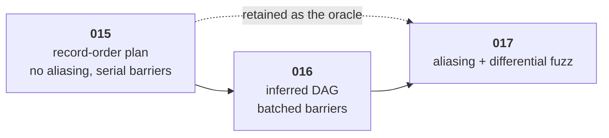

# Graph recording and transfer submission

The first of [009](009-sequencing.md)'s three M3 children. It makes a graph a
real object: recorded, validated, built once, submitted many times, waited on,
and executed. What it deliberately leaves out is every part of planning that is
hard, and [section 3](#3-the-record-order-plan) proves that what is left is
still correct.

## 1. Why transfers first, and why the plan it produces is kept

**Transfers first**, because a copy-only graph is the smallest thing that is
genuinely a graph rather than a rehearsal of one. It has nodes, resources,
declared accesses, hazards between them, a plan, a submission, a fence, a
completion, and an execution that produces bytes a test can read back. It is
missing exactly two things: the dispatch payload, and a barrier plan worth
computing. Both are [016](016-graph-execution.md).

**The plan is kept**, and this is the part that decides the shape of all three
children. [003](003-command-graph.md)'s whole-plan oracle is defined as
executing the graph a second time under a *naive plan* — no aliasing at all, a
full barrier between every pair of nodes in record order — and comparing
results. That is precisely the plan this child produces. So the oracle is not
scaffolding [017](017-graph-aliasing.md) builds at the end and throws away; it
is this child's planner, retained as a second mode.

That ordering matters for a reason beyond cost. A differential test is only
worth running if the oracle cannot share a bug with the thing it checks. An
oracle written *after* the optimizer, by the person who just wrote the
optimizer, is under constant pressure to share its reachability code, its
interference relation, and therefore its mistakes. An oracle that already
existed, shipped, and passed its own tests before the optimizer was designed is
independent by construction.

## 2. What it builds

- **`Recorder`**, from `Device.NewRecorder`, with [003](003-command-graph.md)'s
  recording rules: single-goroutine, one `Build`, and a built graph that is
  immutable.
- **The node and payload IR** for the transfer payloads only:
  `CopyBufferToBuffer`, and the host-facing `CopyToBuffer` / `CopyFromBuffer`.
  The payload interface is closed the way the kernel IR is closed, by an
  unexported marker method, so a later payload is an addition to this list and
  never an escape from it.
- **Resource access declaration**: every node declares, at record time, which
  resources it touches, over which byte range, in which mode. This is the input
  to everything [016](016-graph-execution.md) and [017](017-graph-aliasing.md)
  compute, so it lands here in full even though this child consumes only part
  of it.
- **Graph slots**: `Slot`, `SlotDescriptor`, and `Graph.Rebind`, with V21 and
  V24 as below. A slot is why a graph is worth building once, so it is not
  deferred.
- **Transients**, declared and allocated, each with its own bytes.
- **`Build`**, producing an immutable `Graph` carrying its plan, its statistics,
  and its `GraphMemory`.
- **Submission**: `Graph.Submit`, `Fence`, `Fence.Wait`, the ordering guarantees
  of [003](003-command-graph.md) §"Submission ordering and fences", and the
  one-submission-in-flight rule.
- **Device loss**, [001](001-device-resources.md) §7.4: the fence is where a
  lost device becomes visible to a caller, so the state machine lands with the
  fence rather than being carried further.
- **Per-use view checking**, [001](001-device-resources.md) §7.3: a view's range
  is checked against its buffer at every use, which for a graph means at record
  time for a concrete resource and at rebind and submit for a slot.
- **CPU lowering** for the transfer payloads.
- **Plan-time statistics**, [003](003-command-graph.md) §"Plan-time facts".

## 3. The record-order plan

The plan is one sentence: **execute nodes in record order, with a full barrier
between consecutive nodes.** No edge inference, no reachability, no interference,
no packing. `GraphStats.Barriers` equals the node count.

It is worth stating why that is correct rather than merely conservative, because
[017](017-graph-aliasing.md) leans on the claim.

> **Claim.** For any graph *G*, the record-order plan satisfies every hazard the
> inferred plan of [016](016-graph-execution.md) would express.
>
> **Proof.** [003](003-command-graph.md) §"Acyclicity is structural" establishes
> that every inferred edge runs from a lower node id to a strictly higher one:
> an edge exists only because a later node's declared access conflicts with an
> earlier node's, and record order assigns ids in the order accesses were
> declared. Record order is therefore a topological order of the inferred DAG,
> so a serial execution in record order respects every edge. A full barrier
> between consecutive nodes makes every write of node *i* visible to every
> access of node *j > i*, which covers every RAW, WAR, and WAW the inference
> could classify. ∎

The converse does not hold, and that is the point of [016](016-graph-execution.md):
the record-order plan expresses hazards that do not exist, which is what makes
it correct and slow. On the worked graph of [003](003-command-graph.md) it emits
eight barriers where seven suffice, and it serializes `n2` and `n3` — the two
GEMMs, the pair whose overlap matters most.

### What `GraphMemory` reports here

Two of the three fields are computable without a planner, so all three are
reported from this child and only one of them changes later:

| Field | Here | After [017](017-graph-aliasing.md) |
| --- | --- | --- |
| `UnaliasedBytes` | Σ aligned sizes | unchanged, by definition |
| `PeakBytes` | max over record-order positions of Σ sizes of transients whose record-order interval covers it | unchanged: it is defined over the record-order linearization, which needs no reachability |
| `TransientBytes` | **equal to `UnaliasedBytes`** | the packed pool size |

Reporting all three now, with the third deliberately pinned to the first, is
what makes [017](017-graph-aliasing.md)'s effect a measured difference rather
than a new number appearing.

## 4. Validation: which rows apply, and where

[003](003-command-graph.md) §"Every check" has 24 rows and M3's done criteria
ask for "every applicable validation row". Applicable is made concrete here so a
later reader cannot mistake a scoped-out row for an omission:

| Row | Where | Note |
| --- | --- | --- |
| V1–V6 | **015** | binding completeness, kind, dtype, access, size, usage |
| V7 | deferred | textures, [001](001-device-resources.md) §4, unbuilt |
| V8–V11 | [016](016-graph-execution.md) | workgroup counts, sizes, shared memory — all dispatch |
| V12–V16 | deferred | [005](005-graphics.md), post-v0 |
| V17 | [016](016-graph-execution.md) | node capabilities; the first node needing one is a dispatch |
| V18, V19 | **015** | copy extents; resource ownership and openness |
| V20 | [017](017-graph-aliasing.md) | the planned pool against the device budget |
| V21 | **015** | recorded use covered by its `SlotDescriptor` |
| V22 | [016](016-graph-execution.md) | acyclicity is an assertion over an inferred edge set |
| V23 | **015** | concrete same-node overlap |
| V24 | **split — see below** | graph-wide dynamic overlap |

### V24 spans this child and [017](017-graph-aliasing.md)

V24 rejects a rebind in which a resource supplied through a slot overlaps
another dynamic binding, or any concrete graph resource **including a
transient**, when either side may write. The transient term cannot exist until
transients have placements, and before [017](017-graph-aliasing.md) they have no
shared bytes to collide over. So:

- **Here**: dynamic-vs-dynamic and dynamic-vs-concrete, over declared byte
  ranges, at rebind and at submit, returning `ErrRebindOverlap`.
- **[017](017-graph-aliasing.md)**: the dynamic-vs-transient term, once
  placements exist.

Written into both specs rather than left to the implementation, because a V24
that silently omits a term is a check that passes for the wrong reason, and the
only way to see that is to have said in advance which term is missing.

## 5. What it does not build

Stated so the ceiling is known and so [016](016-graph-execution.md)'s scope is
not read as overlap:

- **No edge inference.** No reachability, no hazard classification, no sub-range
  comparison. §3's claim is what makes their absence sound rather than
  postponed.
- **No barrier planning.** No per-resource state machine, no batching.
- **No aliasing.** Every transient gets its own bytes.
- **No dispatch.** A pipeline cannot be recorded into a graph yet. Attempting it
  is `ErrNotImplemented` naming M3's second child, not an unknown-payload error.
- **No indirect dispatch, no render pass.**

## 6. Testing

- **E2E**: a recorder builds a graph of copies, submits it, waits, and reads
  back the expected bytes; then rebinds a slot and resubmits the same graph,
  producing the second input's bytes with no rebuild.
- Every applicable row of §4 has a focused negative test asserting the message
  names what the row's "Error says" column requires.
- A `Build` on a recorder that already built fails; a second `Submit` while one
  is in flight fails; a recorded node referencing another device's resource
  fails.
- `Fence.Wait` on a graph whose device was lost reports the loss, and a
  submission on a lost device fails at submit rather than at wait.
- `GraphMemory` reports `TransientBytes == UnaliasedBytes` and a `PeakBytes`
  computed independently by a test that walks record-order intervals directly.
  The worked graph of [003](003-command-graph.md) asserts 22 MiB and 12 MiB
  here, which is the half of M3's numeric criterion this child can carry.
- `GraphStats.Barriers` equals the node count, asserted as the definition of the
  conservative plan rather than as an incidental fact, so that
  [016](016-graph-execution.md) lowering it is a visible change.
- A fuzz target builds random transfer graphs and asserts that build either
  succeeds or fails with a validation error naming a row, never panics.
- A benchmark separates build cost from submit cost, because
  [003](003-command-graph.md)'s claim is that the second is small and that claim
  needs a number before [016](016-graph-execution.md) makes the first larger.

## 7. Open questions

- **Whether a transfer-only graph should be submittable at all**, or whether the
  API should require at least one dispatch. It should be submittable: an upload
  batch is a real use, and refusing it would make this child untestable on its
  own terms. Recorded because the question will come back when
  [007](007-tensor-layer.md) uploads weights.
