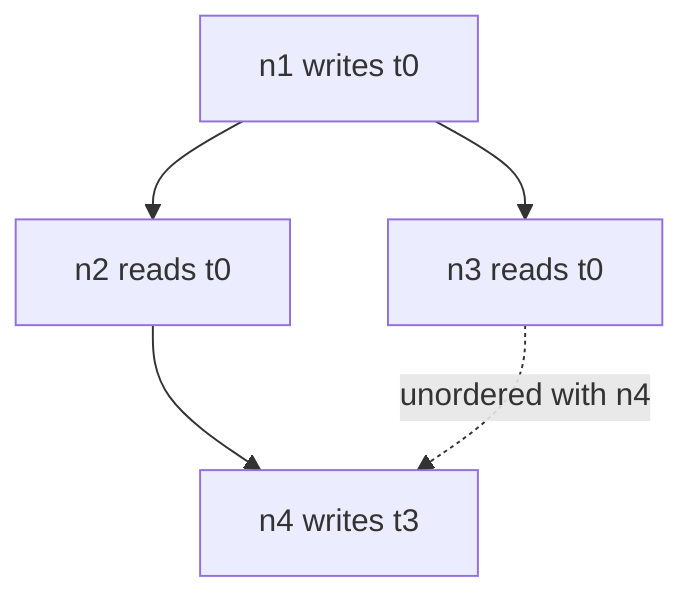

# Transient aliasing and the whole-plan oracle

The third of [009](009-sequencing.md)'s three M3 children. It makes the graph's
memory small, and in the same change it makes the claim that the graph is still
correct something a test can refute.

## 1. Why the optimizer and its oracle land together

[009](009-sequencing.md)'s risk table has one row that blocks later milestones:

> Graph aliasing is unsound | M3 naive-plan fuzz and diamond golden | Block
> later milestones until fixed

A child that landed aliasing and left the fuzz for a fourth would be recorded
complete with that risk still live, which is exactly the kind of tidy history
[009](009-sequencing.md)'s maintenance rule exists to prevent. The risk is
introduced here, so it is retired here.

That is affordable because the oracle already exists.
[015](015-graph-recording.md)'s plan — no aliasing, a full barrier between
consecutive nodes in record order — *is* [003](003-command-graph.md)'s naive
plan, and [015](015-graph-recording.md) §3 proves it correct. It is retained
rather than replaced, so this child's differential test compares two executors
that were designed months apart under different constraints, one of which had
never heard of interference.

## 2. Liveness on a DAG is an interference relation, not an interval

This is the whole content of the child, so it is stated as a claim and a
counterexample rather than as an algorithm.

An interval planner assigns each transient the record-order span from its first
to its last user and aliases transients whose spans are disjoint. On a DAG that
is unsound, and the counterexample is a diamond:



`t0`'s record-order interval is `[n1, n3]` and `t3`'s is `[n4, …]`. Disjoint, so
an interval planner aliases them. But `n3` reads `t0` and `n4` writes `t3`, and
nothing orders `n3` before `n4` — so a backend that runs the two arms at once,
which is every backend doing what the DAG permits, corrupts `t0`.

The sound test is reachability, not position:

```
compatible(T, U)  ⟺  ∀ t ∈ users(T), ∀ u ∈ users(U) :
                        reaches(t, u) ∨ reaches(u, t)
```

Every user of one must be ordered against every user of the other. On the worked
graph this is exactly the `t0`/`t3` row of [003](003-command-graph.md)'s
compatibility table, and it is why the pool is 16 MiB rather than the 12 MiB an
interval planner reports.

## 3. Packing is dynamic storage allocation

Not graph colouring: colouring assigns transients to equal slots and transients
have different sizes. The formulation is to give each transient an offset in one
pool such that interfering transients do not overlap in bytes — NP-hard, so what
lands is [003](003-command-graph.md)'s greedy heuristic, size descending with
first-writer node id as the tie break.

The tie break is not cosmetic. Without it the layout depends on sort stability,
and the plan golden flaps.

## 4. What the three `GraphMemory` fields become

[015](015-graph-recording.md) pinned `TransientBytes` to `UnaliasedBytes`. Here
they separate, and the gap between `PeakBytes` and `TransientBytes` becomes the
number that has to be explained rather than hidden:

| Field | Worked graph | Meaning of the gap |
| --- | --- | --- |
| `UnaliasedBytes` | 22 MiB | what no planning costs |
| `PeakBytes` | 12 MiB | the record-order lower bound, achievable only by an executor that ran strictly serially |
| `TransientBytes` | 16 MiB | what is allocated |

The 4 MiB between 12 and 16 is **not** fragmentation — the pool is fully packed.
It is the price of DAG-safe aliasing, and it is precisely the `t0`/`t3` pair
§2 refused to merge. Reporting both is what stops 16 from looking like a planner
failure, and 16 is optimal here: `{t0, t1, t2, t3}` are pairwise interfering, so
no assignment places four 4 MiB transients in less.

## 5. Aliasing handovers, and V24's remaining term

Two transients sharing bytes need a barrier between the last use of one and the
first use of the other, because the second's writes must not be reordered before
the first's reads. On the worked graph both handovers ride on a barrier the data
flow required anyway, so the barrier count does not change — which is an
assertion, not a hope.

**V24's transient term turned out to be unreachable, and is not added.**
[015](015-graph-recording.md) §4 expected it: once transients have placements, a
resource supplied through a slot could overlap one. The case cannot occur,
because a transient cannot reach a slot at all. `BufferView.check` refuses one at
bind time — *"it is a graph transient, whose memory the builder owns and may
reuse between nodes, so only the graph that declared it may touch it"* — and
that refusal is **stricter** than the overlap test would be: it rejects every
transient offered through a slot, overlapping or not.

A caller has no other route to those bytes. Transients live in memory the
builder allocates and no public allocator hands out, so the only handle that
names them is the one `Recorder.Transient` returns, and that is what the check
above catches.

So V24 keeps the terms it had, and this is recorded rather than quietly dropped
for two reasons. A reader comparing 015 §4 against the code would otherwise find
a promised term missing and reasonably conclude the check was unsound. And the
vacuity is a property of a *different* check, so relaxing `BufferView.check`
would make V24 incomplete without touching V24 — which is why §7's corpus pins
the upstream refusal rather than the overlap it makes impossible.

Row V20 also lands here: the planned pool against the device's reported budget.

## 6. The whole-plan oracle

The strongest test available, and cheap because [015](015-graph-recording.md)
already built half of it.

```
for a randomly generated graph G:
    a = execute(G, plan = optimized)     # 016's edges, 017's aliasing
    b = execute(G, plan = record-order)  # 015's plan, retained
    assert bytes(a) == bytes(b)
```

Any disagreement is a planner or barrier bug, localized to the builder rather
than to a kernel, because both sides ran the same kernels over the same inputs.
Generation randomizes node count, access patterns, sub-ranges, transient sizes,
and — critically — graph *shape*, since the bug §2 describes needs a diamond and
a generator that only produces chains will never see it.

Determinism makes the comparison meaningful: the executor is deterministic by
[003](003-command-graph.md) §"Determinism", so a disagreement is a plan
difference and never scheduling noise.

## 7. Testing

- The worked graph of [003](003-command-graph.md) asserts 22 MiB unaliased,
  12 MiB peak, and 16 MiB allocated, and asserts the offset table row by row.
  This completes M3's numeric criterion, whose first two numbers
  [015](015-graph-recording.md) already carried.
- The diamond of §2 asserts `t0` and `t3` are **not** aliased, written as a
  direct assertion on the placement rather than as an output comparison, because
  an output comparison on the CPU backend can pass while the placement is wrong.
- A test drives the interval planner over the same diamond and asserts it
  produces the unsound layout, so the counterexample is executable and not only
  described. It is the regression that keeps someone from "simplifying"
  reachability back into intervals.
- §6's differential fuzz, with the diamond-producing seed committed.
- Aliasing the worked graph adds no barrier, asserted against
  [016](016-graph-execution.md)'s count.
- V20 and V24's transient term have focused negative tests; V24's is a rebind of
  a slot onto a range overlapping a transient placement.
- A benchmark reports packing cost against transient count, since
  [003](003-command-graph.md) claims `O(n² log n)` and claims it is acceptable at
  200 transients.

## 8. Outcome — complete 2026-08-23

Everything in §§2–6 is built and §7's cases pass, including
[003](003-command-graph.md)'s worked graph asserted at its own sizes: 22 MiB
unaliased, 12 MiB peak, 16 MiB allocated, with every transient's user set
matching the spec's compatibility table. M3's numeric criterion is complete.

### 8.1 The oracle found three bugs, all of them in the implementation

**The interference relation was implemented per pair rather than uniformly.**
[003](003-command-graph.md) is unambiguous — "every node touching one is
ordered, by the inferred DAG, before every node touching the other", with a
formula and reference code that both say so, and a note that `x ≺ x` is false.
The first implementation here accepted *any* per-pair ordering instead, which
permits U's entire lifetime to sit between two users of T: U's write lands in
T's bytes while T is still live, and T's later reader sees U's data.

The oracle produced that shape within seconds — `t0` written by `n0` and read by
`n3`, `t1` used only by `n2`, with `n0 → n2 → n3` — and §2's relation is what
003 asked for all along. **The spec was right and the code was wrong**, which is
the useful direction for a spec to be, and it is the argument for having written
the relation down before implementing it.

**Reading a transient nothing wrote is now a build error, checked per byte
range.** Without aliasing such a read returns zeros — wrong but stable. With
aliasing it returns whatever transient shares those bytes, which is a wrong
answer whose value depends on the packer and therefore on an unrelated
transient's *size*. That is the worst failure mode this design admits, and the
builder can see it, so it says so. The oracle found three variants in order: a
transient nothing writes at all, one only partly written and then read whole,
and a node reading and writing a transient as its first user — which reads what
was there when it started, and that is nothing. In-place work stays legal as
soon as an earlier node writes it, which is what makes it an update rather than
a read of nothing. This is a validation row 003 does not list.

**A kernel panic now reaches the fence rather than aborting.** On a GPU an
out-of-bounds access is clamped or undefined; on this backend it is a Go panic
raised inside a goroutine the caller did not start and cannot recover in.
[006](006-backends.md) §5 makes this backend the oracle, and failing loudly
means a reported error naming the kernel, not a process abort.

After the three fixes, 13.9 million fuzz executions found nothing further. Each
bug also has a focused test, and each fix was confirmed by reinstating the old
rule and watching the right test fail — including one that had to be rebuilt,
because the first attempt at the "lifetime in between" case used transients
that were plainly unordered and so did not distinguish the two relations at all.

### 8.2 What the numbers say

| Measure | Value |
| --- | --- |
| Worked graph, unaliased | 22 MiB |
| Worked graph, peak | 12 MiB |
| Worked graph, allocated | 16 MiB, which is optimal here |
| Packing, 128 transients | ≈580 µs, superlinear as `O(n² log n)` predicts |

The 16 MiB assertion has an honest limit: this graph reaches its lower bound
under greedy-by-first-use too, so the test does not discriminate between packing
orders. 003 says as much — four pairwise interfering 4 MiB transients admit no
assignment under 16 — so size-descending stays a general claim rather than one
this case proves.

### 8.3 What it added beyond §§2–6

- **`Recorder.BuildNaive`**, the conservative planner of
  [015](015-graph-recording.md) retained as a second mode rather than deleted.
  §1 said the oracle already existed; this is the name it exists under.
- **`Graph.TransientPlacement`**, because a placement is the thing worth
  asserting on. An output comparison can pass on a backend that executes
  serially while the layout is unsound, since such a backend cannot observe the
  race the layout would create on one that overlaps.
- **`Graph.Edges` and `Graph.Hazards`** came from
  [016](016-graph-execution.md) and are what the placement assertions read
  alongside.

## 9. What it does not build

[003](003-command-graph.md) §"What this does not optimize" is the list, and none
of it changes here: no node reordering, no transient splitting, no aliasing of
caller buffers, no aliasing across graphs, no locality. Each is a stated ceiling
rather than an omission, and the cross-graph one is the open question
[007](007-tensor-layer.md) prices at a gigabyte per session.
