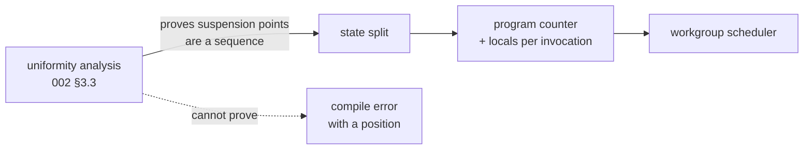

# The resumable cooperative lowering

The first of [009](009-sequencing.md)'s three M4 children. It is the compiler
pass 009 says must not be estimated as part of a kernel: goroutine-per-invocation
is replaced by a generated lowering whose invocations suspend and resume, and a
scheduler that advances them.

## 1. What makes this a milestone and not a project

One rule, imposed by [002](002-compute-model.md) §3.1 and enforced here:

> **Every barrier sits in control flow uniform at its scope.**

Suspension points therefore form a *sequence* rather than an arbitrary graph. A
transform over a sequence needs a program counter; a transform over a graph
needs a relooper, and a relooper is a project. So the uniformity analysis is not
a diagnostic bolted on afterwards — **it is the transform's precondition**, and
it lands here rather than with the other diagnostics in
[019](019-cooperative-diagnostics.md).

## 2. What it builds

- **The uniformity analysis** of [002](002-compute-model.md) §3.3: a forward
  dataflow over the typed IR computing `WorkgroupUniform`, `SubgroupUniform`, or
  `NonUniform` for every value, with that section's seed table and propagation
  rule. When it cannot decide, it rejects, with the position and the predicate
  it could not prove uniform.
- **Shared memory and `Thread.Barrier`** as authored constructs: a kernel may
  declare workgroup-shared storage and call a barrier, and the intrinsic table's
  `Cooperative` stage stops meaning "rejected, arrives at M4".
- **The state split**: the structured IR is cut at each suspension point into
  states, each invocation carries a program counter and its live locals, and the
  generated lowering is a loop over a switch on that counter.
- **The workgroup scheduler**: advances every active invocation to its next
  suspension point, then releases the epoch. Deterministic by default, with the
  shuffled order [006](006-backends.md) §5 already exposes as an option.
- **Selection between the two lowerings**: flat when no shared memory, barrier,
  or subgroup operation appears; cooperative otherwise. Both are generated from
  one IR, which is what makes the agreement in §4 meaningful.

## 3. Why both lowerings, when one would do

The cooperative lowering can execute a flat kernel. Keeping the flat path is
therefore a deliberate cost, and it buys two things.

**Speed, which is the obvious one.** A flat kernel is an ordinary Go loop; the
cooperative one is a loop over a switch with an explicit frame per invocation.
Most kernels in [010](010-kernel-corpus.md) are flat.

**A differential oracle, which is the one that matters.** Every kernel eligible
for both can be run both ways and compared, and a disagreement is a bug in the
transform, localized to the transform, because both sides came from one IR and
ran over the same inputs. [017](017-graph-aliasing.md) built exactly this shape
for the graph planner and it found three bugs in minutes — including one in a
relation that had been written down correctly and implemented wrongly. That is
direct evidence for the shape, not an analogy, so **the agreement is this
child's definition of done rather than a note against it**.

## 4. Testing

- **The differential oracle.** Every kernel in the corpus that is eligible for
  both lowerings runs both ways over the same inputs, and the results are
  compared bit for bit. Bit-for-bit, not within a tolerance: one IR, one set of
  rounding points, so any difference is the transform's.
- A kernel with one barrier and shared memory runs, and its result matches the
  authored function under [004](004-kernel-authoring.md)'s fifth testing level.
- The state split is asserted on the generated code, not only on results: a
  kernel with two barriers generates three states, and a golden of the lowering
  is committed, because a transform that produces the right answer by an
  unexpected shape is a transform nobody can reason about later.
- Every seed in [002](002-compute-model.md) §3.3's table has a positive test at
  its stated level, and the propagation rule's `if l < 4 { x = 1 } else { x = 2 }`
  case has a negative one, because that is where the naive analysis says uniform.
- A barrier under a non-uniform predicate is rejected with a position naming the
  predicate; so is one inside a loop whose trip count is non-uniform, and one
  reached by a `break` under a less uniform predicate.
- The two known false rejections of §3.3 — a predicate uniform by construction
  flowing through shared memory, and a loop bound from a storage buffer — are
  each a test asserting the *rejection*, so the cost of the conservative choice
  is visible and a later escape hatch has something to change.
- A benchmark reports the cooperative lowering's cost against the flat one on a
  kernel eligible for both, since §3 claims the gap is why both exist.

## 5. What it does not build

- **No atomics and no subgroups.** [020](020-cooperative-atomics.md). A kernel
  using either is rejected by name, as it is today.
- **No shared-memory instrumentation.** Reading shared memory before writing it
  is undefined here and diagnosed in
  [019](019-cooperative-diagnostics.md); this child fills shared memory with a
  poison pattern so the behaviour is at least loud, and does not yet claim the
  read is *detected*.
- **No non-uniform-arrival detection.** The static analysis rejects what it can
  prove; [019](019-cooperative-diagnostics.md) catches the rest at runtime.

## 6. Open question

- **Whether the flat lowering survives past v0.** §3 makes the case for keeping
  it, and the differential oracle is most of that case. Once the transform has
  been stable for a while the oracle's value falls and the maintenance cost of
  two lowerings does not. Worth revisiting at M6, when a second backend gives a
  different oracle.
