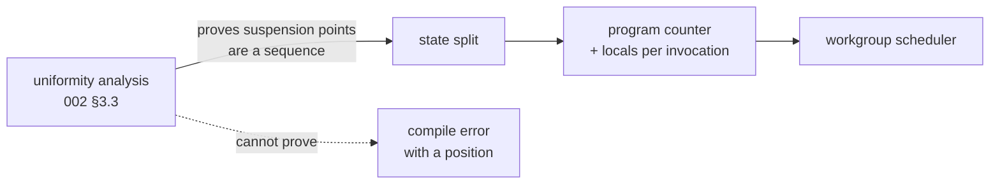

# The resumable cooperative lowering

The first of [009](009-sequencing.md)'s three M4 children. It is the compiler
pass 009 says must not be estimated as part of a kernel: goroutine-per-invocation
is replaced by a generated lowering whose invocations suspend and resume, and a
scheduler that advances them.

## 1. What makes this a milestone and not a project

One rule, imposed by [002](002-compute-model.md) §3.1 and enforced here:

> **Every barrier sits in control flow uniform at its scope.**

Suspension points therefore form a *sequence* rather than an arbitrary graph. A
transform over a sequence needs a program counter; a transform over a graph
needs a relooper, and a relooper is a project. So the uniformity analysis is not
a diagnostic bolted on afterwards — **it is the transform's precondition**, and
it lands here rather than with the other diagnostics in
[019](019-cooperative-diagnostics.md).



## 2. What it builds

- **The uniformity analysis** of [002](002-compute-model.md) §3.3: a forward
  dataflow over the typed IR computing `WorkgroupUniform`, `SubgroupUniform`, or
  `NonUniform` for every value, with that section's seed table and propagation
  rule. When it cannot decide, it rejects, with the position and the predicate
  it could not prove uniform.
- **Shared memory and `Thread.Barrier`** as authored constructs: a kernel may
  declare workgroup-shared storage and call a barrier, and the intrinsic table's
  `Cooperative` stage stops meaning "rejected, arrives at M4".
- **The state split**: the structured IR is cut at each suspension point into
  states, each invocation carries a program counter and its live locals, and the
  generated lowering is a loop over a switch on that counter.
- **The workgroup scheduler**: advances every active invocation to its next
  suspension point, then releases the epoch. Deterministic by default, with the
  shuffled order [006](006-backends.md) §5 already exposes as an option.
- **Selection between the two lowerings**: flat when no shared memory, barrier,
  or subgroup operation appears; cooperative otherwise. Both are generated from
  one IR, which is what makes the agreement in §4 meaningful.

## 3. Why both lowerings, when one would do

The cooperative lowering can execute a flat kernel. Keeping the flat path is
therefore a deliberate cost, and it buys two things.

**Speed, which is the obvious one.** A flat kernel is an ordinary Go loop; the
cooperative one is a loop over a switch with an explicit frame per invocation.
Most kernels in [010](010-kernel-corpus.md) are flat.

**A differential oracle, which is the one that matters.** Every kernel eligible
for both can be run both ways and compared, and a disagreement is a bug in the
transform, localized to the transform, because both sides came from one IR and
ran over the same inputs. [017](017-graph-aliasing.md) built exactly this shape
for the graph planner and it found three bugs in minutes — including one in a
relation that had been written down correctly and implemented wrongly. That is
direct evidence for the shape, not an analogy, so **the agreement is this
child's definition of done rather than a note against it**.

## 4. Testing

- **The differential oracle.** Every kernel in the corpus that is eligible for
  both lowerings runs both ways over the same inputs, and the results are
  compared bit for bit. Bit-for-bit, not within a tolerance: one IR, one set of
  rounding points, so any difference is the transform's.
- A kernel with one barrier and shared memory runs, and its result matches the
  authored function under [004](004-kernel-authoring.md)'s fifth testing level.
- The state split is asserted on the generated code, not only on results: a
  kernel with two barriers generates three states, and a golden of the lowering
  is committed, because a transform that produces the right answer by an
  unexpected shape is a transform nobody can reason about later.
- Every seed in [002](002-compute-model.md) §3.3's table has a positive test at
  its stated level, and the propagation rule's `if l < 4 { x = 1 } else { x = 2 }`
  case has a negative one, because that is where the naive analysis says uniform.
- A barrier under a non-uniform predicate is rejected with a position naming the
  predicate; so is one inside a loop whose trip count is non-uniform, and one
  reached by a `break` under a less uniform predicate.
- The two known false rejections of §3.3 — a predicate uniform by construction
  flowing through shared memory, and a loop bound from a storage buffer — are
  each a test asserting the *rejection*, so the cost of the conservative choice
  is visible and a later escape hatch has something to change.
- A benchmark reports the cooperative lowering's cost against the flat one on a
  kernel eligible for both, since §3 claims the gap is why both exist.

## 5. Outcome — the transform is built, with one gap

§2 is built and §4's cases pass, except the state split's reach: **a barrier
inside a loop is refused by position rather than lowered**, because the state
machine would have to resume in the middle of that loop carrying its induction
variable across the epoch.

That remains this child's work rather than moving to
[020](020-cooperative-atomics.md), even though `reduce_sum` is what needs it.
[009](009-sequencing.md)'s rule for this milestone is that a compiler pass is
not estimated as a line item under a kernel, and handing the mid-loop split to
the child that owns the reduction is that mistake at a smaller scale. 020
depends on it and says so.

Recorded here rather than left implicit, because a reader of §2 would otherwise
believe every legal barrier lowers.

**The flat-versus-cooperative differential runs** over every corpus kernel
eligible for both, comparing bit for bit. It is what §3 argued for and it
exercises the scheduler's own machinery — the per-invocation frames, the epoch
loop, the id computation — against the path that uses none of it.

### 5.1 Two things Go's own rules made visible

Both would otherwise have compiled and computed something else, which is the
failure mode this project spends its budget avoiding.

- **Shared memory is a pointer to its array.** Passing the array by value gives
  every invocation its own copy, which is the opposite of what shared means and
  is not a type error.
- **A frame-resident local is assigned, not redeclared.** Emitting `var` inside
  the lowering shadows the frame field, so the value is lost at the next
  suspension point.

### 5.2 The bring-up kernel had to be rewritten to be worth anything

The first version had one invocation publish a value and the rest read it, and
it **passed with the rendezvous removed entirely** — because the publisher is
invocation zero and happens to run first in sequence. A test that cannot tell a
barrier from a no-op is not testing the barrier.

The corpus kernel now has each invocation read its *neighbour's* slot, so
sequential execution reads poison and the wrong lowering produces NaNs rather
than the right answer slowly. The same mistake appeared in the id comparison:
recording only the global id let a scheduler that swapped the local id's axes
pass, and a kernel addressing a shared tile reads exactly the id that was wrong.

Both were caught by reinstating the bug and watching the test not fail, which is
worth doing on every differential: **a test that passes proves less than one
seen to fail for the stated reason.**

### 5.3 Shared storage is poisoned, and that is not the whole answer

Zero is a value a kernel legitimately expects, so a read-before-write would
return something plausible and survive every test. A quiet NaN propagates
through arithmetic instead. But a poison *value* is still a value a kernel could
compute, which is why [019](019-cooperative-diagnostics.md) makes the read
itself detected rather than merely loud.

### 5.4 What it added beyond §2

- **`kernel.Frame` and `Kernel.Cooperative`**, the scheduler's per-invocation
  slot and the resumable entry point. A cooperative kernel has no `Flat` at all.
- **`Kernel.NewShared`**, generated, because only the generated code knows each
  shared array's element type and extent; the runtime would need reflection.
- **`Kernel.Suspensions`**, which bounds the epoch loop. Exceeding it means the
  generated program counter is not advancing — a defect in the transform rather
  than in the kernel, so it reports rather than looping forever.
- **`ir.SharedMem`** and `Func.Shared`, since a kernel's shared storage is part
  of its signature and a backend needs it at pipeline creation.
- **`Thread.Barrier` does nothing rather than panicking.** The authored function
  has to be runnable, because spec 004's fifth level compares the generated
  lowering against it, and an unexecutable reference is not a reference.

## 6. The mid-loop split, and how it will be checked

A barrier inside a uniform loop needs three states rather than two, because the
loop's back edge becomes a resumption point:

```
     ┌──────────────────────────────┐
     ▼                              │
  ┌─────┐   ┌──────────┐   ┌────────┴─┐
  │check│──▶│body,      │──▶│body,     │
  │cond │   │pre-barrier│   │post-     │
  └──┬──┘   └──────────┘   │barrier,  │
     │         suspend      │then post │
     │                      └──────────┘
     ▼ done
```

The induction variable lives in the frame already, since every local does, so
what is new is the numbering: the state after the barrier must fall through to
the loop's post statement and back to the check rather than to the next
top-level segment.

**How it will be checked, and why not with a golden.** The oracle is an
*unrolled* version against a *looped* one: a fixed-stride reduction written with
its barriers at the top level, which this child lowers today, against the same
computation with the barrier inside the loop. Same inputs, same IR node set,
compared bit for bit — so a disagreement is the new state numbering's and
nothing else's.

That is stronger than a golden of the generated shape, which would tell us the
shape changed rather than whether it is right. It is also the pattern that found
three bugs in [017](017-graph-aliasing.md) and two in this child, so it is the
first thing to build rather than the last.

## 7. What it does not build

- **No atomics and no subgroups.** [020](020-cooperative-atomics.md). A kernel
  using either is rejected by name, as it is today.
- **No shared-memory instrumentation.** Reading shared memory before writing it
  is undefined here and diagnosed in
  [019](019-cooperative-diagnostics.md); this child fills shared memory with a
  poison pattern so the behaviour is at least loud, and does not yet claim the
  read is *detected*.
- **No non-uniform-arrival detection.** The static analysis rejects what it can
  prove; [019](019-cooperative-diagnostics.md) catches the rest at runtime.

## 8. Open question

- **Whether the flat lowering survives past v0.** §3 makes the case for keeping
  it, and the differential oracle is most of that case. Once the transform has
  been stable for a while the oracle's value falls and the maintenance cost of
  two lowerings does not. Worth revisiting at M6, when a second backend gives a
  different oracle.
