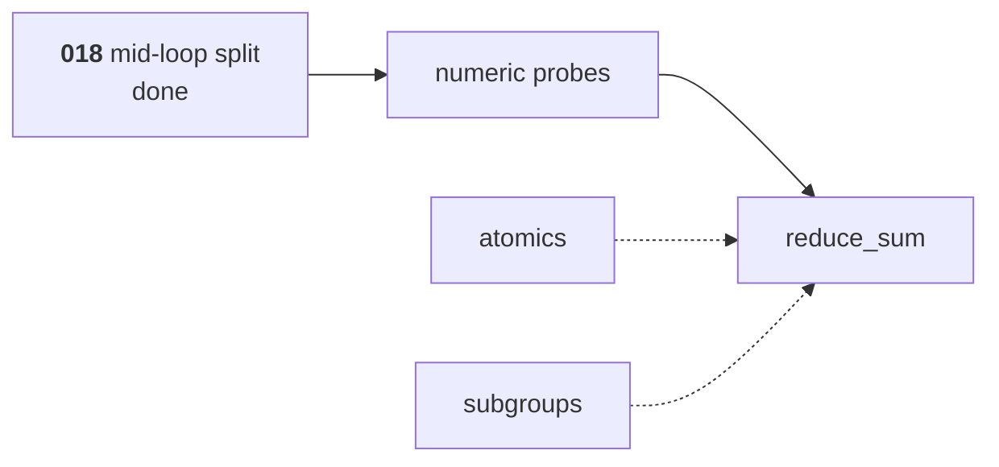

# Atomics, subgroups, and capability inference

The third of [009](009-sequencing.md)'s three M4 children, and the one that
completes M4's definition of done.

**[018](018-cooperative-lowering.md)'s mid-loop split is done**, so
`reduce_sum`'s shape — a halving-stride loop with a barrier each round — lowers.
It stayed in 018 rather than moving here because [009](009-sequencing.md)'s rule
for this milestone is that a compiler pass is not estimated as a line item under
a kernel, which is what folding it in here would have been at a smaller scale. It adds the two operation families a
cooperative kernel needs beyond a barrier, the analysis that reports what a
kernel requires, and the first kernel from [010](010-kernel-corpus.md).

## 1. What it builds

- **Atomics**, [002](002-compute-model.md) §4: the operation set, relaxed
  ordering with barriers explicit, previous-value returns, and the same
  semantics on shared and storage memory. Atomic float add is a capability, not
  a baseline.
- **Emulated subgroups**, [002](002-compute-model.md) §5: membership and
  activity, the operation set, and the rule that subgroup operations do not
  require uniform control flow while barriers do.
- **Capability inference over the IR**: what a kernel body implies, never what
  its author declares. The `//accel:requires` directive is an assertion checked
  against the inferred set, and a mismatch in either direction fails generation.
- **The CPU developer, strict, and mimic modes** wired to that inference, so a
  kernel requiring something the mimicked profile lacks fails at pipeline
  creation rather than at dispatch.
- **`reduce_sum`** from [010](010-kernel-corpus.md), which is the first kernel
  that needs all of the above at once.
- **The arm64 and amd64 numeric probes** of [008](008-numerics.md), establishing
  the available exact domain.

## 2. The order, which has one dependency the list does not show

Transform, then probes, then reduction:

Atomics and subgroups are independent of that chain and can land in any order.
The transform being done first is what makes that true; had it come last, the
easy work would have finished before the blocker appeared, which is when an
estimate slips.

### Why the probes come before the reduction, not after

[009](009-sequencing.md)'s done criteria put it first for a reason:

> CPU arm64 and amd64 numeric probes establish the available exact domain
> **before another test relies on it**

A reduction's test needs to know whether its accumulation is exact on this
machine before it can assert anything. Asserting first and measuring afterwards
produces a test that passes on the developer's laptop and fails on CI, and the
usual response to that is widening the tolerance until it passes everywhere —
which is asserting nothing. So the probe runs first and the reduction's budget
is derived from what it found.

## 3. Why capability inference is not a declaration

A declaration can be forgotten, and the failure is silent: a kernel using
subgroup arithmetic on a device without it produces wrong results rather than an
error, because nothing checked. Inference reads the body, which is the thing
that actually uses the feature.

The directive still exists, as an **assertion**: a mismatch in either direction
fails generation. A kernel declaring more than it needs is as much a bug as one
declaring less — it makes the kernel unavailable on devices that could run it,
and nobody notices, because the symptom is a device being skipped.

## 4. Subgroup sizes are a sweep, not a value

[009](009-sequencing.md) asks for agreement at sizes 1, 4, 32, and 64, and the
list is not arbitrary:

| Size | Why it is in the list |
| --- | --- |
| 1 | Every subgroup operation degenerates to the identity. A kernel that breaks here has an assumption about having neighbours. |
| 4 | Smaller than any real hardware, so a workgroup spans many subgroups and the boundary is exercised repeatedly. |
| 32 | NVIDIA and Apple. |
| 64 | AMD, and the case where one subgroup may span a whole workgroup. |

Each size runs the same kernels and the results must agree, including against
the fallback path for a device without the operation. A subgroup reduction that
agrees at 32 and disagrees at 4 has a boundary bug, and a boundary bug at v0
becomes a wrong answer on hardware nobody in this project owns.

## 5. Testing

- The subgroup sweep of §4, with each size's results compared against the
  non-subgroup fallback.
- `reduce_sum` matches its higher-precision reference under
  [008](008-numerics.md) at lengths that are **not** multiples of the workgroup
  size, which is where the partial final workgroup is, and where an
  off-by-one in the bounds check hides.
- Atomics: the previous-value return, overflow behaviour, and the shared and
  storage forms agreeing, each asserted directly rather than through a
  reduction that would hide a wrong answer in a sum.
- Atomic float add is asserted **non-deterministic**: a test asserting an exact
  total for a float reduction is wrong even where it is right for integers,
  because the hardware picks the accumulation order.
- A kernel whose `//accel:requires` disagrees with what its body implies fails
  generation, in both directions, naming the capability and which side declared
  it.
- A kernel requiring a capability the mimicked profile lacks fails at pipeline
  creation naming the capability and the device, which is
  [000](000-decisions.md) decision 6 and is checked against a profile rather
  than against hardware.

## 6. What it does not build

- **No cross-workgroup coordination.** Forward progress between workgroups is
  not guaranteed ([002](002-compute-model.md) §2.7) and nothing here changes
  that.
- **No native narrow arithmetic.** `CapF16Arithmetic` and `CapBF16Arithmetic`
  are inferred and reported here; the intrinsics that would need them arrive
  with a backend that has them.
