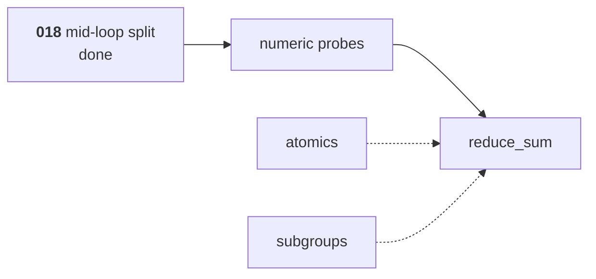

# Atomics, subgroups, and capability inference

The third of [009](009-sequencing.md)'s three M4 children, and the one that
completes M4's definition of done.

**[018](018-cooperative-lowering.md)'s mid-loop split is done**, so
`reduce_sum`'s shape — a halving-stride loop with a barrier each round — lowers.
It stayed in 018 rather than moving here because [009](009-sequencing.md)'s rule
for this milestone is that a compiler pass is not estimated as a line item under
a kernel, which is what folding it in here would have been at a smaller scale. It adds the two operation families a
cooperative kernel needs beyond a barrier, the analysis that reports what a
kernel requires, and the first kernel from [010](010-kernel-corpus.md).

## 1. What it builds

- **Atomics**, [002](002-compute-model.md) §4: the operation set, relaxed
  ordering with barriers explicit, previous-value returns, and the same
  semantics on shared and storage memory. Atomic float add is a capability, not
  a baseline.
- **Emulated subgroups**, [002](002-compute-model.md) §5: membership and
  activity, the operation set, and the rule that subgroup operations do not
  require uniform control flow while barriers do.
- **Capability inference over the IR**: what a kernel body implies, never what
  its author declares. The `//accel:requires` directive is an assertion checked
  against the inferred set, and a mismatch in either direction fails generation.
- **The CPU developer, strict, and mimic modes** wired to that inference, so a
  kernel requiring something the mimicked profile lacks fails at pipeline
  creation rather than at dispatch.
- **`reduce_sum`** from [010](010-kernel-corpus.md), which is the first kernel
  that needs all of the above at once.
- **The arm64 and amd64 numeric probes** of [008](008-numerics.md), establishing
  the available exact domain.

## 2. The order, which has one dependency the list does not show

Transform, then probes, then reduction:

Atomics and subgroups are independent of that chain and can land in any order.
The transform being done first is what makes that true; had it come last, the
easy work would have finished before the blocker appeared, which is when an
estimate slips.

### Why the probes come before the reduction, not after

[009](009-sequencing.md)'s done criteria put it first for a reason:

> CPU arm64 and amd64 numeric probes establish the available exact domain
> **before another test relies on it**

A reduction's test needs to know whether its accumulation is exact on this
machine before it can assert anything. Asserting first and measuring afterwards
produces a test that passes on the developer's laptop and fails on CI, and the
usual response to that is widening the tolerance until it passes everywhere —
which is asserting nothing. So the probe runs first and the reduction's budget
is derived from what it found.

## 3. Why capability inference is not a declaration

A declaration can be forgotten, and the failure is silent: a kernel using
subgroup arithmetic on a device without it produces wrong results rather than an
error, because nothing checked. Inference reads the body, which is the thing
that actually uses the feature.

The directive still exists, as an **assertion**: a mismatch in either direction
fails generation. A kernel declaring more than it needs is as much a bug as one
declaring less — it makes the kernel unavailable on devices that could run it,
and nobody notices, because the symptom is a device being skipped.

## 4. Subgroup sizes are a sweep, not a value

[009](009-sequencing.md) asks for agreement at sizes 1, 4, 32, and 64, and the
list is not arbitrary:

| Size | Why it is in the list |
| --- | --- |
| 1 | Every subgroup operation degenerates to the identity. A kernel that breaks here has an assumption about having neighbours. |
| 4 | Smaller than any real hardware, so a workgroup spans many subgroups and the boundary is exercised repeatedly. |
| 32 | NVIDIA and Apple. |
| 64 | AMD, and the case where one subgroup may span a whole workgroup. |

Each size runs the same kernels and the results must agree, including against
the fallback path for a device without the operation. A subgroup reduction that
agrees at 32 and disagrees at 4 has a boundary bug, and a boundary bug at v0
becomes a wrong answer on hardware nobody in this project owns.

## 5. Testing

- The subgroup sweep of §4, with each size's results compared against the
  non-subgroup fallback.
- `reduce_sum` matches its higher-precision reference under
  [008](008-numerics.md) at lengths that are **not** multiples of the workgroup
  size, which is where the partial final workgroup is, and where an
  off-by-one in the bounds check hides.
- Atomics: the previous-value return, overflow behaviour, and the shared and
  storage forms agreeing, each asserted directly rather than through a
  reduction that would hide a wrong answer in a sum.
- Atomic float add is asserted **non-deterministic**: a test asserting an exact
  total for a float reduction is wrong even where it is right for integers,
  because the hardware picks the accumulation order.
- A kernel whose `//accel:requires` disagrees with what its body implies fails
  generation, in both directions, naming the capability and which side declared
  it.
- A kernel requiring a capability the mimicked profile lacks fails at pipeline
  creation naming the capability and the device, which is
  [000](000-decisions.md) decision 6 and is checked against a profile rather
  than against hardware.

## 6. Outcome — 2026-08-23, extended 2026-08-24

§1 is built except the CPU mode wiring noted below, and §5's cases pass.

| Piece | State |
| --- | --- |
| Atomics, the integer set and `AddF32` | built |
| Emulated subgroups: ids, reductions, `Elect`, `Any`, `All`, `BroadcastFirst`, `Ballot` | built, in uniform control flow |
| Capability inference over the IR | built |
| `//accel:requires` as an assertion | built |
| Capability gating at pipeline creation | built |
| `reduce_sum` against [008](008-numerics.md)'s budget | built |
| arm64 and amd64 numeric probes | built |
| `Broadcast` from a chosen lane, and the four shuffles | built 2026-08-24 — see §6.4 |
| The inclusive and exclusive add scans | built 2026-08-24 — see §6.5 |

### 6.1 Three bugs, each a wrong answer that compiled

- **Access inference did not see an atomic touch its buffer.** An atomic's first
  argument is the buffer rather than an index expression, so a walk that only
  understood indexing reported the binding untouched. That is what the graph
  builder infers dependency edges from, so an unrecorded write is a missing
  barrier and therefore a race.
- **f32 constants were emitted as fractions.** `go/constant`'s `ExactString`
  renders an exact rational as `3/4`, which inside `float32(...)` is integer
  division, which is zero — so every comparison against `0.75` was true. It
  survived until a corpus kernel used a fractional threshold. Constants are now
  spelled as their bit pattern with the decimal in a comment, and the regression
  test asserts on the *emitted text*, because a result test only catches it for
  the constants a corpus happens to use.
- **The subgroup suspension was on the wrong side of the split.** The state that
  read the combined result suspended, rather than the one that contributed, so
  each lane read a value nothing had written. Visible immediately in the
  generated code, which is an argument for reading it.

### 6.2 Two semantics needed the right witness to be testable

Both are rules [002](002-compute-model.md) states that a plausible test does not
exercise.

- **A reduction over one active lane returns that lane's value, not `v + 0`.**
  For every finite `v`, `0 + v` is exactly `v`, so an accumulator seeded with
  zero passes any test using ordinary values. The witness is **negative zero**:
  `0 + (-0)` is `+0`, and a sign that flips changes the sign of a later
  division.
- **A read of undefined shared memory is reported for every stored pattern.**
  Covered in [019](019-cooperative-diagnostics.md), and the same shape: a
  sentinel is a value a kernel could compute.

### 6.3 What is deferred, and why

**Subgroup operations in divergent control flow.** [002](002-compute-model.md)
§5.1 says whether lanes reconverge after divergence is implementation-defined,
so the portable subset is narrower than the operation list suggests, and the
cooperative lowering has nowhere to resume inside a branch. The boundary is what
makes the rest tractable: in uniform control flow the emulation is exactly the
barrier machinery, because every lane arrives.

**The `CPUStrict` and `CPUMimic` modes are wired to capability inference.**
`Device.Missing` checks the profile a mode reports, so a mimicked device refuses
a kernel it cannot run. Strict mode narrows the reported capability set to the
intersection of its declared targets — `internal/cpu/profile.go`'s `resolve`
computes `caps, lim = intersect(targets)` — which is
[006](006-backends.md)'s strict-mode contract discharged here.

> This paragraph said the opposite until 2026-08-24. The narrowing had shipped
> and four documents still called it outstanding, which is the shape of staleness
> that survives longest: a deferral nobody revisits because nothing fails.

### 6.4 The shuffles, and the one rule that had to be narrowed — 2026-08-24

`Broadcast` from a chosen lane, `Shuffle`, `ShuffleXor`, `ShuffleUp` and
`ShuffleDown` are built on both backends. `Elect` and `BroadcastFirst` were
already, and what they gained is a test against a *partial* active set, which is
what [002](002-compute-model.md) §5.2 rule 1 is about and what nothing had
exercised.

**The active set is now a first-class thing the scheduler computes**, rather
than a list whose order happened to be lane order. `combineSubgroups` maps lane
number to frame, so an active set with a hole in it — lanes 0, 2 and 3 — is
answered correctly by every operation rather than only by the ones that scan
from the bottom.

**Rule 3 is narrower than it reads, and the narrowing is forced.** The rule says
a read of an inactive lane is reported. Applied to a lane index that is outside
the subgroup entirely it refuses the operation it exists for: a shuffle up by
one has lane 0 read below the bottom on every device, the kernel discards that
lane's answer, and it cannot guard the *call* because a subgroup operation
inside a conditional does not lower. So an index outside the width is undefined
and silent, and an index inside the width whose lane is not taking part is
reported by name. [002](002-compute-model.md) §5.2 rule 3 now says so.

There is a second reason, and it is about what a test can prove: `ShuffleUp` and
`ShuffleDown` are indistinguishable at delta 0, so the only differential that
tells a swapped emit-table entry from a correct one uses a delta that reads out
of range at one end. Making that an error would leave two of the five operations
with no check on their Metal lowering at all.

**A broadcast's lane operand is checked for uniformity.** [002](002-compute-model.md)
§5.2 requires it to be dynamically uniform and no backend enforces it. The
oracle reports a disagreement rather than picking a winner, because on hardware
the winner is the device's, so a kernel whose output depends on it is already
wrong and an oracle that resolved it would make one device's answer look right.
It is developer-mode instrumentation like the rest of the combination step's
checks, off with them, and tested in both positions — two checks in one function
that disagreed about which mode they live in would make a kernel pass or fail on
a switch neither of them names.

**Neither check is 2.2's shadow bit, and [002](002-compute-model.md) §5.2 rule 3
now says which mechanism it is.** A definition bitmap answers a question about a
*location*; a lane's contribution is a value in flight. Reaching for the shared
tracker would also have meant creating one for kernels with no shared memory,
which turns on the barrier arrival check for every kernel that previously had it
nil — and that check refuses exactly the partial active sets rule 4's test needs,
because a lane not at a subgroup operation is reported as a lane that failed to
arrive. The reports come from the combination step instead, in the same mode.

**Metal now reports `SubgroupShuffle`.** It always spelled `simd_broadcast`,
`simd_shuffle`, `simd_shuffle_xor`, `simd_shuffle_up` and `simd_shuffle_down`;
the capability was absent because nothing emitted them. Ballot stays absent for
the reason [022](022-msl-target.md) §5 gives, which is about `simd_vote`'s type
and not about lanes.

**One gate replaced four registrations.** A rendezvous opcode is spread over the
intrinsic table, the frame carrier, the runtime constant and the Metal
spelling, and missing any one of them compiles. The unmapped case used to lower
to an ordinary barrier — a suspension that combined nothing and resumed reading
the lane's own contribution, which is §6.1's third bug wearing a different hat.
`TestEverySubgroupRendezvousIsRegistered` walks the opcode range instead, so an
operation added later is covered before anyone remembers to add it to a list.

### 6.5 The scans — 2026-08-24

`SubgroupInclusiveAddF32` and `SubgroupExclusiveAddF32` are built on both
backends, over the active lanes in ascending lane order.

**Only the add scans, and only over f32.** [002](002-compute-model.md) §5.2's
scan rows name `Add` alone, and the reduction row's other operators — `Mul`,
`Min`, `Max`, `And`, `Or`, `Xor`, and the i32 and u32 dtypes — are not built for
either the reduction or the scan. Each is a table entry and a spelling per
backend rather than a design question, and none has a consumer:
[010](010-kernel-corpus.md)'s kernels reduce f32 sums and take f32 maxima, which
is what shipped. They are named here so the gap is a decision rather than an
oversight.

**The exclusive scan's identity is the one place an identity is the answer.**
The lowest active lane sums an *empty* prefix, so it receives `+0` whatever it
holds — while a reduction over one active lane receives that lane's value, sign
and all. Both rows are tested with a negative zero, because that is the only
input on which the two rules produce different bits.

**One bug, and it was the range check.** `combineOne` routed a rendezvous to the
shuffle machinery with `op >= SubBroadcastF32`, which read correctly until the
scans were added after the shuffles in the same enumeration — at which point
every scan became a lane-addressed read of lane 0, reported an inactive-lane
error, and returned a NaN. It is a smaller cousin of the bug
`TestEverySubgroupRendezvousIsRegistered` exists to stop, and the fix is the
same shape: a predicate that names its members rather than a bound that happens
to sit at the end of a list.

## 7. What it does not build

- **No cross-workgroup coordination.** Forward progress between workgroups is
  not guaranteed ([002](002-compute-model.md) §2.7) and nothing here changes
  that.
- **No native narrow arithmetic.** `CapF16Arithmetic` and `CapBF16Arithmetic`
  are inferred and reported here; the intrinsics that would need them arrive
  with a backend that has them.
