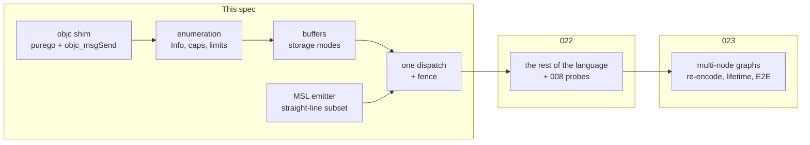

# Metal bring-up

The first of [009](009-sequencing.md)'s three M6 children, and **the cut is
vertical for the same reason [012](012-kernel-pipeline.md)'s was**: the point of
the first child is not to finish a layer, it is to make the device an oracle.
Until one kernel this compiler emitted runs on this GPU and returns a number
that can be compared against the CPU backend, every later piece of Metal work is
checked by inspection. After it, everything is checked by disagreement.

So this child takes a thin slice of every layer — the Objective-C shim, device
enumeration, buffers, the MSL emitter, the compute encoder — and stops at the
narrowest kernel that proves the slice: one straight-line dispatch, upload and
readback, through the public `accel` API.



## 1. What is settled before any of this is written

**A Metal device is present and MSL compiles at runtime.** This is not an
assumption; [009](009-sequencing.md) records the correction where it was one.
The development machine reports `Apple M2`, and the following spine of selectors
has been executed end to end, returning the right answer from a GPU dispatch:

| Step | Selector | Returns |
| --- | --- | --- |
| device | `MTLCreateSystemDefaultDevice` (C function) | `id<MTLDevice>`, +1 |
| name | `-name`, `-UTF8String` | C string |
| compile | `-newLibraryWithSource:options:error:` | `id<MTLLibrary>`, +1 |
| entry point | `-newFunctionWithName:` | `id<MTLFunction>`, +1 |
| pipeline | `-newComputePipelineStateWithFunction:error:` | `id<MTLComputePipelineState>`, +1 |
| memory | `-newBufferWithLength:options:` | `id<MTLBuffer>`, +1 |
| mapping | `-contents` | `void *`, unowned |
| queue | `-newCommandQueue` | `id<MTLCommandQueue>`, +1 |
| submission | `-commandBuffer` | autoreleased |
| encoding | `-computeCommandEncoder` | autoreleased |
| binding | `-setComputePipelineState:`, `-setBuffer:offset:atIndex:` | void |
| launch | `-dispatchThreadgroups:threadsPerThreadgroup:` | void |
| close | `-endEncoding`, `-commit`, `-waitUntilCompleted` | void |

That table is in the spec rather than in a commit message because it is the
part of this work that cannot be derived: every entry is a name that is either
right or crashes inside `objc_msgSend` with a stack pointing nowhere, and each
one here has been observed to work.

**The Metal toolchain is absent and that is not a gap.** `xcrun metal` reports
the toolchain uninstalled, so there is no offline compile of an emitted golden.
`-newLibraryWithSource:options:error:` *is* the Metal compiler, invoked on the
device at runtime, which is the path this backend uses in production anyway and
is stronger evidence than a parse. Goldens stay text comparisons; the compile
check is a runtime one, and it is a real one.

## 2. The shim, and the one thing it must get right

`purego` provides `objc_msgSend` and selector registration. What it does not
provide is a decision about **ownership**, and that decision is this section.

Objective-C's naming rule is a rule, not a convention: a method whose name
begins with `new`, `alloc`, `copy` or `mutableCopy` returns an object the caller
owns (+1) and must release; everything else returns an object the caller does
not own, typically autoreleased.

> **Ownership rule.** The backend retains every object it stores in a Go struct,
> and releases it exactly once, in `Close`. An object obtained from a `new*`
> selector is *already* +1 and is not retained again. An object obtained any
> other way is retained on receipt if it outlives the call that produced it, and
> not otherwise.

The rule is stated as an invariant rather than as advice because the failure it
prevents is silent. Metal object lifetime is the "sharp edge" of
[006](006-backends.md) §2.2, and [`conventions.md`](../docs/conventions.md)
already records why:

> A Metal command buffer completion handler runs *after* the enclosing
> autorelease pool has drained. Releasing an autoreleased object from inside the
> handler is a use-after-free.

Two consequences bind this child:

1. **Every OS thread that sends messages holds its own autorelease pool**,
   pushed and popped on that same thread. Go can move a goroutine between
   threads, so any function that creates autoreleased objects runs inside
   `runtime.LockOSThread`, and the pool is drained before the lock is released.
2. **A completion handler releases nothing it did not retain.** In this child
   the fence is the handler's only job, so the handler touches no Objective-C
   object at all — it closes a channel. That is the strongest form of the rule,
   and [023](023-metal-graph.md) is where it has to weaken and be tested.

### Message sending is typed, and that is where the bugs are

`objc_msgSend` is variadic in C and is *not* variadic in the ABI: arguments are
passed as if the real signature had been declared. Two cases in the spine above
are not plain integers, and both are places a wrong guess produces a plausible
wrong answer rather than a crash:

- `-dispatchThreadgroups:threadsPerThreadgroup:` takes two `MTLSize` values **by
  value**, each three 64-bit integers. Passing a pointer compiles, runs, and
  dispatches a grid nobody asked for.
- `-newLibraryWithSource:options:error:` takes an `NSError **` out-parameter.
  The pointer must address a variable that outlives the call and is initialized
  to nil, since Metal writes it only on failure.

Both are covered by the bring-up test rather than by review: a dispatch of the
wrong grid produces the wrong number of results, which the readback sees.

## 3. Enumeration, capabilities, and limits

`adapters()` in `device.go` already documents the shape this must take:

> A backend that is compiled in but cannot probe contributes a diagnostic rather
> than disappearing, so a caller can tell "no Metal device" from "Metal was not
> built".

So the Metal adapter is added from a `//go:build darwin` file, and a darwin
build with no device contributes a `ProbeDiagnostic`, never an empty list. On
every other platform the file is absent and the CPU adapter stands alone, which
is why the cross-target build is now one of [009](009-sequencing.md)'s gates.

The adapter token is derived from the device's `registryID`, which is stable
within a process and distinguishes two GPUs in a machine that has two.

**Enumerating nothing is `metal.ErrNoDevice`, never an empty list.** An empty
list is indistinguishable from a build with no Metal compiled in, which is the
one distinction this section exists to preserve. The error is what the layer
above turns into a `ProbeDiagnostic` at `ProbeEnumerateAdapters`, as against
`ProbeLoadLibrary` for a framework that would not load: a caller acts on those
two differently, one being a machine without a GPU and the other a broken
installation.

**Capabilities and limits are a table, and the table is checked against the
device rather than trusted.** `driver.Limits` has twenty-one fields and
`driver.Capabilities` sixteen; a mapping written from documentation is a mapping
nobody ran. Each row is one of:

| Source | Example | How it is checked |
| --- | --- | --- |
| Queried | `MaxSharedMemoryBytes` ← `-maxThreadgroupMemoryLength` | the value the device reports |
| Fixed by the API | `MaxWorkgroupInvocations` ← `-maxTotalThreadsPerThreadgroup` | queried, but per-pipeline; the device-level bound is the ceiling |
| Fixed by the family | `MinSubgroupSize = MaxSubgroupSize = 32` on Apple silicon | asserted by a test that dispatches and counts |
| Constant | `MinBufferCopyOffsetAlignment` | a documented constant, with the doc cited in the code |

A row in the last class is the dangerous one, and the rule is that a constant
gets a comment naming what makes it true, so a later reader can find out whether
it still is.

## 4. Memory: three storage modes and one mapping question

[001](001-device-resources.md)'s memory kinds map to Metal storage modes:

| `driver.MemoryKind` | `MTLResourceOptions` | `Block.Bytes()` |
| --- | --- | --- |
| `MemoryDevice` | `StorageModePrivate` | nil |
| `MemoryUpload`, `MemoryShared` | `StorageModeShared` | `-contents` |
| `MemoryReadback` | `StorageModeShared` | `-contents` |

**Unified memory makes this less interesting than it looks, and the spec says so
rather than pretending otherwise.** On Apple silicon `StorageModeShared` is not
a staging copy; it is the same memory the GPU reads. `MemoryDevice` could
therefore be shared too, and be faster. It is private anyway, because
[006](006-backends.md) §1 requires `Bytes()` to be the authority on mappability
and a backend that maps device memory on one machine and not another turns a
portability bug into a machine-specific one. The cost is a blit for
`Block.Write`/`Read` on `MemoryDevice`; the benefit is that the CPU oracle and
Metal agree about what is mappable.

`Block.Write` and `Read` on private memory are **synchronous**, per the
interface comment: a staging shared buffer, a blit encoder, commit, wait. That
is the immediate transfer path of [001](001-device-resources.md) §8.1 and it is
allowed to be slow.

## 5. The MSL subset this child emits

Exactly enough for a straight-line kernel over buffers, which is
[012](012-kernel-pipeline.md)'s subset re-targeted:

- scalar types `i32`, `u32`, `f32`, `bool`, and `f16` and `bf16` as storage
  types. `bf16` is spelled `ushort` rather than `bfloat`, because `bfloat` is a
  Metal family capability and the storage is not: a bf16 binding is only loaded
  and widened, and widening it is `as_type<float>(uint(x) << 16)` because bf16
  is f32's top half. Narrowing f32 to bf16 has to round and stays refused;
- buffer parameters as `device T *name [[buffer(k)]]`, indexed by binding order;
- one std140 uniform block as `constant U &u [[buffer(n)]]`;
- `t.GlobalID()` as `[[thread_position_in_grid]]`, and `len()` as a generated
  uniform, since MSL has no array length;
- arithmetic, comparison, conversion, indexing, `if`/`else`, and `for`; and
- the entry point as `kernel void Name(...)`.

Everything else — threadgroup memory, barriers, atomics, subgroups, helper
functions, `kmath` intrinsics — belongs to [022](022-msl-target.md).

**Buffer index assignment is the contract.** `Dispatch.Bindings` is positional,
and `driver.Dispatch` already says why: *"a reordering here silently swaps two
buffers."* So binding *k* of the kernel layout is `[[buffer(k)]]`, the generated
slice lengths follow at `len(bindings)`, and uniforms follow those. This is
written down because it is the kind of rule that is obvious while writing the
emitter and invisible six months later.

The emitter exports it rather than leaving the host to recompute it, since two
copies of an index scheme is exactly one too many:

| Declaration | What it fixes |
| --- | --- |
| `emit.MSLLengthsIndex(n)` | where the generated lengths are bound, for a kernel with *n* bindings |
| `emit.MSLUniformIndex(n, i)` | where uniform *i* is bound |
| `emit.MSLContractOff` | the pragma every emitted kernel carries; see the outcome below for why it is a pragma and not a compile option |

The lengths slot is reserved whether or not the body calls `len`. A layout that
depended on the body would be a layout the host has to be told about, and one
unused argument slot is cheaper than a second source of truth.

### The length problem

Go's `len(s)` has no MSL spelling. A `device float *` carries no extent, so the
emitter appends a generated uniform block holding one `uint` per slice binding,
and the host fills it from the operand ranges it already has:

$$\texttt{len}_k = \left\lfloor \frac{\texttt{bindings}[k].\texttt{Len}}{\texttt{sizeof}(\texttt{dtype}_k)} \right\rfloor$$

The floor is not decoration. A binding whose byte length is not a multiple of
its element size is a caller error the graph layer already rejects, and the
floor makes the emitted kernel safe rather than undefined if one ever arrives.

## 6. The kernel record gains a target artifact

`kernel.Kernel` today carries `Flat` and `Cooperative`, both Go functions. It
gains one field:

```go
// MSL is the generated Metal Shading Language source, empty when this kernel
// was not generated for that target.
MSL string
```

**This diverges from [004](004-kernel-authoring.md) §"Registration points at
generated CPU code"**, which draws a `Targets: accel.TargetArtifacts{CPU: …,
MSL: …}` struct. The implementation flattened `TargetArtifacts` into fields on
`Kernel` when M2 landed, and this child follows what is built rather than
reintroducing a wrapper for one field. The gap closes, or is ratified, when a
third target arrives; it is recorded here so that 004's struct is not read as
describing code.

`NoMSL string` (added 2026-09-02) is set exactly when `MSL` is empty: the
emitter's refusal with the `file:line:col` of the construct outside the subset.
The generator used to drop the refusal and emit nothing, so a kernel losing its
lowering was a missing line rather than a statement, and the backend's error
could name the kernel and not the reason.

A Metal dispatch of a kernel whose `MSL` is empty is a **build error naming the
kernel and the target**, not a fallback to the Go lowering. Running the CPU
lowering on a device the caller selected specifically would be the worst
possible answer: it would be correct, fast enough to miss, and would mean the
GPU was never exercised.

## 7. What this child compiles, and what it refuses

`GraphCompiler.Compile` accepts a plan whose nodes it supports and returns an
error naming the node and the op for anything else. In this child that is:

| Op | This child | Why |
| --- | --- | --- |
| `OpHostWrite` | yes | the upload half of the E2E |
| `OpDispatch` | yes, non-indirect | the point |
| `OpCopy` | yes | the readback half |
| `OpCopyRows` | no | textures are not in M6 |
| indirect dispatch | no | needs a device-written count, [023](023-metal-graph.md) |

`BarrierBefore` is honoured by ending the current compute encoder and beginning
a new one, which is Metal's barrier between dispatches. That is correct and
conservative: [006](006-backends.md) §4.3 makes re-encoding per submission the
default, so there is no encoder to preserve across submissions anyway. Whether
it is *sufficient* — whether a memory barrier within an encoder would do — is
[023](023-metal-graph.md)'s question, and answering it early would be an
optimisation with no test behind it.

## 8. Testing

Every test here is a device test, and the file is `//go:build darwin`. A test
that finds no device **fails**, per [006](006-backends.md) §7: *"a job that
promises a backend and finds no device is a failure, not a skip."*

1. **The shim.** A device opens, reports a non-empty name, and its adapter token
   is stable across two enumerations and differs from the CPU's.
2. **Runtime compilation is real.** Deliberately malformed MSL is rejected with
   the device compiler's own message, and the message reaches the caller. A
   test that only compiles valid source cannot tell a working compile path from
   one that ignores its error out-parameter — this is the same reinstatement
   discipline M3 and M4 used, applied to a toolchain rather than a bug.
3. **The grid is the one that was asked for.** A kernel that writes its
   `thread_position_in_grid` into a buffer, dispatched at a workgroup count that
   is not one, produces exactly the expected ids. This is what catches an
   `MTLSize` passed by pointer.
4. **Storage modes.** `Bytes()` is nil for `MemoryDevice` and non-nil for the
   host-visible kinds, and a `Write` then `Read` round-trips through the blit
   path at an offset that is not zero.
5. **The differential.** `Add` from [010](010-kernel-corpus.md), run on the CPU
   backend and on Metal from **the same generated record**, agrees
   bit-for-bit at f32. Bit-for-bit is the right bar for `+` on f32 by
   [008](008-numerics.md); anything weaker would pass while contraction was
   silently on.
6. **E2E.** `Enumerate` finds a Metal adapter, `OpenDevice` opens it by id, a
   pool allocates, a graph records upload → `Add` → readback, submits, and the
   fence reports completion. Public API only.

Test 5 is the one that makes the device an oracle, and it is the reason this
child exists in this shape.

## 9. What this child does not build

Named so the milestone is not read as further along than it is:

- threadgroup memory, barriers, atomics, subgroups, helper calls, and every
  `kmath` intrinsic — [022](022-msl-target.md);
- the [008](008-numerics.md) numeric probes and the recorded Metal profile —
  [022](022-msl-target.md), and they run before anything numeric derives from
  them;
- multi-node graph re-encoding, indirect dispatch, completion-handler lifetime
  under repeated early close, and `MTLIndirectCommandBuffer` —
  [023](023-metal-graph.md);
- textures, samplers, and anything in [005](005-graphics.md); and
- `OpenBest` preferring Metal over the CPU, which is a policy question
  [006](006-backends.md) §6.3 owns and which should not be decided by whichever
  backend landed most recently.

## 10. The render bindings — 2026-08-24

`internal/mtl` gained the graphics half: `Texture` and `NewRenderTarget`,
`RenderPipelineSpec` with `BlendSpec` and `VertexLayoutSpec`, `RenderPipeline`,
`DepthState`, `RenderAttachment`, `RenderEncoder` and `CommandBuffer.Render`,
`CompileFunction` and `Function`, `ClearColor`, the two pixel formats and the
load and store action constants, plus `BlitEncoder.CopyTextureToBuffer` and
`CopyBufferToTexture`. Listed because a package layout no spec records is
undocumented structure.

The on-screen half arrived the same day and is listed for the same reason:
`MetalLayer` with `WrapLayer`, `NewOffscreenLayer`, `Configure`, `NextDrawable`
and `Pointer`; `Drawable` with `Texture` and `Release`;
`CommandBuffer.PresentDrawable`; `Size2D`; and `PixelFormatBGRA8Unorm`. Its own
hazards are in [034](034-surface-present.md) §8.1 rather than repeated here,
because they are properties of the drawable contract rather than of this
binding.

Three hazards this section exists to record, because each one compiles.

**An invalid pipeline descriptor aborts the process.**
`-newRenderPipelineStateWithDescriptor:error:` calls `assert` in Metal's
validation layer rather than returning nil with an error, so a missing vertex
function is not a bad diagnostic — it is the caller's process gone, with a line
on stderr and no Go frame. Every field the validator inspects is checked in Go
first.

**A class looked up at package initialization is zero.** `objc.GetClass` runs
before `Devices()` has dlopened Metal, and a message to nil is answered with
zero rather than crashing — so the symptom is an object that "could not be
created" from a call that never reached Metal at all. The render classes are
looked up on first use.

**The render encoder is autoreleased and must be retained.** §2's ownership rule
again: `renderCommandEncoderWithDescriptor:` is not a `new*` selector, so the
pool drains the encoder before `End` is called and Metal asserts "released
without endEncoding". A third abort rather than an error.

## Outcome — 2026-08-23

**Every section here is built except one, and that one is named rather than
rounded up.** `accel` enumerates two adapters on a Mac, `Apple M2` alongside the
CPU oracle; a graph recorded through the public API uploads, dispatches a
generated kernel, and reads back; and the emitted MSL is compiled by the device
compiler itself rather than parsed.

**The criterion that matters is test 5, and it passes.** The same recorded graph
runs on both backends from one kernel record and agrees **bit for bit** over
4096 elements. It was confirmed by reinstating a fault rather than by watching it
pass: editing the emitted MSL alone, `a[i]+b[i]` to `a[i]-b[i]`, flips only the
Metal result. So the device is an oracle from here, which is what the vertical
cut was for.

### Deviation 1: a uniform-carrying dispatch is refused

**What this spec required.** §7 says `Compile` accepts every non-indirect
`OpDispatch`, and §5 says the emitter emits a std140 uniform block. The first
half is not met.

**What was built.** The emitter emits the block, with its padding spelled out,
and the device compiler accepts it — `ElemScale` compiles. The *host* cannot
fill it, so a dispatch carrying uniforms is refused at `Compile` with an error
naming the kernel and the reason.

**Why.** `kernel.Kernel` carries no std140 encoder. The generated codec is a
named type a caller writes (`ScaleParamsCodec`), and a backend holding a
`[]any` has no way to reach it without reflection. That is a gap in the record's
shape rather than in this backend, and inventing a reflective encoder here would
put a second std140 implementation next to the generated one.

**What still holds.** Nothing silently produces wrong bytes: the refusal is at
compile, names the kernel, and names the spec that closes it.

**When it closes.** [022](022-msl-target.md), by giving the record a generated
encoder hook. Two of the nine kernels currently carrying MSL take uniforms.

**Retired 2026-08-23**, in [022](022-msl-target.md) §3. `kernel.Uniform` gained
an `Encode` closure the generator fills with the codec that already exists, so
no second std140 implementation was written. `ElemScale` now runs on both
backends and agrees; the test was confirmed by shifting the emitted struct's
offsets by one slot, which makes Metal return zero while the CPU returns the
right answer.

### What this child found

**Three divergences, each measured rather than remembered**, and all three now
in [`conventions.md`](../docs/conventions.md):

1. **`-contents` is non-nil for private storage on Apple silicon**, contradicting
   what Metal documents, because unified memory makes the allocation genuinely
   addressable. Trusting the object over the requested mode would have made
   every buffer mappable here and not on an Intel Mac — a portability rule
   turned machine-specific.
2. **`MTLMathMode.safe` does not disable contraction.** It looks exactly like
   the control for it and governs reassociation and denormals instead, so `x*x+c`
   returned the fused answer with the option set. Contraction is now turned off
   by a pragma the emitter puts in every kernel, and a test asserts both that the
   pragma works and that the default contracts.
3. **A SIMD width is a property of a compiled pipeline, not of a device.**
   `MTLDevice` has no query, so enumeration compiles a trivial kernel and reads
   `threadExecutionWidth`, which reports 32 here.

**And two bugs whose shape generalizes.** `objc.GetClass("NSString")` in a `var`
initializer runs before Foundation is mapped, so the class was nil, the source
string became nil, and Metal *aborted the process* on an assertion instead of
returning the error this package reads carefully — a selector may be registered
before anything loads, because registering one creates it, and a class may not.
And the first symbol resolver wrote the package's function pointers as it went,
so a test injecting fake lookups overwrote the real
`MTLCreateSystemDefaultDevice` and the next real call jumped to address 1;
finding symbols and installing them are separate jobs and now say so.

**Two existing tests caught real problems**, which is the argument for the CPU
milestones having built them first. `TestLimitsArePopulated` rejected a
zero-valued subgroup limit and forced the width to be measured rather than
omitted. `TestOpenBestNeverReturnsAnUnsanctionedBackend` failed on a premise
Metal falsified — "this machine has only the CPU backend compiled in" — and was
rewritten to check the rule rather than the premise.
