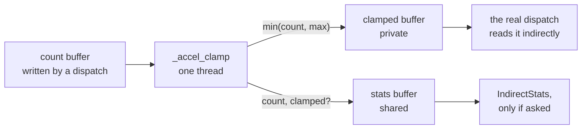

# Metal graph execution

The third of [009](009-sequencing.md)'s three M6 children: everything about
*submission* that [021](021-metal-bringup.md) deferred, and the M6 end-to-end.

## 1. Re-encoding, and the question 021 left open

[006](006-backends.md) §4.3 settles the default: a `MTLCommandBuffer` is
single-submit, so a graph is re-encoded per submission and replay's category-2
saving is zero on Metal. [021](021-metal-bringup.md) implements that already.

What it left open is **how much of a barrier an encoder boundary needs to be**.
021 ends the current encoder at every `BarrierBefore`, which is correct and
conservative. Whether a `memory_barrier` within one encoder would serve, and
what that costs, is measured here — and it is measured rather than assumed,
because the conservative version is already correct and an optimisation with no
measurement behind it is a regression waiting to be attributed to something
else.

## 2. Indirect dispatch — built 2026-08-23

`dispatchThreadgroupsWithIndirectBuffer:` with the device-supplied count, and
[003](003-command-graph.md)'s clamp against the build-time maximum. **Every
build mode clamps**: correctness does not depend on a flag, and no backend may
submit an out-of-range count.

**The clamp runs on the device**, and that is the design decision here. The
obvious implementation reads the count back, clamps on the host, and encodes an
ordinary dispatch — correct, and it destroys the point: a readback is a
synchronisation point in the middle of a graph, so an indirect dispatch would
cost more than the direct one it replaces and a caller would reasonably stop
using it.

The clamp is a one-thread kernel in its **own compute pass**. Sharing an encoder
with the dispatch would be a read of memory nothing ordered against it, which is
undefined rather than merely fast — and would usually produce the right answer,
which is why the test that notices is the over-limit case where the clamped and
unclamped counts differ.

`CollectStats` is what costs the readback. The statistics buffer is written
either way, because a branch to avoid four stores costs more than the stores;
what a caller gives up by not asking is being *told* a clamp happened, never
being protected from one.

## 3. Completion handlers, and the lifetime rule under pressure

[021](021-metal-bringup.md) §2 states the strongest form of the rule by having
no completion handler at all: the fence polls `-status` and blocks on
`-waitUntilCompleted`. That is enough for one submission at a time and not for
much else.

Adding a handler is where [`conventions.md`](../docs/conventions.md)'s
divergence bites:

> A Metal command buffer completion handler runs *after* the enclosing
> autorelease pool has drained. Releasing an autoreleased object from inside the
> handler is a use-after-free.

So the handler releases nothing it did not retain, and the test is repeated
early closes racing asynchronous completion — a graph closed while its
submission is in flight, many times, under the race detector.

## 4. Device loss — built 2026-08-23

Metal has no device-level flag for this: loss surfaces as an error on a command
buffer, which is a property of one submission. So the answer is **derived** from
what submissions reported, learned in `Fence.Wait` because that is the only
place a command buffer's error is read, and once derived it never clears —
[001](001-device-resources.md) §7.4 makes loss terminal, since a driver reset
that produced one failure and then appeared to recover would leave a caller
running on resources whose contents are undefined.

**Not every command buffer error is loss**, and the classifier is deliberately
narrow. A kernel that ran off the end of a buffer faults one submission and
leaves the device usable; reporting that as loss would turn a recoverable bug
into a device the caller must discard, permanently. So `Insufficient Memory`,
`Invalid Resource` and `Not Permitted` are not loss, and the half of the test
asserting that is the more important half.

A real loss cannot be provoked on a healthy machine — and provoking one takes
the developer's display with it — so what is tested is the classifier and the
stickiness, which is where the decisions are.

## 5. Done

1. multi-node graphs re-encode correctly, including the worked graph of
   [003](003-command-graph.md) — **met**: its eight nodes, genuine diamond and
   six aliased transients produce the value its dependency chain predicts, twice
   from one built graph;
2. indirect dispatch clamps in every mode and reports its actual count —
   **met**, at four counts including zero and one over the maximum, and
   confirmed by making the clamp not clamp;
3. completion-handler lifetime survives repeated early closes under the race
   detector — **met in the only form that currently applies**: there is no
   completion handler, because the fence polls `-status` and blocks on
   `-waitUntilCompleted`, which is the strongest form of the rule that a handler
   releases nothing it did not retain. The test exists so that a later change to
   a handler is not made silently;
4. device loss is sticky, reported by every subsequent call, and signals every
   outstanding fence — **partly met**: sticky and reported by every subsequent
   submit and by `Lost`, and *not* pushed to an outstanding fence, which would
   need the handler item 3 avoids. A fence on a lost device returns the loss
   when waited on rather than when the loss occurs; and
5. E2E: the same public upload → GEMM → readback scenario as the CPU, selected
   by enumerating a Metal `AdapterID` and calling `OpenDevice` — **met**.

**What is not built**: the measurement of whether a memory barrier inside one
encoder would serve where an encoder boundary is used today (§1), and
`MTLIndirectCommandBuffer`, which [006](006-backends.md) §4.3 keeps behind an
optional interface, off by default, shipping only with a measurement against
re-encode.

`MTLIndirectCommandBuffer` is **not** in this child. [006](006-backends.md) §4.3
puts it behind the same optional interface as everything else, off by default,
and says it ships only with a measurement against re-encode.

## Testing

Against the CPU backend, as everywhere in M6. The graph tests already exist and
already assert edge sets and barrier positions that were written down before the
code; what this child adds is running them on a second backend.
