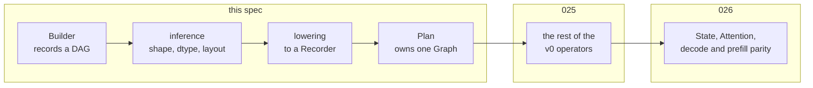

# Tensor bring-up

The first of [009](009-sequencing.md)'s M7 children, cut vertically for the
reason [012](012-kernel-pipeline.md) and [021](021-metal-bringup.md) were: the
point of a first child is not to finish a layer but to make the next ones
checkable. Until one tensor DAG compiles and runs, every piece of shape
inference is checked by reading it; after it, each is checked by running.

So this takes a thin slice of the whole layer — `Runtime`, `Builder`, `Tensor`,
ports, inference, compilation, binding, submission, selection reporting — and
stops at the narrowest operator set that proves the slice.



## 1. What the package is, and where the seam is

`golang.design/x/accel/tensor`, above `accel` and importing it. **A backend
never learns what a tensor is**, which [007](007-tensor-layer.md) states and
this child has to hold in code: everything here lowers to a `Recorder`, and the
device layer sees buffers, pipelines, and dispatches exactly as a hand-written
caller would produce.

That direction is the reason this is a separate package rather than more of
`accel`. A tensor type inside `accel` could reach into unexported graph state,
and the first time it did, the seam would be gone with nothing to notice.

## 2. Errors are collected, not returned

[007](007-tensor-layer.md) requires an invalid operator to return a **poisoned
tensor** so model code needs no error branch per line:

```go
x := tensor.Add(b, a, c)   // wrong shapes: records an error, returns poison
y := tensor.SiLU(b, x)     // poison in, poison out, no second error
```

Two rules make that safe rather than merely convenient:

1. **A poisoned operand produces a poisoned result and no new error.** One
   mistake produces one diagnostic. Without this, a wrong shape near the top of
   a model produces a page of errors that all say the same thing in different
   words.
2. **`Compile` returns every collected error together**, each naming the
   operator, the operand, and the **Go call site**. A tensor DAG has no source
   position of its own, so the call site is recovered with `runtime.Caller` at
   the point the operator was recorded — which is the only moment it exists.

## 3. Inference

Concrete throughout: [007](007-tensor-layer.md) requires every dimension to be a
positive integer at compile time, so there is no symbolic shape and no
inference solver.

**Layout is a stride vector, and a view is not a copy.** Dimensions are
outermost to innermost, the last varies fastest, and contiguous strides are the
suffix products in elements:

$$\text{stride}_i = \prod_{j>i} \text{shape}_j$$

A tensor therefore carries shape, strides, an element offset, and a dtype. That
is enough for `Reshape`, `Slice`, `Permute` and `Broadcast` to be pure host-side
bookkeeping, which is what [025](025-tensor-operators.md) will need and what
this child's structure has to admit even though it lowers only contiguous
operands.

**Broadcasting is NumPy's**, right-aligned, size-one expands, and the expansion
is a **zero stride**. A zero stride is the whole trick: a broadcast operand
needs no materialization because every index along that axis reads the same
element.

## 4. Lowering, and the one thing that makes it honest

An operator becomes a dispatch of a kernel from [010](010-kernel-corpus.md)'s
corpus. What decides *which* kernel is a selector, and
[007](007-tensor-layer.md) requires the decision to be reported:

```go
type KernelSelection struct {
	Op       string // the tensor operator
	Kernel   string // the corpus kernel chosen
	Reason   string // why this one
	Rejected []string
}
```

`Plan.Selections()` returns them. This is not diagnostics decoration: fused
attention versus the composed graph is a *selection*, not a capability, and a
caller who cannot see which they got cannot explain a performance cliff or a
numeric difference.

**Intermediates are transients**, so the graph's aliasing and barrier planning
apply unchanged — a tensor layer that allocated its own intermediates would
reimplement [017](017-graph-aliasing.md) badly.

## 5. What this child builds

- `Runtime`, `Builder`, `Tensor`, `Plan`, and their lifetimes;
- `Input`, `Weight`, `Scalar`, `Output`, and the port list;
- shape, dtype, stride and broadcast inference, with poisoned-tensor error
  collection and call sites;
- lowering to a `Recorder`, transients for intermediates, and `Plan.Memory`;
- `Bindings`, atomic binding validation, scalar packing, and `Plan.Submit`;
- `Plan.Selections`; and
- the elementwise family — `Add`, `Mul`, `SiLU`, `SwiGLU` — which is the
  smallest set that exercises two operands, broadcasting, a unary with a bounded
  primitive, and a fused form whose semantics are a composition.

## 6. What it does not

Named so the milestone is not read as further along than it is:

- every other operator — [025](025-tensor-operators.md);
- `Persistent`, `State`, `ScatterRows`, `LayerState`, `Attention`, and the
  decode and prefill plans — [026](026-tensor-decode.md);
- non-contiguous lowering. Views are inferred and a non-contiguous operand is
  made contiguous by an explicit copy, because the corpus kernels index
  contiguously. `Contiguous` becomes a no-op where the operand already is; and
- any plan cache, which [007](007-tensor-layer.md) puts firmly post-v0.

## 7. Testing

1. **Inference is checked against a table**, including the rejections: mismatched
   dtypes, non-broadcastable shapes, a duplicate port name, an undeclared
   scalar, and a scalar of the wrong kind.
2. **One mistake is one error.** A DAG with a single bad operator followed by ten
   consumers reports one diagnostic, and it names the operator and the call site.
3. **The device layer sees nothing tensor-shaped.** `Plan.Memory` reports
   transient bytes the graph planner chose, which is evidence the intermediates
   went through the recorder rather than round the side of it.
4. **The differential**: every plan runs on the CPU backend and on Metal and
   agrees, under the same rule as [022](022-msl-target.md) — exactly where the
   arithmetic is exact, and within [008](008-numerics.md) §6's ceiling where a
   bounded primitive is reached.
5. **E2E**: a caller declares ports, builds a DAG, compiles, binds buffers and
   scalars, submits, waits, and reads an output, through public API only.

## Outcome — 2026-08-23

A tensor plan compiles and runs on both backends, and the same builder code
compiles against either runtime — which is the claim of backend independence
made checkable rather than architectural.

### Deviation 1: named runtime scalars are absent, and so is `Scale`

**What this spec required.** `Scale(b, x, scalarName)`, and with it `Scalar`,
`ScalarDesc` and `ScalarValue` — [007](007-tensor-layer.md)'s named per-step
values, which "may vary" between submissions of one plan.

**What was built.** None of it. A by-value uniform travels with a recorded
dispatch, and the device layer has no way to rewrite one between submissions, so
a factor that changed every step would need a new plan — exactly what
[007](007-tensor-layer.md) says a runtime scalar must not need.

**Why not improvised.** The two ways out are both device-layer changes with
their own scope: rebinding a recorded node's uniform, or a corpus kernel that
reads its scalar from a one-element binding. Choosing between them from up here
would be picking a device-layer design to suit one operator.

**Why the surface is absent rather than present and unusable.** An API a caller
can call and cannot use is worse than one that is not there: the compiler says
nothing and they find out at run time.

**When it closes.** [025](025-tensor-operators.md), which adds the mechanism and
the surface together. `RoPE` and `Softmax` need it too, so it is not one
operator's problem.

**Retired the same day.** `accel.Graph.SetUniform` replaces one recorded
dispatch's by-value parameter between submissions, refused while a submission is
in flight for the reason `Bind` is. The type must be the one the kernel
declares, checked as a *type* rather than a size: a struct of the same shape and
a different name encodes identically today and diverges the first time either
gains a field. `Scale` and the scalar surface are built on it.

The line stays where [007](007-tensor-layer.md) drew it. A value that changes
nothing structural varies per submission; one that changes a shape, a layout, or
which kernel is selected needs another plan, because the barriers and the
transient layout were computed from it.

### Deviation 2: broadcasting is inferred and not materialized

Inference implements NumPy's rule, and lowering refuses an operand whose extent
differs from the result's — by name, pointing at [025](025-tensor-operators.md).
The corpus kernels index their operands together, so a smaller operand would
read the wrong elements rather than repeating them. Inferring the shape
correctly and refusing to lower it is the honest half-step: the alternative is
either a wrong answer or a shape rule that contradicts the spec.

### What this child found

**One mistake has to stay one diagnostic, and the second one arrived from an
unexpected direction.** The poisoned-tensor rule handles operators. It did not
handle `Compile`'s own check that a graph declares an output — because `Output`
ignores a poisoned value, a graph whose only mistake was upstream reported both
"shapes do not broadcast" and "declares no output". The second is an echo of the
first, and the fix is the same rule one level up: that check runs only when
nothing else went wrong.

**`accel.FailedFence` was added to the device layer**, because
[007](007-tensor-layer.md) requires a binding failure to arrive through the
fence like every other submission failure, and the alternative was every layer
above inventing its own two-value convention or reaching into `accel`.

### Carried forward

The corpus lives in `internal/testkernels`, so a public package now depends on
one whose name says "test". [010](010-kernel-corpus.md) owns the corpus and its
naming; renaming a package is a refactor with its own agreement, and the
dependency is recorded here so it is not discovered as a surprise.
