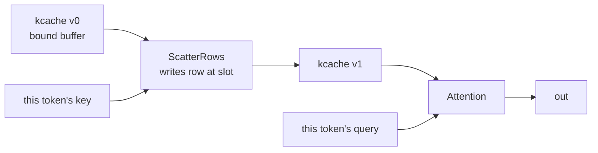

# Persistent state and the decode step

The third of [009](009-sequencing.md)'s M7 children: the one mutable thing in a
transformer, and the operator that reads it.

## 1. Why mutation is versions rather than writes

A KV cache is genuinely mutable — every token appends to it and the next token
reads what the last one wrote. A graph of immutable values has to say that
somehow, and [007](007-tensor-layer.md) chooses SSA-style versions: a write
returns the *next version* of the same binding.

The dependency between the write and the read is then an ordinary edge, and the
graph's own hazard inference covers it: both nodes declare overlapping byte
ranges, so the planner emits a read-after-write barrier without being told that
one of them is a cache. That was checked before M7 began — [009](009-sequencing.md)'s
risk table asked for it — and this is the first thing that depends on it.

## 2. A version that cannot be violated is not a version

**Reading a superseded version is refused.** Both versions live in one
caller-owned buffer, so expressing "the value before the write" would mean
copying the previous contents aside, which v0 does not do.

The alternative is what the first implementation did, and it is worth recording
because it looked fine: the version chain compiled, and a test deliberately
reading the *stale* version still passed — the read happened after the write
regardless, because both bound the same slot. A distinction nothing can violate
is decoration. So an older version is an error, and the message says how far
behind it is and why v0 cannot serve it.

## 3. Attention

The query is this step's and the cache is every step's, and that asymmetry is
the shape of decoding. Expressing it in the types means a caller cannot
accidentally write the query or read a stale cache: a `State` carries a version
and a `Tensor` does not.

**Fusion is a selection**, which [007](007-tensor-layer.md) states plainly:
"runtime kernel selection, not a device capability". v0 selects the fused decode
kernel when the shapes fit and reports that it did. It does **not** fall back to
the composed score-softmax-value graph — which remains the correctness reference
— and says so in `Selections` rather than implying a choice was weighed.

Two bounds come from the kernel rather than from the model, and each is refused
by name: the cache is scored one position per lane, so a capacity above the
workgroup needs a looping variant [010](010-kernel-corpus.md) does not register;
and the query is one token, because a longer one is the prefill plan's.

## 4. Where v0 is narrower than 007

1. **`LayerState` builds the view and cannot be bound.** A slot binds a whole
   resource rather than a range of one, so a per-layer cache needs one state per
   layer until the device layer can bind a sub-range. The view arithmetic is
   built and tested; what is missing is underneath it.
2. **The prefill plan is absent.** The registered attention kernel takes one
   query token, so the "minimal prefill" half of M7's parity criterion has no
   kernel to lower to. `MatMul` and `Softmax` can express the composed form and
   nothing yet assembles them.
3. **`Rows`, `ScatterRows`, `RMSNorm`, `Softmax`, `RoPE` and `Attention` are
   f32**, and `MatMul` is f16. That is what [010](010-kernel-corpus.md)
   registers.

## 5. Done

- a decode plan appends this token's key and value and attends over the cache,
  submitted once per token with the same buffers and nothing rebuilt;
- the cache holds every token afterwards, and nothing past the written positions
  is touched;
- a stale version is refused through every path that reads one, at the caller's
  line; and
- the whole step agrees between the CPU backend and Metal within
  [008](008-numerics.md) §6's ceiling for the softmax inside attention.

## Testing

The decode loop is checked against a reference computed in f64 beside it, one
token at a time, rather than against a stored answer: a change in any kernel
then shows up as a numeric failure rather than as a golden nobody can evaluate.
The cache contents are checked *after* the loop, because holding every token is
the property a per-step check cannot see.
