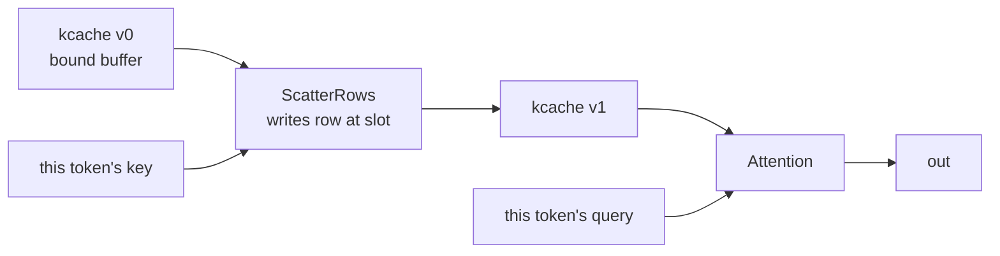

# Persistent state and the decode step

The third of [009](009-sequencing.md)'s M7 children: the one mutable thing in a
transformer, and the operator that reads it.

## 1. Why mutation is versions rather than writes

A KV cache is genuinely mutable — every token appends to it and the next token
reads what the last one wrote. A graph of immutable values has to say that
somehow, and [007](007-tensor-layer.md) chooses SSA-style versions: a write
returns the *next version* of the same binding.

The dependency between the write and the read is then an ordinary edge, and the
graph's own hazard inference covers it: both nodes declare overlapping byte
ranges, so the planner emits a read-after-write barrier without being told that
one of them is a cache. That was checked before M7 began — [009](009-sequencing.md)'s
risk table asked for it — and this is the first thing that depends on it.

## 2. A version that cannot be violated is not a version

**Reading a superseded version is refused.** Both versions live in one
caller-owned buffer, so expressing "the value before the write" would mean
copying the previous contents aside, which v0 does not do.

The alternative is what the first implementation did, and it is worth recording
because it looked fine: the version chain compiled, and a test deliberately
reading the *stale* version still passed — the read happened after the write
regardless, because both bound the same slot. A distinction nothing can violate
is decoration. So an older version is an error, and the message says how far
behind it is and why v0 cannot serve it.

## 3. Attention

The query is this step's and the cache is every step's, and that asymmetry is
the shape of decoding. Expressing it in the types means a caller cannot
accidentally write the query or read a stale cache: a `State` carries a version
and a `Tensor` does not.

**Fusion is a selection**, which [007](007-tensor-layer.md) states plainly:
"runtime kernel selection, not a device capability". v0 selects the fused decode
kernel when the shapes fit and reports that it did. It does **not** fall back to
the composed score-softmax-value graph, and cannot: several query heads share
one key/value head, so the composed form needs a matrix multiply per head and
[025](025-tensor-operators.md) does not broadcast leading axes. The composed
graph remains the correctness reference over the shapes it can express, which is
`kvHeads == 1`. See [044](044-unbounded-context.md) deviation 3.

One bound comes from the kernel rather than from the model, and is refused by
name: the query is one token, because a longer one is the prefill plan's.

The cache had a second: it was scored one position per lane, so a capacity above
the workgroup was refused. [044](044-unbounded-context.md) removed it — the
kernels walk the cache a block at a time — and any capacity the device can
allocate is now accepted.

## 4. The two-layer stack, and the operator it is missing

A stack of two layers — embedding lookup, then normalize, attend over a
per-layer cache, add the residual, twice — composes and matches an f64 reference
written from the model's definition rather than from the kernels, over four
tokens, on both backends. Every value in it is produced by the previous
operator.

**It produces logits**, through a `Cast` to f16 and a projection to the
vocabulary. That was blocked when this section was first written: the registered
GEMM reads f16, every other operator is f32, and no conversion kernel existed.
[010](010-kernel-corpus.md) has one now, with its proof obligations attached,
and `Cast` lowers to it.

That is worth recording precisely because the first version of the test hid it:
it supplied the f16 operands from the host and discarded the f32 results, which
computed every piece of a two-layer model and composed none of them. It passed.
A test that runs the parts of a thing is not a test that the thing works, and
the tell was two assignments to the blank identifier in the middle of the graph.

## 5. Where v0 is narrower than 007

1. **`LayerState` builds the view and cannot be bound.** A slot binds a whole
   resource rather than a range of one, so a per-layer cache needs one state per
   layer until the device layer can bind a sub-range. The view arithmetic is
   built and tested; what is missing is underneath it.
2. **`Rows`, `ScatterRows`, `RMSNorm`, `Softmax`, `RoPE` and `Attention` are
   f32**, and `MatMul` is f16. That is what [010](010-kernel-corpus.md)
   registers.

## 6. Done

- a decode plan appends this token's key and value and attends over the cache,
  submitted once per token with the same buffers and nothing rebuilt;
- the cache holds every token afterwards, and nothing past the written positions
  is touched;
- a stale version is refused through every path that reads one, at the caller's
  line; and
- the whole step agrees between the CPU backend and Metal within
  [008](008-numerics.md) §6's ceiling for the softmax inside attention; and
- a two-layer model produces logits matching an independently written f64
  reference over four tokens, on both backends; and
- a prefill plan and a decode plan over one cache agree, which is M7's parity
  criterion at the plan level.

## Testing

The decode loop is checked against a reference computed in f64 beside it, one
token at a time, rather than against a stored answer: a change in any kernel
then shows up as a numeric failure rather than as a golden nobody can evaluate.
The cache contents are checked *after* the loop, because holding every token is
the property a per-step check cannot see.
