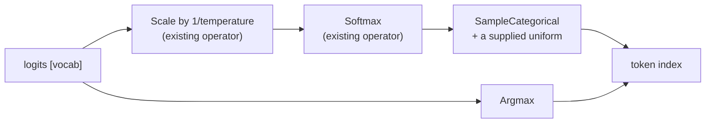

# Sampling

[009](009-sequencing.md)'s M8 item "sampling primitives and policy integration",
and the piece that finishes the sentence [000](000-decisions.md) starts: v0
proves a decode step "reaching a token", and until now the step produced logits
and stopped one operation short of a token.

## 1. The decision this spec exists to make

**The random draw is an input, not something a kernel generates.**

A sampler needs randomness. The obvious design generates it on the device — a
counter-based PRNG seeded per invocation, which is what most inference runtimes
do. This spec does the opposite: the caller supplies one uniform value in
`[0, 1)` per sampled token, as an ordinary runtime scalar.

Three reasons, in the order they matter:

1. **Determinism is testable only if the randomness is an input.**
   [011](011-conformance-harness.md) requires a failing case to be reproducible
   from what a test recorded. A device-side PRNG makes a sampled token a
   function of a seed, an invocation index, and whatever the backend's integer
   arithmetic does — and the CPU oracle and Metal would have to agree
   bit-for-bit on a hash function before they could agree on a token.
2. **The two backends must produce the same token.** That is the whole claim of
   the oracle. With the draw supplied, sampling is a pure function of logits and
   one number, and the differential is the same comparison as every other
   kernel's. With it generated, the differential would be testing a PRNG.
3. **A caller already owns their generator.** A model runtime has a seeded
   `math/rand` or a cryptographic source and a policy about reproducibility.
   Taking that decision away from them buys nothing.

The cost, stated: a caller who wants a device-side generator for a batch of
sequences has to supply a vector of draws rather than a seed. That is one buffer
write per step, which is negligible next to the step, and it is post-v0 anyway
because v0 has one sequence.

## 2. What is sampled

Two primitives, which between them cover greedy and temperature sampling:

| | |
| --- | --- |
| `Argmax` | the index of the largest logit — greedy decoding |
| `SampleCategorical` | an index drawn from the distribution the logits define, using a supplied uniform |

Temperature needs no primitive: it is a scale of the logits before the softmax,
and [025](025-tensor-operators.md)'s `Scale` with a named runtime scalar already
does it, changing every step without a rebuild.

### Truncation — added 2026-08-23

`TopKMask` keeps the k largest and `TopPMask` keeps the smallest set of largest
entries whose mass reaches p. Both drive the rest to **zero weight** rather than
to a sentinel, so the result feeds `SampleCategorical` directly.

**Repeated extraction, not a sort and not a threshold search.** A full sort of a
vocabulary is thousands of comparisons to answer a question about its first few
dozen entries. Extraction asks it directly: each round finds the largest entry
below the previous round's, which is one workgroup reduction.

A threshold search would be fewer rounds and would be *wrong at ties*. Bisecting
the value range lands between two entries that differ in their last bit, and the
count on each side then depends on where the bisection stopped — so a top-k
would keep however many happened to sit above the threshold, which is k only
when nothing ties. Ties near the tail of a distribution are the normal case.

**The comparison is lexicographic on (value, index) descending**, so an entry
ties only with itself. That makes "the k largest" exactly k entries whatever the
data, and the same k on both backends.

**A stated bound.** Both walk at most `TopMaxRounds` = 128 entries. A top-k above
it keeps fewer than asked and a top-p that has not reached its mass stops there.
Stated rather than left implicit, because a truncation that silently kept fewer
entries than asked would change what a model samples without changing what it
reports.

### The walk was amended to take unnormalized weights

`SampleCategorical` now compares against *draw × total* rather than against the
draw. A mask zeroes most of a distribution and leaves the rest summing to less
than one, and the alternative was a renormalizing pass whose only purpose was to
satisfy this kernel.

It also subsumes what §4 originally special-cased: `Softmax` divides by a sum
computed in f32, so its output can land a few ulps below one, and scaling by the
actual total handles that without a rule about it.

**A zero-weight entry can never be drawn**, because its partial sum does not
increase and the comparison is strict. That is what makes a mask a mask.

## 3. Ties, and why they are specified rather than left to the hardware

`Argmax` over logits will meet equal values: an untrained model produces them
everywhere, and a trained one produces them at saturation. **The lowest index
wins.** Stated because the alternative is not "some index" but *a different
index on each backend*: a tree reduction's answer depends on which lane compared
which pair, and two backends reducing at different widths would disagree.

`SampleCategorical` has the same problem in a different place. It walks the
cumulative distribution and takes the first index whose running sum exceeds the
draw, and **the walk is in index order**, not in the order a parallel scan would
produce. A parallel prefix sum is faster and would put the boundary in a
different place when two probabilities are equal.

Both are cases where the fast answer and the reproducible answer differ, and
this spec takes reproducibility — which is the same trade
[008](008-numerics.md) makes when it forbids a tolerance.

## 4. The draw's domain

The supplied uniform is in `[0, 1)`. Half-open at the top, because a draw of
exactly 1 would exceed every partial sum and fall off the end of the
distribution, and the index it would return is the one the implementation
happens to leave in a register.

A draw outside the range is **clamped**, not rejected: a kernel cannot report an
error, and a clamped draw samples the first or last token rather than reading
out of bounds. The clamp is unconditional for the reason
[003](003-command-graph.md) gives about indirect counts — correctness does not
depend on a build mode.

**The probabilities need not sum to exactly one**, and the implementation must
not assume they do. `Softmax` divides by a sum computed in f32, so its outputs
sum to one within a few ulps and can land just below. The walk therefore returns
the **last index** if it reaches the end without exceeding the draw, rather than
falling off it.

## 4.1 Outcome — 2026-08-23

Both primitives are built, compile on the device, and agree between the
backends. The tie rule was confirmed the way everything here is confirmed — by
reinstating the fault: changing the reduction's comparison from strict to
non-strict makes ties go to the *highest* index instead, and the two plateau
cases fail immediately while every distinct-valued case still passes. A test
using only distinct logits would have passed for an implementation with no tie
rule at all.

The differential's two cases are chosen against the same risk. Argmax runs over
a vocabulary with **three equal maxima spread so the pairs that meet them form
at different depths of the reduction tree**, and the categorical case uses a
distribution of **equal masses**, so the boundary a draw lands on is one an
in-order walk and a parallel scan would place differently. A distribution of
distinct values would have compared equal whatever either backend did.

## 5. Done

- `Argmax` returns the lowest index among ties, checked with an all-equal input
  and with a plateau;
- `SampleCategorical` returns the index the cumulative distribution names for a
  given draw, checked at every boundary of a small distribution and at draws of
  0 and just below 1;
- a draw outside `[0, 1)` clamps rather than reading out of range;
- a distribution summing slightly below one returns the last index rather than
  falling off the end; and
- both agree between the CPU backend and Metal, over a distribution whose
  boundaries a differing tie rule would move;
- top-k keeps exactly k entries including when the boundary ties, checked
  against a sort written from the definition rather than from the extraction;
- top-p keeps the set that *reaches* p rather than the largest one below it, and
  is relative to its input's own total so it composes after a top-k; and
- a truncation asking for more than the bound keeps what it can, which is pinned
  rather than discovered.
