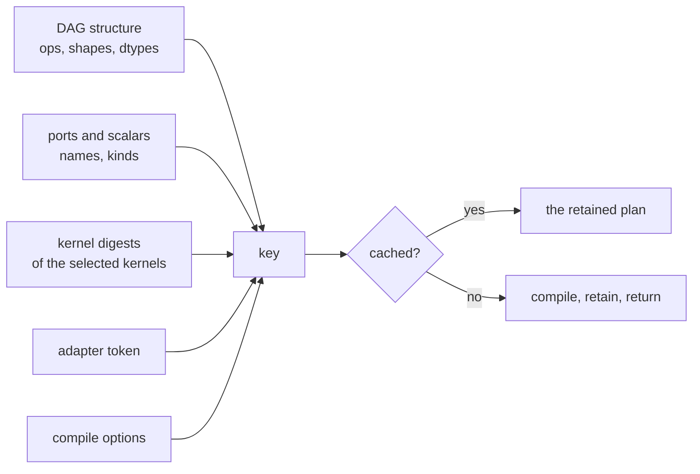

# Prefill buckets and the plan cache

[009](009-sequencing.md)'s M8 item "production prefill bucketing and, only then,
an optional stable-identity plan cache". The ordering in that sentence is the
design: bucketing is what makes a caller hold several plans, and holding several
plans is what makes a cache worth having.

## 1. Buckets

A plan has one concrete shape, so a prompt of 37 tokens and a prompt of 41 need
different plans. Compiling per prompt puts kernel selection and graph planning
on the request path, which is exactly what compiling once was for.

**A bucket set is a sorted list of lengths, and a prompt runs in the smallest
bucket that fits.** The extra positions are padding.

**Padding needs no mask, and that is worth stating because it looks like it
should.** [026](026-tensor-decode.md)'s prefill masks causally: query position
`s` attends to cached positions at most `base + s`. Padding sits *after* the real
tokens, so a real position's window never reaches it. What the padded positions
themselves compute is garbage, and the caller discards it — they asked for `n`
rows and read `n`.

The cost is arithmetic on rows nobody reads, which is what a bucket trades for
not compiling. A bucket set is therefore a policy: fewer buckets means more
waste, more buckets means more plans and more memory.

**A prompt longer than the largest bucket is an error**, not a silent
truncation. Truncating a prompt changes what a model was asked and produces a
plausible answer to a different question.

## 2. The cache, and the key

[007](007-tensor-layer.md) fixes what the key must contain, and the sentence
that matters is its last one:

> its key must include a stable tensor-DAG identity, every input shape and
> dtype, the selected kernel-set version, the device identity and relevant
> capabilities, and every compile option that affects lowering. **Shape alone is
> never a sufficient key.**

So the key is a digest over six things, and each is there because leaving it out
returns a plan that is wrong in a way nothing else would catch:

| Component | What its absence returns |
| --- | --- |
| the DAG's structure | a plan for a *different model* that happens to have the same shapes |
| port names, kinds, dtypes and shapes | a plan whose bindings a caller cannot satisfy, or can satisfy wrongly |
| scalar names and kinds | a plan reading a value nobody bound |
| the selected kernels' digests | a plan built from a kernel that has since been regenerated |
| the device's adapter token | a Metal plan handed to a CPU runtime, or one device's plan to another |
| the compile options | a plan lowered under different settings |

**The kernel digests are the component a naive cache omits**, and the one whose
absence survives longest before biting: a plan compiled before `go generate`
ran, held in a cache, and reused after — running a lowering whose source no
longer exists.

## 3. What the cache is not

**Not automatic.** [007](007-tensor-layer.md) makes that a decision rather than
an omission: a cache that evicts on its own makes memory ownership invisible,
and a plan owns transient device memory. This one is a value a caller creates,
holds, and closes, and it evicts nothing — it grows until closed. A caller who
wants a bound builds one bucket set rather than an unbounded key space.

**Not a substitute for holding a plan.** A decode loop should keep its plan in a
variable. The cache is for the case where the *shape* varies — a prefill bucket
per request — and a lookup is still a digest and a map probe on the request path.

**Not concurrent-safe by accident.** It is guarded, because a plan is and
because a caller serving requests will share one.

## 3.1 Outcome — 2026-08-23

Built as `tensor.Identity`, `tensor.PlanCache` and `tensor.Buckets`.

**The identity is length-prefixed rather than concatenated**, which is a detail
worth stating because getting it wrong is silent: writing `"ab"` then `"c"` and
writing `"a"` then `"bc"` hash to the same bytes, so a digest over a structure
stops distinguishing structures exactly where two fields meet. It is also
versioned, so a later change to what it covers cannot leave an old key valid for
a plan that no longer matches it.

**`accel.AdapterID` gained a `String` method**, because this is the layer that
needed it and could not reach the token. Without it the best a key could do is
the device's *name*, which two identical GPUs in one machine share — and
[007](007-tensor-layer.md) names device identity as a required component
precisely so that one device's plan is not handed to another.

**Padding is proved rather than argued.** The claim that a padded prefill gives
the same rows for the real tokens is not obvious — the padded plan attends over
a longer query and computes rows nobody reads — and if the reasoning were wrong
the failure would be quiet: a model answering slightly differently depending on
which bucket a prompt landed in, indistinguishable from ordinary
nondeterminism until somebody diffs two runs of the same prompt. So there is a
test that runs both and compares, and asserts the padded plan really did compute
more, which is what stops the comparison being trivially true.

**`Label` is excluded from the key on purpose.** Two plans differing only in
what they are called are the same plan, and including it would double the cache
for nothing.

## 4. Done

- a bucket set picks the smallest bucket that fits, and refuses a prompt longer
  than its largest;
- a padded prefill produces the same rows for the real tokens as an exact-length
  plan does, which is what makes padding free rather than merely cheap;
- two builders recording the same DAG produce the same key, and every one of §2's
  six components changes it;
- a cache returns the same plan for a repeated key and a different one otherwise;
  and
- closing the cache closes every plan it holds, and a runtime refuses to close
  while any remain open.
