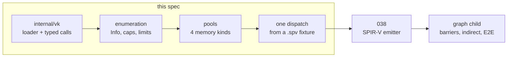

# Vulkan bring-up

The analogue of [021](021-metal-bringup.md), one API over, and **the cut is
vertical for the same reason**: the point of a first child is not to finish a
layer, it is to make a second vendor's device an oracle.
[000](000-decisions.md) decision 3 names the cost this pays down — *"the oracle
has no second opinion"*.

This is post-v0 work, and it is not blocked. [009](009-sequencing.md)'s
[correction](009-sequencing.md#correction-vulkan-was-never-blocked--2026-08-23)
settles that: Vulkan is verifiable on `ubuntu-latest` against Mesa lavapipe for
one apt install. Read the correction, not the paragraphs above it — that file
appends and never edits.

## 1. What is settled before any of this is written

**The entry points.** [021](021-metal-bringup.md) §1 tables executed selectors
because a wrong name crashes inside `objc_msgSend`. Vulkan's equivalent is the
resolved-symbol list, and the predecessor ran it:
`polyred/gpu/backend_vk.go` resolves 32 entry points and drives
instance → device → memory → descriptors → pipeline → dispatch on lavapipe,
green in CI. This child takes that list and adds the six it never needed:
`vkCmdCopyBuffer`, `vkCmdPipelineBarrier`, `vkCreateFence`, `vkWaitForFences`,
`vkGetFenceStatus`, `vkResetFences`.

**The struct layouts, which unlike selectors are mechanically checkable.** The
prior art marshals ~20 create-info structs and reads
`VkPhysicalDeviceMemoryProperties` at hand-computed offsets (`memProp[4+i*8]`),
under a comment claiming *"Go's natural alignment matches on amd64"* with
nothing asserting it. `VkPhysicalDeviceProperties` is ~800 bytes with
`deviceName[256]`, `pipelineCacheUUID[16]` and all of `VkPhysicalDeviceLimits`
inline; one wrong offset yields a limit that is a plausible integer.

> **The layout table is a test.** Every marshalled struct gets a row per field:
> name, C type, expected offset, expected size — the expected values
> **hand-transcribed from `vulkan_core.h` as literal constants**, never derived
> from the Go declaration. A test asserts `unsafe.Offsetof`/`unsafe.Sizeof`
> against those literals, needs no loader and no device, and runs on every
> platform in tier 1.

Asserting a Go struct against itself proves self-consistency, not C-ABI
agreement, which is why the literals are the point. This test is what makes 037
reviewable by someone who cannot run it, and nobody here can:
[009](009-sequencing.md) measured no loader on the development Mac, twice. The
C-type column is fixed — `VkDeviceSize` is `uint64`, `VkBool32` is `uint32`,
every handle is `uintptr`, every enum and flag bitmask is `uint32`.

## 2. The evidence story, which is not Metal's

[021](021-metal-bringup.md) leans on `-newLibraryWithSource:` *being* the Metal
compiler. Vulkan has no source level: [004](004-kernel-authoring.md)'s target
table gives SPIR-V artifact **binary**, source level **no**. Two independent
consumers replace it, and both are needed because they fail differently.

| Check | Catches | Misses |
| --- | --- | --- |
| `vkCreateShaderModule` + `vkCreateComputePipelines` on lavapipe | what a real driver's SPIR-V front end rejects | structural and decoration errors it tolerates |
| `spirv-val` (apt `spirv-tools`) | structural and decoration errors | whatever a driver's own compiler dislikes |

`vkCreateShaderModule` frequently accepts garbage that
`vkCreateComputePipelines` then rejects, so the negative test drives both. This
is [021](021-metal-bringup.md) test 2 restated: a path that only compiles valid
input cannot tell a working compile from one that ignores its result code.

## 3. The 037/038 boundary: this child dispatches

037 consumes `[]byte` of SPIR-V; [038](038-spirv-target.md) produces it. The
dispatch happens **here**, against a committed `.spv` fixture in `testdata`,
with its GLSL source, a `spirv-dis` listing, and a note naming the glslang
version that produced it — offline, once, never regenerated by CI.

Stopping at buffer round trips instead would make 038 debug the emitter and the
runtime spine at once, the cut [012](012-kernel-pipeline.md) and
[021](021-metal-bringup.md) both argued against. After this child a 038 failure
is the emitter's and nothing else's. glslang never runs in CI and never on the
shipped path, per [006](006-backends.md) §2.3: a build-time external tool inside
the runtime story is *"fine for a proof and not shippable"*. The predecessor's
`vk-probe.yml` regenerates the artifact under test; this child does not.

## 4. The loader, and its platform split

`purego.Dlopen` is not compiled on Windows, so this is two implementations and
not one with a filename variable.

| GOOS | Library | Mechanism |
| --- | --- | --- |
| linux | `libvulkan.so.1` | `purego.Dlopen`/`Dlsym`, calls through `purego.SyscallN` |
| windows | `vulkan-1.dll` | `syscall.LoadLibrary`/`GetProcAddress`, calls through `purego.SyscallN` |

Build tag `(linux || windows) && (amd64 || arm64)`. The architecture gate is not
caution: `VkDeviceSize` is `uint64` and `SyscallN` passes `uintptr`, so a 32-bit
target is not untested, it is wrong.

Only `vkGetInstanceProcAddr` is found by `dlsym`. Everything else comes from
`vkGetInstanceProcAddr(instance, …)`, and once a `VkDevice` exists from
`vkGetDeviceProcAddr`, which is what lets layers and extensions interpose;
`dlsym` for everything works on lavapipe and silently bypasses them.

**Resolving symbols and installing them are separate jobs**, which is
[021](021-metal-bringup.md)'s recorded bug: Metal's first resolver wrote the
package's function pointers as it went, so a partial failure left half a table
live. The resolver builds a complete table and swaps it in, or errors and
installs nothing.

**No call wrapper panics.** The prior art's `c()` panics on any non-zero
`VkResult` and callers `recover()` into a string. R1 requires that probing not
panic, and a recovered string erases the classification §11 depends on:
`VK_ERROR_DEVICE_LOST` and `VK_ERROR_OUT_OF_DEVICE_MEMORY` become one error.
Every call returns a typed `vk.Result`.

`purego.SyscallN` caps at 15 arguments and the widest call here,
`vkCmdPipelineBarrier`, takes 10. It also *"does not properly call functions
that have both integer and float parameters"*; no compute-path call passes a
float by value, and `pQueuePriorities` is a pointer. Recorded so it is checked
rather than discovered.

## 5. Enumeration, capabilities, and limits

Packages mirror Metal's split: `internal/vk` is the loader and typed calls (the
analogue of `internal/mtl`), `internal/vulkan` is the `driver.Device`
implementation (the analogue of `internal/metal`).

**The instance version is negotiated, not assumed.** `VkApplicationInfo.apiVersion`
is a maximum, and a 1.0 loader answers a higher request with
`VK_ERROR_INCOMPATIBLE_DRIVER`. So resolve `vkEnumerateInstanceVersion` through
`vkGetInstanceProcAddr(NULL, …)`, treat its absence as 1.0, and request
`min(available, 1.1)`. 1.1 rather than 1.0 because exactly two things need it,
named rather than justified by a general appeal to R2:
`VkPhysicalDeviceSubgroupProperties` (`subgroupSize`, and the op classes filling
`Capabilities.SubgroupOps`) and `VkPhysicalDeviceIDProperties.deviceUUID`. Every
other `Limits` field is reachable from core-1.0 `VkPhysicalDeviceLimits`. A
device below 1.1 is **not offered as an adapter** and the reason becomes a
`ProbeDiagnostic`: an adapter that must fail R2 at `Open` is worse than an
absent one with an explanation.

Enumeration creates one `VkInstance` and no `VkDevice`, per
[006](006-backends.md) §6.1. Enumerating nothing is `vk.ErrNoDevice`, never an
empty list — the distinction `internal/metal` preserves, because an empty list
is indistinguishable from a build with no Vulkan compiled in. `Adapter.Token()`
is `deviceUUID` copied into `[16]byte`, which it fits exactly. `Info.Software`
is `VkPhysicalDeviceType == CPU`, which is how lavapipe reports itself and what
[006](006-backends.md) §6.2 makes its own class.

Every `Limits` field gets a named source, and **almost none of them is a
same-name transcription** — Vulkan's spelling differs from accel's nearly
everywhere, so a table is the only honest form. The bulk:

| accel `Limits` field | Vulkan source |
| --- | --- |
| `MaxUniformBlockBytes` | `maxUniformBufferRange` |
| `MaxStorageBufferBindingBytes` | `maxStorageBufferRange` |
| `MaxWorkgroupSize` | `maxComputeWorkGroupSize` |
| `MaxWorkgroupInvocations` | `maxComputeWorkGroupInvocations` |
| `MaxWorkgroupCount` | `maxComputeWorkGroupCount` |
| `MaxSharedMemoryBytes` | `maxComputeSharedMemorySize` |
| `MaxTextureExtent2D` | `maxImageDimension2D` |
| `MaxTextureExtent3D` | `maxImageDimension3D` |
| `MaxTextureArrayLayers` | `maxImageArrayLayers` |
| `MinStorageBufferOffsetAlignment` | `minStorageBufferOffsetAlignment` |
| `MinUniformBufferOffsetAlignment` | `minUniformBufferOffsetAlignment` |
| `MinBufferCopyOffsetAlignment` | `optimalBufferCopyOffsetAlignment` |
| `MinBufferCopyRowPitchAlignment` | `optimalBufferCopyRowPitchAlignment` |
| `MaxBufferBytes` | **not in core 1.0** — `VkPhysicalDeviceMaintenance3Properties.maxMemoryAllocationSize`, or the heap size |
| `MaxPoolBytes` | **not a `VkPhysicalDeviceLimits` member at all** — the selected heap's `VkMemoryHeap.size` |

The last two rows are the reason this table exists rather than a sentence. A
field with no member behind it is where a fabricated constant goes, and
`TestLimitsArePopulated` asserting non-zero does not catch a plausible wrong
integer — only a named source does.

The rows that need a further word:

| Field | Source | How it is checked |
| --- | --- | --- |
| `MaxPools` | `maxMemoryAllocationCount` | queried; this limit is why the field exists |
| `MaxBindingsPerKind` | `maxPerStageDescriptorStorageBuffers` | queried |
| `MinTexturePlacementAlignment` | none — Vulkan reports it per image | `bufferImageGranularity`, with a comment saying it is an upper bound and that textures are not in this child |
| `MinSubgroupSize`, `MaxSubgroupSize` | `subgroupSize` for both | a constant relationship, with a comment naming what breaks it: a device whose subgroup size varies per pipeline, which is what the 1.3 size-control feature exists to express and which this child does not request |

The last two rows are the class [021](021-metal-bringup.md) §3 ruled on: a
constant gets a comment naming what makes it true. The failure is the prior
art's `maxThreads() int { return 1024 }`, and `TestLimitsArePopulated` caught
this class once on Metal already.

**No row of `internal/cpu/profile.go`'s `baselines[BackendVulkan]` widens from a
lavapipe run.** That table is the *strict oracle's* model of Vulkan; widening it
because lavapipe reported float atomics would make every strict-mode kernel
claim portability to hardware nobody asked. Never widen from observation.

## 6. Memory: four kinds onto memory types

Here the prior art is exactly wrong, in the shape [006](006-backends.md) §1
names. `hostMemType` panics unless it finds `HOST_VISIBLE|HOST_COHERENT`,
allocates every buffer from it and maps it permanently — polyred's
`backendBuffer.bytes()`, which *"quietly foreclosed 001's memory kinds"*. The
symptom is that `MemoryDevice` pools are mappable, and every test asserting
otherwise passes on lavapipe, where all memory is host-visible, and fails on the
first discrete GPU.

Selection is a **preference order** over `VkPhysicalDeviceMemoryProperties`, not
a predicate:

| `driver.MemoryKind` | Preferred flags | Fallback | `Block.Bytes()` |
| --- | --- | --- | --- |
| `MemoryDevice` | `DEVICE_LOCAL` | any type | nil, always |
| `MemoryUpload` | `HOST_VISIBLE\|HOST_COHERENT` | — | mapped range |
| `MemoryReadback` | `HOST_VISIBLE\|HOST_COHERENT\|HOST_CACHED` | `HOST_VISIBLE\|HOST_COHERENT` | mapped range |
| `MemoryShared` | `DEVICE_LOCAL\|HOST_VISIBLE\|HOST_COHERENT` | none — `Supports` reports false | mapped range |

`MemoryShared` is a `cap` cell in [006](006-backends.md) §3, resolved from the
type list and never assumed. `MemoryDevice` returns nil from `Bytes()` even when
the chosen type is host-visible, for [021](021-metal-bringup.md) §4's reason: a
backend that maps device memory on one machine and not another turns a
portability bug into a machine-specific one. The cost is a staging buffer plus
`vkCmdCopyBuffer` for `Block.Write`/`Read`, which [001](001-device-resources.md)
§8.1 allows to be slow. Lavapipe reports every type host-visible and coherent,
so no fallback row above is exercised in CI — worth knowing before trusting one.

**Coherent only, in this child.** `Block.Bytes()` returns a plain `[]byte` with
no flush hook, so non-coherent memory needs `vkFlushMappedMemoryRanges` and
`vkInvalidateMappedMemoryRanges` rounded to `nonCoherentAtomSize` at write
boundaries the seam cannot see. A kind with no coherent host-visible type
reports `Supports(kind) == false` rather than being served incoherently and
returning stale bytes. Changing that is a seam question, and it is §17's.

**One allocation per pool, not per buffer.** `driver.Device.Alloc` makes one
device allocation and accel suballocates, so a pool is exactly one
`VkDeviceMemory` and one `VkBuffer` bound at offset 0, with union usage
`STORAGE|UNIFORM|TRANSFER_SRC|TRANSFER_DST|INDIRECT`. An `Operand` is then
`{buffer, offset, size}` with no new concept, at the price of every operand
offset respecting `minStorageBufferOffsetAlignment`. The prior art's allocation
per buffer works on lavapipe and dies on real hardware at the four-thousandth
tensor with `VK_ERROR_TOO_MANY_OBJECTS`, a mistake only tier 4 observes.

`driver.Unwrap` is called before every type assertion on a `Block`.
[031](031-shared-transients.md) hands backends a forwarding block, and it must
resolve at use rather than at compile, or a pool growth leaves the backend
holding the pre-growth allocation.

## 7. Buffers, descriptor sets, and the binding contract

[021](021-metal-bringup.md) §5 makes buffer index assignment the contract.
Vulkan needs that plus a descriptor **type**, which MSL's flat scheme has no
equivalent of — and a type mismatch between the layout and the module's
decorations is a validation error only when a layer is on, and a wrong read when
it is off. Set 0 throughout, for a kernel with *n* bindings and *u* uniform
blocks:

| Binding | Contents | Descriptor type |
| --- | --- | --- |
| `0 … n-1` | `kernel.Bindings[k]`, in order | `STORAGE_BUFFER` |
| `n` | the generated lengths block | `UNIFORM_BUFFER` |
| `n+1+i` | uniform block *i* | `UNIFORM_BUFFER` |

That table is [038](038-spirv-target.md) §5's, and the backend does not restate
it: `emit.MSLLengthsIndex(n)`, `emit.MSLUniformIndex(n, i)` — MSL-prefixed today, and [038](038-spirv-target.md) proposes the rename that makes them shared — and the exported per-slot
descriptor type are what the set layout is built from. Two copies of a numbering
is one too many, and this is the copy that would drift.

**The lengths block stays**, rather than being dropped for `OpArrayLength`, so
the host code is identical across both targets — and 038 §5 gives the harder
reason: `OpArrayLength` reports the *bound descriptor range*, so a kernel handed
a sub-range would see a different `len()` than MSL and the CPU do.

**Its members are scalar `uint`s at 4-byte offsets, not a `uint[N]` array.** An
array in a std140 uniform block has **stride 16**, so the array spelling costs
4x padding that the host fill and the emitted declaration must both reproduce
exactly. The layout is one fact, stated here and honoured there. The slot is
reserved whether or not any body calls `len`, and the host fills entry *k* as

$$\texttt{len}_k = \left\lfloor \frac{\texttt{bindings}[k].\texttt{Len}}{\texttt{sizeof}(\texttt{dtype}_k)} \right\rfloor$$

**The layout is built from `kernel.Bindings` and `kernel.Uniforms`, never
observed.** The prior art derives it lazily from the highest binding index seen
at first dispatch; R6 makes the record the owner. The symptom of the lazy
version is a kernel with an unused trailing binding getting a short layout, and
a pipeline created against a layout that does not match its module — which
lavapipe may accept.

**`Compile` checks the workgroup size against the module.** `vkCmdDispatch`
takes workgroup counts only; the local size is an `OpExecutionMode LocalSize`
baked into the binary. A record saying 16x8 against a module saying 8x8 runs a
quarter of the grid and leaves the rest holding whatever the buffer was zeroed
to, which passes any test whose reference is zero there. So the backend reads
`LocalSize` back out of the module and refuses a mismatch, naming both triples.

**`pName` is read out of the module, never assumed.** The prior art hardcodes
`"main"` because glslang always emits it, while [038](038-spirv-target.md) §2
emits the *kernel* name. A constant on either side fails pipeline creation with
a message naming neither, so the same pass that decodes `LocalSize` decodes
`OpEntryPoint`'s name and passes it through — which also lets the §3 fixture,
which does say `main`, run unmodified.

All of this happens in `Compile`, following `internal/metal/exec_darwin.go`: a
backend that defers knowable validation to `Submit` reports it through a fence,
which is the hardest place for a caller to act on it.

## 8. Submission, fences, and what owns lifetime

**This child re-records per submission**, which makes it structurally identical
to [021](021-metal-bringup.md). [006](006-backends.md) §4.1 fixes the *target*
shape — a reusable primary command buffer whose descriptor sets are rewritten
host-side — and its open question 1 keeps "does it beat re-recording" behind a
measurement it calls a hypothesis. The graph child takes it, with that
measurement.

**`vkDeviceWaitIdle` is not called at the end of a submission.**
`Executable.Submit` *"begins the work and returns without waiting"*. The prior
art's `commit()` waits so it can immediately reset the descriptor pool. Keeping
the wait makes `Fence` a lie: `Done()` is always true, every in-flight test
passes vacuously, and [001](001-device-resources.md) §8.2's asynchronous-write
contract is silently synchronous. Removing it without moving the resets makes
the pool reset and the `vkUpdateDescriptorSets` writes to objects an in-flight
command buffer references — undefined behaviour with no diagnostic. So lifetime
gets an owner.

> **The submission slot.** One `VkCommandPool`, one `VkDescriptorPool` and one
> `VkFence` per in-flight submission. A slot is reclaimed — both pools reset,
> fence reset — only when its fence is observed signalled. A submission with no
> free slot waits for the oldest.

`driver.Fence` maps at core 1.0. `Wait()` is `vkWaitForFences` with an infinite
timeout; `Done()` is `vkGetFenceStatus`, where `VK_NOT_READY` is false,
`VK_SUCCESS` is true, and `VK_ERROR_DEVICE_LOST` is loss rather than false.
Timeline semaphores are the better long-term answer for `SubmitAfter` and
cross-queue ordering, need 1.2, and are not here.

**`OpHostWrite` lowers to `vkCmdUpdateBuffer`, and that is legal only because
this child re-records.** Those bytes *"are rewritten on every submission, which
is what makes a graph carrying a small constant replayable"*. Baked into a
*recorded* command buffer, the second submission silently replays the first
one's constant — an obligation the graph child inherits with the reusable CB.
`vkCmdUpdateBuffer` also caps at 65536 bytes; a larger write takes §6's staging
path. Uniform blocks are never push constants for the same reason one field
over: `Graph.SetUniform` makes them vary.

**One compute-capable queue family, one queue**, reported through R8 rather than
assumed. [001](001-device-resources.md) §1 is honest about what follows: every
multi-queue path stays *specified and unexercised*, and lavapipe will not change
that.

**Locking is per object, not global.** Vulkan has no thread affinity — the GL
backend's `runtime.LockOSThread` habit does not transfer — but `VkQueue`,
`VkCommandPool`, `VkDescriptorPool` and `VkDescriptorSet` are externally
synchronized. One mutex guards the queue and the submission slots; a pool's
allocation and mapping take no shared lock. The prior art's single global mutex
satisfies [001](001-device-resources.md) §1.2's safety promise and serializes
the per-pool allocation that section expects to be concurrent, which is a
failure a correctness suite never reports.

## 9. Barriers, argued from the plan and not from a passing test

`PlanNode.BarrierBefore` is a real obligation. The prior art resolves 32 entry
points and `vkCmdPipelineBarrier` is not among them, because it submits one
dispatch per command buffer and never needed one.

Even this child's chain has real edges: staging `vkCmdCopyBuffer` → the dispatch
that reads it, and the dispatch → the readback copy. So `BarrierBefore` lowers
to `vkCmdPipelineBarrier` with a buffer memory barrier over the touched
operands, `TRANSFER|COMPUTE_SHADER` to `COMPUTE_SHADER|TRANSFER`, access masks
derived from the plan's edge.

**No test here can check that, and the spec says so rather than implying
otherwise.** Per [006](006-backends.md) §7 lavapipe serializes, so the whole
cooperative corpus produces correct answers with every barrier dropped. The
barrier is argued from the plan's edges, and no claim of the form "verified on
Vulkan" is made from a lavapipe run.

## 10. Device loss

`VK_ERROR_DEVICE_LOST` is returned by `vkQueueSubmit`, `vkWaitForFences` and
`vkDeviceWaitIdle`, so this is more real than Metal's and
[023](023-metal-graph.md) §4's classifier transfers unchanged: **derived from
result codes, sticky, narrow**. [001](001-device-resources.md) §7.4 makes loss
terminal.

`VK_ERROR_OUT_OF_DEVICE_MEMORY` and `VK_ERROR_OUT_OF_HOST_MEMORY` are **not**
loss, and *"the half of the test asserting that is the more important half"*:
reporting an allocation failure as loss turns a recoverable bug into a device
the caller must discard permanently. Lavapipe cannot be made to lose a device,
so what is tested is the classifier and the stickiness, which is where the
decisions are.

## 11. The kernel record

SPIR-V is the third target, so [021](021-metal-bringup.md) §6's deferred
question comes due, and [038](038-spirv-target.md) §8 answers it the same way
this child needs: **the flat shape is ratified, not reversed** — `SPIRV []byte`
beside `MSL string`, rather than reinstating
[004](004-kernel-authoring.md)'s `TargetArtifacts` wrapper, which would rename
`Kernel.MSL` across the generator, the goldens and the Metal backend for no
behavioural gain. No entry-point field is added, because §7 reads the name from
the module.

A Vulkan dispatch of a kernel whose `SPIRV` is empty is a build error naming the
kernel and the target, never a fallback to the Go lowering — which would be
correct, fast enough to miss, and would mean the GPU was never exercised. How a
*generated* binary reaches that field without thousands of lines of byte
literals under the freshness gate is [038](038-spirv-target.md)'s problem; 037
constrains it to one thing, that the backend receives `[]byte`.

## 12. What this costs

- **Nobody on this project can run it locally.** Darwin is excluded, so there is
  no MoltenVK path and no local iteration loop. The compensation is §1's layout
  test, which runs everywhere, plus a blocking CI job.
- **The Windows path is compiled and unexercised.** No runner promises Vulkan on
  Windows, so `vulkan-1.dll` is built by the cross-compile gate and never
  called. Said plainly, because [011](011-conformance-harness.md) §11 makes an
  unpromised backend a rot-green risk rather than a gap.
- **Every number lavapipe produces is lavapipe's**, on `ubuntu-latest`, at a
  Mesa version. Never "the Vulkan profile".
- **A staging copy for every `MemoryDevice` transfer**, bought deliberately.
- **Roughly forty structs marshal before anything runs**, as
  [006](006-backends.md) §2.3 predicted. The predecessor removes the risk, not
  the labour.

## 13. Testing and CI

A new blocking `.github/workflows/ci-vulkan.yml`, modelled on `ci-metal.yml`:
`ubuntu-latest`, an explicit `apt-get install -y mesa-vulkan-drivers libvulkan1
vulkan-tools spirv-tools` (no `glslang-tools`), a `vulkaninfo --summary`
diagnostic, an `Enumerate` step first so "no device on this runner" is one line,
and `ACCEL_REQUIRE_VULKAN=1` carrying the promise. Both CGO settings run, and
not only for the race detector: purego reaches `dlopen` through fakecgo at
`CGO_ENABLED=0` and through real cgo at `=1`, so the loader is two code paths.

[006](006-backends.md) §7's entry gate has five items. This child owns 1–3 —
probe, a capability report populating every row of §3's matrix, and a buffer
round trip for every dtype, which needs no kernel at all. Items 4 and 5, the
barrier reduction and the tiled GEMM, need the emitter.

## 14. Done

Each is a checkable assertion, and each names what it catches.

1. **Every marshalled struct's field offsets and sizes equal the literals
   transcribed from `vulkan_core.h`**, on every platform, with no loader — an
   alignment assumption that reads a plausible integer out of the wrong field.
2. **`Enumerate` with no ICD returns a `ProbeDiagnostic` separating
   `ProbeLoadLibrary` from `ProbeEnumerateAdapters`, and does not panic** — R1's
   failure, and the difference between no GPU and a broken installation.
3. **No `driver.Limits` field is zero on an opened device**, via the existing
   `TestLimitsArePopulated` — the fabricated constant and the forgotten row.
4. **`Block.Bytes()` is nil for a `MemoryDevice` pool and non-nil for the
   host-visible kinds, on a machine where every memory type is host-visible** —
   the prior art's foreclosure, on the one machine that would otherwise hide it.
5. **A `Write` then `Read` on a `MemoryDevice` pool at a non-zero offset
   round-trips every dtype** — the staging and `vkCmdCopyBuffer` path, and an
   offset ignoring `minStorageBufferOffsetAlignment`.
6. **A deliberately corrupted `.spv` is rejected and the driver's own message
   reaches the caller**, through both `vkCreateShaderModule` and
   `vkCreateComputePipelines` — a compile path that ignores its `VkResult`.
7. **A kernel writing its global id, dispatched at a 3-D workgroup count with
   every axis above one, produces exactly the expected ids** — the prior art's
   `dispatch(x, y, z) { c.gx = x }`, which passes every 1-D test and leaves two
   planes untouched.
8. **A module whose `LocalSize` disagrees with `kernel.WorkgroupSize` is refused
   at `Compile`, naming both triples** — the quarter-grid dispatch that returns
   plausible partial results into an already-zeroed buffer.
9. **`Fence.Done()` is false for a submission still in flight** — a
   `vkDeviceWaitIdle` left in the submission path, which makes every asynchrony
   test pass vacuously.
10. **Device loss is sticky and reported by every later call; a resource fault
    and both out-of-memory results are not loss** — a classifier that turns a
    recoverable bug into a permanently discarded device.
11. **E2E through the public API only**: `Enumerate` finds a Vulkan adapter,
    `OpenDevice` opens it by id, a pool allocates, a graph records upload →
    dispatch of the fixture → readback, submits, and the fence completes.

Nothing here claims memory-model verification. [006](006-backends.md) §7 forbids
that from a software rasterizer, and §9 says why the barrier in particular is
argued rather than evidenced.

## 15. What this child does not build

- the SPIR-V emitter, the [008](008-numerics.md) probes, and the recorded
  lavapipe profile — [038](038-spirv-target.md);
- multi-node graph lowering with real barrier planning, indirect dispatch with
  its on-device clamp (`vkCmdDispatchIndirect` has [023](023-metal-graph.md)
  §2's undefined-behaviour-over-limit problem identically), the reusable primary
  command buffer, and the milestone E2E — the Vulkan graph child;
- timeline semaphores, multiple queues, cross-queue ownership transfer;
- images, samplers, WSI and present;
- `VK_LAYER_KHRONOS_validation` as a shipped mode; and
- the R1 isolated helper-process probe. Vulkan is the case R1 was written for:
  the loader dlopens ICDs named by `VK_ICD_FILENAMES` and layers named by
  `VK_INSTANCE_LAYERS`, so a broken third party can abort inside
  `vkCreateInstance` and take enumeration with it. The mechanism is a re-exec of
  the binary under a probe environment variable reporting JSON on stdout, so an
  abort becomes an exit status. It is deferred because CI runs a known-good ICD
  and nothing here would exercise it, and because Metal has none either — it is
  one spec covering both backends, not half of this one.

## 16. Open questions

1. **Does `Block.Bytes()` need a flush hook?** §6 commits to coherent memory and
   drops a kind that has none. Hardware with a non-coherent-only
   `MemoryReadback` type needs flush and invalidate rounded to
   `nonCoherentAtomSize`, which changes the seam and not this backend. Nothing
   available produces that device, so the question stays open rather than being
   answered from lavapipe.
2. **What does the union usage flag set cost?** Every pool's single `VkBuffer`
   carries `STORAGE|UNIFORM|TRANSFER_SRC|TRANSFER_DST|INDIRECT`, which may
   narrow the memory types a driver offers. Comparable on lavapipe as a
   memory-type-bits difference; only a real driver can price it.
3. **Which `VkPhysicalDeviceType` ordering `OpenBest` uses** when a machine has
   both a discrete GPU and lavapipe. [006](006-backends.md) §6.3 owns the
   policy, and it should not be decided by whichever backend landed most
   recently.
