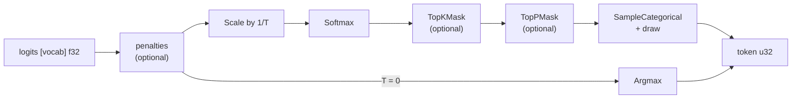

# Sampling policy

[028](028-sampling.md) built the primitives — `Argmax`, `SampleCategorical`,
`TopKMask`, `TopPMask` — with the random draw supplied as an **input**, so one
token is reproducible. This spec is the layer that composes them into a token a
model runtime actually asks for, and makes a whole **sequence** reproducible.

[007](007-tensor-layer.md) places "sampling operators and policy" post-v0. That
is a schedule, not a design gap.

**State — 2026-08-25.** Built: §2's generator (`tensor.Stream`, `Derive`,
`Draw`), §4's three penalty kernels, §5–§6's composition (`SamplingOptions`,
`Validate`, `Scalars`, `DeclareSamplingScalars`, `Sample`), and §9's assertions
including the CPU/Metal **token** differential and the interleaved
reproducibility run. Four deviations below.

Two of §9's assertions are the ones the corpus differential cannot make, and
they are worth separating from the rest. The differential compares each
kernel's two lowerings; every kernel here passes it. What it cannot see is
**where a boundary falls in the composition** — a plateau at the top-k edge, or
a nucleus the walk stops inside — which decides a different token from
arithmetic that matched everywhere. So the cross-backend assertion is on the
token a caller reads, over many draws, and it additionally requires those draws
to produce more than one distinct token: agreement between two backends that
both return a constant is not evidence.

The interleave in the reproducibility test is likewise not a detail. One token
sampled twice passes for a design that reseeds every step; a whole sequence
sampled twice passes for one whose generator happens to advance identically both
times. Running a different sequence in between is what fails for a mutable
generator hidden anywhere, and it does — verified by hiding a counter behind
`Stream`'s value type.

### Deviations

**1. The counts live in caller-owned state, and `Sample` names it.** §4's two
passes need a `[vocab]u32` buffer one node zeroes and another accumulates into,
and every node in a `tensor` graph produces exactly one output tensor. The
buffer is therefore a `State` port, like the KV cache and like the history, and
the version chain is what orders the clear before the count and the count before
the read. The alternatives were an `inPlace` clear — which buys a `[vocab]u32`
copy to avoid a zero-fill of the same size — and one cooperative kernel zeroing
and counting across a barrier, which prices 152k invocations through the
scheduler [006](006-backends.md) §5 keeps for correctness rather than speed.

**2. The draw is a tensor, not a scalar.** §6 lists it in `Scalars`.
[043](043-per-row-values.md) makes every per-row value a tensor, and the built
`SampleCategorical` already takes one draw per row, so a scalar here would be
the one value in the policy that a batch could not vary.

**3. `Scalars` does not carry k and p.** §6 lists them; the built `TopKMask` and
`TopPMask` record them as node attributes, which is what makes
[029](029-plan-cache.md)'s digest distinguish a top-5 plan from a top-40 one.
They are structural, so changing one is a different plan — which is what §7 says
about everything structural, and k and p were on the wrong side of its own line.

**4. §3's numerical refusal is unreachable, and is kept anyway.** The two
temperature rules are stated separately and are not independent: every
temperature whose reciprocal overflows is around 3e-39, far below the 1e-3
guardrail, so the guardrail always answers first. The check is kept so that
lowering `MinTemperature` cannot silently start admitting a temperature that
produces an all-NaN distribution and a plausible token from it, and the
shadowing is asserted by a test rather than left to be rediscovered the day the
constant moves.

`Shape` and `SamplingShape` are not built. Their job — saying which plan a
policy needs — is served by `Greedy` and `Penalised` together with the recorded
k and p, which the plan digest already covers.

## 1. The thing 009 got half right

[009](009-sequencing.md) says the primitives "take their inputs explicitly,
including the random draw, so a policy layer is a caller of this API and not a
change to it". That is true of the **kernel** API and false of the **tensor**
API. The four primitives live in `internal/testkernels`, reachable only through
`kernel.Dispatch` and `kernel.DispatchCooperative`, so **no `Plan` can produce a
token today**.

This spec owns that promotion: `Argmax`, `SampleCategorical`, `TopKMask` and
`TopPMask` become public `tensor` operators, following `tensor/quantized.go` — a
thin recorder over an existing kernel with the host-side check that catches a
bad configuration before it "compiles, runs, and produces a matrix of noise".
One consequence: logits must arrive as **f32**, since
[007](007-tensor-layer.md) has no silent promotion and an f16 logits tensor
needs an explicit `Cast`.

The token output is a `u32` tensor, and that needs nothing new — `Rows` and
`ScatterRows` already require `u32` ids (`tensor/ops.go:56`,
`tensor/quantized.go:120`), 007 lists `u32` among v0 tensor storage, and
`tensor/builder.go:288` records a port's dtype from the value rather than
assuming one.

## 2. The draw: the caller holds the generator, and there is no generator object

[028](028-sampling.md) settles that the draw is an input, and its three reasons
are all about a *device-side* generator: nothing there forbids a host-side one,
it forbids putting one in a kernel.

The hard part is what "seeded" means when the caller holds the randomness. The
shape everybody writes first is a config struct with a `*rand.Rand` in it. Go
copies a struct silently — on assignment, by value, into a map — so two
sequences share one generator, interleave draws, and neither reproduces.
`*rand.Rand` is also not safe for concurrent use, so two goroutines sharing one
is a data race the detector finds only if a test happens to run them together.

**The fix is to have no mutable generator at all.** The draw is
*counter-based*: a pure function of a seed and the step index.

$$
z_0 = \text{seed} + j \cdot \texttt{0x9E3779B97F4A7C15}
$$
$$
\text{draw}(seed, j) = \frac{\operatorname{finalize}(z_0) \gg 40}{2^{24}}
$$

where `finalize` is SplitMix64's avalanche (xor-shift 30, multiply
`0xBF58476D1CE4E5B9`, xor-shift 27, multiply `0x94D049BB133111EB`, xor-shift
31). Three properties, each load-bearing:

| Property | What it buys | What breaks without it |
| --- | --- | --- |
| Pure function of `(seed, j)` | per-sequence state is one integer, copyable, with no shared object to alias | the `*rand.Rand` failure above |
| Avalanche, not `seed + j` | adjacent seeds and adjacent steps decorrelate | `seed+step` gives a monotonically drifting draw stream: plausible output, badly biased |
| `(z >> 40) / 2^24` | 24 bits into an f32 mantissa: exact, and **can never be 1.0** | `float32(rng.Float64())` rounds up to exactly 1.0 about once in 2^24; 028 clamps it, so the last token silently gets extra mass and every differential still passes |

**The step index is the token index, not a draw counter.** The caller already
holds this number — it is the counter the KV cache uses as its write index — so
the sampler stores nothing per sequence, and exactly one draw is defined per
token whether or not that step was greedy. Turning temperature off for one step
does not shift every later token.

`accel` defines the generator rather than calling `math/rand`, because a golden
test pinning token ids for a seed otherwise pins the standard library: v1 is
frozen to the Go 1 value stream, v2 promises nothing and its `Float32` uses a
different algorithm. Twenty lines of pure Go, and the promise is accel's.

```go
// Stream is one sequence's source of draws. It is a value: copying it is
// copying a number, so two sequences cannot accidentally share one.
type Stream struct{ Seed uint64 }

// Draw returns the uniform in [0,1) for token step of this sequence.
func (s Stream) Draw(step uint64) float32

// Derive gives sequence seq of a batch its own stream from one root seed:
// Stream{finalize(root + (seq+1)*0x9E3779B97F4A7C15)}.
func Derive(root, seq uint64) Stream
```

`Draw`'s largest output is exactly `0.99999994`, which is the ceiling
[028](028-sampling.md)'s kernel clamps to, so the generator and the backstop
agree by construction rather than by coincidence.

Resuming a sequence at token N is free, and a batch of N sequences advances
without interleaving, because there is no stream position to advance.

## 3. Temperature, and the T=0 that is not a small T

Temperature cannot ride on `Softmax`: the built `SoftmaxOptions` is `{Axis}`
only. It is a separate `Scale(b, logits, name)` node whose scalar is `1/T`,
computed on the **host** — which is where the division by zero lives.

**T = 0 selects a different DAG.** It lowers to `Argmax`, not to a softmax with
a tiny T. This is not tidiness:

- With `T = 1e-6` and a logit gap smaller than T, the softmax is not one-hot at
  all and the walk samples the runner-up.
- With an exact tie at the top — ordinary at saturation, per
  [028](028-sampling.md) §3 — `Argmax` returns the **lowest index** while the
  walk returns whichever the draw lands in.

Clamping T to an epsilon therefore gives decoding that is greedy almost always
and silently emits the second-best token when the top two logits are close —
reproducible under the seed, so it reads as a model quirk rather than a bug.
A different DAG is a different plan, which §7 prices.

The other end is refused, not clamped, by **two rules that are not the same
rule** and are stated separately so neither is mistaken for the other.

1. **A numerical refusal.** `Validate` refuses any `T` for which `float32(1/T)`
   is not finite — the cliff at roughly `2.9e-39`. Below it `1/T` is `+Inf`, the
   scaled logits are `±Inf`, the softmax is `NaN` across the whole vocabulary,
   `SampleCategorical`'s total is `NaN`, every comparison is false, and it
   returns the last index: a plausible token id from a completely broken step.
2. **A guardrail, and only a guardrail.** `0 < T < MinTemperature` (`1e-3`) is
   also refused, with an error naming `T = 0` as the way to ask for greedy. This
   makes the common mistake loud. It is **not** a numerical guarantee: with the
   max subtracted, the runner-up weight is $e^{-g/T}$ for a logit gap $g$, which
   underflows f32 only at $g/T > 87$, so at `T = 1e-3` a gap of `0.02` still
   leaves a weight near `2e-9` and the walk can still take the runner-up.

**Any positive `T` is a stochastic policy** that may disagree with argmax at
close or tied logits. `T = 0` is the only way to ask for argmax.

## 4. Penalties, and where the history lives

Three penalties over the tokens generated so far, with counts $c_i$ of token id
$i$ in the history:

$$
l'_i =
\begin{cases}
l_i, & c_i = 0\\[4pt]
l_i / r - \alpha_{\text{pres}} - \alpha_{\text{freq}}\, c_i, & c_i > 0,\; l_i > 0\\[4pt]
l_i \cdot r - \alpha_{\text{pres}} - \alpha_{\text{freq}}\, c_i, & c_i > 0,\; l_i \le 0
\end{cases}
$$

The sign asymmetry of the divisive repetition penalty $r$ is stated rather than
discovered: dividing a *negative* logit by $r > 1$ moves it **up**, rewarding
the repeat it was meant to punish, so the negative branch multiplies. The honest
limit: $r$ is scale-dependent, because logits have no fixed zero, so two models
with different logit offsets need different $r$ for the same effect. The
subtractive pair does not have that problem. Default $r = 1$, which is off.

**The history is a fixed-capacity ring plus a count, exactly as the KV cache
does it**: a `[HistoryCap]u32` buffer the caller owns, one 4-byte write per step
at `n mod HistoryCap`, and a `u32` count scalar `min(n, HistoryCap)`. The window
is therefore the last `HistoryCap` tokens — a policy choice made explicit rather
than an artefact — and a count above capacity is refused on the host before
submission, then checked in the kernel under strict CPU execution.

Binding "the tokens so far" at its current length instead changes the input
shape every token, which is a new plan every token: [007](007-tensor-layer.md)
forbids graph construction in a decode step, and [029](029-plan-cache.md)'s key
includes operand shapes, so the cache grows without bound. The symptom is decode
getting slower as the sequence lengthens and device memory climbing — read as a
memory leak, not as a sampler bug.

**Penalties are applied count-first, in two passes**, and this is not an
optimization:

```
history[H] ──▶ pass 1: counts[vocab] u32, one AddU32 per entry
                        │
logits[vocab] ──────────┴──▶ pass 2: one thread per vocab index,
                              one branch and one exact update from counts[i]
```

The history holds duplicate ids by construction — that is what a frequency
penalty counts. One thread per history entry writing `logits[id] -= penalty`
races on those duplicates: unsynchronised, updates are lost; with `AddF32`,
[008](008-numerics.md) §2 class E makes the result "non-deterministic against
itself" and [011](011-conformance-harness.md) §9 excludes it from bit
comparison. Even a serial loop is order-dependent in f32, since `l-p-p` and
`l-2p` differ. Integer `AddU32` is baseline, exact and order-independent, so
pass 1 is deterministic and pass 2 does one update per distinct token. Getting
this wrong gives different tokens on rerun from the same prompt and seed, but
only when a token repeats: rare, and close to undebuggable from output.

## 5. The order, and why not another



| Step | Why here |
| --- | --- |
| penalties before temperature | subtracting $\alpha$ after scaling by $1/T$ is subtracting $\alpha T$ before it, so penalties tuned at one temperature would change strength at another. Two knobs a user turns independently must not multiply. |
| temperature before softmax | it is the softmax's argument; there is nowhere else it means anything. |
| truncation after softmax | top-p needs mass, so it must be post-softmax. Top-k joins it there so both masks act on the values the sampler will actually walk: f32 rounding can make two distinct logits equal probabilities, and a top-k over logits would then keep a different boundary entry than the walk sees. |
| top-k before top-p | fixed by [028](028-sampling.md): top-p is relative to its input's own total, so it composes after a top-k. The reverse order lets k cut inside the nucleus and keep less than p mass; this way each bound is one the other cannot violate. |

**Nothing renormalizes, and there is never a second softmax.** A mask leaves the
weights summing below one, which invites a fix; [028](028-sampling.md) deleted
the renormalizing pass "whose only purpose was to satisfy this kernel" and
amended the walk to compare against *draw × total*. A softmax over a mask output
is worse than useless: `exp(0) = 1` for every dropped entry against `exp(p)`,
`p ∈ [0,1]`, for the kept ones, so it is near-uniform over the whole vocabulary.
Top-k then appears to do nothing and the model occasionally emits a wildly
improbable token.

**"Off" means the node is absent.** `TopK = vocab` does not disable top-k:
`topk.go` clamps rounds to `TopMaxRounds`, so a caller who believes they turned
truncation off is running top-128. `TopK = 0` and `TopP = 0` are the only ways
to say off, and they remove the node from the DAG.

## 6. The public type

Package `tensor`, beside `BlockPool` and `PlanCache` — layer 2, pure Go, no new
package and no new dependency. A plain `XxxOptions` struct, because that is the
repo idiom: there are zero functional-option constructors in non-test code.

```go
// SamplingOptions configures one sequence's policy. The zero value is greedy:
// argmax, no penalties, no truncation.
type SamplingOptions struct {
    Temperature float32 // 0 is greedy (Argmax). (0, MinTemperature) is refused.
    TopK        int     // 0 is off. 1..TopMaxRounds otherwise.
    TopP        float32 // 0 is off. (0, 1] otherwise.
    Repetition  float32 // 0 and 1 are both off. Divisive, sign-asymmetric.
    Presence    float32 // 0 is off. Subtractive.
    Frequency   float32 // 0 is off. Subtractive, per occurrence.
    HistoryCap  int     // ring capacity; required when any penalty is on.
}

// TopMaxRounds is 028's bound, re-exported so a caller can write the check
// their own configuration has to pass.
const TopMaxRounds = 128

func (o SamplingOptions) Validate() error

// Shape is the structural part — which plan this policy needs. Vocabulary is a
// parameter because it comes from the logits tensor, not from the options.
func (o SamplingOptions) Shape(vocab int) SamplingShape

// Sample records the nodes Shape reports and declares the per-step scalars.
// history is the [HistoryCap]u32 ring of section 4. It must be nil exactly when
// no penalty is configured, and its length must equal HistoryCap; both are
// refused at record time rather than producing a plan that reads zeros.
func Sample(b *Builder, logits, history *Tensor, o SamplingOptions, prefix string) *Tensor

// Scalars is what a decode step binds: temperature reciprocal, draw, k, p, the
// penalty coefficients, and the history count n. It returns an error rather
// than a map for a draw outside [0,1) or an n above HistoryCap.
func (o SamplingOptions) Scalars(prefix string, draw float32, n uint32) (map[string]ScalarValue, error)
```

There is **no RNG in the struct**, which is §2's whole point: copying
`SamplingOptions` copies numbers. `Stream` is a separate value held per
sequence, and the step it is asked for is that sequence's token count.

`Validate` refuses rather than clamps, because this is the first layer that can
report an error — a kernel cannot, which is why `TopMaxRounds` truncates and the
draw clamps down there. It refuses `Temperature < 0` or NaN, a `Temperature`
whose reciprocal is not finite, `Temperature` in `(0, MinTemperature)`,
`TopK < 0` or `TopK > TopMaxRounds`, `TopP` outside `(0, 1]`, NaN in any
coefficient, and a penalty with `HistoryCap <= 0`. `Scalars` refuses a `draw`
outside `[0, 1)` and an `n` above `HistoryCap`, for the same reason.

## 7. Plans, and who compiles them

Per-step scalars — the temperature reciprocal, the draw, k, p, the coefficients,
the history count — cost nothing: `Submit` rewrites every uniform on every
submission. What is **structural** is which nodes exist, and `Shape` is exactly
that: greedy-or-categorical, penalties on/off, top-k on/off, top-p on/off,
history capacity, vocabulary. Two shapes are two plans.

The policy compiles nothing behind the caller's back. [029](029-plan-cache.md)
refuses an automatic cache because "a plan owns transient device memory", so
`Sample` records into a `Builder` the caller already has, and a caller wanting
several shapes hands them to their own `PlanCache`. No policy-keyed cache is
needed: `tensor.Identity` digests every operator in record order, so
argmax-versus-categorical and top-k-present-versus-absent already key
differently.

Ownership stops at the graph. The policy holds no `*accel.Queue`, no fence, and
performs no readback; the caller submits, waits on the fence it already waits
on, and reads the 4-byte token. That readback is the performance argument too:
today's decode loop reads the full f32 logits back every step, 128 KiB for a 32k
vocabulary against 4 bytes for a token id.

## 8. What this costs

- **Top-p does not exit early.** `TopPMask` runs all 128 rounds whatever `p`
  is, because stopping the loop puts a barrier in non-uniform control flow,
  which [002](002-compute-model.md) §3.1 and [018](018-cooperative-lowering.md)
  forbid. `p = 0.5` costs what `p = 0.99` costs, and top-k-then-top-p costs
  `k + 128` workgroup reductions. Enabling top-p by default on a false cost
  model is a design mistake, not just a slow step.
- **Penalties cost a vocab-sized `u32` buffer** and two passes over the
  vocabulary, every step, even when nothing repeats.
- **More plans.** Greedy and stochastic are separate compilations with separate
  transients; [031](031-shared-transients.md)'s pool is the answer when that
  matters.
- **A host round trip per token**, to append the id to the history and feed the
  next step — 4 bytes on a wait the loop already performs, not a new sync.
- **Single sequence only.** `SampleCategorical` writes `out[0]` from a *uniform*
  draw, and [030](030-paged-kv.md) settled that a per-sequence value must be a
  binding — "a uniform would make every sequence its own plan". A batched
  sampler therefore needs new kernels taking a draws binding, per-sequence
  temperature/k/p bindings, and a token vector output: kernel work, not
  composition, and not in this spec. `Derive` exists so the seeding is ready.

## 9. Done

Each assertion names the mutation it catches.

- **A sequence of N tokens reproduces bit-for-bit from one seed**, compared
  [008](008-numerics.md) Exact on the ids with no bounded tier, and **with a
  second sequence interleaved between the two runs** — the interleave catches a
  design hiding a mutable generator anywhere. One token sampled twice proves
  nothing: it passes for a design that reseeds every step.
- **`Draw` never returns 1.0**, checked over the full 24-bit output range;
  reinstating `float32(float64 uniform)` fails it.
- **Changing `Temperature` at step k does not change the draws at steps > k**,
  which fails for any design where the stream position depends on the policy.
- **`Temperature = 0` returns the lowest index on a plateau**; replacing it with
  `T = 1e-6` returns whichever index the draw lands in and fails.
- **A temperature whose reciprocal is not finite is refused before submission**;
  without that check the step produces all-NaN logits and returns the last index
  rather than an error. The `(0, MinTemperature)` refusal is checked separately,
  since it is a guardrail and not the same rule.
- **A penalised repeat gives the same token on every rerun**, over a history
  where one id occurs three times and was the argmax before the penalty;
  `AddF32` in pass 1, or one thread per history entry, fails it
  non-deterministically.
- **Penalties act before temperature**: with the coefficients fixed, the
  penalized ranking at `T = 0.5` matches the one at `T = 2`. Moving the penalty
  nodes after `Scale` makes the effective penalty $\alpha T$ and the two
  rankings differ — the mutation that catches a reversal of the one ordering
  decision this spec owns.
- **A history at capacity keeps binding one shape**, asserted as one compile
  across 4×`HistoryCap` steps; binding the history at its current length
  compiles every step and fails.
- **`TopK = vocab` is refused**, not silently top-128; the mutation is
  clamping instead of refusing.
- **The composed pipeline keeps exactly k at a tied boundary and the set that
  reaches p**, over equal masses — a well-separated distribution passes for an
  implementation with no tie rule at all, as [028](028-sampling.md) §4.1 records.
- **A masked distribution whose kept weights sum to 0.3 samples only kept
  indices**; inserting a renormalizing softmax after the mask makes dropped
  tokens reachable and fails.
- **CPU and Metal emit the same token ids** for one seed and prompt, over a
  distribution whose boundaries a differing tie rule would move, extending the
  differential table that already holds `TopKMaskKernel`, `TopPMaskKernel`,
  `SampleArgmaxKernel` and `SampleCategoricalKernel`.

## 10. Open questions

- **A device-resident history.** `Persistent` plus `ScatterRows` could append
  the sampled token without the host round trip, at the cost of counting
  duplicates on-device against a version chain. Worth it only once the token
  readback is measured to matter.
- **The batched sampler**, per §8: which spec owns the new kernels, and whether
  per-sequence `k` and `p` are worth their bindings or a batch shares one policy.
- **Whether the penalty window should be separate from `HistoryCap`**, which
  today conflates "how far back the policy looks" with "how much it costs".
- **min-p and typical-p.** Both are masks of the same family and would compose
  in the same slot; neither has a kernel, and neither is asked for yet.
