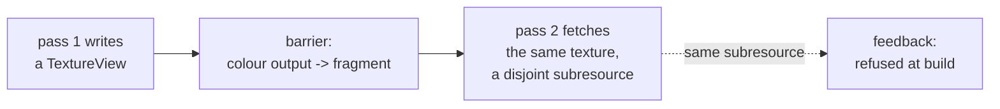

# Texture attachments, texture views, and texel fetch

[042](042-surface-completion.md) §5.2 reviewed a graphics surface that had grown
to 124 declarations without one, and found that most of what it found was a
single decision with many symptoms: **a render attachment is a `BufferView`, not
a texture.**

`render.go` said the shape a caller writes would not change when textures
landed. It does, and that sentence is why the change looked deferrable. This
spec is the change.

## 1. What follows from the current decision

Not a list of missing features. Eight things that are each *consequences*, which
is why they cannot be fixed one at a time:

| Symptom | Because |
| --- | --- |
| `ColorTargetState.Format` and `DepthStencilState.Format` reach no backend | a `BufferView` carries a dtype, not a format. Metal hardcodes `RGBA32Float` per attachment; the CPU backend reinterprets attachment bytes as `[]float32` unconditionally |
| the per-device `FormatInfo` table is built and thrown away | the render path reads two of its twelve fields, and `Blendable` is read nowhere |
| check **V13** is unimplementable | there is no format on either side to compare |
| sRGB never converts | [035](035-cpu-rasterizer.md) §5 says it converts on write and on read; nothing owns the conversion |
| no stage can read a previous pass's output | so no deferred shading, no shadow maps, no material textures |
| 033 §7's feedback rejection is blocked | it compares subresources, and nothing names one |
| `LoadKeep` costs a copy in and a copy out **per pass** on Metal | a buffer is staged into a texture and back |
| a present costs a full-screen conversion draw **every frame** | `RGBA32Float` is not a compositor format and a blit cannot convert |

The last two are a frame's cost model rather than a missing feature: at 1080p a
Metal frame makes several full-frame round trips through system memory at four
times the natural byte width, and no test fails.

## 2. The shape

A view names a subresource, and one type serves every use of one.

```go
type TextureView struct {
    Texture *Texture
    Mip     int    // 0 is the base level
    Layer   int    // 0 is the first array layer
    Format  Format // zero means the texture's own
}

func (t *Texture) View(d TextureViewDesc) (TextureView, error)
```

`ColorAttachment.View` and `DepthAttachment.View` become `TextureView`. A
shader-visible texture binding takes the same type.

**One type, because feedback is why subresources exist here.** 033 §3.3 forbids
an overlapping subresource being both an attachment and shader-visible, and
permits disjoint ones — a different mip or layer is a different subresource.
That comparison is only sound if both sides name a subresource the same way.
Spelling `Mip` and `Layer` on the attachment *and* again on the binding would
make the rule compare two shapes, which is how a rule ends up withdrawn: this
project has withdrawn two already (V23, and 033 §6's undeclared-slot rule), both
because a rule was written against a shape nobody tested.

### 2.1 Format is on the view, and that is the interesting half

`Format` zero means the texture's own, so the common case writes nothing. A
non-zero `Format` **reinterprets** the same bytes, and is legal only within a
compatible family.

$$\text{compatible}(a, b) \iff \text{bpp}(a) = \text{bpp}(b) \ \wedge\ \text{channels}(a) = \text{channels}(b) \ \wedge\ \text{numeric}(a) = \text{numeric}(b)$$

where `numeric` distinguishes only the *encoding* — linear versus sRGB — and not
the channel order. The table today has exactly one such pair, `RGBA8Unorm` and
`RGBA8UnormSRGB`, and that pair is the reason this field exists:

> Write linear through one view; present through an sRGB view of the same
> texture.

That is how every target expresses it — Vulkan `VkImageView` format,
D3D12 `DXGI_FORMAT` view casting, Metal `newTextureViewWithPixelFormat:`, and
WebGPU `viewFormats` — and it is what makes sRGB a **view** property rather than
a texture property. 035 §5's claim that sRGB converts on write and on read then
has an owner: the conversion belongs to the view's format, applied where the
attachment is read and written.

Reinterpretation across a family is refused by name, and the refusal states both
formats and which of the three clauses failed.

## 3. Texel fetch, which lands with it and not after

[032](032-stage-abi.md) §5 specifies integer texel fetch in a stage. It is in
this spec rather than its own because **a stage that cannot read a texture
cannot demonstrate that attachments became textures** — the whole point of the
change is that a pass can read a previous pass's output, and nothing proves that
without a fetch.

Fetch and not a filtered sampler, which 032 §5 already argues and which a real
renderer's experience corroborates: a CPU oracle cannot reproduce a hardware
sampler's addressing, its LOD rounding, or its integer lerp truncation, so a
filtered sampler is a feature the oracle cannot check. Integer fetch has one
definition, and a stage that wants filtering builds it from fetches.



The barrier above is why [042](042-surface-completion.md) §5.3's stage work came
first: before it, both sides of that edge were `stageTransfer`.

## 4. What changes, by layer

| Layer | Change |
| --- | --- |
| resources | `TextureView`, `Texture.View`, the compatibility rule, and `MipLevels`/`ArrayLayers` above one become admissible rather than refused |
| render API | attachments take a `TextureView`; `ColorTargetState.Format` is checked against it, which makes **V13** implementable |
| CPU rasterizer | attachment reads and writes go through a format encode/decode instead of `typedSlice(kernel.F32, raw)`; sRGB converts there |
| Metal | real `MTLRenderPassDescriptor` attachments. The per-pass staging copies and the present conversion draw are deleted, not optimised |
| stages | texel fetch: an intrinsic, its MSL spelling, and the CPU implementation |
| graph | feedback rejection compares subresources, which unblocks 033 §7 |

## 5. Order, and what is genuinely sequential

Only two edges are real.

1. **`TextureView` and the format rule first**, because every other item names
   the type.
2. **The backends and the fetch are parallel** — the CPU rasterizer, the Metal
   attachment path, and the stage intrinsic touch different files and can be
   built at once.
3. **Feedback rejection last**, because it needs both an attachment and a fetch
   to have anything to reject.

## 6. What is written before the feature

[042](042-surface-completion.md) §5.4's entry already exists and skips: a texture
round trip compared against the CPU oracle, which starts running the day Metal
lowers a texture copy. Texture origin is per *resource kind* rather than per
backend, and this change gives the render path its second kind.

Two more belong in the same place, written before rather than after:

- **a format-reinterpreting view**: linear write, sRGB read, compared against the
  CPU oracle doing the same conversion. The one case where the bytes are equal
  and the values are not;
- **a disjoint-subresource pass pair**: mip 0 as an attachment while mip 1 is
  fetched, which 033 §3.3 says is legal. A rule that only ever refuses is a rule
  nobody has tested the accepting half of.

## 7. Done

- an attachment names a `TextureView`, and `MipLevels`/`ArrayLayers` above one
  are accepted rather than refused;
- a non-zero view `Format` reinterprets within a family and is refused outside
  one, naming both formats and the failing clause;
- `ColorTargetState.Format` is compared against the attachment's, which is V13,
  and the refusal names the pipeline, the node and the attachment index;
- a fragment stage fetches a texel from a texture a previous pass wrote, on the
  CPU backend and on Metal, compared pixel for pixel;
- an overlapping subresource as attachment and shader-visible is refused at
  build naming both views, and a **disjoint** one is accepted and produces the
  expected pixels;
- sRGB converts on write and on read, checked against the CPU oracle;
- Metal's per-pass staging copies and the present conversion draw are gone, and
  a frame's transfers are counted in a test so their absence is asserted rather
  than assumed.
