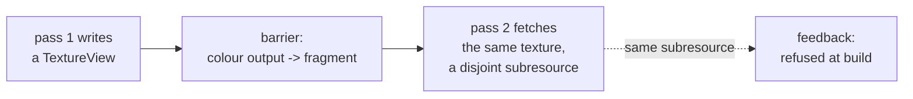

# Texture attachments, texture views, and texel fetch

[042](042-surface-completion.md) §5.2 reviewed a graphics surface that had grown
to 124 declarations without one, and found that most of what it found was a
single decision with many symptoms: **a render attachment is a `BufferView`, not
a texture.**

`render.go` said the shape a caller writes would not change when textures
landed. It does, and that sentence is why the change looked deferrable. This
spec is the change.

## 1. What follows from the current decision

Not a list of missing features. Eight things that are each *consequences*, which
is why they cannot be fixed one at a time:

| Symptom | Because |
| --- | --- |
| `ColorTargetState.Format` and `DepthStencilState.Format` reach no backend | a `BufferView` carries a dtype, not a format. Metal hardcodes `RGBA32Float` per attachment; the CPU backend reinterprets attachment bytes as `[]float32` unconditionally |
| the per-device `FormatInfo` table is built and thrown away | the render path reads two of its twelve fields, and `Blendable` is read nowhere |
| check **V13** is unimplementable | there is no format on either side to compare |
| sRGB never converts | [035](035-cpu-rasterizer.md) §5 says it converts on write and on read; nothing owns the conversion |
| no stage can read a previous pass's output | so no deferred shading, no shadow maps, no material textures |
| 033 §7's feedback rejection is blocked | it compares subresources, and nothing names one |
| `LoadKeep` costs a copy in and a copy out **per pass** on Metal | a buffer is staged into a texture and back |
| a present costs a full-screen conversion draw **every frame** | `RGBA32Float` is not a compositor format and a blit cannot convert |

The last two are a frame's cost model rather than a missing feature: at 1080p a
Metal frame makes several full-frame round trips through system memory at four
times the natural byte width, and no test fails.

## 2. The shape

A view names a subresource, and one type serves every use of one.

```go
type TextureView struct {
    Texture *Texture
    Mip     int    // 0 is the base level
    Layer   int    // 0 is the first array layer
    Format  Format // zero means the texture's own
}

func (t *Texture) View(d TextureViewDesc) (TextureView, error)
```

`ColorAttachment.View` and `DepthAttachment.View` become `TextureView`. A
shader-visible texture binding takes the same type.

**One type, because feedback is why subresources exist here.** 033 §3.3 forbids
an overlapping subresource being both an attachment and shader-visible, and
permits disjoint ones — a different mip or layer is a different subresource.
That comparison is only sound if both sides name a subresource the same way.
Spelling `Mip` and `Layer` on the attachment *and* again on the binding would
make the rule compare two shapes, which is how a rule ends up withdrawn: this
project has withdrawn two already (V23, and 033 §6's undeclared-slot rule), both
because a rule was written against a shape nobody tested.

### 2.1 Format is on the view, and that is the interesting half

`Format` zero means the texture's own, so the common case writes nothing. A
non-zero `Format` **reinterprets** the same bytes, and is legal only within a
compatible family.

$$\text{compatible}(a, b) \iff \text{bpp}(a) = \text{bpp}(b) \ \wedge\ \text{channels}(a) = \text{channels}(b) \ \wedge\ \text{numeric}(a) = \text{numeric}(b)$$

where `numeric` distinguishes only the *encoding* — linear versus sRGB — and not
the channel order. The table today has exactly one such pair, `RGBA8Unorm` and
`RGBA8UnormSRGB`, and that pair is the reason this field exists:

> Write linear through one view; present through an sRGB view of the same
> texture.

That is how every target expresses it — Vulkan `VkImageView` format,
D3D12 `DXGI_FORMAT` view casting, Metal `newTextureViewWithPixelFormat:`, and
WebGPU `viewFormats` — and it is what makes sRGB a **view** property rather than
a texture property. 035 §5's claim that sRGB converts on write and on read then
has an owner: the conversion belongs to the view's format, applied where the
attachment is read and written.

Reinterpretation across a family is refused by name, and the refusal states both
formats and which of the three clauses failed.

## 3. Texel fetch, which lands with it and not after

[032](032-stage-abi.md) §5 specifies integer texel fetch in a stage. It is in
this spec rather than its own because **a stage that cannot read a texture
cannot demonstrate that attachments became textures** — the whole point of the
change is that a pass can read a previous pass's output, and nothing proves that
without a fetch.

Fetch and not a filtered sampler, which 032 §5 already argues and which a real
renderer's experience corroborates: a CPU oracle cannot reproduce a hardware
sampler's addressing, its LOD rounding, or its integer lerp truncation, so a
filtered sampler is a feature the oracle cannot check. Integer fetch has one
definition, and a stage that wants filtering builds it from fetches.



The barrier above is why [042](042-surface-completion.md) §5.3's stage work came
first: before it, both sides of that edge were `stageTransfer`.

## 4. What changes, by layer

| Layer | Change |
| --- | --- |
| resources | `TextureView`, `Texture.View`, the compatibility rule, and `MipLevels`/`ArrayLayers` above one become admissible rather than refused |
| render API | attachments take a `TextureView`; `ColorTargetState.Format` is checked against it, which makes **V13** implementable |
| CPU rasterizer | attachment reads and writes go through a format encode/decode instead of `typedSlice(kernel.F32, raw)`; sRGB converts there |
| Metal | real `MTLRenderPassDescriptor` attachments. The per-pass staging copies and the present conversion draw are deleted, not optimised |
| stages | texel fetch: an intrinsic, its MSL spelling, and the CPU implementation |
| graph | feedback rejection compares subresources, which unblocks 033 §7 |

## 5. Order, and what is genuinely sequential

Only two edges are real.

1. **`TextureView` and the format rule first**, because every other item names
   the type.
2. **The backends and the fetch are parallel** — the CPU rasterizer, the Metal
   attachment path, and the stage intrinsic touch different files and can be
   built at once.
3. **Feedback rejection last**, because it needs both an attachment and a fetch
   to have anything to reject.

## 6. What is written before the feature

[042](042-surface-completion.md) §5.4's entry already exists and skips: a texture
round trip compared against the CPU oracle, which starts running the day Metal
lowers a texture copy. Texture origin is per *resource kind* rather than per
backend, and this change gives the render path its second kind.

Two more belong in the same place, written before rather than after:

- **a format-reinterpreting view**: linear write, sRGB read, compared against the
  CPU oracle doing the same conversion. The one case where the bytes are equal
  and the values are not;
- **a disjoint-subresource pass pair**: mip 0 as an attachment while mip 1 is
  fetched, which 033 §3.3 says is legal. A rule that only ever refuses is a rule
  nobody has tested the accepting half of.

## 6.1 What the CPU-side change costs while Metal is behind — 2026-08-24

Attachments name a `TextureView` and the CPU backend honours the format. **Metal
does not lower a texture attachment yet**, and refuses by name. That is the
correct intermediate state — a refusal a caller can read beats a wrong pixel —
and it has a consequence worth stating before anyone reads a green CI and draws
the wrong conclusion.

**The Metal render differential now skips.** `TestARenderPassAgreesOnBothBackends`
compared the same graph on the CPU rasterizer and on Metal pixel by pixel, and
it is the reason the CPU backend is an *oracle* for graphics rather than the
only implementation. It skips with Metal's own refusal as its reason, so it
starts comparing again the day the Metal path lands — the same self-activating
shape as §6's texture round trip.

**`internal/mtl` fell from 92.8% to 84.1%** on the same 485 statements: 42
statements of the Metal render path — `DrawIndexed`, depth state, clears,
buffer-to-texture copies — are reachable by nothing while the differential
skips. That is not a testing gap to paper over. It is the honest measurement of
a half-landed change, and it resolves when the Metal path lands rather than by
adding a test.

**CI does not see it.** The coverage job runs on Linux, where `internal/mtl` is
a `_darwin` package and is excluded from the profile entirely. The number is
visible only on a Mac. So a green CI on this commit does **not** mean graphics
is verified on two backends, and this paragraph exists because the next person
to read that badge will assume it does.

**This is a release blocker rather than a defect.** Nothing is wrong; something
is half-built. A tag cut here would ship graphics verified on one backend while
the previous commit verified it on two, and no gate in CI would say so.

### Closed, 2026-08-24

Metal renders into the attachment's declared format. The plan already carried
`ColorFormat` and `ColorPitch`; the backend ignored both. Three changes and none
of them needed a texture in the driver layer:

- **the format reaches the texture and the pipeline.** A mapping that refuses
  what it cannot spell, rather than defaulting — defaulting is how the original
  defect worked;
- **the pipeline cache key gains the formats.** Metal validates a pipeline's
  colour formats against the pass's attachments at draw time, so two passes
  differing only in format would share a cached pipeline and the device would
  reject the second. Visible only when one plan holds both, which is what a key
  omission produces and a test rarely finds;
- **a row copy lowers**, as the blit encoder's contiguous copy once per row. It
  was refused, so a texture attachment could not be given prior contents.

**Two entries written before their features fired.** The render differential
passes again. And §6's texture round trip — written while Metal refused a
texture copy, skipping with that refusal as its condition — ran for the first
time and passed: Metal returns texture rows in caller order, matching the
oracle byte for byte. `docs/conventions.md` records that origin as *known* to
differ between backends, and until this commit nothing compared it.

**A defect the new test found.** A Metal depth attachment was allocated by code
no test reached, found in a coverage report rather than by a failure. It works;
it is now compared against the oracle with two overlapping triangles at
different depths.

**And one that is left open, deliberately.** Metal's render write-back does not
align a row to 256 bytes where `ReadTexture` does, so an attachment whose row is
narrower reads back partly blank: at 4×4 an RGBA32Float row is 64 bytes and
three quarters of the image is lost, at 8×8 it is half, and at 16×16 and above
it is exact. The differential and the format test are pinned to sizes above the
boundary and say why. This is a real bug with a known shape, and it is recorded
here rather than fixed in the same commit as the change that revealed it.

**`internal/metal` is at 89.8%**, from 72.3% before this work, and the 90% gate
is not met. Every function in the package is exercised — there are no
uncovered functions — and the shortfall is 84 statements across 31 error arms
that need an allocation or an encoder to fail. Recorded rather than papered
over: the gate is right and the number is honest, and closing it wants fault
injection rather than another test.

## 7. Done

- an attachment names a `TextureView`, and `MipLevels`/`ArrayLayers` above one
  are accepted rather than refused;
- a non-zero view `Format` reinterprets within a family and is refused outside
  one, naming both formats and the failing clause;
- `ColorTargetState.Format` is compared against the attachment's, which is V13,
  and the refusal names the pipeline, the node and the attachment index;
- a fragment stage fetches a texel from a texture a previous pass wrote, on the
  CPU backend and on Metal, compared pixel for pixel;
- an overlapping subresource as attachment and shader-visible is refused at
  build naming both views, and a **disjoint** one is accepted and produces the
  expected pixels;
- sRGB converts on write and on read, checked against the CPU oracle;
- Metal's per-pass staging copies and the present conversion draw are gone, and
  a frame's transfers are counted in a test so their absence is asserted rather
  than assumed.

## 8. Outcome — the resources and CPU rows, 2026-08-24

§4's first two rows and the CPU-backend row are built. The Metal row, the stage
row and the graph row are not, and each is owed to a separate slice.

### 8.1 What was built

| § | Item | State |
| --- | --- | --- |
| 2 | `TextureView`, `Texture.View`, `Texture.Whole`, the compatibility rule | done (landed just before this work) |
| 4 | `ColorAttachment.View` and `DepthAttachment.View` are a `TextureView` | done |
| 4 | the plan carries each attachment's format and row pitch | done |
| 4 | the CPU backend converts through a format codec instead of `typedSlice(kernel.F32, raw)` | done |
| 2.1, 4 | sRGB converts on write and on read, decided by the view's format | done |
| 4 | **V13**: `ColorTargetState.Format` and `DepthStencilState.Format` against the attachment's | done |
| 4 | `MipLevels`/`ArrayLayers` above one | **still refused** — see §8.3 |
| 4 | Metal attachments, the staging copies, the present conversion draw | not started |
| 4 | texel fetch | not started |
| 4 | feedback rejection over subresources | not started |

Four rules the pass now owns, all at build and all named: the texture declares
`TextureRenderTarget`; its extent covers the render area; a colour attachment is
not a depth format and a depth attachment is; and a format whose layout is
device-defined — `Depth24PlusStencil8` — is refused rather than given a guess at
an encoding.

### 8.2 The conversions, stated

The CPU rasterizer is the oracle, so each conversion has one definition and a
format with two defensible readings is refused rather than given one.

$$\text{unorm8}: \quad \text{decode}(b) = \frac{b}{255}, \qquad \text{encode}(v) = \operatorname{round}\big(255 \cdot \operatorname{clamp}(v, 0, 1)\big)$$

Round to nearest and not truncate, which every target specifies: truncation
sends $1/255$ back to $0$ and the loss is invisible in an image. `NaN` encodes
as zero.

sRGB is IEC 61966-2-1's piecewise curve, applied to the three colour channels
and not to alpha — alpha is a coverage weight rather than a light intensity, and
putting it through a display transfer function makes a half-covered pixel
composite wrong:

$$\text{linear}(c) = \begin{cases} c/12.92 & c \le 0.04045 \\ \left(\dfrac{c + 0.055}{1.055}\right)^{2.4} & \text{otherwise} \end{cases} \qquad \text{srgb}(c) = \begin{cases} 12.92\,c & c \le 0.0031308 \\ 1.055\,c^{1/2.4} - 0.055 & \text{otherwise} \end{cases}$$

It is applied in `internal/cpu/texel.go`, at the two ends of a pass: the
attachment decodes into the rasterizer's linear float components before the
loads, and the components encode back after the last draw. That is exactly what
[035](035-cpu-rasterizer.md) §5 says — *"sRGB attachment formats convert on
write and on read, not in the fragment stage"* — and the view's `Format` is what
selects the codec, so one texture written through two views is two different
operations over the same bytes.

`Depth24PlusStencil8` is refused in the codec **and** at build, because "24
plus" means at least 24 bits and a backend may store it as 32 with 8 unused or
pack it with the stencil. The other formats each have one reading: `BGRA8Unorm`
differs from `RGBA8Unorm` in channel order and nothing else, the float formats
are a reinterpretation, and the half formats go through the same
round-to-nearest-even conversion a narrow kernel binding uses.

### 8.3 Deviations from what this spec drew

**`MipLevels` and `ArrayLayers` are still refused, and were not half-admitted.**
§4 said they "become admissible rather than refused". They did not, and the
reason is not the one the refusal used to give. A view names a subresource now,
so *binding* is no longer the obstacle; what is, is that everything underneath
still addresses a whole allocation — `textureBytes` sizes one level, a
texture-buffer copy moves one, and a recorded access covers the texture's whole
byte range, which is what the barrier plan reasons over. Admitting mips means
sizing a chain, computing a subresource's byte offset, and narrowing a hazard
range: three changes in three layers, none of which falls out of this one. The
refusal's *reason* was updated instead, because a limit whose stated cause has
stopped being true is how a limit outlives the thing that caused it.

**The plan carries a row pitch, which §4 did not mention.** A texture's rows are
padded to the device's copy alignment — 256 bytes on both backends — so an
attachment's bytes are not $w \cdot \text{bpp}$ per row and the stride cannot be
divided out of the operand size. It is carried explicitly rather than derived,
because deriving it works exactly while an attachment is a whole allocation and
stops the day one names a mip.

**The CPU backend copies in and out per pass.** §1 charges Metal for exactly
that cost, and this is not the same mistake: Metal paid it to move bytes between
two resources of the same format, and this pays it to *convert*, because the
rasterizer works in float32 components and the attachment does not. A backend
with a fixed-function output stage pays nothing.

**`driver.Format` is a second spelling of `Format`.** The alternative was moving
the public type down to the seam, which would have dragged the per-device
capability table — `Renderable`, `Sampleable`, `Blendable` — to where a backend
could read it, and a backend is told what to do rather than asked what is
possible. [LoadOp](003-command-graph.md)'s warning about two definitions
swapping silently does not transfer: a swapped load action is invisible to every
test and a swapped format changes pixels. The mapping is a switch and a test
walks the whole enumeration in both directions.

**Two transient-aliasing tests changed subject.** `render_alias_test.go` read
its property through a transient *attachment*, and a texture cannot be a
transient. Both were retargeted at a transient the pass reads — its vertex data
— which pins the same regression (`Recorder.touch` on a render pass) and the
same relation (aliasing is sound when every user of one transient is ordered
against every user of the other). **The attachment path specifically is no
longer covered by them**, and nothing else covers it: a transient render target
is not expressible.

**A slot attachment did not change shape.** [034](034-surface-present.md) makes
a presented image a *buffer* slot, so `ColorAttachment.Slot` still names one and
its bytes are `RGBA32Float` with tight rows — which is byte for byte what a slot
attachment already was. `SlotDescriptor.Format` was left alone; wiring it here
was not asked for and a present slot does not set it.

### 8.4 What Metal does, and what it costs

Only the CPU backend lowers a texture attachment. A Metal device refuses one at
build, naming the pass, the attachment and this spec — decision 6, absence is
reported rather than discovered. The alternative was worse than a refusal: the
Metal path stages an attachment through a buffer that assumes `RGBA32Float` and
tight rows, so a texture attachment would have produced a plausible image rather
than an error.

The differential entries on that path skip with the reason rather than being
deleted, the arrangement `TestATextureRoundTripKeepsCallerOrderOnMetal` already
uses, so the comparison resumes on the first day it can.

**The cost is measured, and it is stated as a level rather than as a drop.**
Running the coverage gate on a Mac after this change puts `internal/metal` at
85.8% (680/793 statements) and `internal/mtl` at 84.1% (408/485), both under the
90% bar, because the Metal render encoder is no longer reached by any running
test. What those two packages measured *before* was not recorded, so no delta is
claimed here — only that they are below the gate now and that the Metal slice is
what brings them back.

The repository's coverage job runs on Linux, where both packages are
documentation-only and contribute no statements, so CI does not see this. That
is why it is written down: **the Metal slice is not optional cleanup, and the
one gate that would have argued for it does not run where anyone would notice.**

### 8.5 What is still owed

Unchanged from §7, minus what §8.1 marks done:

- a fragment stage fetching a texel from a texture a previous pass wrote, on
  both backends, compared pixel for pixel;
- an overlapping subresource refused at build naming both views, and a disjoint
  one accepted and producing the expected pixels;
- Metal's real `MTLRenderPassDescriptor` attachments, with the per-pass staging
  copies and the present conversion draw deleted and a frame's transfers counted
  in a test;
- `MipLevels` and `ArrayLayers`, once the allocation, the copy and the hazard
  range name a subresource.
