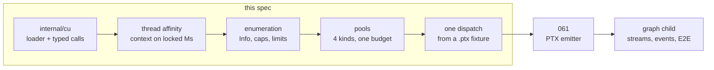

# CUDA bring-up

The analogue of [021](021-metal-bringup.md) and [037](037-vulkan-bringup.md),
one API over, and **the cut is vertical for the same reason**: the point of a
first child is not to finish a layer, it is to make a second vendor's device an
oracle.

[006](006-backends.md) §2.7 put CUDA outside the backend set and
[000](000-decisions.md) put it outside v0 — *"out of the first milestone on
effort, not principle: PTX or cubin generation is a target
[004](004-kernel-authoring.md) does not have."* This spec and
[061](061-ptx-target.md) are that effort. Nothing in the exclusion was a
principle, and §1 measures the parts that were assumptions.



## 1. What is settled before any of this is written, because it was measured

[037](037-vulkan-bringup.md) §1 leans on the predecessor. There is no CUDA
predecessor, so this section leans on a probe instead: two cgo-free Go programs
cross-compiled `CGO_ENABLED=0 GOOS=linux GOARCH=arm64` on darwin/arm64 and run
on a GB10 (Grace Blackwell, sm_121, driver 580.173.02, CUDA 13.0, Ubuntu 24.04,
128 GB unified). Every number below is from that run and not from a document.

**The whole chain is reachable through purego.** Nineteen entry points resolved
from `libcuda.so.1`, then `cuInit` → `cuDeviceGet` → `cuCtxCreate_v2` →
`cuModuleLoadDataEx` → `cuMemAlloc_v2` → `cuMemcpyHtoD_v2` → `cuLaunchKernel` →
`cuCtxSynchronize` → `cuMemcpyDtoH_v2`, verifying 1048576 of 1048576 f32
elements. No CUDA toolkit was installed. No `nvcc`, no NVRTC, no `libcudart`.

`purego.SyscallN` caps at 15 arguments (`syscall.go:16`) and the widest call
here, `cuLaunchKernel`, takes 11. It also does not correctly call functions
mixing integer and float parameters; no driver-API call on the compute path
passes a float by value. Recorded so it is checked rather than discovered.

**The driver JIT compiles PTX text, and an old `.target` runs on new hardware.**
The fixture declares `.version 7.0 / .target sm_70` and ran on sm_121. So there
is no per-architecture cubin matrix to build and ship, and the issue's
`sm_120`-binary-compatibility reasoning is not a bet this backend has to make.
What `.target` *does* still gate is capability, which is [061](061-ptx-target.md)
§1's problem and not this child's.

| JIT state | `cuModuleLoadDataEx` |
| --- | --- |
| cold, `~/.nv/ComputeCache` removed | 10.1 ms |
| warm, same module | 63 µs |
| reload within the process | 27–48 µs |

The driver's on-disk cache makes JIT a first-run event rather than a per-start
cost, which matters because [029](029-plan-cache.md) sizes startup and because a
consumer measures time to first token. Cold cost for a whole corpus is unmeasured
and is §12's.

**`nvidia-smi` reports `[N/A]` for memory on this part and the driver API does
not.** §6 is that finding, and it is the one place where a measurement changed a
design rather than confirming one.

**A CUDA context is current per OS thread, and a goroutine is not.** §4 is that
finding. It is the reason this child has a section [037](037-vulkan-bringup.md)
does not.

## 2. The 060/061 boundary: this child dispatches

060 consumes PTX text; [061](061-ptx-target.md) produces it. The dispatch
happens **here**, against a committed `.ptx` fixture in `testdata` — hand-written,
39 instructions, a guarded f32 `c[i] = a[i] + b[i]`, with a comment naming what
each block is for. It is read in review, which is the whole difference from
[037](037-vulkan-bringup.md) §3's `.spv`: no toolchain produced it, so none has
to be recorded, and CI never regenerates it.

Stopping at buffer round trips instead would make 061 debug the emitter and the
runtime spine at once, the cut [012](012-kernel-pipeline.md) and
[021](021-metal-bringup.md) both argued against. After this child a 061 failure
is the emitter's and nothing else's.

## 3. The loader

One implementation, not [037](037-vulkan-bringup.md)'s two: CUDA on darwin ended
at 10.13 and the Windows path is `nvcuda.dll` through `syscall.LoadLibrary`,
which is the same shape 037 already specifies and which no runner here promises.

| GOOS | Library | Mechanism |
| --- | --- | --- |
| linux | `libcuda.so.1` | `purego.Dlopen`/`Dlsym`, calls through `purego.SyscallN` |
| windows | `nvcuda.dll` | `syscall.LoadLibrary`/`GetProcAddress` — specified, not built here |

Build tag `linux && (amd64 || arm64)`. The architecture gate is not caution:
`CUdeviceptr` is `unsigned long long` and `SyscallN` passes `uintptr`, so a
32-bit target is not untested, it is wrong.

**Every symbol comes from `dlsym`, and the versioned spellings are the real
names.** Unlike Vulkan there is no `vkGetInstanceProcAddr` indirection: CUDA's
ABI versioning is in the symbol, so the loader asks for `cuMemAlloc_v2`,
`cuCtxCreate_v2`, `cuMemcpyHtoD_v2`, `cuMemGetInfo_v2` and their siblings, never
the unsuffixed names, which resolve to the v1 entry points with 32-bit sizes.
A table of `(accel name, C symbol, since)` is the artifact, and resolving the
unsuffixed name is the failure it exists to prevent: it links, it runs, and it
truncates every allocation above 4 GB.

`cuGetProcAddress` is the documented forward-compatible alternative and is
**not** used at v0: it needs a CUDA version and flags per symbol, which is a
second version-negotiation surface for no benefit while every symbol this child
needs has existed since CUDA 4.

**Resolving symbols and installing them are separate jobs**, which is
[021](021-metal-bringup.md)'s recorded bug: Metal's first resolver wrote the
package's function pointers as it went, so a partial failure left half a table
live. The resolver builds a complete table and swaps it in, or errors and
installs nothing.

**No call wrapper panics.** Every call returns a typed `cu.Result`, and
`cuGetErrorName`/`cuGetErrorString` turn it into a message. R1 requires that
probing not panic, and a recovered string erases the classification §10 depends
on.

## 4. The context is per OS thread, and Go is not

This is the section with no analogue in [037](037-vulkan-bringup.md). Vulkan has
no thread affinity at all; Metal's objects are free-threaded. CUDA's *current
context* is thread-local state, and a Go goroutine changes OS threads whenever it
likes — including between two purego calls, each of which enters and leaves
syscall state.

Measured, on the probe, eight goroutines running alloc → upload → launch →
synchronize → download → verify, 200 cycles each:

| Shape | Result |
| --- | --- |
| no `LockOSThread`, no `cuCtxSetCurrent` | always fails, `CUDA_ERROR_INVALID_CONTEXT` (201) |
| `cuCtxSetCurrent` before every driver call | **flaky**: failed on 2 of 5 and 3 of 5 repeat runs, at a different call each time |
| `LockOSThread`, `cuCtxSetCurrent` once inside the locked region | reliable |

The flaky row is the one worth having measured. It is the shape a backend would
reach for first, it passes most of the time, and the window is between the
`cuCtxSetCurrent` and the call it was meant to arm. A test suite that ran it
twice would have shipped it.

**But this backend is not [006](006-backends.md) §2.5's GLES shape.** That
paragraph — *"the backend owns a `runtime.LockOSThread` goroutine holding the
context and replays a recorded list onto it"* — serializes every submission
through one thread, and it is not what CUDA needs. A context may be current on
many threads at once. Measured, one primary context shared across locked
goroutines:

| Locked goroutines | Cycles | Per cycle |
| --- | --- | --- |
| 1 (the GLES shape) | 1600 | 801 µs |
| 8 | 8 × 200 | 497 µs |
| 16 | 16 × 100 | 433 µs |

> **The rule.** Every driver call happens on a goroutine that is locked to its
> OS thread for the whole call sequence it belongs to, with the context asserted
> once inside the locked region. Not per call, and not once per process.

So the backend owns a **pool** of context-armed worker threads, one per in-flight
submission slot (§8), not a single replay thread. `cuCtxSetCurrent` costs 574 ns
and `cuCtxGetCurrent` 350 ns through purego, both measured, which is why arming
is done once per slot acquisition and not defensively per call.

**`cuDevicePrimaryCtxRetain`, not `cuCtxCreate`.** The primary context is the one
`libcudart` uses, so a process that also links something CUDA-based shares a
context rather than fighting over the current one. `cuCtxCreate` is a second
context on the same device: legal, and it makes every pointer from the other one
invalid in this one, with `CUDA_ERROR_INVALID_CONTEXT` as the only symptom. The
probe used `cuCtxCreate` because it was alone on the machine; a backend is not.

**A test asserts the rule rather than trusting it.** `internal/cu` exposes no
call that is reachable off a locked thread: the typed calls take a `*cu.Ctx`
token that only the slot acquisition can mint, so "forgot to lock" is a compile
error and not a flake. That is the only mechanism here that is not a
transcription of an existing backend, and §14 item 3 is what checks it.

## 5. Enumeration, capabilities, and limits

Packages mirror Metal's split: `internal/cu` is the loader and typed calls (the
analogue of `internal/mtl`), `internal/cuda` is the `driver.Device`
implementation (the analogue of `internal/metal`).

`driver.Backend` gains `BackendCUDA` and `accel.Backend` the aliased constant.
That is the entire public surface change, per
[000](000-decisions.md) layering rule 2. **No `OpenCUDA`.** `specs/STATUS.md`
already records `OpenCPU` (`device.go:103`) as the standing violation of layering
rule 3; a second one is not a precedent, it is a pattern.

Enumeration calls `cuInit(0)` and `cuDeviceGetCount`, and creates no context —
per [006](006-backends.md) §6.1, and because `cuDevicePrimaryCtxRetain` on every
device to answer `Enumerate` would allocate a context per GPU on a box that has
eight. Enumerating nothing is `cu.ErrNoDevice`, never an empty list.
`cuInit` failing because no driver is installed is a `ProbeDiagnostic` and never
a fake device.

`Adapter.Token()` is `cuDeviceGetUuid_v2`, which is 16 bytes and fits `[16]byte`
exactly. `Info.Software` is always false; there is no CUDA software rasterizer,
which is [006](006-backends.md) §6.2's class and the reason this backend cannot
be a CI oracle the way lavapipe is (§12).

Every `Limits` field gets a named source. Most are one
`cuDeviceGetAttribute` call, and the table exists because the four that are not
are where a fabricated constant goes.

| accel `Limits` field | Source |
| --- | --- |
| `MaxWorkgroupSize` | `MAX_BLOCK_DIM_{X,Y,Z}` (2, 3, 4) |
| `MaxWorkgroupInvocations` | `MAX_THREADS_PER_BLOCK` (1) — measured 1024 |
| `MaxWorkgroupCount` | `MAX_GRID_DIM_{X,Y,Z}` (5, 6, 7) |
| `MaxSharedMemoryBytes` | `MAX_SHARED_MEMORY_PER_BLOCK` (8) — measured 49152 |
| `MinSubgroupSize`, `MaxSubgroupSize` | `WARP_SIZE` (10) for both — measured 32 |
| `MaxUniformBlockBytes` | `TOTAL_CONSTANT_MEMORY` (9) |
| `MaxPools` | **no attribute** — see below |
| `MaxBufferBytes` | **no attribute** — `cuDeviceTotalMem_v2`, and §6 |
| `MaxPoolBytes` | **no attribute, and no honest answer** — §6 is the whole section |
| `MaxStorageBufferBindingBytes` | **no attribute** — `MaxBufferBytes`; CUDA binds pointers, not ranges, so there is no separate ceiling |
| `MinStorageBufferOffsetAlignment` | `TEXTURE_ALIGNMENT` (14) is the wrong one — `cuMemAlloc` returns 256-byte-aligned, and 061 §5 needs only the dtype's own alignment |
| `MinUniformBufferOffsetAlignment` | n/a — 061 §5 passes uniforms as launch parameters, not buffers |
| `MaxBindingsPerKind` | derived from the launch-parameter limit, §7 |
| `MinBufferCopyOffsetAlignment` | 1 — `cuMemcpy` has no alignment requirement, with a comment saying so |

`MaxPools` has no query. CUDA's allocation count is bounded by address space and
not by an object table, so the Vulkan failure it exists for
(`VK_ERROR_TOO_MANY_OBJECTS` at the four-thousandth allocation) has no CUDA
analogue. It is reported as the count that fits `MaxPoolBytes` at the minimum
pool size, with a comment naming that as the reasoning — the class
[021](021-metal-bringup.md) §3 ruled on, where a constant gets a comment naming
what makes it true and the failure is the prior art's `maxThreads() { return 1024 }`.

Capabilities measured on GB10, filling [006](006-backends.md) §3's CUDA column,
which does not exist yet and which this child writes:

| Capability | CUDA | Source |
| --- | --- | --- |
| Atomic float add, storage | **yes** | `atom.global.add.f32`, sm_20 — the first backend where this is not `cap` |
| Atomic float add, shared | **yes** | `atom.shared.add.f32` |
| Subgroup basic/vote/ballot/shuffle/arithmetic | **yes** | `.sync` warp primitives, floor sm_70 (061 §1) |
| f16 storage, f16 arithmetic | **yes** | native since sm_53 |
| bf16 storage | yes | native since sm_80; **arithmetic stays refused**, per 006 |
| i8 packed dot product | cap | `dp4a`, sm_61 — queried from the capability major/minor |
| Indirect dispatch | **no** | there is no `cuLaunchKernelIndirect`; §15 |
| Denormals, Inf/NaN, FP contraction control | ? | 061 §7, measured by probe |

**Indirect dispatch is the one architecturally absent row**, and it is a real
gap rather than a deferral: CUDA has no device-side grid-size source for an
ordinary launch. The answers are CUDA Dynamic Parallelism or a graph update
from the host, both of which are the graph child's and neither of which is a
one-line lowering. `Capabilities.IndirectDispatch` is false and
`Device.Missing` names it.

**No row of `internal/cpu/profile.go` widens from a CUDA run.** That table is the
*strict oracle's* model, and widening it because a GB10 reported native float
atomics would make every strict-mode kernel claim portability to hardware nobody
asked about. Never widen from observation.

## 6. Memory: four kinds, one physical pool, and a budget that is not the pool

GB10 has no device memory. CPU and GPU share one 128 GB LPDDR5X pool, which is
also the pool Linux is running in. Measured:

```
cuDeviceTotalMem_v2   130663002112   121.7 GiB
cuMemGetInfo_v2       free  43.6 GiB / total 121.7 GiB
/proc/meminfo         MemTotal 121.7 GiB   MemFree 43.9 GiB   MemAvailable 109.6 GiB
nvidia-smi            memory.total [N/A]   memory.free [N/A]
```

Three facts, in the order that matters.

**First, the driver API answers where NVML does not.** `nvidia-smi` reporting
`[N/A]` on this part is an NVML gap, not a device one, so memory accounting does
*not* have to come from `/proc/meminfo` for want of an alternative. Anything
sizing a cache from a device memory query reads a real number here.

**Second, that real number is host RAM.** `cuDeviceTotalMem` is *exactly*
`MemTotal`. Filling `Limits.MaxPoolBytes` from it — the obvious lowering, and
what every field above does — hands a consumer the whole machine as a device
budget. In tgo that value picks the precision (`weights/device.go:55`) and sizes
KV admission (`serve.go:479`), so a 27B model is judged to fit at f16 and a cache
is sized against 121.7 GiB. Both allocations then *succeed*, because unified
memory is malloc, and the host dies. This is the same failure observed from the
other side on this part: vLLM at `--gpu-memory-utilization 0.30` held 37.6 GB for
a model whose weights are 1.2 GB, because 0.30 of a unified pool is 0.30 of the
machine.

**Third, `cuMemGetInfo`'s free is not the alternative.** It tracks `MemFree`
(43.6 against 43.9 GiB), not `MemAvailable` (109.6 GiB). The 66 GiB between them
is reclaimable page cache. So `total` overstates by including memory the OS
needs and `free` understates by excluding memory the OS would give back, and
neither is a budget.

[006](006-backends.md) R2 forbids the escape: *"An unknown required limit is an
adapter-open failure, not zero and not a guessed portable minimum."* So the
adapter reports a number or refuses to open.

> **The rule.** On an adapter reporting `CU_DEVICE_ATTRIBUTE_INTEGRATED`,
> `MaxPoolBytes` is derived from `/proc/meminfo` **MemAvailable** sampled at
> `OpenDevice`, less a reserve, and never from `cuMemGetInfo`. An explicit
> budget supplied by the caller replaces the derivation entirely.

The override is **not** a `CUDAOptions` struct. A memory budget is not a CUDA
concept — a shared discrete GPU wants one identically — so it is a
backend-neutral field on the existing public open path, honoured by any backend
that can and refused by name by one that cannot. That keeps layering rule 3 and
puts one field, not a type, in a public signature.
[042](042-surface-completion.md) owns the spelling.

The four kinds onto CUDA allocators:

| `driver.MemoryKind` | Allocator | `Block.Bytes()` |
| --- | --- | --- |
| `MemoryDevice` | `cuMemAlloc_v2` | **nil, always** |
| `MemoryUpload` | `cuMemHostAlloc(WRITECOMBINED)` | mapped range |
| `MemoryReadback` | `cuMemHostAlloc(0)` — cached, because it is read | mapped range |
| `MemoryShared` | `cuMemAllocManaged(ATTACH_GLOBAL)`, gated on `INTEGRATED` and `CONCURRENT_MANAGED_ACCESS` | mapped range |

**`MemoryDevice` returns nil from `Bytes()` on GB10, where it trivially need
not.** This is the oracle rule ([006](006-backends.md), opening) and
[021](021-metal-bringup.md) §4's reason, and unified memory is exactly the
condition under which a backend talks itself out of it. 006 records what
happened last time: the predecessor's `backendBuffer.bytes()` worked *"only
because the Metal backend created every buffer with `StorageModeShared`"* and
*"quietly foreclosed 001's memory kinds"*. Unified-first is the scoping answer;
unified-shaped is not the contract. The cost is a `cuMemcpy` for `Block.Write`
and `Read` that copies within one physical pool, which
[001](001-device-resources.md) §8.1 allows to be slow.

**One allocation per pool, not per buffer**, as 037 §6: a pool is one
`cuMemAlloc` and an `Operand` is `{base, offset, size}`.

`driver.Unwrap` is called before every type assertion on a `Block`, because
[031](031-shared-transients.md) hands backends a forwarding block that must
resolve at use.

## 7. Bindings, launch parameters, and where the uniform goes

[021](021-metal-bringup.md) §5 makes buffer index assignment the contract and
[038](038-spirv-target.md) §5 fixes the numbering both GPU targets share:

| Slot | Contents |
| --- | --- |
| `0 … n-1` | `kernel.Bindings[k]`, in order |
| `n` | the generated lengths block |
| `n+1+i` | uniform block *i* |

**CUDA keeps the numbering and changes the mechanism.** `cuLaunchKernel` takes
`kernelParams`, an array of pointers to argument values that the driver copies
into constant bank 0 before the launch. So slot *k* is launch parameter *k*: a
binding is a `CUdeviceptr` by value, and the lengths block and each uniform block
are **passed by value as parameters**, not as buffers.

That is a deliberate divergence from both other GPU targets and it is worth the
two consequences it has:

- **`Graph.SetUniform` becomes the cheapest rebinding there is.** No buffer, no
  upload, no barrier before the dispatch that reads it — the host rewrites one
  entry of the params array. [003](003-command-graph.md) promises rebinding
  stays cheap and this is the target where it costs nothing.
- **The host fill is not identical across targets**, which is the property
  [037](037-vulkan-bringup.md) §7 kept the lengths block *for*. Vulkan's reason
  does not transfer: it kept the block because `OpArrayLength` reports the bound
  descriptor range, and CUDA has no descriptor range to disagree with. The
  numbering is what has to be shared, and it is.

The parameter block has a ceiling — 4 KB before CUDA 12.1 and 32,764 bytes
after — so `MaxBindingsPerKind` and `MaxUniformBlockBytes` are derived from it
jointly, and a kernel that exceeds it is refused at `Compile`, naming the total
and the ceiling. A kernel whose uniforms alone exceed it is 061's problem to
lower differently and this child's to refuse clearly. **The exact ceiling on this
driver is measured, not assumed**, because the two values differ by 8x and the
wrong one is either a refusal that should not happen or a launch that corrupts.

**`Compile` checks the workgroup size against the module**, as
[037](037-vulkan-bringup.md) §7: `cuLaunchKernel` takes block dimensions from
the host and nothing makes the host agree with the artifact.
[061](061-ptx-target.md) §1 emits `.reqntid` rather than `.maxntid`, so a launch
at any other block shape is refused by the driver — but that refusal arrives
through a fence, which is the hardest place for a caller to act on it. So
`Compile` reads `cuFuncGetAttribute(MAX_THREADS_PER_BLOCK)` back and refuses a
record that disagrees, naming both triples. The attribute reports the *product*
and not the triple, which is why `.reqntid` is emitted as well as checked: 16x8
and 8x16 are one number here and two shapes on the device. The failure both
prevent is [037](037-vulkan-bringup.md)'s quarter-grid dispatch, which returns
plausible partial results into an already-zeroed buffer.

`cuFuncGetAttribute(SHARED_SIZE_BYTES)` is checked against
`Limits.MaxSharedMemoryBytes` at the same point, because a static `.shared`
array over the limit fails at *launch*, which reports through a fence.

All of this happens in `Compile`, following `internal/metal/exec_darwin.go`.

## 8. Submission, streams, events, and what owns lifetime

**This child re-records per submission**, which makes it structurally identical
to [021](021-metal-bringup.md) and [037](037-vulkan-bringup.md). CUDA graphs
(`cuGraphLaunch`) are the reusable object [006](006-backends.md) §4.1 wants and
they are the graph child's, with the measurement 006's open question 1 requires
before the claim.

**`cuCtxSynchronize` is not called at the end of a submission.**
`Executable.Submit` *"begins the work and returns without waiting"*. Keeping a
wait makes `Fence` a lie: `Done()` is always true and every in-flight test passes
vacuously.

> **The submission slot.** One `CUstream` (created `NON_BLOCKING`), one
> `CUevent` (created `DISABLE_TIMING`), and one context-armed locked goroutine
> per in-flight submission, per §4. A slot is reclaimed when its event is
> observed complete. A submission with no free slot waits for the oldest.

`driver.Fence` maps directly and better than Vulkan's: `Wait()` is
`cuEventSynchronize`, `Done()` is `cuEventQuery` where `CUDA_ERROR_NOT_READY` is
false and `CUDA_SUCCESS` is true. `SubmitAfter` is `cuStreamWaitEvent`, which is
a device-side wait and needs no host round trip — the thing Vulkan needs timeline
semaphores for and does not have at core 1.0.

**The stream is not the default stream.** `NULL` has implicit synchronization
with every other blocking stream in the context, so a backend using it turns
[001](001-device-resources.md) §8.2's asynchronous contract into a global
barrier that no test distinguishes from a correct one.

**`OpHostWrite` lowers to `cuMemcpyHtoDAsync` on the slot's stream, from a
staging block, and that is legal only because this child re-records.** Those
bytes *"are rewritten on every submission, which is what makes a graph carrying a
small constant replayable"*. The source must outlive the launch, so it is a
`MemoryUpload` block from the slot and never a Go slice — an async copy from
collected memory is a use-after-free with no diagnostic. The graph child inherits
this obligation with `cuGraphExecKernelNodeSetParams`.

**One queue.** `Capabilities` reports one compute queue with no separate transfer
queue, per R8, even though CUDA has copy engines: using them means a second
stream with ownership transfer, which is specified and unexercised at v0 and
[001](001-device-resources.md) §1 is already honest about that class.

**Locking is per object.** `CUcontext` and `CUstream` are internally
synchronized; the slot pool and the module cache take a mutex, and a pool's
allocation takes its own. A single global mutex satisfies
[001](001-device-resources.md) §1.2 and serializes the per-pool allocation that
section expects to be concurrent — a failure a correctness suite never reports.

## 9. Barriers

`PlanNode.BarrierBefore` is a real obligation and CUDA makes it *cheaper to get
wrong*, because work on one stream is ordered. Two dispatches on one stream see
each other's writes with no barrier at all, so the whole cooperative corpus
produces correct answers with every barrier dropped, exactly as
[006](006-backends.md) §7 says lavapipe does for Vulkan.

So `BarrierBefore` lowers to nothing on the submission stream, and the spec says
that plainly rather than emitting a no-op to look diligent. What it lowers to
becomes real in the graph child, where a CUDA graph's nodes are a DAG and the
edges *are* the barriers: an edge the plan implies and the graph omits is a race
the stream ordering was hiding. **The barrier is argued from the plan's edges,
and no claim of the form "verified on CUDA" is made from a single-stream run.**

## 10. Device loss

`CUDA_ERROR_ILLEGAL_ADDRESS`, `CUDA_ERROR_LAUNCH_FAILED` and
`CUDA_ERROR_LAUNCH_TIMEOUT` are **sticky by the driver's own design**: once one
is returned, the context is unusable and every later call in it returns
`CUDA_ERROR_LAUNCH_FAILED`. So [023](023-metal-graph.md) §4's classifier
transfers with less work than Vulkan's, and [001](001-device-resources.md) §7.4's
terminal loss matches the hardware.

`CUDA_ERROR_OUT_OF_MEMORY` is **not** loss, and *"the half of the test asserting
that is the more important half"*: reporting an allocation failure as loss turns
a recoverable bug into a device the caller must discard permanently.

Unlike lavapipe, this device **can** be made to lose itself: a kernel
dereferencing a null device pointer produces `CUDA_ERROR_ILLEGAL_ADDRESS`
deterministically. That test is Tier 4 and it is the first real loss test the
project has.

## 11. The kernel record

PTX is the third target, and [038](038-spirv-target.md) §8's flattening is
already ratified: `PTX string` sits beside `MSL string` (`kernel.go:455`),
and `kernel.MissingArtifact(name, target)` covers both. **PTX is text**, so
unlike SPIR-V it needs no embedded file and no separate disassembly — it lives in
the generated Go file the way MSL does, subject to the same backquote guard
`emit.go:317` already applies.

A CUDA dispatch of a kernel whose `PTX` is empty is a build error naming the
kernel and the target, never a fallback to the Go lowering — which would be
correct, fast enough to miss, and would mean the GPU was never exercised.

## 12. What this costs

- **CI cannot run it.** There is no CUDA software rasterizer, so unlike
  [037](037-vulkan-bringup.md)'s lavapipe there is no `ubuntu-latest` oracle and
  no free tier-2 gate. Everything device-side is tier 4 on a lab box. The
  compensation is that the entry-point table and the parameter-block layout are
  checkable with no device, and that the oracle rule means the CPU backend
  already computes every expected answer.
- **The lab box is one part.** GB10 is integrated, single-GPU, unified. Every
  number is that machine's; nothing here is "the CUDA profile", and the discrete
  paths (`MemoryDevice` on real device memory, host-device transfer overlap,
  multi-GPU) are written and unexercised.
- **A `cuMemcpy` for every `MemoryDevice` transfer**, bought deliberately, §6.
- **Cold JIT for a whole corpus is unmeasured.** One trivial kernel costs
  10.1 ms cold. [010](010-kernel-corpus.md)'s corpus is not one kernel, and the
  first run on a new driver version invalidates the cache.
- **The darwin developer has no local loop at all**, worse than 037: not even a
  cross-compile smoke test proves anything beyond linking.

## 13. Testing and CI

Tier 1 (every commit, no device): the symbol table, the parameter-block layout,
the `Limits` source table, and the fixture's own text.

Tier 2 (`ubuntu-latest`): the loader compiled at both CGO settings — purego
reaches `dlopen` through fakecgo at `CGO_ENABLED=0` and through real cgo at
`=1`, so it is two code paths — plus `ptxas` on the fixture behind
`ACCEL_REQUIRE_PTXAS`, which is [061](061-ptx-target.md) §9's.

Tier 4 (manual or nightly, the lab box): everything in §14 from item 4 down. A
new non-blocking `.github/workflows/ci-cuda.yml` modelled on `ci-metal.yml`,
with `ACCEL_REQUIRE_CUDA=1` carrying the promise, targeting a self-hosted
runner. It is non-blocking until the runner is reliable, and
[011](011-conformance-harness.md) §11 makes that an explicit rot-green risk
rather than a gap.

[006](006-backends.md) §7's entry gate has five items. This child owns 1–3 —
probe, a capability report populating every row of the new CUDA column, and a
buffer round trip for every dtype, which needs no kernel. Items 4 and 5, the
barrier reduction and the tiled GEMM, need the emitter.

## 14. Done

Each is a checkable assertion, and each names what it catches.

1. **Every entry point in the symbol table resolves to a `_v2`-suffixed C name
   where one exists**, asserted against literals transcribed from `cuda.h` — the
   unsuffixed `cuMemAlloc`, which links, runs, and truncates every allocation
   above 4 GB.
2. **`Enumerate` with no driver returns a `ProbeDiagnostic` separating
   `ProbeLoadLibrary` from `ProbeEnumerateAdapters`, and does not panic** — R1's
   failure, and the difference between no GPU and a broken installation.
3. **No `internal/cu` call is reachable without a slot token**, asserted by a
   type-level test — §4's flaky row, which passes most of the time.
4. **A driver call sequence on an unlocked goroutine is refused by construction,
   and a stress test of 16 concurrent slots × 100 cycles produces correct results
   with no `CUDA_ERROR_INVALID_CONTEXT`** — the measured 2-of-5 flake.
5. **No `driver.Limits` field is zero on an opened device**, via the existing
   `TestLimitsArePopulated` — the fabricated constant and the forgotten row.
6. **`MaxPoolBytes` on an integrated adapter is neither `cuDeviceTotalMem` nor
   `cuMemGetInfo`'s free, and an explicit budget replaces it exactly** — §6, the
   failure that takes the host down rather than the process.
7. **`Block.Bytes()` is nil for a `MemoryDevice` pool on a machine where all
   memory is physically shared** — the predecessor's foreclosure, on the one
   machine that would otherwise hide it.
8. **A `Write` then `Read` on a `MemoryDevice` pool at a non-zero offset
   round-trips every dtype.**
9. **A deliberately corrupted `.ptx` is rejected and the driver's JIT log reaches
   the caller** — a compile path that ignores its `CUresult`. The probe already
   plumbs `CU_JIT_ERROR_LOG_BUFFER`.
10. **A kernel writing its global id, dispatched at a 3-D grid with every axis
    above one, produces exactly the expected ids** — the prior art's
    `dispatch(x, y, z) { c.gx = x }`, which passes every 1-D test.
11. **A record whose workgroup size disagrees with
    `cuFuncGetAttribute(MAX_THREADS_PER_BLOCK)` is refused at `Compile`, naming
    both triples** — the quarter-grid dispatch.
12. **`Fence.Done()` is false for a submission still in flight** — a
    `cuCtxSynchronize` left in the submission path.
13. **Device loss from an illegal address is sticky and reported by every later
    call; out-of-memory is not loss** — the classifier that turns a recoverable
    bug into a permanently discarded device.
14. **E2E through the public API only**: `Enumerate` finds a CUDA adapter,
    `OpenDevice` opens it by id, a pool allocates, a graph records upload →
    dispatch of the fixture → readback, submits, and the fence completes.

## 15. What this child does not build

- the PTX emitter, the [008](008-numerics.md) probes, and the recorded GB10
  profile — [061](061-ptx-target.md);
- multi-node graph lowering with real barrier planning, CUDA graphs as the
  reusable submission object with the measurement 006 requires, and the milestone
  E2E — the CUDA graph child;
- indirect dispatch, which needs dynamic parallelism or a host graph update, §5;
- multiple streams, copy engines, cross-stream ownership transfer;
- multi-GPU, peer access, and NVLink;
- discrete-GPU allocation strategy: real device memory, staging overlap, and
  `MemoryShared` reported absent. The contract is written for it (§6); no machine
  here runs it;
- textures, samplers, surfaces, and anything graphics — CUDA has no render path
  and never gains one;
- the R1 isolated helper-process probe, deferred for
  [037](037-vulkan-bringup.md)'s reason, though CUDA is a weaker case for it than
  Vulkan: there is no ICD or layer mechanism, so a third party cannot interpose.

## Open questions

1. **The reserve in §6.** The shape is settled — derived from `MemAvailable` at
   `OpenDevice`, never from `cuMemGetInfo`, overridable — and the subtrahend is
   not. A fixed absolute is a guessed portable minimum, which R2 names; a
   fraction of `MemTotal` is what took vLLM's host down. It probably has to be
   derived from what the process has already committed, which needs a number
   nobody has measured yet.
2. **`MaxPoolBytes` is sampled once and drives long-lived policy.** A consumer
   reads it at open to pick a precision and size a cache, and `MemAvailable`
   moves underneath. Either the limit is re-sampled and the contract says a limit
   may shrink, or it is a reservation the adapter actually takes at open. The
   first weakens `Limits`, the second makes opening a device an allocation.
3. **The launch-parameter ceiling**, 4 KB or 32,764 bytes, and therefore whether
   §7's by-value uniforms hold for every kernel in
   [010](010-kernel-corpus.md) or need a buffer fallback for the large ones.
4. **Whether ptxas' FMA contraction is reachable through the driver JIT**, which
   decides whether [061](061-ptx-target.md) §7's rounding-modifier strategy is
   sufficient or needs a JIT option that may not exist.
